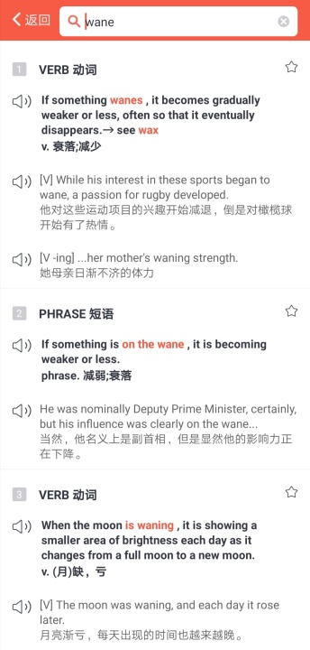

前言

全文 XX个单词，包含 2020考研英语大纲词汇 190 个。

单词右上角标有考研（比如compose考研）代表这个单词被【拓词】2020考研英语大纲单词书收录。

不少《经济学人》的句子结构，同样出现在考研真题里， 比如equivalent of 等。

标绿文字可以重点读，与文章结构有关。 字变小是因为Nora认为ta们不重要😂。

很久以前说着冰岛语的人和说英语的人其实可以理解对方，为什么这么多年过去了，
英语越来越大众化，冰岛语越来越难，会说的人很少（和英语比较而言）
互联网其实做了很好的解释。

关于互联网有没有毁掉语言， 文章也说得很清楚～

正文

<h1 style="color:red">
The internet is changing language less than curmudgeons fear
</h1>

Instead it is helping explain how language works
 

001 <i>What is technology doing to language? Many assume the answer is simple: ruining it</i>. Kids can no longer write except in text-speak. Grammar <strong>is going to the dogs</strong>. The ability to <mark>compose</mark><b>考研</b> thoughts longer than a tweet is <strong>waning</strong>. 

重点讲解|第1段

<strong><kbd>waning（wane）</kbd></strong>

 

<strong><kbd>go to the dogs 衰落、大不如前、每况愈下</kbd></strong>

 

专门用于形容组织、公司甚至国家经济风光不再。
来源貌似和中国有关。据说古时候， 狗不能进入城。所以狗只能在墙外流浪，吃着城里的人扔出来的不要的垃圾、食物。 
被「放逐的人」，「不被接受的人」，或者「罪犯」也要被迫与这些流浪狗一起生活。 
用来形容生活或者经济彻底破落。 

Its origin is a bit unclear but some people believe that the idiom originates from the <b>ancient Chinese</b> custom of <i>not allowing dogs into the walls of the city</i>, and as a result they gathered outside the main walls, living off anything they could find in the rubbish. They often had to compete for food and space with <b>the people</b> who had been <i>expelled from the city</i>, and therefore had “gone to the dogs”.

Nora读后感|第一段

<small>科技之于语言是什么？不少觉得是负面作用， 正如这里的<b>ruin</b>. 写起字来，不成体统， going to the dogs有几分世风日下的感慨。  世人的功底好像就一落千丈了。是吗？不见得吧。 文字这种东西，拿过去的标准来衡量好像并不公允。    比如提起汉朝，是赋。 唐朝是诗， 宋朝词。现在说词，境界不逊唐诗。事实上相当于一段长的时期， 词就不登大雅之堂，所以是小词。 查查词的来源就了然了，多是关乎风花雪月。   不另说小说了，夫子会教写诗写赋，但也不会教散文， 林语堂谈小说是</small>

 
 grown without cultivation. And it gave without expected return.

 
 
 
 <small>这么看来，互联网时代的文字某种程度上也属于grown with cultivation, expected return应该也是可以期待的结果才是～</small>
 
 

词汇表|第一段

assume v. 假定 
go to the dogs 大不如前 
compose v.组成，构成 
wane v.衰落

 002 <i>Language experts <mark>tend</mark>考研  to <mark>resist</mark>考研  that gloom, <strong>noting</strong> that there is little proof that speech is really</i> <b>degenerating</b>: kids may say “lol†out loud sometimes, but this is a marginal phenomenon. Nor is <mark>formal</mark>考研  writing <b>falling apart</b>.  

<small>Sentences like “omg wtf William teh Conqueror pwned Harold at Hastings in 1066!†tend to be written by middle-aged columnists trying to <mark>imitate</mark>考研 children’s supposed habits. A study by Cambridge Assessment, a British exam-setter, found almost no <mark>evidence</mark>考研  for text-speak in students’ writing. </small> 

重点讲解|第2段

<strong><kbd>fall apart</kbd></strong>
. 

eg1:...I'm lucky my whole life didn't fall apart. I could have lost my wife, my career, everything. 

eg2: ... If you only knew, my dad's whole world would fall apart without her.

eg3: ...Police detective Frank Taylor had his marriage fall apart after the abduction of his son. 

<strong><kbd>degenerate</kbd></strong>
. 

Nora读后感|第2段

专家说，对于语言，互联网并没有起败坏作用。

词汇表|第2段

resist v.抵抗 
gloom n.昏暗 
degenerate v.恶化  
conqueror n.征服者 
columnist n.专栏作家  

003 <i>Fortunately, the story of language and the internet has attracted more serious analysts, too</i>. Now Gretchen McCulloch, a prolific language blogger and journalist—and herself of the generation that grew up with the internet—joins them with a new book, “Because Internet”. <u>Rather than obsessing about what the internet is doing to language, it largely focuses on what can be learned about language from the internet</u>. 

<small>Biologists grow <mark>bacteria</mark>考研  in a Petri dish partly because of those organisms’ <b>short lifespans</b>: they are born and reproduce so quickly that studies over many <mark>generations</mark>考研  can be done in a reasonably <b>short period</b>. Studying language online is a bit like that: trends appear and disappear, platforms rise and fall, and these let linguists <mark>observe</mark>考研  dynamics that would otherwise take too much time.</small>

重点讲解|第3段

<strong><kbd>句子分析</kbd></strong>

<em><u>Rather than</u> obsessing about what the internet is doing to language, it largely focuses on what can be learned about language from the internet.</em>

rather than A, it focuses on B. 

<strong>考研真题|2017年英语一</strong>

eg1: <i>Rather than</i> just <strong>focusing</strong> on GDP, over 40 different sets of criteria from health, education and civil society engagement have been measured to get a more rounded assessment of how countries are performing.

eg2: But policymakers who <strong>refocus</strong> efforts on improving well-being <i>rather than</i> simply worrying about GDP figures could avoid the forecasted doom and may even see progress. 

词汇表|第3段

analyst n.分析家 
prolific adj.多产的  
obesess v. 迷恋 
Petri dish 皮氏培养皿 
lifespan n. 寿命 
linguist n. 语言学家 

004 <i>For example</i>, why do languages change? A thousand years ago, early versions of English and Icelandic were closely related, possibly even mutually intelligible. English has since evolved hugely, and Icelandic, far less. 

<small>Linguists have studied the relative effects of strong ties (friends, family) and weaker acquaintanceships in such patterns</small>, <b>hypothesising</b> that <strong>small communities would <mark>host</mark>考研 more <mark>stable</mark>考研 languages</strong>. 

<small> A computer <i>simulation</i> proved that a mix of strong and weak ties—close-knit groups existing in a larger sea—allowed language-change “leaders” to disseminate updates to the wider population. </small>

<small><i>Twitter</i> combines strong and weak ties—and sure enough, drives more language change than <i>Facebook</i>, which is more dominated by strong ties. That, in turn, helps explain the conservatism of Icelandic (more like Facebook) and the mutability of English (more like Twitter).</small>

词汇表|第4段

version v. 版本 
intelligible adj. 可以理解的 
evolve v.进化 
acquaintance n. 认识 
hypothesize v. 假定 
simulation n. 模仿 
disseminate n. 传播 
dominate v.在～中最具影响力 
conservatism n. 保守 
mutability n.易变性  

005 <i>Emoji, odd as they may look, also <mark>reflect</mark>考研  something universal</i>. They are not a language (try telling a complex story in emoji to someone who doesn’t know it already). <b>They are</b>, Ms McCulloch argues, <b>the digital <mark>equivalent</mark>考研  of gestures</b>. 

Those come in two types. 

<small>“Emblems”, like a thumbs-up or a wink, have a fixed meaning and form. But “co-speech†gestures—wincing, gesticulating, pointing—are <mark>spontaneous</mark>考研  and more variable. And emoji come in these same flavours. </small>

<small>People randomly combine many co-speech-style emoji, <b>but</b> are <b>more</b> restrained in mixing emblems. Just as it would make no <mark>sense</mark>考研  to give someone the finger while shaking your head to negate it, emblematic emoji often stand alone rather than in expressive chains.</small>

<small>Other online “innovations†are not really new, either. Philosophers have previously tried to <mark>invent</mark>考研  a marker for irony—a backwards question-mark or an upside-down exclamation point, for example—before online types succeeded with the <mark>sarcastic</mark>考研 ~tilde~. The first use of omg long preceded computers. Those who worry about teens speaking “hashtag†aloud (“Good for you—hashtag sarcasm!”) might consider the last time they punctuated an utterance by saying “full stop†or “period”.</small>

重点讲解|第5段

<strong>equivalent </strong>

<strong>考研真题|2011年英语一</strong>

eg1: In a society that so persistently celebrates procreation, is it any wonder that admitting you regret having children <i>is equivalent to</i> admitting you support kitten-killing? It doesn't seem quite fair, then, to compare the regrets of parents to the regrets of the children. 

<strong>考研真题|2019年英语二</strong>

eg2: In the popular imagination, of course, guilt still gets a bad rap. It is deeply uncomfortable-- it's the emotional <i>equivalent of</i> wearing a jacket weighted with stones. 

词汇表|第5段

universal adj.普遍的 
the equivalent of 对应物 
gesticulate v.做手势 
spontaneous adj. 自然的，自发的 
variable adj. 多变的 
flavour n. 概念 
ramdomly adv. 任意地 
restrain v. 制止 
negate v. 取消，使无效 
emblematic adj. 象征地 
innovation n. 创新 
philosopher n. 哲学家 
irony n. 冷嘲 
exclamation n. 感叹 
sarcasm n. 讽刺

006 <i>In the end, Ms McCulloch’s book is about the birth of a new <mark>medium</mark>考研  <strong>rather than</strong> a new language.</i> <u>For millennia, speech was all there was. </u> For most of “recorded†history, nearly everyone was illiterate. Then, in the age of the printing press and mass literacy, writing acquired a kind of primacy, seen as prestigious, a standard to be learned and <mark>imitated</mark>考研 (often even in speech).

Nora读后感|第6段

会写文章的人曾经是一个高门槛， 士农工商的分级就可见一斑～

旧时，舞文弄墨属于精英们的日常。兴之所致，对酒当歌，赏月成诵。

词汇表|第6段

millennia n. 千年   
speech n. 讲话    
record v. 记录   
illiterate adj. 文盲地   
literacy n.文盲     
acquire v. 获得   
primacy n. 首要  
prestigious adj.有声望的  
standard adj. 标准 
imitate v.模仿

007 Future historians may <mark>regard</mark>考研  that <mark>epoch</mark>考研  of <b>reverence</b> as unusual. <b>Mass reading has now been joined by mass writing: frequent, error-filled and evanescent—like speech</b>. 

Little surprise that internet users have created tools to give their writing the gesture, playfulness and even meaninglessness of chitchat. 

<b>Mistaking it for the downfall of “real†writing is a <mark>category</mark>考研  error</b>. Anything that helps people enjoy each other’s company can only be a good thing.

重点讲解|第7段

<strong><kbd>mistaking A for B is a/an (adj) error</kbd></strong>
. 

<strong><kbd>mistake A for B </kbd></strong>

<i>mistake</i> friendship <i>for</i> love 
<i>mistake</i> isolation <i>for</i> independence 
<i>mistake</i> effort <i>for</i> achievement 
<i>mistake</i> thirst <i>for</i> hunger 
<i>mistake</i> money <i>for</i> anything 
<i>mistake</i> concern <i>for</i> pity
<i>mistake</i> charity <i>for</i> justice

词汇表|第7段

historian adj.历史学家 
epoch n.时间 
reverence n.尊敬 
evanescent adj. 逐渐消失的 
gesture n. 手势 
meaninglessness n.无意义 
category n.种类 
company n.陪伴

后记

本篇文章包含  <b>2020考研英语大纲词汇</b> <strong>125</strong>个 ，部分列表如下

<strong><kbd>compose </kbd></strong>

<strong><kbd>tend </kbd></strong>

<strong><kbd>resist </kbd></strong>

<strong><kbd>formal </kbd></strong>

<strong><kbd>imitate </kbd></strong>

<strong><kbd>evidence</kbd></strong>

<strong><kbd>bacteria </kbd></strong>

<strong><kbd>generation </kbd></strong>

<strong><kbd>observe</kbd></strong>

<strong><kbd>stable </kbd></strong>

<strong><kbd>reflect </kbd></strong>

<strong><kbd>equivalent</kbd></strong>

<strong><kbd>spontaneous</kbd></strong>

<strong><kbd>sense</kbd></strong>

<strong><kbd>invent </kbd></strong>

<strong><kbd>sarcastic </kbd></strong>

<strong><kbd>medium </kbd></strong>

<strong><kbd>regard </kbd></strong>

<strong><kbd>epoch </kbd></strong>

<strong><kbd>category </kbd></strong>

