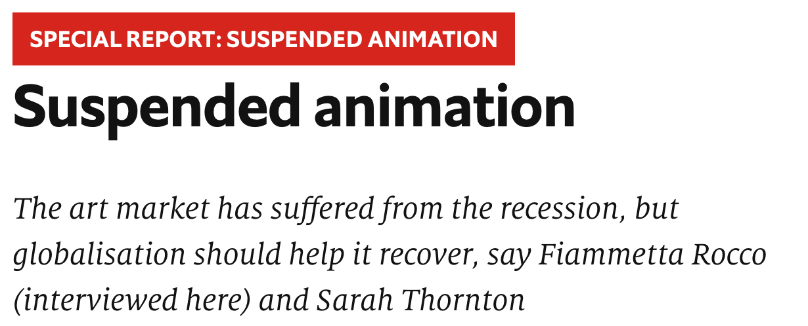

<h1><b>拓词魔鬼营</b>|外刊精读课</h1>

001 THE longest bull run in a century of art-market history ended on a dramatic note with a sale of 56 works by Damien Hirst, “Beautiful Inside My Head Forever”, at Sotheby's in London on September 15th 2008 (see picture). All but two pieces sold, fetching more than £70m, a record for a sale by a single artist. It was a last hurrah. As the auctioneer called out bids, in New York one of the oldest banks on Wall Street, Lehman Brothers, filed for bankruptcy.

002 The world art market had already been losing momentum for a while after rising vertiginously since 2003. At its peak in 2007 it was worth some $65 billion, reckons Clare McAndrew, founder of Arts Economics, a research firm—double the figure five years earlier. Since then it may have come down to $50 billion. But the market generates interest far beyond its size because it brings together great wealth, enormous egos, greed, passion and controversy in a way matched by few other industries.

003 In the weeks and months that followed Mr Hirst's sale, spending of any sort became deeply unfashionable, especially in New York, where the bail-out of the banks coincided with the loss of thousands of jobs and the financial demise of many art-buying investors. In the art world that meant collectors stayed away from galleries and salerooms. Sales of contemporary art fell by two-thirds, and in the most overheated sector—for Chinese contemporary art—they were down by nearly 90% in the year to November 2008. Within weeks the world's two biggest auction houses, Sotheby's and Christie's, had to pay out nearly $200m in guarantees to clients who had placed works for sale with them.

004 The current downturn in the art market is the worst since the Japanese stopped buying Impressionists at the end of 1989, a move that started the most serious contraction in the market since the second world war. This time experts reckon that prices are about 40% down on their peak on average, though some have been far more volatile. But Edward Dolman, Christie's chief executive, says: “I'm pretty confident we're at the bottom.”

005 What makes this slump different from the last, he says, is that there are still buyers in the market, whereas in the early 1990s, when interest rates were high, there was no demand even though many collectors wanted to sell. Christie's revenues in the first half of 2009 were still higher than in the first half of 2006. Almost everyone who was interviewed for this special report said that the biggest problem at the moment is not a lack of demand but a lack of good work to sell. The three Ds—death, debt and divorce—still deliver works of art to the market. But anyone who does not have to sell is keeping away, waiting for confidence to return.

