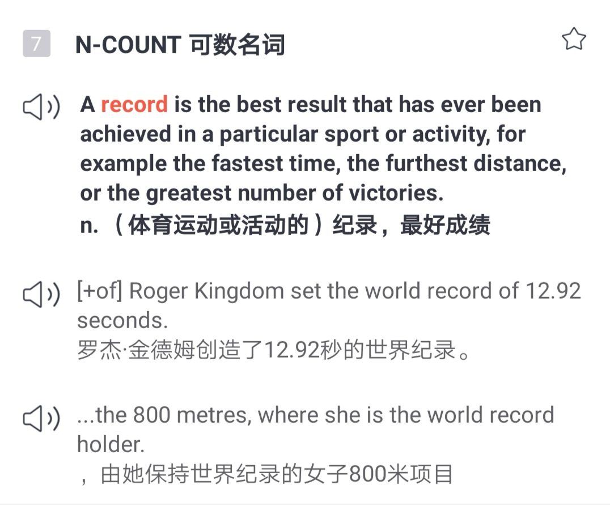
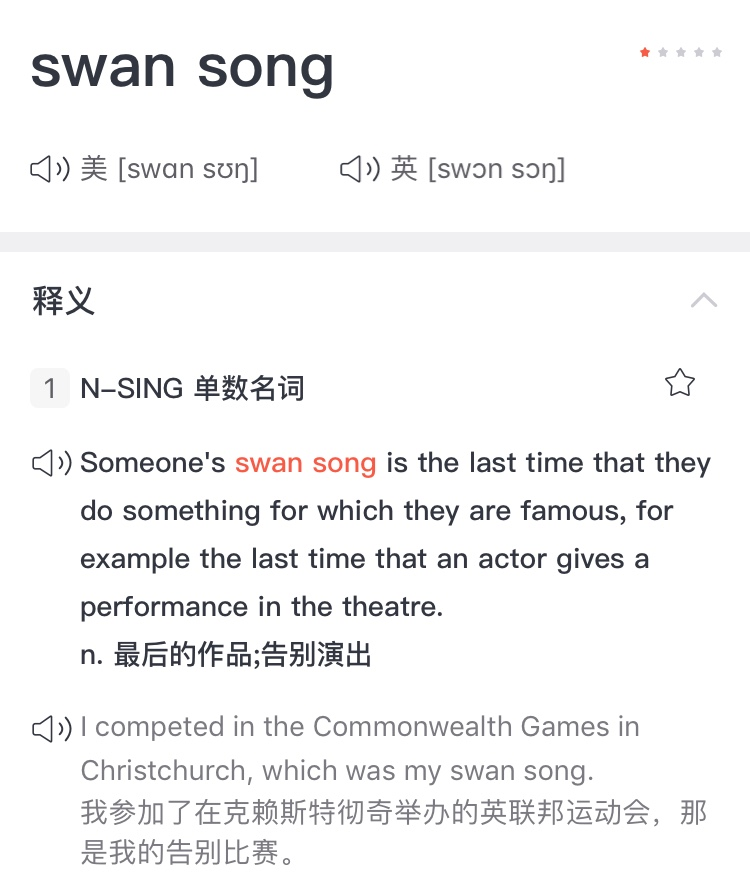
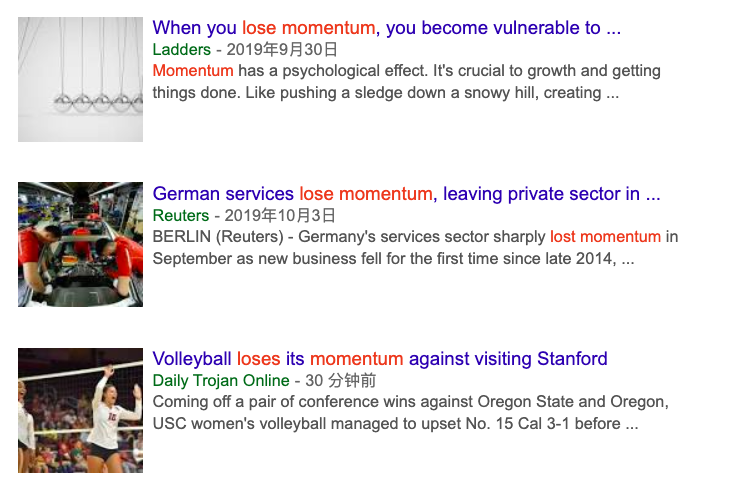

<h1><b>拓词魔鬼营</b>|外刊精读课</h1>

前言

全文 478 单词，包含 2020考研英语大纲词汇 150 个。

单词右上角标有考研（比如<mark>divorce</mark>考研）代表这个å•è¯è¢«ã€æ‹“è¯ã€‘2020考研英语大纲单词书收录。

标绿文字可以重点读，与文章结构有关。 字变小是因为Nora认为ta们不重要😂。

文章来自《经济学人》，原文特别特别长， 考研英语取了前5段， 构成了2010年英语二的阅读一，几乎所有内容都一样，但是有一句话删掉了。 

2010年考研英语三题来源于The Economist(《经济学人》)，2010年的考研题， 3篇是The Economist, 1篇是商业周刊，1篇是

《麦肯锡周刊》，1篇《哈佛商业评论》，1篇西方原著。

考研英语完型填空部分，使用了2009年6月6日 Economist 《经济学人》杂志上的一篇文章，文章主要内容，是对社会学上一个经典的理论：霍桑效应的批判和反思。文章难度适中。命题专家在出题的时候也进行了一定程度的改写。

估计有不少人疑惑是在考英语还是在考经济，今天选的这篇讲的是艺术，如果在考场上初见， 估计不少人会一头雾水。。 

怎么搞定考研阅读？背好单词，或者另外一个途径， 读读常出题的那些外刊？

如果只是读文章，记记单词，文法这些，用散装的方式去理解文章，但是还是不懂为什么是这样行文，这个词这样子安排是不是有什么“暗戳戳”的想法。

这样即使读过了，好象也不会get到文章的深意哎， 若是考场上遇到，选对答案与否，这个应该不是必然了。

正文

001 <i>THE longest <b>bull run</b> in a century of art-market history <b>ended on a <mark>dramatic</mark>考研 note with</b> a sale</i> <small>of 56 works by Damien Hirst, “Beautiful Inside My Head Forever”, at Sotheby's in London on September 15th 2008 (see picture). All but two pieces sold, <b>fetching</b> more than £70m, a <b>record</b> for a sale by a single artist. <b>It was a last hurrah</b>. As the auctioneer called out bids, in New York one of the oldest banks on Wall Street, Lehman Brothers, filed for bankruptcy.</small>

重点讲解|第1段

<h5>end on a note with </h5>

 

🌰 ...We'll <b>end</b> this little tribute not <b>on</b> a failure, but <b>on a high note</b>.
<small>出自<i><small>Vanity Fair</small></i></small>

🌰The twentieth century was <b>ending on a high note</b>. 
...but I'd like to <b>close on a postive note</b> by saying that most of these statesments are just jokes...

<small><i><small>出自Salon</small></i></small>

🌰<b>On a positive note</b>, I was sure that when my sixtysomething, ball-of-energy aunt got through redesigning the entire upstairs and driving contractors and decorators nuts, the upper stories of the house would once again be livable and ...

<small><i><small>出自小说Tails You Lose</small></i></small>

☞☞<small><b>conclude</b>/<b>close</b>/<b>finish</b>/<b>leave</b>/<b>begin</b>/<b>start off</b></small>    on a <i>positive</i> <strong>note</strong>

<h5>record</h5>

<h5>last hurrah </h5>

 

<kbd><strong>Swan song</strong></kbd>有近似义。
 

词汇表|第1段

dramatic adj. 戏剧性的 
fetch v. 卖得，售得 
auctioneer n.拍卖商 
file v. 提出 
bankruptcy n.破产

002 <i>The world art market had already been <b><kbd>losing <mark>momentum</mark>考研</kbd></b> for a while after rising vertiginously since 2003. </i> <small>At its peak in 2007 it was worth some $65 billion, reckons Clare McAndrew, founder of Arts <mark>Economics</mark>考研, a research firm—double the figure five years earlier. Since then it may have come down to $50 billion. <i>But</i> the market generates interest far beyond its size because it brings together great wealth, <mark>enormous</mark>考研 egos, greed, <mark>passion</mark>考研 and <mark>controversy</mark>考研 in a way matched by few other industries.</small>

重点讲解|第2段

🌰 <small>What am I in the eyes of most people — a nonentity, an eccentric, or an unpleasant person — somebody who has no position in society and will never have; in short, the lowest of the low.  All right, then — even if that were absolutely true, then I should one day like to show by my work what such an eccentric, such a nobody, has in his heart.  That is my ambition, based less on resentment than on love in spite of everything, based more on a feeling of serenity than on <mark>passion</mark>考研.  Though I am often in the depths of misery, there is still calmness, pure harmony and music inside me.  I see paintings or drawings in the poorest cottages, in the dirtiest corners. </small>  And my mind is driven towards these things with an <kbd><i>irresistible</i> <b>momentum</b></kbd>. 
<small>— Vincent van Gogh</small>

<small>大多数人眼中，我是一个无足轻重的人，一个古怪的、引人反感的人，一个在这个社会中没有也永远不会有任何位置的人，总而言之，就是底层中的底层。 好吧，即使这些都是真的，总有一天我也要通过我的作品展示我这样一个无足轻重的、古怪的人的内心。 这就是我的志向，基于万般种种后的爱而非愤怒，基于真诚而非激情。 虽然我经常沉浸于悲伤中，我的内心仍有冷静、平和与乐音。</small>  我从最简陋的木屋、从最肮脏的角落中看到艺术。我的意识不可控制的被这些事物吸引。

<small>— 文森特·梵高</small>

 

<b>build</b> <i>momentum</i> 增强势头 
gain <i>momentum</i> 势头增强 
gather <i>momentum</i> 势头增强 
have <i>momentum</i> 得势 
lose <i>momentum</i> 势头减弱 
maintain <i>momentum</i> 保持势头

词汇表|第2段

momentum n. 动量 
vertiginously adv. 陡峭地 
peak n. 顶点 
reckon v. 认为 
generate v.产生 
wealth n. 财富 
enormous adj. 巨大的 
ego n. 自我；自尊 
greed n. 贪婪 
passion n. 热情 
controversy n. 争议 
match v. 匹配

003 In the weeks and months that followed Mr Hirst's sale, <i>spending of any sort became deeply <b>unfashionable</b></i>, <small>especially in New York, where the <mark>bail-out</mark>考研 of the banks <b>coincided with</b> the loss of thousands of jobs and the <mark>financial</mark>考研 demise of many art-buying investors. In the art world that meant collectors stayed away from galleries and salerooms. Sales of contemporary art fell by two-thirds, and in the most <b>overheated</b> <mark>sector</mark>考研—for Chinese contemporary art—they were down by nearly 90% in the year to November 2008. Within weeks the world's two biggest <mark>auction</mark>考研 houses, Sotheby's and Christie's, had to pay out nearly $200m in guarantees to clients who had placed works for sale with them.</small>

重点讲解|第3段

<h5>A coincide with B</h5>
🌰  The festival is held twice a year, in April and October, when it <b>coincides with</b> Halloween.
 
BBC Oct 27, 2019

🌰  Sometimes <i>the best</i> and <i>worst</i> times of your life can <b>coincide</b>. <small>It is a talent of the soul to discover the joy in pain—-thinking of moments you long for, and knowing you’ll never have them again. The beautiful ghosts of our past haunt us, and yet we still can’t decide if the pain they caused us out weighs the tender moments when they touched our soul. This is the irony of love.</small>
 
― Shannon L. Alder

词汇表|第3段

unfashionable adj. 不流行的，过时的 
coincide v. 同时发生 
demise n. 终止，消亡 
gallery n. 画廊 
comtemporary adj. 当代的 
two-thirds 三分之二 
auction n. 拍卖 
guarantee n.保证金

004 <i>The <mark>current</mark>考研 downturn in the art market is the worst</i> <small>since the Japanese stopped buying Impressionists at the end of 1989, a move that started the most serious <b>contraction</b> in the market since the second world war. This time experts reckon that prices are <b>about 40% down on their peak on <mark>average</mark>考研</b>, though some have been far more volatile. But Edward Dolman, Christie's chief executive, says: “I'm pretty confident we're at the bottom.”</small>

词汇表|第4段

downturn n.衰退 
Impressionist 印象派画家 
contraction n. （分娩时的）子宫收缩，宫缩 
on average 平均 
volatile adj.动荡不定的 

005 <i>What makes this <b>slump</b> different from the last, he says, is that there are still buyers in the market</i>, <s>whereas in the early 1990s, when interest rates were high, there was no demand even though many collectors wanted to sell. Christie's revenues in the first half of 2009 were still higher than in the first half of 2006. </s><small>Almost everyone who was interviewed for this special report said that the biggest problem at the moment is not a lack of demand but a lack of good work to sell. The three Ds—death, debt and <mark>divorce</mark>考研—still <mark>deliver</mark>考研 works of art to the market. But anyone who does not have to sell is keeping away, waiting for confidence to return.</small>

考研真题里没有划删除线的句子。

重点讲解|第3段

<b>What makes</b> this slump <b>different from</b> the last,  he says,  <b>is that</b> there are still buyers in the market 

<i>What makes A different B is that...</i> 

词汇表|第4段

slump n. 萧条，衰退

后记

这篇文章最长的句子是👇这句，不妨用这个来测试一下是否可以很快读懂。

“I'm pretty confident we're at the bottom.” What makes this slump different from the last, he says, is that there are still buyers in the market, whereas in the early 1990s, when interest rates were high, there was no demand even though many collectors wanted to sell.

整篇文章的走向（基调），其实也屡次提到：contemporary,  downturn, volatile, demise。 
bull run, peak, at the bottom, fall，其他的数据和例子也罢，都是一直絮絮叨叨地再讲这个概念。

既然讲了艺术市场的走向， 不意外地用了很多数据参照， 很多写法考研er可以拿去用在小作文的图表题上。 
比如对于趋势的描述，第2段的这个句子就不错

<u>The world art market</u> had already been <u>losing momentum</u> for a while after <u>rising vertiginously</u> since 2003.

 the world art market可以换成其他的对象， lose momentum也可以是gain momentum或者是其他， rising vertiginously也可以换一个走向。

 表示下降/降低， 第3段就可以参考
 
Sales of contemporary art <u>fell by</u> two-thirds, and in the most overheated sector for Chinese contemporary art—they <u>were down by</u> nearly 90% in the year to November 2008.

 

 fell by two thirds, were down by nearly 90%, 简单直接具体，而且不重复。

本篇文章包含  <b>2020考研英语大纲词汇</b> <strong>150</strong>个 ，部分列表如下

<strong><kbd>passion momentum</kbd></strong>

<strong><kbd>financial enormous</kbd></strong>

<strong><kbd>economics dramatic</kbd></strong>

<strong><kbd>divorce deliver </kbd></strong>

<strong><kbd>current controversy </kbd></strong>

<strong><kbd>average auction </kbd></strong>

<strong><kbd>bail sector</kbd></strong>

