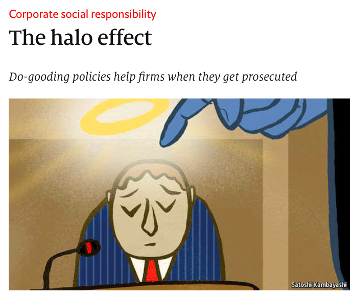

<h1><b>拓词魔鬼营</b>|外刊精读课</h1>

001 “THERE is <i>one and only one</i> social responsibility of business,” wrote Milton Friedman, <i>a Nobel prize-winning economist</i>. “To use its resources and engage in activities designed <i>to increase its profits</i>.” <s>Plenty of climate-change campaigners would argue with that</s>. <b>But</b> even if you accept Friedman’s premise and regard corporate social responsibility (CSR) policies as <i>a waste of shareholders’ money</i>, things may not be <b>absolutely</b> <i>clear-cut</i>. New research suggests that CSR may <i>create monetary value</i> for companies—<small>at least when they are prosecuted for corruption</small>.

词汇表|第1段

premise n.前提 
corporate adj.公司的 
shareholder n.股东 
absolutely adv. 绝对是 
clear-cut adj.清晰的 
monetary adj.货币的 
prosecute v.起诉  
corruption n.腐败 

31. The author views Milton Friedman's statement about CSR with  
A. tolerance 
B. skepticism 
C. uncertainty 
D. approval

态度题|第1段

按照<i>The Economist</i>的套路， 文章的开始必然是不平凡。 比如之前讲英语很简单的那篇，开头就搬出了历史名人斯大林。 

这里一开始，就引入了“重要人物”——诺贝尔经济奖获得者。论权威性，无出其右。尽管权威，但是也是仅供参考，也是会被challenge，比如这篇文章。换个角度，可以将这篇文章看作是一场辩论，相互battle的题是"CSR是不是浪费钱？".

如何认可诺奖获得者说的话，就是absolutely clear-out, 哪还有may not be。

打专家的脸不能随便，证明一个观点错误的最简单方法大概是给个反例了，所以这里提new research，而且还说了具体场景， at least when they are prosecuted for corruption. 

002 The largest firms in America and Britain together spend more than $15 billion a year on CSR, according to an estimate last year by EPG, a consulting firm. <i>This could add value to their businesses in three ways</i>. 

<b>First</b>, <i>consumers</i> may take CSR spending as a “signal” that a company’s products are of high quality. 

<b>Second</b>, <i>customers</i> may be willing to buy a company’s products as an indirect way to donate to the good causes it helps. 

<b>And third</b>, through a more diffuse “halo effect”, whereby its good deeds earn it greater consideration from <i>consumers</i> and others.
 

重点词汇|第2段

estimate n.估计 
consult v.咨询 
indirect adj.间接的 
donate v.捐赠 
diffuse adj.弥漫的 
halo effect 光环效应 
whereby pron. 凭此 
consideration n. 考虑

 32 According to Paragraph 2, CSR helps a company by  
A. winning trust from consumers 
B. guarding it against malpractices 
C. protecting it from being defamed 
D. rasing the quality of its products

段落题|第2段

这一段有点在做presentation的感觉， 有理有据。

 “CSR对企业很好。”

好在哪？ first, second, and third.

CSR的作用力，直接对象是谁？

有点像读长难句时，怎么找句子主干？很容易的一个方法是： 先找谓语，即从动词开始筛选，然后找这个动词对应的主语，即动作的发出者， 再动作的接受者， 宾语。 

复杂的事情也可以这么来看。 

有的企业有CSR，有的没有。 那就把CSR看作一个作用力，就像复杂句里的谓语一样， 那这个作用力的直接对象是？

从1，2，3来看， 都是跟consumer有关。 再看32题的选项，答案就很明显了。

003 <b>Previous</b> studies on CSR have had trouble disentangling these effects because consumers can be affected by <b>all three</b>.<i> A recent</i> <s>paper by Harrison Hong of Princeton University and Inessa Liskovich of the University of Texas</s> <mark>study</mark> <i>attempts to separate them</i> <small>by looking at bribery prosecutions under America’s Foreign Corrupt Practices Act (FCPA)</small>. <s>The authors</s><mark> It</mark> argue(<mark>s</mark>) that since prosecutors do not consume a company’s products as part of their investigations, they could be influenced only by the halo effect.

重点词汇|第3段

disentangle v. 理清 
effect n. 影响 
attempt n. 尝试 
separate v. 分开 
prosecution n. 起诉 
prosecutor n. 公诉人 
investigation n. 调查

删除线的内容在考研真题变成了study。 删除（改写）并没有影响原意。 出题人这么做其实是降低了阅读的难度。

其实，处理长难句也是这个套路。让长句变短，即让重要的信息凸显， 次要的信息先靠边。 

paper <i>by</i> Harrison Hong of Princeton University and Inessa Liskovich of the University of Texas

by 后面的一长串内容都是对这份报告 paper 来源的补充。 报告谁写的，具体到了作者的学校。 这种很细碎的部分，可以略过。

读者更care的是这份报告里与CSR有关的结论，至于谁写的，没那么重要。

004 The study found that, among <i>prosecuted firms</i>, those <i>with</i> the most comprehensive <i>CSR programmes</i> <s>(as measured by MSCI ESG, a provider of corporate indices)</s> tended to get more <b><kbd>lenient penalties</kbd></b>. Their analysis <i>ruled out</i> the possibility that it was firms’ political influence, <i>rather than</i> their CSR stance, that accounted for the <b>leniency</b>: <i>companies that contributed more to political campaigns</i> did not receive <b>lower fines</b>.

重点词汇|第4段

differentiate v.区别 
bribery n. 行贿 
prosecutor n. 公诉人 
consume v. 消耗 
investigation n.调查  
comprehensive adj. 全面的 
lenient adj. 宽大的 
penalty n. 惩罚 
account for 是～的原因 
leniency n. 宽大 
campaign n. 运动 
fine n.罚金

 33 The expression "more lenient"(Line 2, Para. 4) is closest in meaning to  
A.more effective 
B. less controversial 
C.less severe 
D. more lasting

词汇题|第4段

用简单的话把复杂的事情讲清楚，这是《经济学人》的语言让人痴迷的地方，比如说这一段。

这段是典型的比较结构。 

被起诉的公司（文中的prosecuted firms， companies)，分了两类： 一个是with most comprehensive CSR programmes，一个是contributed more to political campaigns. 

简单来说，一个是有CSR programmes,一个是有political campaigns。都是一一对应的关系，CSR之于political, programmmes类比campaigns。

看这一段的第一句，知道被起诉的公司中，有<b>CSR</b>的结果是：<i>more lenient penalties</i>. 

The study found that, among prosecuted firms, those with the most comprehensive CSR programmes (as measured by MSCI ESG, a provider of corporate indices) tended to get more lenient penalties. 

而有<b>political campaigns</b>的呢，是<i>did not receive lower fines</i>. 

companies that contributed more to political campaigns did not receive lower fines.

<b>CSR</b> <small>programmes</small> ➜ <small>more</small> <i>lenient penalties</i>  
<b>political</b> <small>campaigns</small> ➜ <i>not lower fines</i>

以CSR为中心，political campaigns其实可以看作 not CSR programmers. 上图还可以简化成

<b>CSR</b> <small>programmes</small> ➜ <small>more</small> <i>lenient penalties</i>  
<b>not CSR</b> <small>campaigns</small> ➜ <i>not lower fines</i>

这样看，答案就清晰多了。即lenient penalties↔︎lower fines. 

005 <b>In all</b>, the authors conclude that <b>whereas</b> prosecutors should only evaluate a case based on its merits, they <b>do</b> seem to <i>be influenced by a company’s record in CSR</i>. “We estimate that either eliminating a substantial labour-rights concern, such as child labour, or increasing corporate giving by about 20% results in fines that generally are 40% lower than the typical punishment for bribing foreign officials,” says <s>Mr Hong</s> <mark>one researcher</mark>.

重点词汇|第5段

conclude v.推断 
evaluate v.评价 
eliminate v.消除 
substantial adj.实质的  
concern n. 关心 
bribe v.贿赂

 34 When prosecutors evaluate a case, a company's CSR record  
A.has an impact on their decision 
B.comes across as reliable evidence 
C.increases the chance of being penalized 
D.constitutes part of the investigation

同义替换|第5段

这一题属于同义替换。 一句话没有说完，需要从原文里找到一致的，再把题目补完。

题目中的prosecutors evaluate和第一句的prosecutors should only evaluate很一致了，而且不是那种细节部分的一致，有时候可能有误导性，这种主语谓语一致，可以放心大胆得读句子了。

题目里的CSR's record对应首句的a company's record in CSR， 原文的be influenced by即是A选项的impact。

<b>CSR</b> <small>programmes</small> ➜ <small>more</small> <i>lenient penalties</i>  
<b>not CSR</b> <small>campaigns</small> ➜ <i>not lower fines</i>

<s>006 The authors also found that all forms of CSR are not created equal. Spending on employee and community relations had a much bigger impact on the prosecutors than did promoting diversity or being environmentally friendly.</s>

重点词汇|第6段

employee n. 雇员 
community n. 社区 
impact n. 影响 
promote v. 促进 
diversity n. 多样性

007 <s>Mr Hong and Ms Liskovich</s> <mark>Researchers</mark> admit that their study does <b>not</b> answer the question of <i>how much</i> businesses ought <i>to spend</i> on CSR. <b>Nor</b> does it reveal how much companies are banking on the halo effect, rather than the other possible benefits, when they decide their do-gooding policies. <b>But</b> at least they have demonstrated that when companies get into trouble with the law, evidence of good character can win them a <i>less costly punishment</i>.

重点词汇|第7段

reveal v. 揭示 
bank on 依赖，依靠 
benefit n. 益处，好处 
demonstrate v. 说明 
evidence n.证据  
costly adj. 昂贵的

 35 Which of the following is true of CSR, according to the last paragraph?  
A.Its negative effects on businesses are over overlooked. 
B.The necessary amount of companies' spending on it is unknown 
C.Companies' financial capacity for it has been overestimated. 
D.It has brought much benefit to the banking industry.

段落题|第7段

3个关键词， <b>not, nor, but</b>。 即2个不确定的，1个肯定的。 

<b>不确定1</b>: <i>how much</i> to spend?关于CSR，该花多少？还是跟钱有关，我需要花多少钱合适？

<b>不确定2</b>: <i>how much</i> companies are banking on the halo effect?该对CSR有多大的期待，说的是回报问题。

<b>确定</b>：公司有麻烦的时候(when companies get into trouble)，可以被少罚点(<i>a less costly punishment</i>)。 

