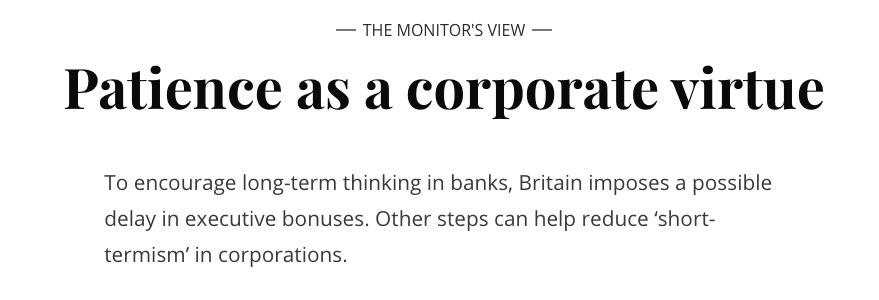

<h1><b>拓词魔鬼营</b>|外刊精读课</h1>

001 <i>Financial regulators</i> in Britain <i>have imposed</i> a rather unusual <i>rule on the bosses</i> of big banks.<small> Starting next year, any guaranteed bonus of top executives could be delayed 10 years if their banks are under investigation for wrongdoing</small>. <i>The main purpose</i> of this “clawback” rule is to <b>hold</b> bankers <b>accountable for</b> harmful risk-taking and to restore public trust in financial institutions. <i>Yet officials also hope for a much larger benefit</i>: <small>more long-term decisionmaking, not only by banks but by all corporations, to build a stronger economy for future generations</small>.

重点词汇|第1段

regulator n.管理者 
impose v. 强制实行  
executive n. 主管；经理 
investigation n. 调查 
wrongdoing n. 违法行为 
accountable adj. 有责任的 
restore v. 恢复 
institution n. 机构 
benefit n. 好处 
corporation n.大公司 

🌟impose ...  on 
🌰 Financial regulators in Britain <b>have imposed</b> a rather unusual <i>rule</i> <b>on</b> the bosses
impose

🌰If you want to <b>impose</b> your <i>music taste</i> <b>on</b> your parents, play your tunes all day at top volume. 

🌰Social relations <b>impose</b> courtesy

🌰No naiton has the capacity to <b>impose</b> its <i>will</i> <b>on</b> others in a substantial or permanent way. 

 

🌟hold ... accountable for 

🌰The main purpose of this “clawback” rule is to <b>hold</b> bankers <b>accountable for</b> harmful risk-taking and...

🌰 men  who think nobody will <b>hold</b> them <b>accountable for</b> their <i>actions</i>, who forget there is a stronger One abover every strong one...

hold (...) accountable for actions/ behaviors/ results/ decisions/ crimes  

002 <i>“Short-termism,”</i> or <i><small>the desire for quick profits</small></i>, has <i>worsened</i> in publicly traded companies, <small>says the Bank of England’s top economist, Andrew Haldane. He quotes <b>a giant of</b> classical economics, Alfred Marshall, in describing this <i>financial impatience</i> as acting like “children who pick the plums out of their pudding to eat them at once” rather than putting them aside to be eaten last.</small>

重点词汇|第2段

profit n.收益  
worsen v.恶化 
giant n.大师

003 The <i>average time</i> <small>for holding a stock in both the United States and Britain, he notes, has</small> <i>dropped</i> <small>from seven years to seven months in recent decades</small>. <i>Transient investors</i>, <small>who demand high quarterly profits from companies</small>, <i>can hinder a firm’s efforts</i> <small>to invest in long-term research or to build up customer loyalty. This has been dubbed “<i>quarterly capitalism</i>.”</small>

重点词汇|第3段

transient adj.短暂的 
hinder v. 阻止 
loyalty n.忠诚 
dub v.把～称作 
capitalism n.资本主义

004 In addition, <i>new digital technologies have allowed more rapid trading</i> <small>of equities, quicker use of information at the speed of Twitter, and thus shorter attention spans in financial markets. “There seems to be <b>a predominance of</b> short-term thinking <b>at the expense of</b> long-term investing,” said Commissioner Daniel Gallagher of the US Securities and Exchange Commission in a speech this week.</small>

重点词汇|第4段

equity n.普通股 
span n. 间隔 
predominance n.优势  
at the expense of 以牺牲～的利益为代价

🌟a predominance of  
🌰 There seems to be <b>a predominance of</b> short-term thinking at the expense of long-term investing...

🌰The <b>predominance</b> <i>over</i> their greatest rivals held for 87 years is also gone.

<i>The Guardian</i> Mar 6, 2019

🌰We are always looking for job candidates,” she said, acknowledging that her industry is known for high turnover rates, low pay and <b>a predominance of</b> female workers.

<i>New York Times</i> Jul 6, 2018

 

🌟at the expense of  
🌰  There seems to be a predominance of short-term thinking <b>at the expense of</b> long-term investing...

🌰If you find it embarrassing to dress up as Santa, you might say that you do it to amuse your nephews, <b>at the expense of</b> your pride.

🌰oil companies increase drilling <b>at the expense of</b> the environment

🌰"I was 11, and dancing was already all that mattered, <b>at the expense of</b> almost everything else, even my own well-being.”

<i>Washington Post</i> Nov 1, 2019

005 <i>In the US</i>, <small>the Sarbanes-Oxley Act of 2002 has pushed most public companies to <b>defer</b> performance bonuses for senior executives by about a year, slightly helping reduce “<i>short-termism</i>.” In its latest survey of CEO pay, The Wall Street Journal finds that “a substantial part”of executive pay is now tied to performance</small>.
 

重点词汇|第5段

defer v.推迟 
senior adj.级别高的  
substantial adj.相当程度的 

006 <i>Much more could be done to <b>encourage</b> “long-termism</i>,” <small>such as changes in the tax code and quicker disclosure of stock acquisitions. In France, shareholders who hold onto a company investment for at least two years can sometimes earn more voting rights in a company.</small>

重点词汇|第6段

disclosure n.公开  
acquisition n.并购

🌟encourage  
🌰... to encourage empathy development in our students 

🌰The move is part of New York’s broader effort to <b>encourage</b> outdoor sports.

Washington Times Nov 10, 2019

🌰There are ecouraging signs of an artistic revival. 

<small>出现了鼓舞人心的艺术复兴的迹象。</small>

🌰In 2015, encouraged by government media outlets, speculative mainland investors poured into China's stock market...

007 Within companies, <i>the right compensation design can <b>provide incentives for</b> executives to think beyond their own time at the company and on behalf of all stakeholders</i>. Britain’s new rule is a reminder to bankers that society has an interest in their performance, not just for the short term <i>but for the long term</i>.

重点词汇|第7段

incentive n.刺激  
on behalf of 代表 
stakeholder n.利益相关者；股东  
reminder n.提示 

🌟provide incentives for  
🌰 In October, Alibaba said it was now “greener than ever” and <b>provided incentives for</b> customers to recycle, adding that its delivery subsidiary Cainiao would observe Nov. 20 as a special cardboard recycling day.

Reuters Nov 10, 2019

🌰 People are given various <b>incentives</b>, such as shopping vouchers or a small financial reward, for doing the surveys.

BBC Nov 8, 2019

 
<h2>思考题</h2>
 

   1  According to Paragraph 1, one motive in imposing the new rule is the_________.

　　A. enhance banker’s sense of responsibility

　　B. help corporations achieve larger profits

　　C. build a new system of financial regulation

　　D. guarantee the bonuses of top executives

　　2. Alfred Marshall is quoted to indicate_________.

　　A. the conditions for generating quick profits

　　B. governments’ impatience in decision-making

　　C. the solid structure of publicly traded companies

　　D. “short-termism” in economics activities

　　3. It is argued that the influence of transient investment on public companies can be__________.

　　A. indirect

　　B. adverse

　　C. minimal

　　D. temporary

　　4. The US and France examples are used to illustrate____________.

　　A. the obstacles to preventing “short-termism”.

　　B. the significance of long-term thinking.

　　C. the approaches to promoting “long-termism”.

　　D. the prevalence of short-term thinking.

　　5. Which of the following would be the best title for the text?

　　A. Failure of Quarterly Capitalism

　　B. Patience as a Corporate Virtue

　　C. Decisiveness Required of Top Executives

　　D. Frustration of Risk-taking Bankers

