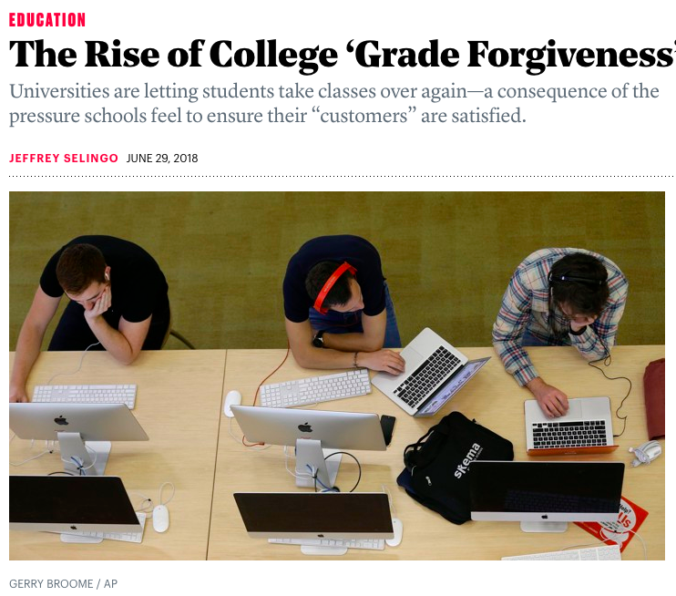

<h1><b>拓词魔鬼营</b>|外刊精读课</h1>

 

<small>Over the course of the past three decades, the A has become the most common grade given out on American college campuses. In 2015, 42 percent of grades were top marks, compared to 31 percent in 1988.</small>
<small>This trend of ⬇️</small>

001 <b><i>grade inflation</i>—the gradual increase in average GPAs over the past few decades—<i>is often considered <mark>a product of</mark> a consumer era in higher education</i>, in which students are treated like customers to be pleased. <mark>But another, related force</mark>—a policy often buried deep in course catalogs called “grade forgiveness”—is helping raise grade-point averages.</b> 

🌟a product of  
🌰I look at myself as <b>a product of</b> my choices, not a victim of my circumstances.

🌰 This boy, let's say he's <b>a product of</b> a filthy neighborhood and a broken home, he can't help it.(电影《十二怒汉》)

🌰 What is happening today is <b>a product of</b> what happened in 1991 and 1992.(时代周刊)

🌰 Happiness is not <b>a product of</b> achievement or wealth or fame.(时代周刊)

关于因果关系的表述，《大西洋月刊》提供了一个很好的范例。用不是典型的因果关系词比如reason,because,result等。但是通过be a product of...暗示了因果关系（文字功底更高一筹）。

<i>A is a product of B</i>的字面意思是：A是B的产物。

逻辑表述是B→A，即B是<b>因</b>， A是<b>果</b>。

电影《12怒汉》（豆瓣评分9.4分）是关于一个18的少年该不该被处死的故事。

一个在贫民窟长大的18岁少年因为涉嫌杀害自己的父亲被告上法庭，证人言之凿凿，各方面的证据都对他极为不利。十二个不同职业的人组成了这个案件的陪审团，他们要在休息室达成一致的意见，裁定少年是否有罪，如果罪名成立，少年将会被判处死刑。

所以才有这样的交代，<b>因为</b>他的成长环境（家庭不美满，友邻不和睦），<b>所以</b>致使他（可能）会有杀害父亲的行为：This boy, let's say he's <b>a product of</b> a filthy neighborhood and a broken home, he can't help it.

再比如，我们是<b>因为</b>自己的选择变成了如今的模样？还是被环境所逼，<b>因为</b>那些不能控制的外在，<b>所以</b>让我们到了现在的境地。这些都是有<i>明确因果导向关系</i>在。 却可以不用任何明显表示因果关系的词，也能把意思传达到位。 

比如Nora认为，我的当下<b>由</b>我过去的选择而来，而非环境弄人，就可以这样子说：

I look at myself as <b>a product of</b> my choices, not a victim of my circumstances.

 

🌟句子分析  
🌰<b>grade inflation</b>—<u>the gradual increase in average GPAs over the past few decades</u>—<i>is</i> often considered a product of a consumer era in higher education, in which students are treated like customers to be pleased.

🌰 <b>But another, related force</b>—<u>a policy often buried deep in course catalogs called “grade forgiveness”</u>—<i>is</i> helping raise grade-point averages.

🌰 And anything that raises GPAs will likely make <b>students</b>—<u>who, at the end of the day, are paying the bill</u>—<i>feel</i> they’ve gotten a better value for their tuition dollars, which is another big concern for colleges.(第5段)

和《经济学人》，《基督教科学箴言报》相比， 《大西洋月刊》的长句明显多很多。但是也不属于故意为难人的那种长，其实有很好的把话说清楚。 

这里的3个例子都是， 长句子中间都有两个小横线（-），碰到这样的形式，时间要紧的拓友们可以把它们略过去。 小横线中间的句子（比较长的文字）都是对前面的对象（名词性质）的解释，所以细节层面的描述了。 

有些是概念比较新，不那么深入人心，通俗易懂，所以需要来解释一下，例子1就是。
也有是代指或者泛指，比较模糊，不够清晰，需要补充说明一下，例子2就是。 
有些是限定一下范围，这样更严谨，例子3就是。 

这样的表达不仅仅是《大西洋月刊》常有，其他的外刊也会有，放在写作里也是极合适的，虽然写出来的是长句子，但是很有层次感，该交代的话都有交代，嫌长的可以不看横线中间的内容，理解有障碍的看了会恍然大悟，这种长句子才不是又臭又长。

重点词汇|第1段

inflation n. 通货膨胀 
era n.年代 
please v.取悦 

<small>Different schools’ policies can work in slightly different ways, but in general,</small>

002 <b><i>grade forgiveness</i> <mark>allows</mark> students to retake a course in which they received a low grade, and the most recent grade or the highest grade is the only one that <mark>counts</mark> in calculating a student’s overall GPA</b>. 

<small>(Both grades still appear on the student’s transcript.)</small>

🌟allow 

🌰<i>grade forgiveness</i> <b>allows</b> students to retake a course in which they received a low grade, and the most recent grade or the highest grade is the only one that counts in calculating a student’s overall GPA

🌰 <i>The Visa chip</i> will <b>allow</b> a customer to hold the phone near a cash register and push a button to pay a bill rather than having a clerk swipe a credit card. The digital mobile phone can replace the  customer's signature as well. (时代周刊)

🌰<i>the technique</i> may one day <b>allow</b> women with ovarian cancer, for example, to have children of their own. (时代周刊)

allow是一个被低估了用法的单词。

一般的用法有权力的意味在。那个「允许」的人或者国家或者机构，怎么看就会觉得段位高一点。可以这么「中规中矩」地用。还有这篇文章的用法也很可取，表达的是「功能效用」，有点像介绍「产品功能」。

把allow前面的主语（名词）当作产品来理解是这样的：

产品A: 成绩宽恕（grade forgiveness） 
作用：考试得低分了可以重修（retake a course） 
适用人群：考低分的学生们(students who received a low grade)

产品B：Visa芯片（The Visa Chip） 
功能：更容易地付钱<small>（hold the phone near a cash register and push a button to pay a bill rather than having a clerk swipe a credit card）</small> 
适用人群：顾客customers

产品C：某项技术(the technique) 
功能：生孩子(to have children) 
适用人群：卵巢癌患者(women with ovarian cancer)

介绍某个产品、计划、方案等的功用（某某某有什么作用，即可以做什么），就可以以这个形式来。

<!-- 🌟count  -->

重点词汇|第2段

retake v. 重修 
count v. 作数

003 <b><i>The use of this little-known practice has accelerated in recent years</i>, as <i>colleges</i> continue to <i>do their utmost to</i> <u>keep students in school</u> (and paying tuition) and <u>improve their graduation rates</u>. According to a forthcoming survey by the American Association of Collegiate Registrars and Admissions Officers, a trade group, some 91 percent of undergraduate colleges and 80 percent of graduate and professional schools permit students to repeat courses to improve a grade. When <i>this practice <mark><b>first started</b></mark></i> decades ago, it was usually limited to freshmen, to give them a second chance to take a class in their first year if they struggled in their transition to college-level courses. But now most colleges, save for many selective campuses, allow all undergraduates, and even graduate students, to get their low grades forgiven</b>.

<!-- 
 -->

<!-- 🌟the use of ~ has accelerated ~   -->

<!-- 
 -->

🌟do one's utmost  

🌰The use of this little-known practice has accelerated in recent years</i>, as <i>colleges</i> continue to <i>do their utmost to</i> <u>keep students in school</u> (and paying tuition) and <u>improve their graduation rates</u>

🌰 I have the <b>utmost</b> respect for Anderson Cooper

🌰 They deserve <b>utmost</b> dignity and respect and privacy at this moment. 

🌰"I might rely upon your <b>utmost</b> discretion?""Of course".

🌰Protecting my son from such a predator was of <b>utmost</b> priority.

🌰Once treated with the <b>utmost</b> suspicion, they now enjoy an almost celebrity-status, often gracing the front covers of glossy magazines.(金融时报)
人们一度<b>极其</b>怀疑这一阶层，但一夜之间这些富豪几乎就成了名人，频频占据畅销杂志的封面。

🌟<b>utmost</b> <i>respect/care/concern/wonder/importance/significance/confidence/security</i>

对Nora而言，utmost这个词自带高光，还有巨大的能量。

这个词意味着程度和级别很高，比most似乎还有隆重一点。 do one's utmost配得上「竭尽全力」。

也可以直接放在某个名词的前面，表达一下感情，虽然可能很夸张，但是听的人还是很舒服，被重视的感觉真好。 

比如「高山仰止」：道德崇高，令人仰慕。多仰慕?utmost respect，佩服得五体投地也符合这样的情况. 

小心翼翼，事无巨细，多仔细呢？utmost discretion. 

彬彬有礼，感觉如沐春风如临秋水，多舒服的相处呢？utmost courtesy. 

重点词汇|第3段

accelerate v.（使）加快  
utmost v.最大的  
tuition n. 学费  
permit v. 允许  
transition n.过渡

<small>以下小字部分属于外刊原文内容，但是被考研出题人做了删减处理，不属于考研真题原文。</small>

<small>The rise of grade forgiveness scans as yet another instance of colleges treating students as customers to be satisfied—similar to campus amenities such as luxurious dorms, palatial recreational facilities, and cornucopian dining halls. Indeed, there seems to be demand for do-overs. “Students are asking for it,” said Jack Miner, Ohio State University’s registrar and executive director of enrollment services. “We’re attracting and retaining stronger students and there’s more competition to get into majors and graduate schools, and a small change in their GPA can help.”</small>  
<small>Ohio State expanded its grade-forgiveness policy three years ago to cover all undergraduates instead of just freshmen. Miner says that about 4,500 students—roughly 10 percent of Ohio State’s undergraduate population—take advantage of the policy in any given year. Most students see their grades rise in the second attempt, usually a full letter grade or a full letter and a half, Miner said. Still, about 15 percent of students who receive a failing grade in the first attempt have the same outcome in the second. “That’s a wake-up call for those students that maybe they need to reconsider their major,” Miner said.</small>  
<small>Miner is generally optimistic about the promise of grade forgiveness, but others are concerned about what it could do to academic dynamics. “It teaches students that their work in a course doesn’t matter because there’s always another chance,” said Jonathan Marx, a professor of sociology at Winthrop University, in South Carolina.</small>  
<small>Marx and his colleague David Meeler, an associate professor of philosophy, have studied grade-forgiveness programs at eight public institutions in an unnamed southern state. What they found in a study published in 2013 is that 5 percent of the seniors they polled at one of the institutions used grade-forgiveness policies to keep anywhere from a quarter to half of all of their coursework from counting toward their GPA. One student highlighted in the study repeated five different courses for better grades, including a math class in which she was eventually able to raise her grade from a D to an A-minus.</small>  
<small>“Everyone knows about grade inflation, but this is GPA distortion, and few people looking at a student’s GPA know it happens,” Meeler said. He and Marx told me they have nothing against giving students second chances, but their issue is with the colleges that, say, allow a student to repeat five courses as they please. “Institutions are allowing students to manage their grades to get the highest reward,” Meeler said, as opposed to requiring students to work with faculty members to master the material.</small>  
<small>At the University of Colorado Boulder, such concerns led faculty members to eliminate grade forgiveness in 2010. Professors at the time were worried about the fairness of the policy—they noticed that students in some majors were using it more than those in others, and that a freshman-oriented rule was being used regularly by upperclassmen. But now, as other colleges adopt or expand such policies, Colorado is considering reinstating the practice. “We’re weighing how to foster student success to help them achieve their goals,” said Kristi Wold-McCormick, the university’s registrar. “We are not trying to alter academic history. It gives the student a chance to tell their story, about how they overcame a mistake or a struggle.”</small>

004 <b><i>College officials</i> also tend to emphasize that the <i>goal of grade forgiveness</i> is <u><i>less about</i></u> the grade itself and <u><i>more about</i></u> encouraging students to retake courses critical to their degree program and graduation without incurring a big penalty. “Ultimately,” Ohio State’s Miner said, “we see students achieve more success because they retake a course and do better in subsequent courses or master the content that allows them to graduate on time.”</b>

🌟<b>the goal of </b>something <b>is less about</b> A<b>and more about</b> B 

🌰 <i>the goal of</i> grade forgiveness <b>is less about</b> the grade itself <b>and more about</b> encouraging students(真题原文)

🌰<i>The goal</i> is to get 51 votes. <i>The goal</i> is really <b>less about</b> policy and <b>more about</b> passing something. (NPR: Fresh Air)

🌰<i>My point</i> was <b>less about</b> the definition, and <b>more about</b> the fact that...

🌰<i>He</i> was <b>more about</b> the business and <b>less about</b> being friendly with patients. 

🌰It's <b>less about</b> demand and <b>more about</b> supply.

🌰But like I said, <i>being middle class</i> is <b>less about</b> what you've got, and <b>more about</b> what you do with what you've got.
但是，就像我所说的那样，中产阶级不是你拥有什么，更多的是你能用你所拥有的做什么。

怎么委婉地否定别人的观点，突出自己的观点？这个句式就很合适。 

就像例子3所说的，我的点(my point)不在于（less about），而是在（more about)。

less about还是比直接的not舒服很多。 more about也是指明了倾向性， 有点but的意味在，却不是那么的决绝。 碰到这样的句式，需要警惕的是more about的内容，是重点。

重点词汇|第4段

emphasize v.强调   
incur v. 招致  
penalty n. 惩罚

005 <b>That said, there is a way in which grade forgiveness satisfies colleges’ own needs as well. <i>For public institutions</i>, <i>state appropriations</i> are sometimes <i>tied partly to their success</i> on metrics such as <u><i>graduation rates</i></u> and <u><i>student retention</i></u>—so <i>better grades</i> can, by boosting figures like those, <i>mean more money</i>. And anything that raises GPAs will likely make students—who, at the end of the day, are paying the bill—feel they’ve gotten a better value for their tuition dollars, which is another big concern for colleges.</b>

🌟there is a way in which ... 
🌰That said, <b>there is a way in which</b> <u>grade forgiveness satisfies colleges’ own needs as well</u>.（真题原文）

🌰<b>There is a way in which</b> <u>we can begin to mark our history and our past</u>.（CNN）

🌰But I do feel as though <b>there is a way in which</b> <u>the Internet provides this medium for people who ordinarily would not be able to</u>.

🌰The paradox of Christa Worthington was that she presented as somebody who was really on top of things, who was elegant and refined, but <b>there was a way in which</b> <u>emotionally she was disorganized, disorderly, undisciplined</u>. 

句子结构是这样的：there is a way in which + 事实或结论（完整句子）。

可以看作数学的证明题。 有一个结论（内容为例子里的下划线句子），可以被证明（there is a way）。证明过程呢？就是这句话之后的解释了。 

比如想说明白这句话，「<b>我纹身、抽烟、喝酒、说脏话，但我是好女孩</b>」可以写成：

<b>我纹身、抽烟、喝酒、说脏话</b>，<i>but there is way in which</i> <b>我是好女孩</b>。

如果准备写成小短文，后面应该再附以这样的女孩好在哪的具体说明，以兹证明这个结论<small>——（我纹身、抽烟、喝酒、说脏话），但我是好女孩</small>——生效。

<b>说理</b><i>表达观点</i>的时候可以试试这个句式。 <i>先</i>说，某个观点说得通：<b>There is a way in which +某个观点（完整句子）</b>，然后<i>再</i>具体描述一下。

重点词汇|第5段

appropriation n. 拨款 
metric n. 度量标准 
retention n.保持；保留 
boost v.使增长；推动

006 <b>Indeed, grade forgiveness is just another way that universities are responding to consumers’ expectations for higher education. Since students and parents expect a college degree to lead to a job, it is in the best interest of a school to churn out graduates who are as qualified as possible—or at least appear to be. On this, students’ and colleges’ incentives seem <mark>to be aligned</mark>.</b>

🌟it is <b>in the best interest of</b> <i>a school</i> to churn out graduates... 
in one's best interest 对...有最大好处、为...着想

🌰 a decision I made <b>in the best interest of</b> <i>my family and my country</i> 

🌟 <b>in the best interest of</b> 实物 <i>someone/patients/clients/employees/investors/company/nation</i>

🌟 <b>in the best interest of</b> 虚物 
<i>fairness/ accuracy/ security/ career</i> 

🌰 George W. Bush did that because he truly believed that it was <b>in the best interest of</b> <i>the United States</i> to address the issue of Saddam Hussein. (The Atlantic 大西洋月刊)

🌰Why would you want to break that up? " Mr. Robertson counters that many Scots understand it would be leaving a legacy of power, but that ultimately it is <b>in the best interest of</b> the <i>Scottish people</i>. （CSMonitor基督教科学箴言报）

🌰  In fact, the Internet Service Providers never have demonstrated that they were not willing to share information among themselves if they felt it was <b>in the best interest of</b> <i>national security</i>, but the divide will continue to impede any meaningful policies to counter cyber terrorism. (USAToday)

这个表达，很正义凛然，很无私，很有奉献精神。似乎说了马上就占据了道德高地。

比如父母代做的决定，还没有来得及生气，就被一句我是<b>为了你好</b><i>in the best interest of you</i>堵回去了，不舒服的小情绪马上偃旗息鼓。 

这种表达会在哪里常见到呢？政客。美国总统们的发言里常听到。所以不意外常常在战争片里常常听到in the best interest of nation，people这种说法。

那些大决定，影响重大的决定，没有办法简单地证明对错的决定，用这个表达就可以含糊过去了，毕竟是为了「people, nation」，这么高尚的理由在，为什么还要指摘总统瞎做决定呢😂，看看电影<i>《星球大战：克隆人之战》</i>里这段话：

 How would you have it work? We need a system where the politicians sit down and discuss the problem... agree what's <b>in the best interest</b> of all the people... and then do it. That's exactly what we do. The trouble is that people don't always agree. Well, then they should be made to. - By whom? Who's gon na make them? - I don't know. Someone. - You? - Of course not me. - But someone. - 

虽然被politicians和statesman用“坏”了，但是考研写作里还是用来讲原因的好表达。比如环保题材里，可以说in the best interest of public health.

可以是指实在的，也可以虚的，上面👆都有交待。 考研的题源们（大西洋月刊/基督教科学箴言报/USAToday）也给了很好的示范👆

重点词汇|第6段

qualify v.达到标准  
churn out 快速生产 
incentive n.刺激；动机  
align v. 与～联合；使成直线；调准

 
<h2>说明</h2>
 

选自2019年考研英语一阅读二。出题人对原文进行了大幅度的删减， 小字是被删减的部分。

原文标题是《绩点谅解的抬头》（The Rise of College ‘Grade Forgiveness’），讲的是学生在今天这个时代被看成“客户”。

客户就是上帝，要让他们满意。即一门课绩点不好（不是不及格），学生可以再学一遍，来刷绩点。

 
<h2>思考题</h2>
 
26. What is commonly regarded as the cause of grade inflation?

A. The change of course catalogs.

B. Students’ indifference to GPAS.

C. Colleges’ neglect of GPAS.

D. The influence of consumer culture.

27. What was the original purpose of grade forgiveness?

A. To help freshmen adapt to college learning.

B. To maintain colleges’ graduation rates.

C. To prepare graduates for a challenging future.

D. To increase universities’ income from tuition.

28. According to Paragraph 5,grade forgiveness enable colleges to_________.

A. obtain more financial support

B. boost their student enrollments

C. improve their teaching quality

D. meet local governments’ needs

29. What does the phrase “to be aligned”(Line 5, Para.6) most probably mean?

A. To counterbalance each other.

B. To complement each other.

C. To be identical with each other.

D. To be contradictory to each other.

30. The author examines the practice of grade forgiveness by________.

A. assessing its feasibility

B. analyzing the causes behind it

C. comparing different views on it

D. listing its long-run effects

<!-- 参考网址：https://kaoyan.eol.cn/shiti/yingyu/201812/t20181224_1638421.shtml -->

