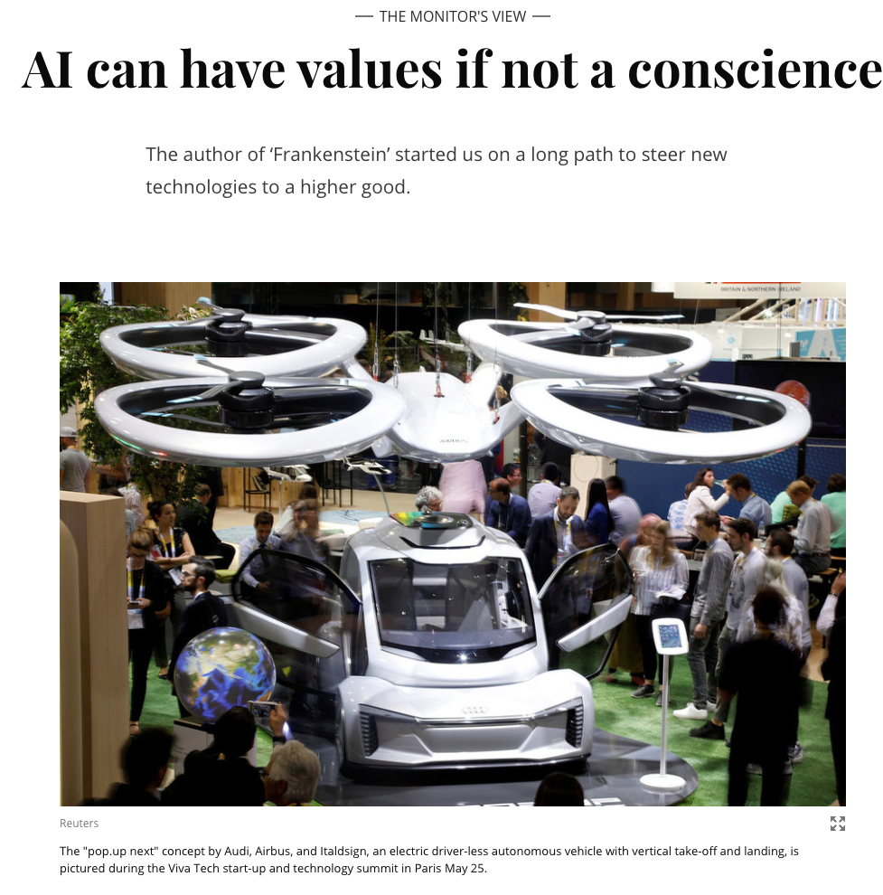

<h1><b>拓词魔鬼营</b>|外刊精读课</h1>

001 <b>This year marks exactly two centuries since the publication of “Frankenstein; or, The Modern Prometheus,” by Mary Shelley. Even before the invention of the electric light bulb, the author produced a remarkable work of speculative fiction that would foreshadow myriad ethical questions to be spawned by technologies yet to come.</b>

002 <b>Today the rapid growth of artificial intelligence (AI) raises fundamental questions: “What is intelligence, identity, or consciousness? What makes humans humans?"</b>

003 <b>What is being called artificial general intelligence, machines that would mimic the way humans think, continues to elude scientists. Yet humans remain fascinated by the idea of robots that would look, move, and respond like humans, similar to those recently depicted on popular sci-fi TV series such as “Westworld” and “Humans.”</b>

004 <b>Just how people think is still far too complex to be understood, let alone reproduced, says David Eagleman, a Stanford University neuroscientist and science adviser for “Westworld.” “[W]e are just in a situation where there are no good theories explaining what consciousness actually is and how you could ever build a machine to get there.”</b>

005 <b>But that doesn’t mean crucial ethical issues involving AI aren’t at hand.</b> Less sophisticated AI is already embedded in everyday life, from the (sometimes) helpful voice assistants like Alexa to Facebook tagging photos for users.

Besides much-talked-about vehicles that will drive themselves, AI is crunching huge amounts of data to suggest whether a prisoner would likely return to crime if released; algorithms exist that can choose the best applicants for a job or the right classes for a student to take (not to mention defeat a human at chess or win a debate).

All these systems contain the possibility of misuse. One viral video shows an automatic soap dispenser in a public bathroom that only dispenses soap onto white hands. Apparently the design team forgot to calibrate the sensor so that it recognized hands with darker skin tones.

While that foul-up might seem frivolous, or even humorous (though perhaps not to those being denied soap), it illustrates a more serious problem: If an employer looks for new hires, for example, using an algorithm based on the characteristics of its presently all-white or all-male staff, might the algorithm recommend only people with those characteristics?

<s>The coming use of autonomous vehicles poses gnarly ethical questions.</s> <mark><b>The coming use of autonomous vehicles, for example, poses thorny ethical questions.</b></mark><b>Human drivers sometimes must make split-second decisions. Their reactions may be a complex combination of instant reflexes, input from past driving experiences, and what their eyes and ears tell them in that moment. </b>

<b>AI "vision" today is not nearly as sophisticated as that of humans. And to anticipate every imaginable driving situation is a difficult programming problem. </b>One possible technique may be to survey human drivers to ask what they would do in myriad driving situations. Another would be to analyze accidents involving AI after the fact, to understand how it proved deficient and fix the problem.

The hope is that AI-driven vehicles will become far better drivers than humans, saving thousands of human injuries and deaths.

006 <s>But</s> <b>whenever decisions are based on masses of data, “you quickly get into a lot of ethical questions,” notes Tan Kiat How, chief executive of the Info-communications Media Development Authority, a Singapore-based agency that is helping the government develop a voluntary code for the ethical use of AI.Along with Singapore, other governments and mega-corporations are beginning to establish their own guidelines. Britain is setting up a data ethics center. India released its AI ethics strategy this spring. </b>Worldwide, high schools and colleges could seriously commit to teaching students in AI courses about the ethical issues this new technology raises.

007 On June 7 Google pledged to not “design or deploy AI” that would cause “overall harm,” or to develop AI-directed weapons or use AI for surveillance that would violate international norms. It also pledged to not deploy AI whose use would violate international laws or human rights.

008 <b>While the statement is vague, it represents one starting point. So does the idea that decisions made by AI systems should be “explainable, transparent, and fair</b>,” as S. Iswaran, Singapore’s minister for communications and information, put it recently.

009 <b>To put it another way: How can we make sure that the thinking of intelligent machines reflects humanity’s highest values? Only then will they be useful servants and not Frankenstein’s unleashed monster.</b>

 
<h2>说明</h2>
 

选自2019年考研英语一阅读三二。出题人对原文进行了大幅度的删减，红字是真题部分。

文章大体内容是：要AI或机器人像人类一样思考，还早着呢！但并不是说AI的开发不会涉及到伦理道德的问题。就像《弗兰克斯坦》，就像克隆羊多利，就像基因改造的婴儿...

 
<h2>思考题</h2>
 

31. Mary Shelley’s novel Frankenstein is mentioned because it

A. fascinates AI scientists all over the world.

B. has remained popular for as long as 200 years.

C. involves some concerns raised by AI today.

D. has sparked serious ethical controversies.

32. In David Eagleman’s opinion, our current knowledge of consciousness

A. helps explain artificial intelligence.

B. can be misleading to robot making.

C. inspires popular sci-fi TV series.

D. is too limited for us to reproduce it.

33. The solution to the ethical issues brought by autonomous vehicles

A. can hardly ever be found.

B. is still beyond our capacity.

C. causes little public concern.

D. has aroused much curiosity.

34. The author’s attitude toward Google’s pledge is one of

A. affirmation.

B. skepticism.

C. contempt.

D. respect.

35. Which of the following would be the best title for the text?

A. AI’s Future: In the Hands of Tech Giants

B. Frankenstein, the Novel Predicting the Age of AI

C. The Conscience of AI: Complex But Inevitable

D. AI Shall Be Killers Once Out of Control

