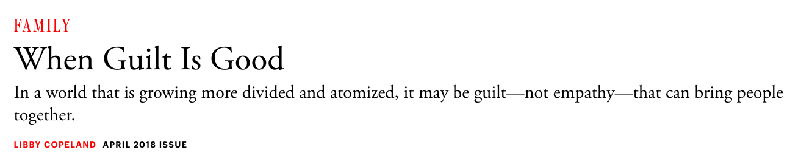

<h1><b>拓词魔鬼营</b>|外刊精读课</h1>
<!--  -->
<!--  -->

A few years ago, researchers in Germany set out to plumb the moral consciences of small children. They invited a series of 2- and 3-year-olds to play with a marble track in a lab. Close to the track—inauspiciously close—was a block tower that one of the adult experimenters claimed to have painstakingly constructed. Just before turning her back, she asked them not to damage it.

Needless to say, the game was rigged. After a few runs, a marble would knock over part of the tower, at which point the experimenter responded with what the resulting journal article described as a “mildly sad” tone. “Oh no,” she would say, then ask what had happened. In some versions of the experiment, the child seemed to be to blame; in others, an adult who was helping with the experiment toppled the tower. The kids’ reactions revealed a lot about how social-emotional development progresses during these key years. While many of the 2-year-olds seemed sympathetic to the researcher’s plight, the 3-year-olds went beyond sympathy. When they believed that they’d caused the accident, they were more likely than the 2-year-olds to express regret and try to fix the tower. In other words, the 3-year-olds’ behavior varied depending on whether they felt responsible.

 

Their actions, according to Amrisha Vaish, the University of Virginia psychology researcher who led the study, demonstrate “the beginnings of real guilt and real conscience.” Vaish is one of a number of scholars studying how, when, and why guilt emerges in children. 001<b>Unlike so-called basic emotions such as sadness, fear, and anger, guilt emerges a little later, in conjunction with a child’s growing grasp of social and moral norms. Children aren’t born knowing how to say “I’m sorry”; rather, they learn over time that such statements appease parents and friends—and their own consciences. This is why researchers generally regard so-called moral guilt, in the right amount, to be a good thing</b> :A child who claims responsibility for knocking over a tower and tries to rebuild it is engaging in behavior that’s not only reparative but also prosocial.

 

 

002 <b>In the popular imagination, of course, guilt still gets a bad rap. It evokes Freud’s ideas and religious hang-ups. More important, guilt is deeply uncomfortable—it’s the emotional equivalent of wearing a jacket weighted with stones. Who would inflict it upon a child? Yet this understanding is outdated. “There has been a kind of revival or a rethinking about what guilt is and what role guilt can serve,” Vaish says, adding that this revival is part of a larger recognition that emotions aren’t binary—feelings that may be advantageous in one context may be harmful in another. Jealousy and anger, for example, may have evolved to alert us to important inequalities. Too much happiness (think mania) can be destructive.</b>

 

003<b>And guilt, by prompting us to think more deeply about our goodness, can encourage humans to atone for errors and fix relationships. Guilt, in other words, can help hold a cooperative species together. It is a kind of social glue.</b>

 

004 <b>Viewed in this light, guilt is an opportunity. Work by Tina Malti, a psychology professor at the University of Toronto, suggests that guilt may compensate for an emotional deficiency. In a number of studies, Malti and others have shown that guilt and sympathy (and its close cousin empathy) may represent different pathways to cooperation and sharing. Some kids who are low in sympathy may make up for that shortfall by experiencing more guilt, which can rein in their nastier impulses. And vice versa: High sympathy can substitute for low guilt.</b>

 

005<b>In a 2014 study, for example, Malti and a colleague looked at 244 children, ages 4, 8, and 12. Using caregiver assessments and the children’s self-observations, they rated each child’s overall sympathy level and his or her tendency to feel negative emotions (like guilt and sadness) after moral transgressions. Then the kids were handed stickers and chocolate coins, and given a chance to share them with an anonymous child. For the low-sympathy kids, how much they shared appeared to turn on how inclined they were to feel guilty. The guilt-prone ones shared more, even though they hadn’t magically become more sympathetic to the other child’s deprivation.</b>

006<b>“That’s good news,” Malti says. “We can be prosocial because of our empathetic proclivity, or because we caused harm and we feel regret.”</b>

 

Malti describes guilt as a self-directed emotion, elicited when you act in a way that’s out of keeping with your conscience. Sympathy and empathy are other-directed. A child who isn’t inclined to feel bad for a classmate whose toy car she stole might nevertheless feel uncomfortable with the idea of herself as a thief—and return the toy. Guilt can include sympathy, Malti says, but it doesn’t have to. She’s agnostic about which of the two paths children take, so long as they treat one another well.

 

This is a provocative idea at a moment when parents and educators have come to almost fetishize empathy—when a child’s ability to put herself in another’s shoes seems like the apex of goodness. Parents encourage children to consider how their peers feel when they don’t share their toys. Preschool teachers instruct students to consider one another “friends,” implying that good behavior is predicated on affection. Elementary schools base anti-bullying curricula around altruistic concepts like love and kindness.

 

When it comes to helping kids manage relationships and tamp down aggression, “schools and programs have almost exclusively focused on empathy promotion,” Malti says. “I think it’s incredibly important to nurture empathy, but I think it’s equally important to promote guilt.”

 

 

If you still find the idea of guilting your child unpalatable, keep in mind that we’re talking about a very specific kind of guilt. This is not telling your child that her disobedience proves she’s unworthy, or describing how painful it was to give birth to her. This is not pressuring your grown son or daughter to hurry up and have babies before you die. In short, this is not your grandmother’s guilt-trip.

 

You don’t want a child to feel bad about who she is (that’s called shaming) or responsible for things outside her control (which can give rise to maladaptive or neurotic guilt; see the child who feels guilty for her parents’ divorce). Malti points out that a child’s age and disposition are also important considerations; some may be temperamentally guilt-prone and require a lighter touch. The point is to encourage both goodness and resilience. We all make mistakes, and ideally we use them to propel ourselves toward better behavior.

 

Proper guilting connects the dots between your child’s actions and an outcome—without suggesting anything is wrong or bad about her—and focuses on how best to repair the harm she’s caused. In one fell swoop it inspires both guilt and empathy, or what Martin Hoffman, an emeritus professor at NYU known for his extensive work on empathy, has termed “empathy-based guilt.” Indeed, you may already be guilting your child (in a healthy way!) without realizing it. As in: “Look, your brother is crying because you just threw his Beanie Boo in the toilet.” Hopefully, the kid is moved to atone for her behavior, and a parent might help her think through how to do that.

Work by Renee Patrick, a psychology professor at the University of Tampa, shows that it’s important for parents to express themselves in a warm and loving way: A parent who seems chastising or rejecting can induce anxiety in a child, and do nothing to encourage healthy behavior. Patrick’s work also shows that kids whose parents used a strategy intended to elicit “empathy-based guilt” during their adolescence tended to see moral concepts like fairness and honesty as more central to their sense of themselves. (A related technique that’s been found effective in adolescents involves what Patrick calls “parental expression of disappointed expectations”—which is as harrowing as it sounds.)

 

Joan Grusec, a psychologist and researcher in parenting and children’s development, and a colleague of Malti’s at the University of Toronto, says it’s important to make the what-you-can-do-about-it part a discussion between parent and child, instead of a sermon. Forcing a child to behave morally may prevent her from internalizing the lesson you’re trying to impart. And, she says, such a conversation may work better “once everybody has simmered down,” rather than in the heat of a dispute. She points to research on what academics call reminiscence, which suggests that discussing a transgression after the fact may better help children understand what they did wrong.

 

Of course, knowing when to feel bad and what to do about it are things we could all benefit from. Malti’s research may focus on kids, but guilt is a core human emotion—an inevitability for people of every age. And she believes that it has the potential to be especially helpful now, in a world that is growing more divided and atomized.

 

She argues that guilt may have the ability to bring us together, not despite but because of its focus on the self. The proposition is radical. What if the secret to treating one another better is thinking about ourselves not less, but more?

 
<h2>说明</h2>
 

2019年考研英语二 passage1 

出自《大西洋月刊》Guilt is good. 

 
<h2>思考题</h2>
 

21.Researchers think that guilt can be a good thing because it may help______.

　　A)regulate a child's basic emotions

　　B)improve a child's intellectual ability

　　C)foster a child’s moral development

　　D)intensity a child's positive feelings

　　22.According to paragraph 2, many people still consider guilt to be______.

　　A)deceptive

　　B)burdensome

　　C)addictive

　　D) deception

　　23. Vaish hold that the rethinking about guilt comes from an awareness that______.

　　A)emotions are context-independent

　　B)emotions are socially constructive

　　C)emotional stability can benefit health

　　D)an emotion can play opposing roles

　　24. Malti and others have shown that cooperation and sharing _______.

　　A. may help correct emotional deficiencies

　　B. can result from either sympathy or guilt

　　C. can bring about emotional satisfaction

　　D. may be the outcome of impulsive acts

　　25. The word “transgressions” (Line 4, Para.5) is closest in meaning to _______.

　　A. teachings

　　B. discussions

　　C. restrictions

　　D. wrongdoings

