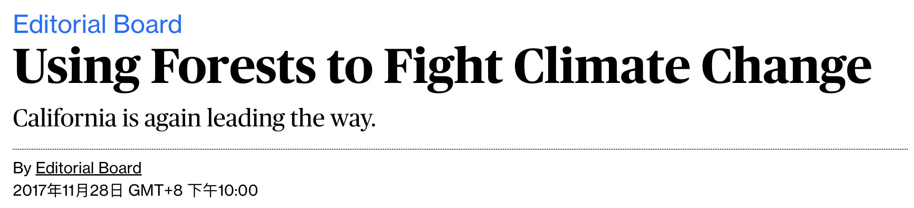

<h1><b>拓词魔鬼营</b>|外刊精读课</h1>

 
<h2>说明</h2>
 

选自2019年考研英语二阅读二。出题人对原文进行了的删减。

文章选自 Bloomberg Opinion彭博观点. 

Using forests to fight climate change. 

 
<h2>正文</h2>
 

001 Forests give us shade, <u>quiet</u> and one of the harder challenges in the fight against climate change. Even as we humans count on forests to soak up <b>a good share of</b> the carbon dioxide we produce, we are threatening their ability to do so. The climate change we are hastening could one day leave us with forests that emit more carbon than they absorb.

a ___ share of 

a <i>large</i> share of 

a <i>fair</i> share of 

a <i>disproportionate</i> share of 

a <i>significant</i> share of 

a <i>growing</i> share of 

002 <i>Thankfully, <b>there is a way out of this trap</b> -- but it involves striking a subtle balance</i>. Helping forests flourish as valuable "carbon sinks" long into the future may require reducing their capacity to sequester carbon now. California is <b>leading the way</b>, as it does on so many climate efforts, in <b>figuring out</b> the details.

strike a balance 寻求平衡

We try to srtike a balance between justice and mercy. 
我们设法做到宽严相济，恩威兼施。

lead the way引路

Domestic companies are expected to lead the way in building new power plants in the country.
本国的公司预期将率先开始在国内建造新的发电厂。

003 The state's proposed Forest Carbon Plan <b>aims to</b> <u> double</u> efforts to <u> thin</u> out young trees and <u> clear</u> brush in parts of the forest, including by controlled burning. This temporarily <b>lower</b>s carbon-carrying capacity. But the remaining trees <u>draw</u> <b>a greater share of</b> the available moisture, so they grow and thrive, restoring the forest's capacity to <u> pull</u> carbon from the air. Healthy trees are also better able to fend off bark beetles. The landscape is rendered less combustible. Even in the event of a fire, fewer trees are consumed.

aim to 旨在

But he said the focus of the deal was to service its customers in China rather than <b>aim to</b> become a "global local bank" .
但他表示，此笔交易的重点是为其中国客户服务，而非成为“全球性当地银行”。

004 The need for such planning is increasingly urgent. Already, since 2010, drought and beetles have killed more than 100 million trees in California, most of them in 2016 alone, and wildfires have scorched hundreds of thousands of acres.

005 California's plan <s>envisions treating</s><mark>to treat</mark> 35,000 acres of forest a year by 2020, and 60,000 by 2030 -- <u>financed</u> from the proceeds of the state's emissions-permit auctions. That's only <b>a small share of</b> the total acreage that could benefit, an estimated half a million acres in all, so it will be important to prioritize areas <b>at greatest risk of</b> fire or drought.

You're <b>at greatest risk of</b> osteoporosis if you're white or of Asian descent.
如果你是白人或亚裔的话，你患上骨质疏松的风险最高。

If you smoke, you know you're putting yourself <b>at increased risk of</b> lung cancer.
如果你抽烟，那么你肯定知道自己患肺癌的风险会增加。

But <b>at the risk of</b> looking silly in a few days (or weeks or months or years), I'm going to ignore the obvious pitfalls and forge ahead.
承担着名声受损几天（或者几星期、几月甚至几年）的风险，我决定无视这一明显的陷阱，毅然要趟这条浑水。

006 The strategy also <b>aims to</b> ensure that carbon in woody material removed from the forests is locked away in the form of solid lumber, burned as biofuel in vehicles that would otherwise run on fossil fuels, or used in compost or animal feed. New research on transportation biofuels is under way, and the state plans to encourage lumber production close to forest lands. In future the state proposes to take an inventory of its forests' carbon-storing capacity every five years.

007 State governments <b>are <i>well</i> accustomed to</b> managing forests, including those owned by the U.S. Forest Service, but <i><u>traditionally</u></i> they've focused on wildlife, watersheds and opportunities for recreation. Only  <i><u>recently</u></i>  have they come to see the vital part forests will have to play in storing carbon. California's plan, which is expected to be <u>finalized</u> by the governor early next year, should <b>serve</b> as a model.

 
<h2>思考题</h2>
 

26."one of the harder challenges" implies ___

A. global climate change may get out of control

B. forests may become a potential threat

C. people may misunderstand global warming

D. extreme weather conditions may arise

27.To maintain forests as valuable "carbon sinks", we may need to _

A.preserve diversity of species

B. lower their present carbon-absorbing capacity

C. accelerate the growth of young trees

D. strike a balance among different plants

28.California's Forest Carbon Plan endeavors to_

A.restore its forests quickly after wildfires

B.cultivate more drought resistant trees

C.find more effective ways to kill insects

D.reduce the density of some of its forests

29.what is essential to California's plan according to para. 5?

A.to obtain enough financial support

B.to carry it out before 2020

C.to handle the areas in the serious danger first

D. to perfect the emission-permit auctions

30.the author's attitude toward California's plan can be best described as _

A.supportive

B.ambiguous

C.tolerant

D.cautious​​​​

