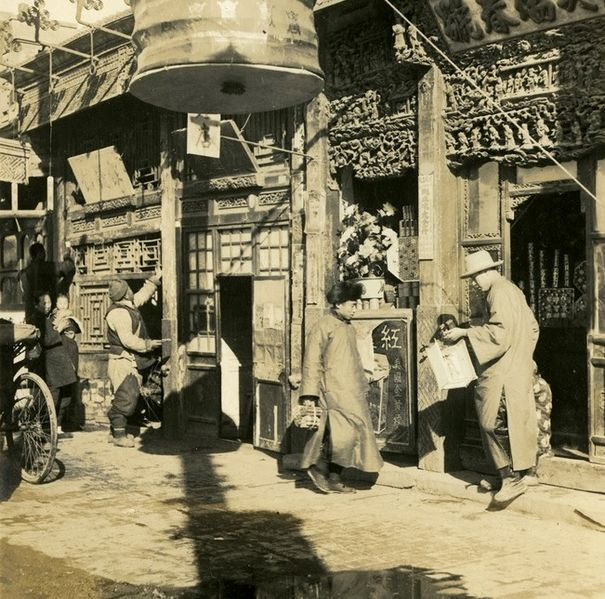

<h1><b>拓词魔鬼营</b>|外刊精读课</h1>

<h1>How I celebrated the New Year</h1>
<h4>林语堂</h4>

<!--   -->
<!-- <h2>前言</h2> -->
<!--   -->

<!-- 文章来自林语堂的How I celebrated the New Year，一个世纪前的民国，过新年是怎样一番情境？看看林语堂怎么说。  -->

<!--   -->
<!-- <h2>正文</h2> -->
<!--   -->

01 <u>The old Chinese new year, of the lunar calendar, <i>was the greatest festival in the year for the Chinese people</i>, compared with which every other festival seemed  lacking in completeness of the holiday spirit</u>. 

<u>For five days the entire nation dressed in its best clothes, shut up shop, loafed, gambled, beat gongs, let off firecrackers, paid calls and attended theatrical performances</u>. 

<u>It was the great day of good luck, when everybody looked forward to a better and more prosperous new year, when everybody had the pleasure of adding one year to his age and was ready with an auspicious, luck-bringing word for his neighbors</u>.

02 The humblest maid had the right not to be scolded on New Year's Day, and  <i>strangest of all</i>, even the hard-working women of China loafed and ate melon  seeds and refused to wash or cook a regular meal or even handle the kitchen knife. <i>The justification for this idleness</i> was that to chop meat on New Year's Day was to  chop off good luck, and to pour water down the sink was to pour away good luck,  and to wash anything was to wash away good luck.

03 <b>Red scrolls</b> were pasted on every door containing the words: <i>Luck, Happiness,  Peace, Prosperity, Spring</i>. For it was the festival of the return of spring, of life and growth and prosperity. And all around, in the home courtyards and in the streets,  there was the sound of firecrackers and the smell of sulphur was in the air.

04 <b>Fathers</b> lost their dignity, <b>grandfathers</b> were more amiable than ever, and  <b>children</b> blew whistles and wore masks and played with clay dolls. <b>Country women</b>, dressed in their best, would go three or four miles to a neighboring village to  watch a theatrical show, and <b>village dandies</b> indulged in what flirtations they  dared. It was the day of emancipation for women, emancipation from the drudgery of cooking and washing, and if the men were hungry, they could fry nienkao, or  make a bowl of noodles with prepared sauce, or go to the kitchen and steal cold  cuts of chicken.

05 <i>The National Government of China has officially <b>abolished</b> the <i>lunar New Year</i>,  but the lunar New Year is still with us, and refuses to be abolished</i>.

06 I am ultra-modern. No one can accuse me of being conservative. I <b>am</b> not only  <b>for</b> the Gregorian calendar, but <b>am</b> even <b>for</b> the thirteen-month calendar, in which all months have exactly four weeks or twenty-eight days. In other words, <u><i>I am very scientific in my viewpoint and very logical in my reasoning</i></u>. <u>It was this scientific  pride which was badly wounded when I found my celebration of the official New  Year a great failure, as anyone who pretended to celebrate it with any real feeling must have found out for himself</u>. I didn't want the Old New Year. But the Old New  Year came. It came on February the fourth. My big Scientific Mind told me not to  keep the Old New Year, and I promised him I wouldn't. "I'm not going to let you  down," I said, with more good will than self-confidence.

07 For I heard rumblings of the Old New Year's coming as far back as the  beginning of January, when one morning I was given for breakfast a bowl of  Iapacho, or <b>congee</b> with lotus-seeds and dragon-eyes, which sharply reminded me  it was the eighth day of the twelfth moon. A week after that, my servant came to  borrow his extra month's pay, which was his <b>due</b> on the New Year's Eve. He got an afternoon's leave and showed me the package of new blue cloth which he was  going to send to his wife.

Preparing for New Year in Beijing, 1910s. Image by Unknown.

08 On February first and February second, I had to give tips to the postman, the  milkman, the expressman, the <b>errand</b> boys of book companies, etc. I felt all along  what was coming. February the third came. Still I said to myself, "I'm not going to  keep the Old New Year." That morning, my wife told me to change my underwear. I said, "What for?" "Chouma is going to wash your underwear today. She is not going to wash tomorrow, nor the day after tomorrow, nor the day after the day after  tomorrow." Being human, I could not refuse.

09 <i>That was the beginning of my downfall</i>. After breakfast, my family was going to the bank, for there was a mild sort of bank panic, which came in spite of the fact  that by ministerial orders the Old New Year didn't exist. "Y. T." my wife said, "we  are going to hire a car. You might come along and have a haircut." I didn't care for the haircut, but the car was a great temptation. I never liked monkeying about a  bank, but I liked a car.

10 I thought I could profitably go to the <i>City Gods' Temple</i> and see what I could get for the children. I knew there must be lanterns at this season, and I did want my  youngest child to see what a rotating lantern was like. I should not have gone to  the City Gods' Temple in the first place. Once there at this time of the year, you  know what would happen.

11 I found on my way home that I had not only rotating lanterns and rabbit lanterns and several packages of Chinese toys with me, but some twigs of plum blossoms,  besides. After coming home I found that someone from my native place had presented me with a pot of narcissus, the narcissus which made my native place nationally famous, and which used to bloom so beautifully and gave out such subtle fragrance on New Year's Day in my childhood.

12 I could not shut my eyes without the entire picture of my childhood coming back to me. Whenever I smelt the narcissus, my thoughts went back to the <b>red scrolls</b>,  the New Year's Eve <b>feast</b>, the <b>firecrackers</b>, the <b>red candles</b> and the <b>Fukien oranges</b> and the <b>early morning calls</b> and that <b>black satin gown</b> which I was allowed to wear once every year. At lunch, the smell of the narcissus made me think of one kind of Fukien rice-pudding, made with carrots.

13 "This year, no one has sent us any carrot pudding," I said sadly. "It's because no one came from <i>Amoy</i>. Otherwise, they would have sent it," said my wife.  "I remember once I bought exactly the same kind of pudding in a Cantonese shop  on Wuchang Road. I think I can still find it." "No, you can't," challenged my wife. "Of course I can." I took up the challenge. By three o'clock in the afternoon I was  already in a bus on my way home from North Szechuen Road with a big basket of  nienkao weighing two pounds and a half. At five, we ate the fried nienkao, and with the room filled with the subtle fragrance of narcissus, I felt terribly like a sinner. "I'm not going to celebrate the New Year's Eve," I said resolutely; "I'm going to see the movies tonight." "How can you?" asked my wife. "We have invited Mr. Ts to  dinner this evening." <i>It all looked pretty bad</i>.

14 At half past five, my youngest child appeared in her new red dress. "Who put on the new dress for her?" I rebuked, visibly shaken, but still gallant. "Huangma did," was the reply. By six o'clock, I found red candles burning brightly on the  mantelpiece, their lapping flames casting a satirical glow of triumph upon my  Scientific Consciousness.<i> My Scientific Consciousness was already very vague and low and unreal</i>. "Who lighted the candles?" again I challenged. "Chouma did," was  the reply. "Who bought the candles?" I demanded. "Why, you bought them yourself  this morning." "Oh, did I?"

15 I thought I must have looked a little ridiculous, the ridiculousness coming less  from the recollection of what I did in the morning than from the conflict of my head and my heart at that moment. I was soon startled out of this mental conflict by the "bomb-bah!" of firecrackers in my neighborhood. One by one, those sounds sank  into my deep consciousness. <i>They have a way of shaking the Chinese heart that no European knows</i>.

16 The challenge of my neighbor on the east was soon taken up by my neighbor on the west, until it grew into a regular fusillade. I was not going to be beaten by  them. Pulling out a dollar bill, I said to my boy: "Ah-ching, take this and buy me  some heaven-and-earth firecrackers and some whip firecrackers, as loud as  possible and as big as possible. Remember, the bigger and the louder the better." So amidst the "bomb-bah" of firecrackers, I sat down to the New Year's Eve  dinner. And I felt very happy in spite of myself.