🌟做喜欢的就赢了，想去的地方早晚会抵达 
🌟对喜欢的东西就直言喜欢 
🌟人生若只如初见

<h1 style="color:red">排行榜</h1>

全球榜

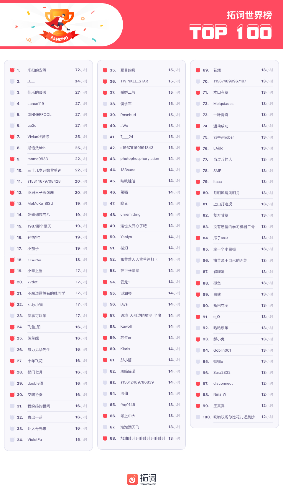

PS: 最新一周排行榜又来啦。后台时间统计单位为「分钟」，故「小时」排名分先后。

魔鬼营

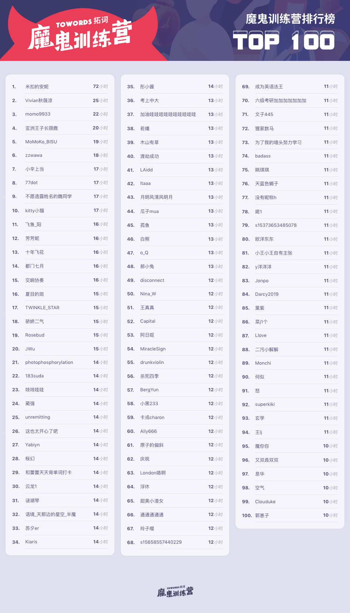

PS: 最新一周排行榜又来啦。后台时间统计单位为「分钟」，故「小时」排名分先后。

<h1 style="color:red">壹 | 拓词快讯 </h1>

暖暖

关于（无法让人随心所欲的）人生，爱默生做过这样的注解

> Life itself is a bubble and a skepticism, and a sleep within a sleep. 

是光彩耀人，也是一戳就破的泡泡。

是忽左忽右，不会停的质疑。 

是但愿长醉不愿醒的梦中梦。

1，2，3，这些在爱默生看来，都是需要修正的解读方式。 

他强调，「heed thy private dream」才是重点，就像莎士比亚说的那样，

> Thou art sick, but shalt not be worse, and the universe, which  <i><b>holds thee dear, shall be the better</b></i>  
出自莎士比亚十四行诗

你笃行不倦，宇宙也予你回应，馈以温暖。 

看小大大小硕的心得就有这样的感觉：

<a href="https://www.topschool.com/towords_learning_experience?experience_id=89163&userId=s15175094362398">

当控制不住眼泪却还一声不吭抹开眼泪看拓词的时候。真的很丧啊。我尽力了，可我控制不了。大家比赛的比赛，拿奖的拿奖，面试的面试，考研的考研，保研的保研，拿奖学金的拿奖学金，只有我一直在不停的后退。早就做不到了，那个会努力的自己。如果我的丧让你感到厌烦，对不起，我会不再出现在你面前。晚安，再也不安。

</a>

点击文字可跳转至心得

这可能是一个看剧得用倍速，看书或者长文需要充值很多很多耐心的时代。

但小大大小硕的心得，ta的同桌回复以及其他的拓友答复， Nora看了好久。

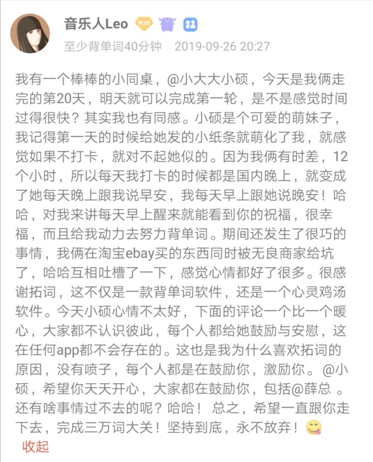

感觉自己有被拓友们治愈，就像“烟烟同学233”“肖消乐”说的那样。

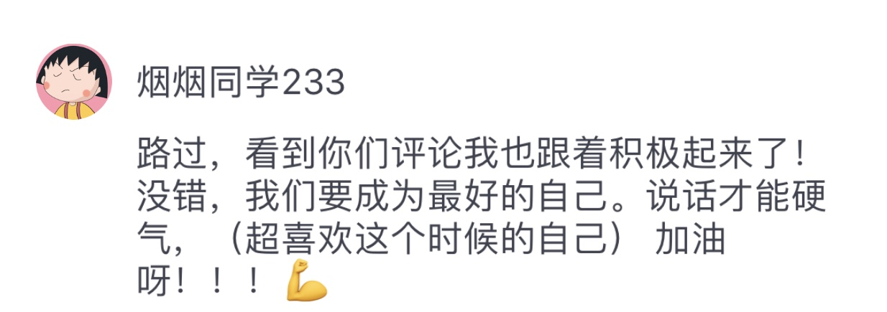 

薛大说， 「<b>不用去跟别人比，每个人都是自己的一生</b>」。

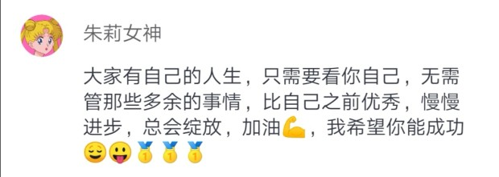 
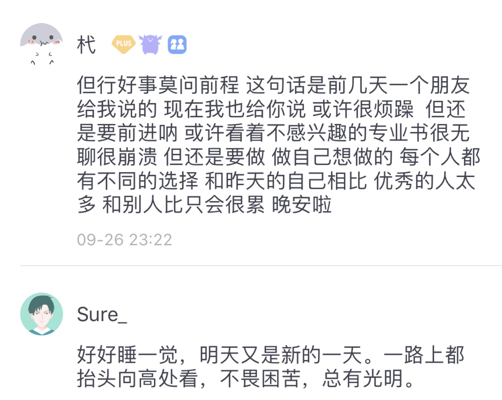 
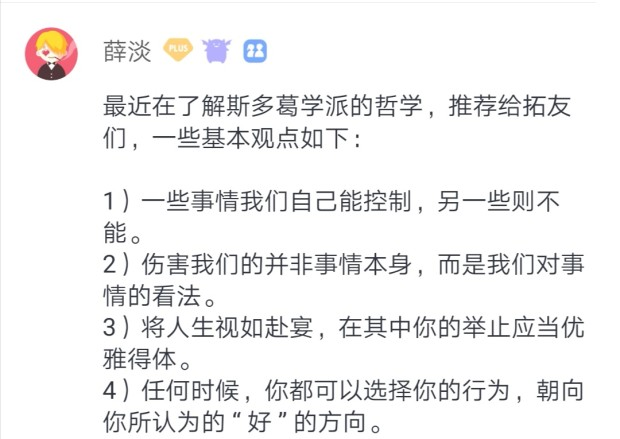

Nora就踏过这个坑，当初无比在意他人的目光，也无比讨厌过去的那个自己。

好像是真的。

那些让我们变得不快乐的价值和眼光， 往往是我们从别人那里借鉴和模仿得来的。  

像我自己，年少时想要改变世界，后来倒是被驯服得服服帖帖。会这样也可能是因为年轻吧，看看柯林斯说的

>Ageing's one saving grace is you worry less about what people think. 
上了年纪的一个好处是不再那般担心别人的看法。

好像隐隐约约解释了为什么孔子说七十从心所欲不逾矩，因为年纪到了(๑˙ー˙๑)

如果陷入这种被影响的的状态，需要做什么？百年前的作家这么自问自答：

>we must set up the <b>strong present tense</b> against all the rumors of wrath, past or to come.

抓住当下即好。

看拓友们的回复，小硕新心得，也是这样的感觉。 

<b>set up the strong present tense</b>

世界很大，会有这样那样的存在，它们是无声无息的风，可以随心所欲地吹到它想到的任何角落。 

比如那些令人沮丧的价值判断。

不过Nora觉得所有的一切终究都会被安排好。等这一切该来的事情慢慢到来。

坚持做自己该做的每一件事就好啦, let the time take care of itself. 

最后送上Nora很喜欢的文字

<!-- 
 -->

Scars make who we are. I have never seen a strong person with an easy past.

其实也是说给Nora自己听的～

恋慕之心

最极致（苦）的文字工作者， Nora以为应该有字典编撰家。 

编字典枯燥吗？是吧，应该是那种很闷很闷，闷到可以生蘑菇的那种。

用作家的话说，是foolish task，extremely tedious work. 
难度枯燥程度大概是修行可以升仙的那种。

那编辑是什么人？简单笨拙的坚持和不善言辞的weirdo吗？也不尽然...

的确有些词典拿来查就好，读起来索然无味。 

也有些编得很精妙，读起来实在有趣，甚至可以当连续剧来看。

说的就是柯林斯字典编辑部：

<b>喜欢的时候直言喜欢</b>， 

<b>还带着一两分天真</b>， 

<b>也会像正在告别的朋友</b>，

<b>告诉你ta悟到的人生至理</b>

结婚关键词 | nevertheless

>大部分婚姻在婚后五至九年间失败。然而，人们仍会选择结婚。 
出自柯林斯字典

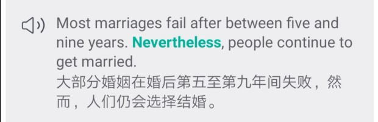

所以七年之痒其实有理有据，刚好是中数哎。年轻时情难自已，海誓山盟，想一生一世，以为结婚就能长长久久。

>I have loved you with an everlasting love! 

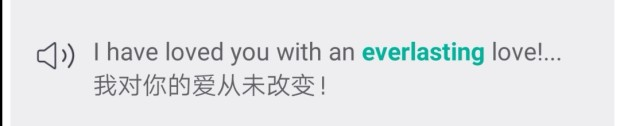

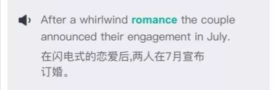

呵，太年轻，就有人说出大实话，“结婚还是得趁还不懂事时赶紧结一结好。” 当然是因为... 

love n. A <b>temporary insanity curable by marriage</b>. 

离婚关键字 | spite

>

我拒绝和她离婚，就是为了出口恶气。 
出自柯林斯字典

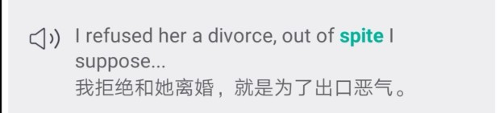

>

有好多年，那对夫妻跌宕起伏的关系总是登上报纸头条。 
出自柯林斯字典

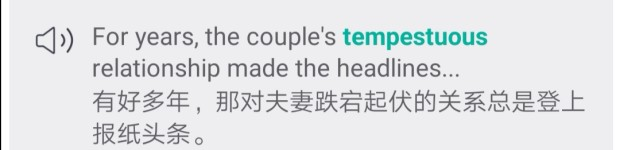

>

她错在说出了他们的婚外情。 
出自柯林斯字典

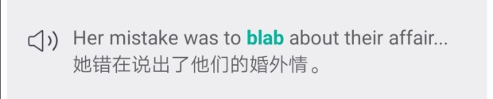

人生果然还是若只如初见的好呀。 配上王尔德的话特别应景

Never marry at all, Dorian. Men marry because they are tired, women, because they are curious: both are disappointed.

除了无时不刻呼唤爱， 有时候很“中二”，比如喜欢唱片到可以为爱走天涯，旷课逃学算什么大不了的事，极度嗜甜

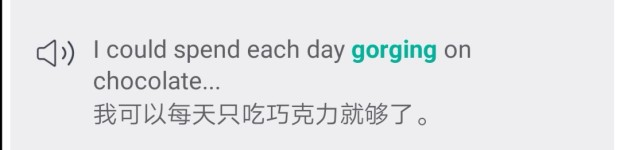

某些事情上也非常拎得清

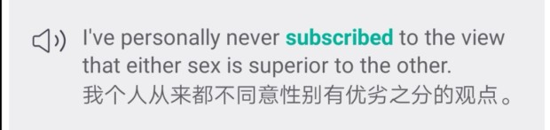

也会像阅尽千帆的老者絮絮叨叨

<h1 style="color:red">贰 | 魔鬼营志异 </h1>

外刊精读

这期文章标题是：

<b>Which is the best language?</b>

最美语言最常被提及的应该是法语吧，Nora不同意。 

都德的《最后一课》里说法语是全世界最美的语言，但是都德据说并不会说其他语言，没有比较，何来之最。

法国人爱说自己是最美的语言，Nora也认为中文最美。 关于这个心理， 《经济学人》也说清楚了。 

>The French are hardly alone in believing that their language is especially poetic, emotional, logical, precise, accessible or rich.

《经济学人》还说，你觉得语言里最美的部分很有可能是很多人最痛恨的🌚

>But it turns out that the things people prize in their own languages can often be the same things foreign learners hate. 

即便如此， 语言仍然是只要用对了方式，足够的时间和耐心，总可以把事情说得清

>Given the time and willingness to explain or coin basic terms, any language could be used to talk about anything. 

和处事倒是一个道理。 全文，Nora最喜欢的是

>In short,languages are governed by trade-offs.  
One that avoids making certain information mandatory may be easy to speak, 
but leaves the listener to fill the gap.

人生就是无数个trade-offs

见功力的从来都是取舍。 写文字是，雕塑也是，哪里是精细，哪里粗糙，都是恰恰好。

你看，做事情要么砸钱要么砸时间，普遍都是二者之间的trade-off。

感情里的那句，世间安得双全法，不负如来不负卿好像也是。

背单词也是， 用现在的时间置换未来的空间。 

假期里的行万里路，也算用空间来置换时间。

已结束的夏日在南方被延续， 可以继续放肆地吃冰镇西瓜、喝很凉的啤酒、去晒大太阳...

祝大家假期愉快呀～

