

🌟2020考研、经济学人 
🌟英式or美式 
🌟请相信，你可以进步

<h1 style="color:red">壹 | 排行榜 </h1>

<h1 style="color:red">排行榜</h1>

全球榜

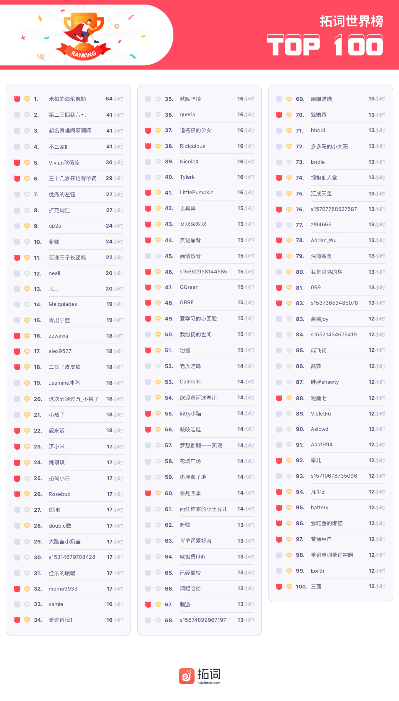

PS: 最新一周排行榜又来啦。后台时间统计单位为「分钟」，故「小时」排名分先后。

魔鬼营

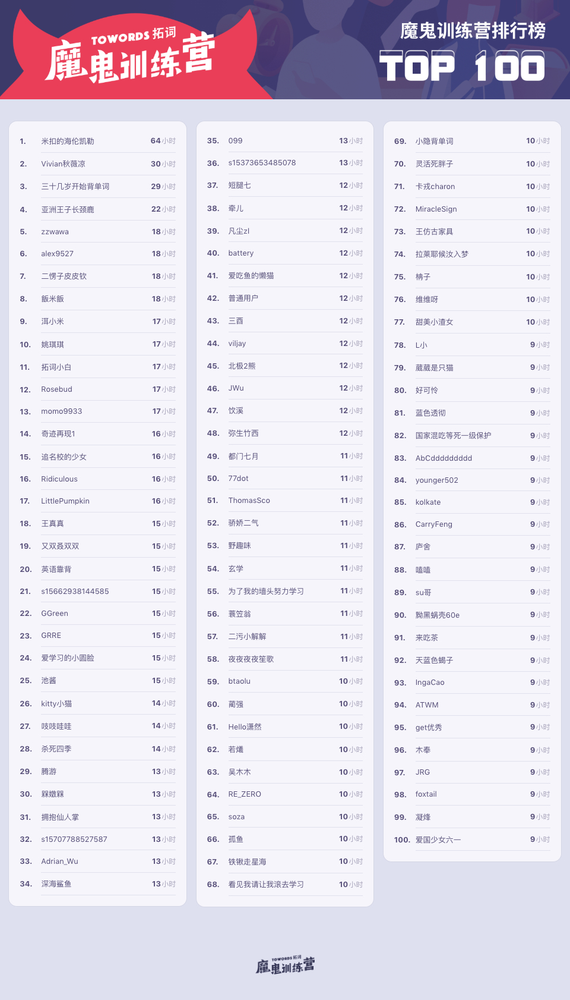

PS: 最新一周排行榜又来啦。后台时间统计单位为「分钟」，故「小时」排名分先后。

<h1 style="color:red">贰| 拓词快讯 </h1>

请相信，你可以进步

关于ambition, 牛津大词典给的例句是

life offered few opportunities for young people with ambition.  
生活给予雄心勃勃的年轻人的机会很少。 

Nora更喜欢柯林斯的例句

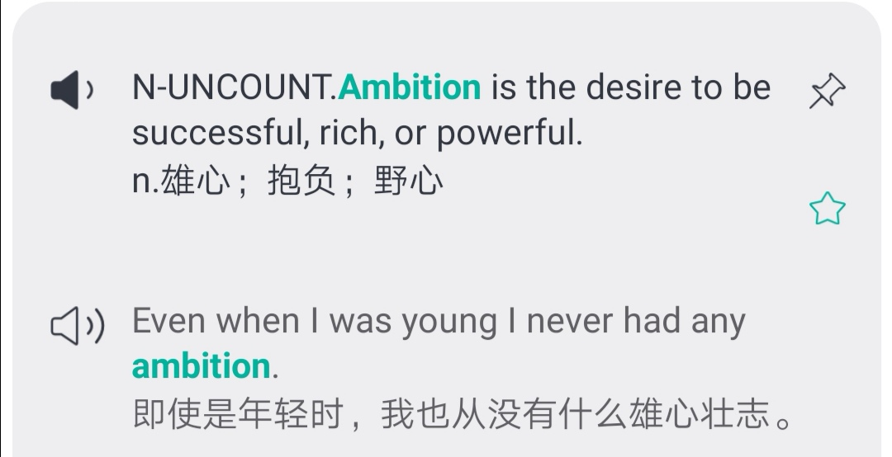

关于ambition牛津的例句和柯林斯的例句，有点像薛大今天在例会上分享的”<b>固守式</b>思维模式growth mindset“和“<b>成长型</b>思维模式fixed mindset”。

这两种思维模式的定义，来自斯坦福大学心理学家卡罗尔德韦克(Carol Dweck),也是全球奖金最高的教育奖项“一丹奖”德获得者。卡罗尔德韦克在TED关于这两种思维模式的演讲如下：

点击图片可播放视频

<a href="https://www.bilibili.com/video/av25216156?from=search&seid=3133905362438802357">
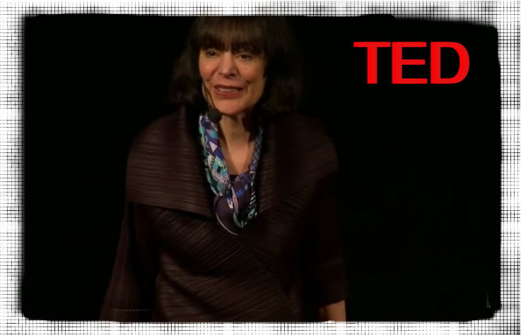
</a>

演讲里说到，这两种模式并不仅仅在心理范畴下有意义，而是有科学数据支撑。 科学家们监测了学生们面对错误时的脑活动成像。 

薛大说他是“成长型思维模式”的坚定支持者，好多拓友也是

常人不会去“突破”的，ta们可以哎～

<i>看来到了一个时间，就会逼出自己的潜能。</i>
 

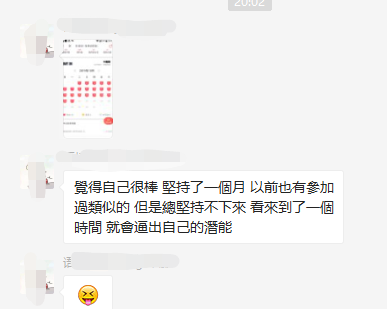
 

<i>功不唐捐</i>
 

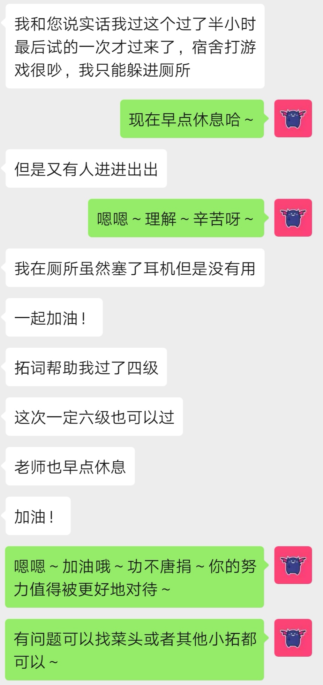
 

<i>ta的打卡是一场“步步惊心”的“历险记”</i>
 

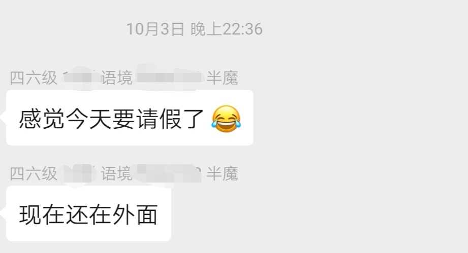

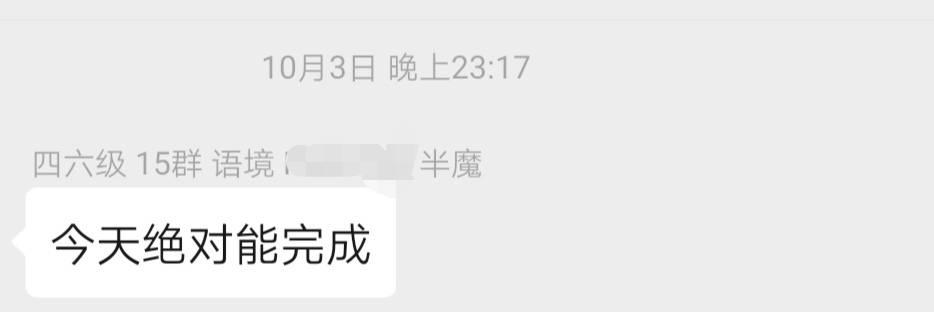

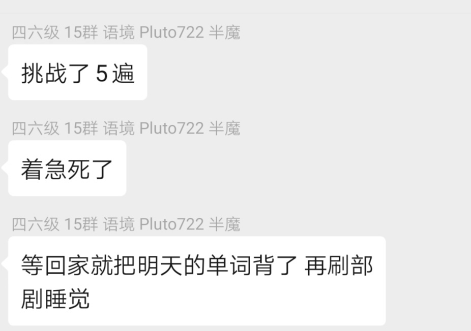

薛大诠释拓词的slogan"突破自我"，说是"成长"

嗯，没有损耗的经历怎么会有成长～

<h1 style="color:red">叁 | 魔鬼营志异 </h1>

早安英语

<h5>2020考研、经济学人、first and foremost...</h5>

And we are,first and foremost, gentleman

 

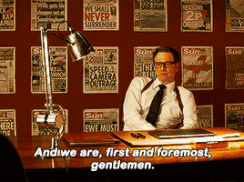

<small>
出自电影《王牌特工》
</small> 
first and foremost:首要的。用英文解释，则是 most important, more than anything else。

是<b>《经济学人》</b>的常用结构。

<b>拓词2020考研大纲词</b>也有收录。

<b>考研真题</b>也出现过好几次。 

first表示在时间上属于优先。 

foremost 在重要性也作出了取舍， most就可见一斑。 

有时候，最先做某件是因为最容易。 有时候也会把最重要的事情放在最后头。 

first and foremost 则是在时间上和权重上都是同时最高级别了。 强调突出的意味很明显了。

​

比如有人既是演员，又是歌手， 如果ta说

I am <kbd><strong>first and foremost</strong></kbd>  an actor, not a singer. 

说明更倾向认可自己的演员身份。 

此前Nora在精读课上讲过《经济学人》用词上押韵有偏好， 字头押韵，字尾押韵， <kbd><strong>first and foremost</strong></kbd> 这个表达刚好两者都满足。 

简奥斯汀的小说《傲慢与偏见》<kbd><strong>Pride and Prejudice</strong></kbd>  《理智与情感》<kbd><strong>Sense and Sensibility</strong></kbd>  就属于字头押韵，读起来很有感觉。 

此前在精读课上讲到的<kbd><strong>Pride and Province</strong></kbd>也属于这样的情况。 

在写作上，<kbd><strong>first and foremost</strong></kbd> 可以和<kbd><strong>chiefly, principally , mainly, to a great degree</strong></kbd> 做替换。

<kbd>
<mark>first and foremost</mark>
</kbd>

<h5><b>考研真题</b>|2010年英语二</h5>

<h6><i>Reading| Text 2| Para 4</i></h6>
In my own research <i>complaints</i> from women about their husbands most often <i>focused <kbd><strong>not</strong></kbd> on</i> tangible inequities such as having given up the chance for a career to accompany a husband to his or doing far more than their share of daily life-support work like cleaning, cooking, social arrangements and errands.  
<kbd><strong>Instead</strong></kbd> they <i>focused on</i> communication: "He doesn't listen to me.""He doesn't talk to me." I found as Hacker observed years before that most wives want their husbands to be <kbd><mark>first and foremost</mark></kbd> conversational partners but few husbands share this expectation of their wives.

词汇表|考研真题

complaint n. 抱怨 
focus v.关注 
tangible adj. 感觉得到的 
inequity n.不公平 
career n.事业 
accompany v. 陪同 
arrangement n. 安排 
communication n. 交流 
conversational  adj.交谈的 
expectation n.期待 

<kbd>
<mark>first and foremost</mark>
</kbd>

<h5><b>经济学人</b>|2019年5月</h5>

<h6>South Korea mulls a way to make everyone a bit younger</h6>

When Koreans meet a new acquaintance, one of the first questions they ask is, “How old are you?” 

What may seem surprising or even rude to foreign visitors is necessary to comply with Korean standards of politeness. The language has a multi-tiered system of honorifics. 

How you address somebody depends on their status, which is determined <kbd><mark>first and foremost</mark></kbd> by age, though sex and professional standing also play a role. Getting it wrong can be awkward.

 

词汇表|经济学人

acquaintance n.认识的人 
rude adj.粗鲁的 
comply with 服从 
multi-tiered adj. 多层次的 
honorifics n.敬语 
address v. 称呼（某人） 
status n.地位 
determine v. 决定 
professional adj. 职业的 
play a role 起作用 
awkward adj. 尴尬的

最后分享一个Nora很喜欢的一句话， 关于女生打扮是给谁看的。

女为悦己者容？不是所有。

就像有这么一句话：

别人的美你总会习惯， 
但是自己的美， 
千金难换。

A woman should dress  
<kbd><strong>first and foremost</strong></kbd> 
 for her own pleasure.  
If these things happen to appeal to men, 
well, that really is a side issue.

 

外刊精读

<h5>2020考研、经济学人、with a salt...</h5>

前言

这次的选文共 735个单词，包含 2020考研英语大纲词汇 190 个。

单词右上角标有考研(比如<mark>debate</mark>考研)代表这个单词被【拓词】2020考研英语大纲单词书收录。标绿文字可以重点读，与文章结构有关。字变小是因为Nora认为ta们不重要 。

学英语的我们，会疑惑到底该学英式还是美式?这两种的差别是什么?《经济学人》给了很好的回 答。

对于美式英语，英国人的态度有点耐人寻味。上次精读课讲的句式结构，这次又来了。选文仍然是来自《经济学人》。

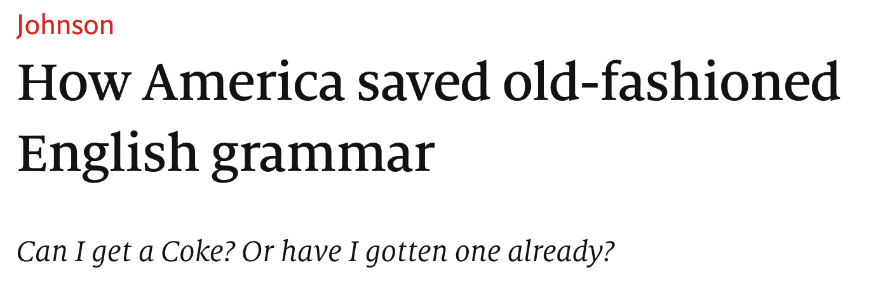

开篇就“杠”美国人：美国人或者到底是“进化”了还是“退化”了这门语言？

001 <i><kbd>IS AMERICA RUINING English or giving it new life? Most of this old transatlantic <mark><kbd>debate</kbd></mark>考研</strong> concerns words.</kbd></i> 

<small>Is <mark><kbd>elevator</kbd></mark>考研 </small> an improvement on <mark><kbd>lift</kbd></mark>考研</strong>? Why say transportation when <mark><kbd>transport</kbd></mark>考研</strong> will do?</small> 

<i><kbd>Sometimes it involves spelling</kbd></i>, <small>specifically the American reforms that made British centre into American center. Pragmatic change or dumbing down? And, of course, the quickest way to tell a Yank from a Brit is by pronunciation.</small>

Nora读后感|第1段

常见的英美式不同，《经济学人》举了elevator 和lift、transportation 和transport。 
同样是说英语，是英国人还是美国人?嗯， 拼写有关系， spelling involves. 读法也有玄机。 
美国人爱用elevator, 英国人常用lift.  

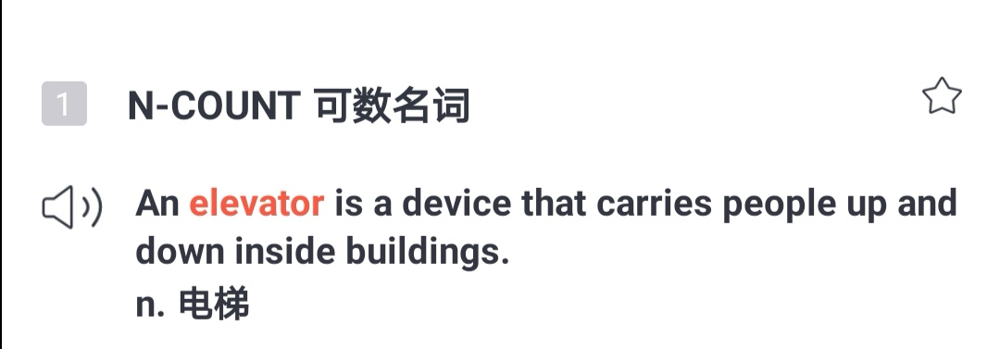

 

美国人爱用transportation, 英国人常用transport.（"别有用心"例句）

 

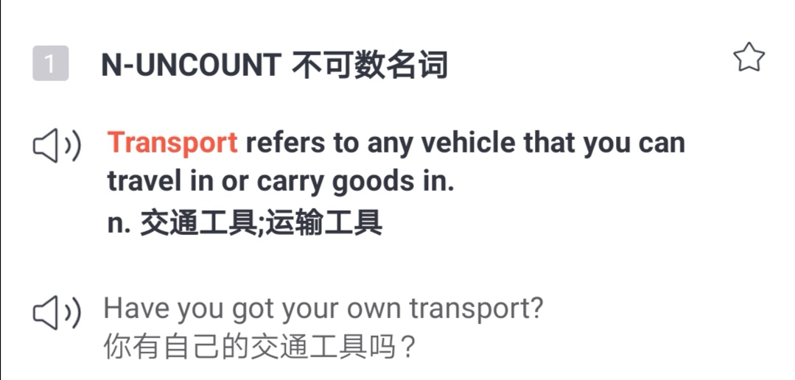

除了这里说的两组，还有好多，随便盘点一下就一大堆了：

<mark><b>英式  |  美式</b></mark>

薯条 chips | French fries    
薯片 crisps | chips 
假期 holiday | vacation 
饼干biscuit | cookie  
公寓flat | apartment 
糖果sweets | candy 
大学university | college, university 
谢谢Cheers | Thanks,Thank you. 
罐头tin | can  
电影 film | movie  
秋天 autumn | fall 
花园 garden | yard  
汽油petrol | gas, gasoline 
...

说回来，咱们背那么多的单词，以为是近义，好多其实是这两国人民非得搞不同（使用习惯不同），但是苦了我们学英文的人，这些都得记住～🤦‍♀️

词汇表|第1段

transatlantic adj. 大西洋彼岸的 
debate n.讨论 
concern v. 与～有关 
elevator n. 电梯 
lift n. 电梯 
transportation n. 交通 
transport n. 交通 
involve v. 使～参与 
spelling n. 拼写 
reform v. 改革 
pragmatic adj. 务实的 
dumb down 使～简化；使～通俗化 
Yank n. 美国佬 
pronunciation n. 发音

002 <i><kbd>But the differences</kbd></i>  between British and American English <i><kbd>go beyond words, sounds and spelling to grammar itself.</kbd> </i>

<small>Here they can be <mark><kbd>subtle</kbd></mark>考研</strong>, but they are many: the index of the “Cambridge Grammar of the English Language” mentions regional differences in 95 places. America being the parvenu, most people assume that any variations between the two countries result from American <mark><kbd>innovation</kbd></mark>考研</strong>, to the (sometimes <mark><kbd>mock</kbd></mark>考研</strong> <mark><kbd>horror</kbd></mark>考研</strong> of Britons. In reality, America has often been the <mark><kbd>conservative</kbd></mark>考研</strong> one, and Britain the innovator. When British speakers borrow American habits, they are sometimes unwittingly readopting an older version of their language.</small>

Nora读后感|第2段

英美式的差别，《经济学人》也做了很好的归纳和总结。除开发音，拼写这些容易被领会的表象，其实还有更深层的特质。比如其实美式偏保守(conservative)， 英式用法上更别具一格(innovator) 。 

重点讲解|第2段

<b>the differences</b> between British and American English <b>go beyond</b> words, sounds and spelling to grammar itself.

tea's greatest benefits <b>go beyond</b> physical health

the problems <b>go beyond</b> the boredom and the frustration of being away from home so long 

...there are reasons that <b>go beyond</b> style and message

在考研写作里，想要表达超过的概念，但是记不起exceed, surpass, transcend, excel, outdo, outstrip  这类词，可以试一下go beyond，不仅简单，意思传达上也很到位。

词汇表|第2段

grammar n. 语法 
regional adj. 地区的 
parvenu n. 暴发户，新贵 
assume v.假定 
variation n. 变化 
result from 由～引起 
innovaiton n. 创新 
mock v.嘲笑 
horror n. 惊恐 
conservative adj. 保守的 
innovator n. 创新者 
unwittingly adv. 不知情地 
readopt v. 重新采纳 
version n. 版本

文章中间<s>啰啰嗦嗦</s>讲了很多例子，这里就直接略过了。 结尾开始点题了， how America saved old-fashioned English grammar。《经济学人》编辑给了个意味深长的说法 。

008 Stereotypes often have <strong><kbd>a grain of truth</kbd></strong>. <i>Americans <strong><kbd>have indeed</kbd></strong> innovated  <strong><kbd>extensively</kbd></strong> with English, as with other things</i>. <i><kbd>But language never sits still</kbd></i>: the British variety itself went on changing after 1776, as all living languages must. 

Americans, for their part, <strong><kbd>eagerly</kbd></strong> <mark><kbd>import</kbd></mark>考研</strong> <strong><mark><kbd>fashionable</kbd></mark>考研</strong> British slang. 

Instead of <strong><kbd>bemoaning</kbd></strong> new-fangled Americanisms, British observers could spare a thank you to the old colonies for keeping traditional English safe.

重点讲解|第8段

<h5>a grain of truth</h5>

刻板印象还是有几分道理的，美国人真的有在“发展”英语。但是这份肯定其实有点勉强, a grain of truth 就可见一斑。 

再补刀，其实也跟美国人或者某国人没关系，语言本身一直在变化language never sits still。简言之，这个truth不用太当回事， 在其他篇目用a grain of truth的时候，<i>The Economist</i>还是这个套路。

 
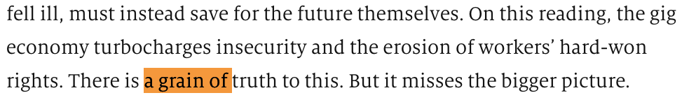

写加拿大总理Justin Trudeau也是

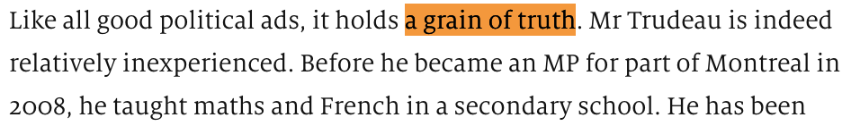

 
类似的短语还有a grain of salt，常这么用， take something with a grain of salt，用英文解释就是

 

to <b>not completely believe</b> something; to be <b>doubtful</b> about the truth or accuracy of 
something. 

 

意思是“别太当真”“半信半疑”，别把某个承诺或者说法看得太重。

<b>怀疑</b>和<b>一粒盐(a grain of salt)</b>居然有关系？难道是因为以前的盐=钱？据说是有一种解毒剂， 必须和盐一起服用， 否则没啥效果。 

 

Hypotheses of the phrase's origin include Pliny the Elder's Naturalis Historia, regarding the discovery of a recipe for an <i>antidote to a poison</i>. In the antidote, <i>one of the ingredients</i> was a grain of <i>salt</i>. Threats involving the poison were thus to be taken "with a grain of salt", and therefore less seriously.

 

所以面对那种“值得怀疑”的东西， 也需要“加点盐”才能接受。 只要你对某件事，特别是别人的话有所保留、将信将疑， 就可以放心大胆地用“take it with a grain of salt”啦。  
豆瓣评分9.5分的美剧《我们这一天》（This Is US）有这样的一段台词

“So you got to take everything I say with <b>a grain of salt</b>"

<video width="320" height="240" controls>
  <source src="/asset/eco1024/thisisus.mp4" type="video/mp4">
Your browser does not support the video tag.
</video>
 

听起来有点心酸，你有没有过遇到这样的人， have always taken him/her with <b>a grain of salt</b>? 

词汇表|第8段

stereotype n. 刻板印象 
indeed adv.确实 
innovate v. 创新 
extensively adv.广泛地  
still adj. 静止的，不动的 
variety n. 变化 
eagerly adv. 热切地 
import v. 进口 
fashionable adj. 流行的 
slang n. 俚语 
bemoan v. 叹息 
new-fangled adj.（新想法）太复杂的 
observer n. 观察者 
spare v. 抽出，拨出（金钱或其他资源） 
colony n. 殖民地

后记

本篇文章包含  <b>2020考研英语大纲词汇</b> <strong>190</strong>个 ，部分列表如下

<strong><kbd>elevator striking </kbd></strong>

<strong><kbd>fashionable subsequent</kbd></strong>

<strong><kbd>lift export</kbd></strong>

<strong><kbd>invention horror </kbd></strong>

<strong><kbd>replace mock</kbd></strong>

<strong><kbd>debate permission</kbd></strong>

<strong><kbd>subtle indulge</kbd></strong>

<strong><kbd>conservative frequency</kbd></strong>

<strong><kbd>indicative complaint</kbd></strong>

<strong><kbd>innovation retreat</kbd></strong>

<strong><kbd>decline import</kbd></strong>

<strong><kbd>transport invasion</kbd></strong>

<h1 style="color:red">Nora心得 | 英式or美式，还是混搭 </h1>

10月24号的魔鬼营精读课，Nora选的是

还是不论美国的这些“发展”的英国人是不是看在眼，但是按照《经济学人》的说

虽然标题说的是美国“save”了语言，但英国貌似并不待见。 

比如是“may I get " 还是“ can I get" 又被拿出来“做文章了”。

Get gets Brits in another expression: “<b>Can I get…?</b>”, now nearly as ubiquitous in London restaurants as it is in Seattle. Part of the British complaint is that the American expression <i>wrongly</i> uses “<b>can</b>” <i>rather than</i> “<b>may</b>”. 

出自《经济学人》

上一次是2011年。当时 BBC征集了英国人觉得美国人说得最不像英语的“美语50用法“

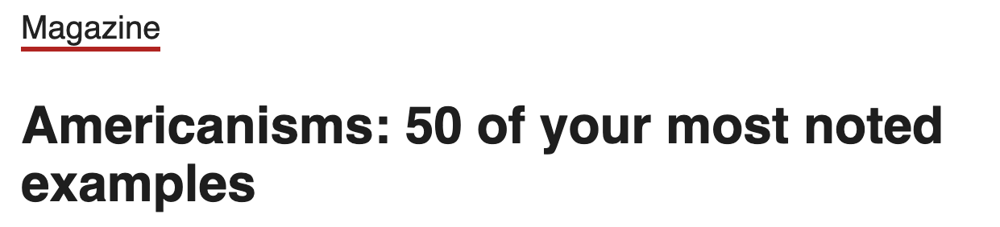

第一条就是关于“can I get"

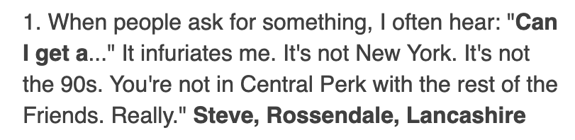

infuriate着实有点吓人😂 

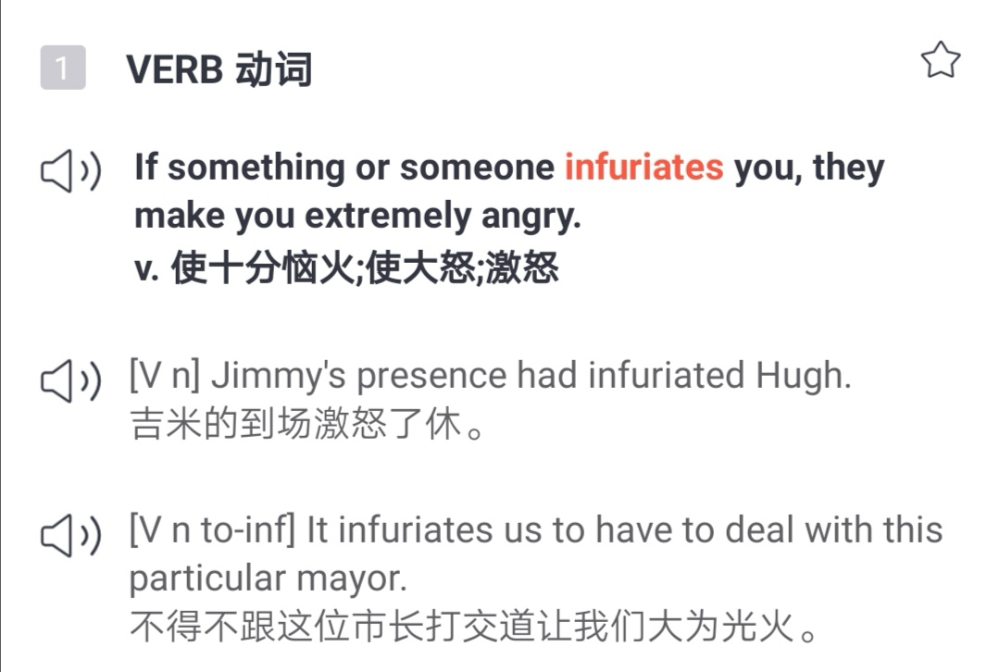

不过这次《经济学人》的编辑们为美国稍稍”正名“了一下， can的大行其道不一定是美国的锅，may在英国处于衰退期的时候，《老友记》第一季还没来（1994年《老友记》首播）

<b>May</b> is in <b>steep decline in America</b> in general, partly as can further colonises its role in signalling permission. <b>But</b> it is in almost as stark <b>a retreat in Britain</b>, too. According to one study, <b>may’s frequency</b> in British speech <b>declined by 40%</b> between <i>1961</i> and <i>1991</i>.

出自《经济学人》

50个典型里提到的transportation和transport还在。 

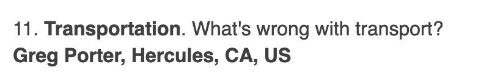

<small>出自BBC</small>

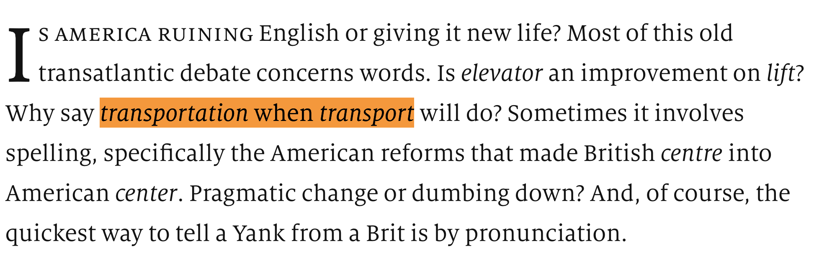

<small>出自The Economist（经济学人）</small>

关于这50条，英国人是这样的评价的：

Some are useful, while some seem truly unnecessary.

有点好奇第一个some的比重是多大，还是只是客套一下😂

may和can还算是“近亲”，对于二语习得者如我，倒是没有英国人那么敏感，觉得差别大到不可原谅。 不像哈利波特书名改动那么大。

哈利波特系列第二部， 英国版是Harry Potter and the Philosopher's Stone. 
美国版本则是Harry Potter and the Sorcerer's Stone.

philosopher's stone这个名字背后包含的，是中世纪的炼金术文化。

The Philosopher's Stone was a legendary alchemical substance with magical properties. This ruby-red stone could be used to create the Elixir of Life, which made the drinker immortal, as well as transform any metal into pure gold. The only known Stone to have ever existed was created by the famed alchemist Nicolas Flamel.

公元前5世纪， 古希腊的先哲们认为万物由四种基本元素组成： 气air、火fire、水water、土earth。它们以不同的比例混合，就成了万物。 

到了中世纪， 炼金术士根据四元素说发展出一套炼金术的理论。 改变物质中四种元素的比例， 就可魔术般改变事物的性质， 普通的金属就变成贵重的黄金。 要实现这种转换， 必需有一种特殊的，类似催化剂的物质， 即philopher stone. 

不仅可以“点石成金”，也可以让人“进化”——长生不老。 所以这种石头也可以用来制造长生不死的万能药(elixir)。当年很多哲学家科学家当年都很沉迷炼金术，比如现代化学之父Robert Boyle、物理学家牛顿。

除了点金还可以长命百岁、永葆青春，这也是佛地魔想要魔法石恢复肉体的原因。 小说《牧羊少年奇幻之旅》里有提到过哲人石，动漫《钢之炼金术师》中爱德华弟兄寻觅的“贤者の石”也是指philosopher's stone。

有没有人曾炼成过philosopher's stone？历史上记载的是尼古拉·勒梅。在哈利波特系列中，尼古拉·勒梅存在，而且也是同样的设定。 

据说是出版社的编辑认为美国儿童并不那么熟悉philosopher's stone，就变成了sorcerer's stone, 格调貌似降了很多😂

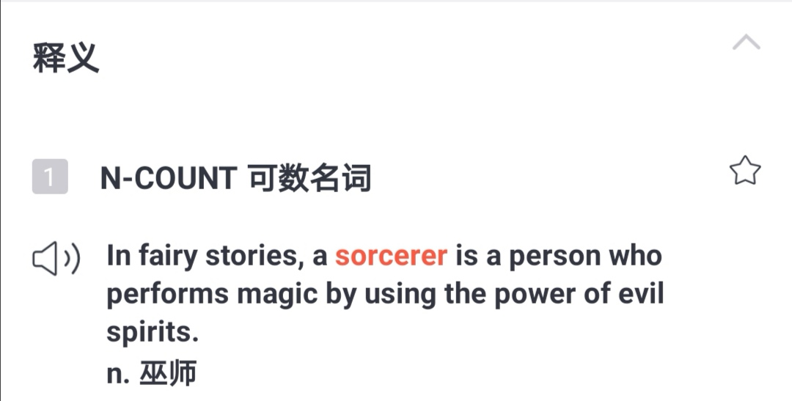

为什么分philosopher's stone和sorcerer's stone?了解这背后的原因好像比单纯争美式还是英式更标准有意义得多，对Nora来说是的。 

再如日语里好多词都是从其他语言借鉴过来。倒是可以反溯来源

番茄是トマト（日语罗马音Tomato），猜想是不是从British English引入的。但是到了足球，日语里更常用的是サッカー(日语罗马音sakka)， 不是フットボール(日语罗马音Futtobōru)，那又是受美国影响更大？😂

纠结英式（音）还是美式（音）？额，著名的脱口秀演员黄西（他的英语发音混着浓浓的中国口音，却用幽默把包括美国总统在内的观众逗得乐不可支）认为文化比口音重要得多。 

语言学家David Crystal也说过类似的话

<b>There is no such thing as an ugly accent,  like there's no such thing as an ugly flower. </b>

关于英音，倒是有这么一句话，

<i>An Englishman's way of speaking absolutely classifies him. </i>

争英式和美式谁更标准，好像也有这个意思，非得有个高下，有个“贵贱”才罢。 

奥黛丽赫本主演的电影《窈窕淑女》（改编自萧伯纳的《茶花女》）里，主角们的口音就天差地别： 一个粗俗的底层卖花女；一个名门高校的教授。

香港以前是英国的殖民地， 老香港人讲英语的时候，即使说不了几句，也是“英国味”足足的。在香港的大公司里，通常会有一个雇员，叫tea lady, 在公司的茶水间干活，负责端茶倒水。每个tea lady都会一句：would you like a cup of tea？

高级吗？一种语音而已。

对于英式or美式这个问题，比起拼写哪个更标准，发音哪个更对，Nora更想知道的是美国人华盛顿欧文（有人称他是美国文学之父）为什么会得到这样得评价“：

“记述的和为之写作的都是英格兰，而不是他自己的国家”

土生土长得美国人，若是不了解前情，可能会以为他是英国作家，而非美国作家。

<h1 style="color:red">彩 | 蛋 </h1>

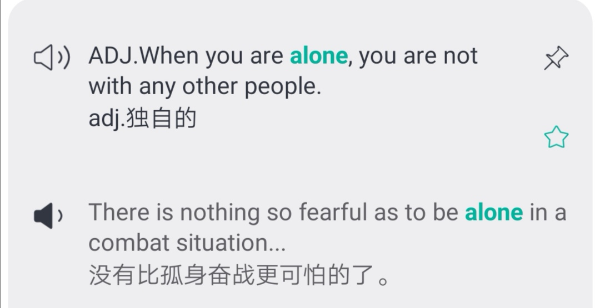
 

<i>那就和同桌一起吧～😄</i>

 
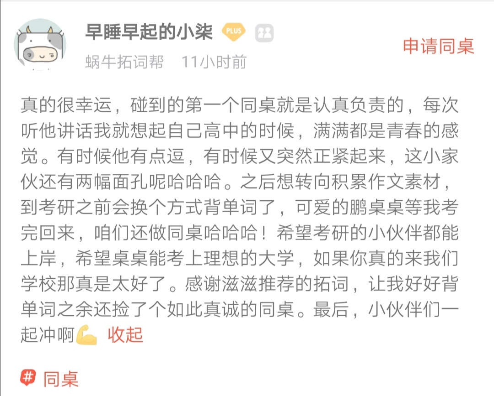
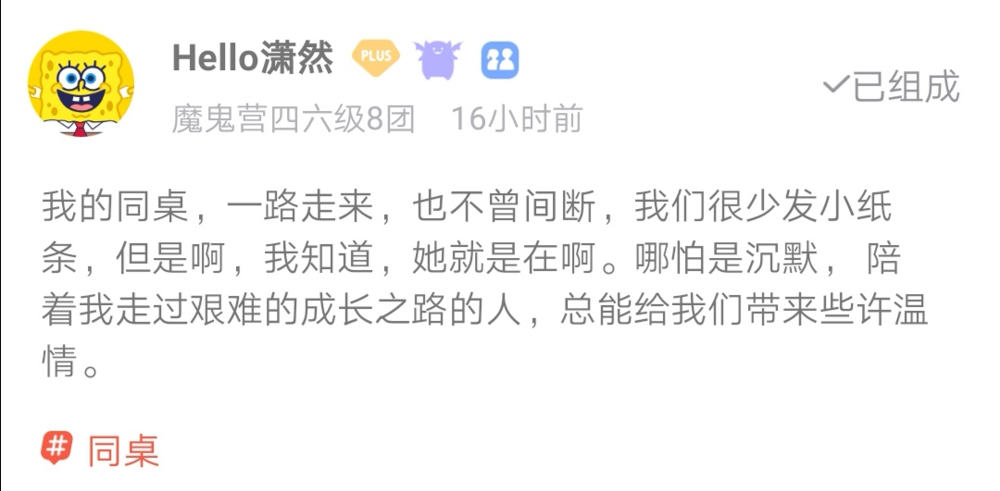
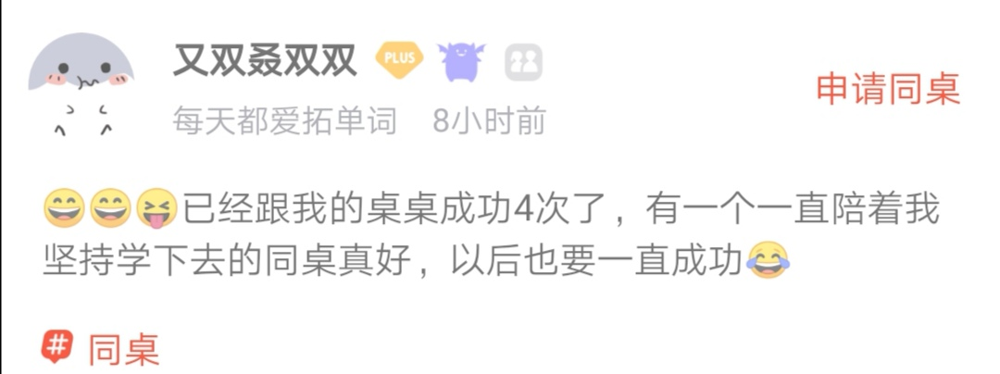

