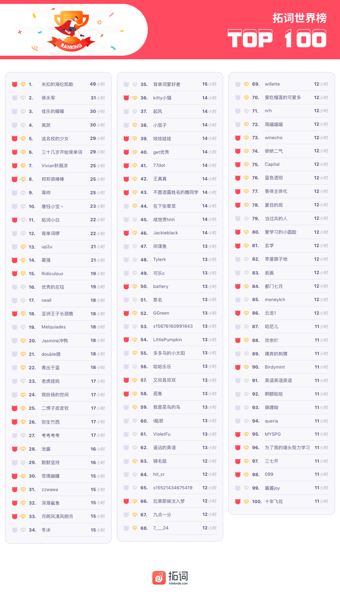
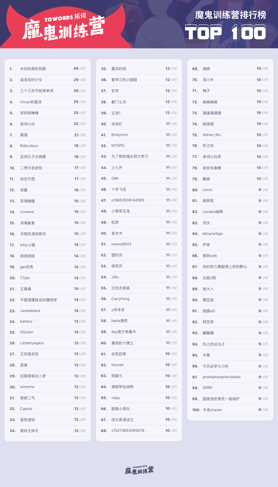

<h1 style="color:red">壹 | 排行榜 </h1>

<h1 style="color:red">排行榜</h1>

全球榜

PS: 最新一周排行榜又来啦。后台时间统计单位为「分钟」，故「小时」排名分先后。

魔鬼营

PS: 最新一周排行榜又来啦。后台时间统计单位为「分钟」，故「小时」排名分先后。

<h1 style="color:red">贰| 拓词快讯 </h1>

友

<h1 style="color:red">叁 | 魔鬼营志异 </h1>

早安英语

<h5>2020考研、经济学人、first and foremost...</h5>

And we are,first and foremost, gentleman

<small>
出自电影《王牌特工》
</small> 
first and foremost:首要的。用英文解释，则是 most important, more than anything else。

是<b>《经济学人》</b>的常用结构。

<b>拓词2020考研大纲词</b>也有收录。

<b>考研真题</b>也出现过好几次。 

first表示在时间上属于优先。 

foremost 在重要性也作出了取舍， most就可见一斑。 

有时候，最先做某件是因为最容易。 有时候也会把最重要的事情放在最后头。 

first and foremost 则是在时间上和权重上都是同时最高级别了。 强调突出的意味很明显了。

​

比如有人既是演员，又是歌手， 如果ta说

I am <kbd><strong>first and foremost</strong></kbd>  an actor, not a singer. 

说明更倾向认可自己的演员身份。 

此前Nora在精读课上讲过《经济学人》用词上押韵有偏好， 字头押韵，字尾押韵， <kbd><strong>first and foremost</strong></kbd> 这个表达刚好两者都满足。 

简奥斯汀的小说《傲慢与偏见》<kbd><strong>Pride and Prejudice</strong></kbd>  《理智与情感》<kbd><strong>Sense and Sensibility</strong></kbd>  就属于字头押韵，读起来很有感觉。 

此前在精读课上讲到的<kbd><strong>Pride and Province</strong></kbd>也属于这样的情况。 

在写作上，<kbd><strong>first and foremost</strong></kbd> 可以和<kbd><strong>chiefly, principally , mainly, to a great degree</strong></kbd> 做替换。

<kbd>
<mark>first and foremost</mark>
</kbd>

<h5><b>考研真题</b>|2010年英语二</h5>

<h6><i>Reading| Text 2| Para 4</i></h6>
In my own research <i>complaints</i> from women about their husbands most often <i>focused <kbd><strong>not</strong></kbd> on</i> tangible inequities such as having given up the chance for a career to accompany a husband to his or doing far more than their share of daily life-support work like cleaning, cooking, social arrangements and errands.  
<kbd><strong>Instead</strong></kbd> they <i>focused on</i> communication: "He doesn't listen to me.""He doesn't talk to me." I found as Hacker observed years before that most wives want their husbands to be <kbd><mark>first and foremost</mark></kbd> conversational partners but few husbands share this expectation of their wives.

词汇表|考研真题

complaint n. 抱怨 
focus v.关注 
tangible adj. 感觉得到的 
inequity n.不公平 
career n.事业 
accompany v. 陪同 
arrangement n. 安排 
communication n. 交流 
conversational  adj.交谈的 
expectation n.期待 

<kbd>
<mark>first and foremost</mark>
</kbd>

<h5><b>经济学人</b>|2019年5月</h5>

<h6>South Korea mulls a way to make everyone a bit younger</h6>

When Koreans meet a new acquaintance, one of the first questions they ask is, “How old are you?” 

What may seem surprising or even rude to foreign visitors is necessary to comply with Korean standards of politeness. The language has a multi-tiered system of honorifics. 

How you address somebody depends on their status, which is determined <kbd><mark>first and foremost</mark></kbd> by age, though sex and professional standing also play a role. Getting it wrong can be awkward.

 

词汇表|经济学人

acquaintance n.认识的人 
rude adj.粗鲁的 
comply with 服从 
multi-tiered adj. 多层次的 
honorifics n.敬语 
address v. 称呼（某人） 
status n.地位 
determine v. 决定 
professional adj. 职业的 
play a role 起作用 
awkward adj. 尴尬的

最后分享一个Nora很喜欢的一句话， 关于女生打扮是给谁看的。

女为悦己者容？不是所有。

就像有这么一句话：

别人的美你总会习惯， 
但是自己的美， 
千金难换。

A woman should dress  
<kbd><strong>first and foremost</strong></kbd> 
 for her own pleasure.  
If these things happen to appeal to men, 
well, that really is a side issue.

 
<h1 style="color:red">Nora心得 | 英式or美式，还是混搭 </h1>

10月24号的魔鬼营精读课，Nora选的是

虽然标题说的是美国“发展”了语言，不论美国的这些“发展”的英国人是不是看在眼但是 按照《经济学人》的说

最是书香能致远

10月，你会有始料不及的运气，会有突如其来的欢喜。

银烛秋光冷画屏，轻罗小扇扑流萤。天阶夜色凉如水，卧看牵牛织女星。”该诗写女子独守空房，抒发幽怨之情。轻罗小扇，用又轻又薄的绢绸作的小团扇。扇子本是夏天用来挥风取凉的，秋天就没用了，所以古诗里常以秋扇比喻弃妇。流萤，飞动的萤火虫

Epiphany 顿悟
An epiphany is an experience of sudden and striking realization.
一个词讲了一个故事的感觉 : )

I&apos;m very fortunate in that I don&apos;t have to do the washing-up or the dusting.","tran":"我很幸运，因为我不用洗餐具也不用打扫灰尘

Like a dreamer awakened, we see life, not with the romantic color of yesternight's dream, but with a saner vision. 

出自林语堂的《吾国与吾民》

昨夜，有追忆前尘，非常恍惚朦胧的诗意在里面。 昨夜星辰昨夜风，李商隐。 昨夜西风凋碧树，昨夜雨疏风骤，中国诗文中只要一说到昨夜，就呆着诗情。 

这一次回望前尘，可能少了很多中国古代那些风雅的诗人他们所具有的浪漫诗情。而是用一种更为清晰的更为真切的视野来打量我们曾经经历的过往。 
sane， sensible and reasonable有道理的，理性的。 
看一样东西，可以用不同的眼光。 用特别理性的眼光，叫with a saner/sane vision. 

英语词汇的斑斓和词汇之间修饰搭配无穷的变化。

pleasure就分很多种，我们活在这个世界，无数次去打量这个世界，看世界的方式和结果也是不一样的，如果有些时候，用一种特别清醒的真切的眼光，去看这个世界，看到的风景和图像叫sane vision. 
如果通览很多英文的原典籍和原著，打量一样东西，都可以有不同的景象和视野产生？

这些名家去看世界之前， vision会有哪些搭配呢？

人生中极其罕见的情况下看到的盛大的景象，极其浩瀚，语言难以去描摹和表达， 这个意象很常见。 
面对大峡谷， 面对维也纳浩瀚的森林
面对像泰山这样充满了历史饱含沧桑这样的峰峦的时候， 
这个盛大的景象，magnificent, brilliant， 相对有格调的是glorious vision. 
古道西风瘦马， 或者苏东坡讲的
往日崎岖还记否,路长人困蹇驴嘶。
凄清惨淡的景象，bleak vision.全景完整的风景， 一览众山小一样， 

Panoramic vision. 
如果一个地方恍若仙境，仙山琼岛， 英文用什么？Fairy vision. 莫奈的很多画，你所流连的是里面迷离的风景。 
叫enchanted vision. 
极其清晰冷静的观点叫sane vision. 某些风景令人遐想， prefiguring vision。 所有这些东西都是东西方这些名家，笔下表现生活当中过无数次的凝眸。 
所看到的不一样的风景， 内心中不一样的回声。 

glorious vision 和 上帝联系在一起

This is some text! 
This is some text! 
This is some text! 