

🌟11月，那些让人清醒的句子 
🌟cor cordium,我此生对别人说过的最真实的话 
🌟做人该有的美德

<h1 style="color:red">壹 | 排行榜 </h1>

<h1 style="color:red">排行榜</h1>

全球榜

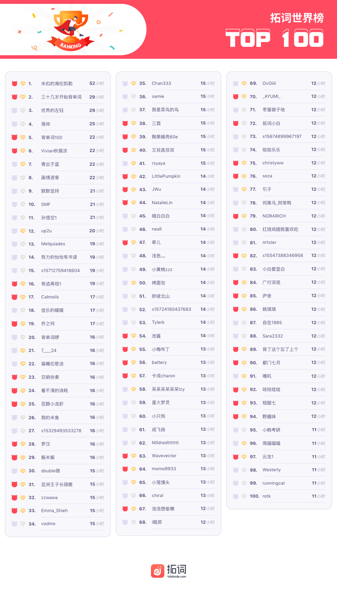

PS: 最新一周排行榜又来啦。后台时间统计单位为「分钟」，故「小时」排名分先后。

魔鬼营

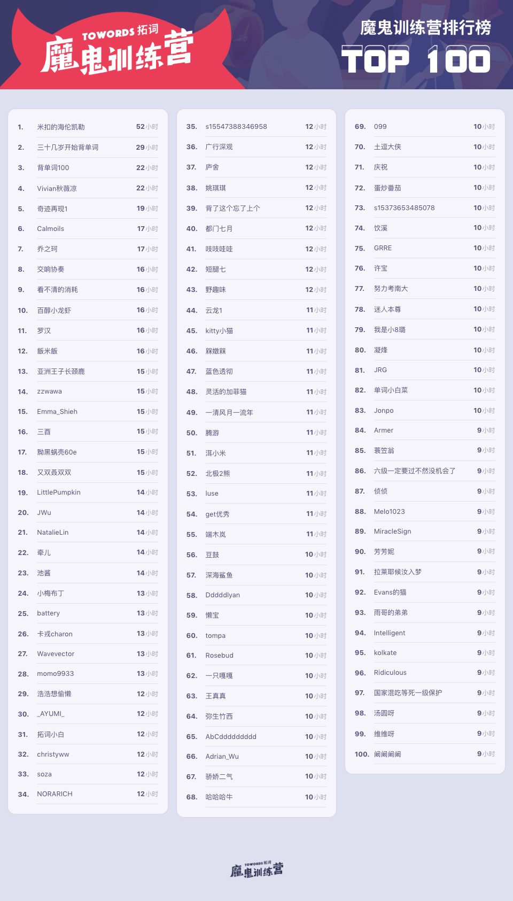

PS: 最新一周排行榜又来啦。后台时间统计单位为「分钟」，故「小时」排名分先后。

<h1 style="color:red">贰 | 拓词快讯 </h1>

你有好故事，值得被倾听

上周末和暴躁延去看脱口秀，好像有这么一句话，让延姐很是动容：

 Friends are the family we choose ourselves. 
 朋友是我们选择的家人
 

 Nora也同意，不过背后还是有一丁点儿家人不能选择的无奈。 长大的过程，Nora还是有好几次希望有别人家的父母。
 
 家庭对孩子的影响如何？科学做过很具体详尽的解释。 英国的科学家花了70年的时间（开始于1946年）追踪超过7万个小孩的一生，横跨了5代人，想去找出为什么孩子的差别的缘由。 
 
 数据表明，出生很重要。父母也是，他们做的一些很小的事情就会对孩子有很好的影响。 

比如实验里说到的：

talking and listening to a child, responded to them warmly 
与他们交谈，倾听他们说的，亲切地回应他们 
reading to children every day seems to be really important 
每天为孩子们朗读故事也很重要。 

除了以上，Nora觉得以下应该也算是那些小小的，但是会对孩子有很好影响的事。

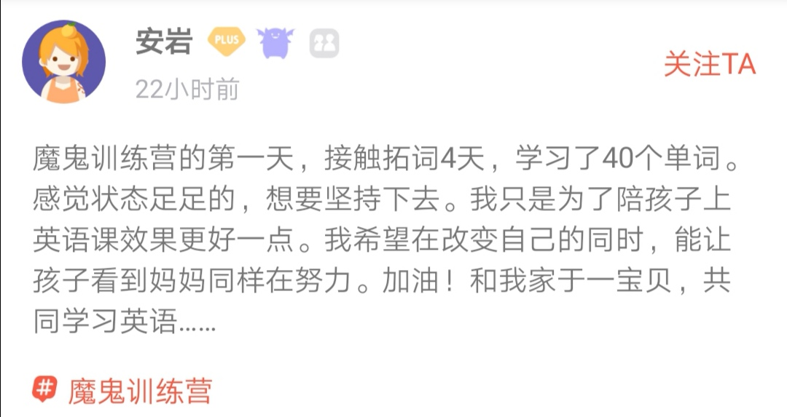

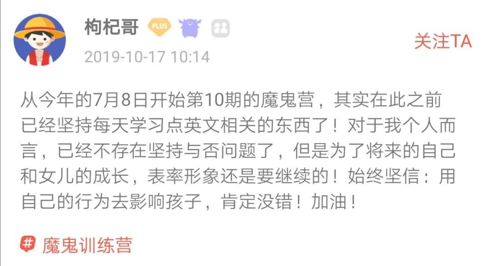

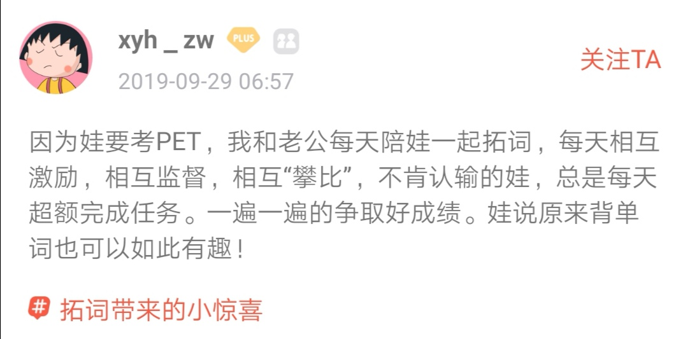

<h1 style="color:red">叁 | 早安英语 </h1>

cor cordium,我此生对别人说过的最真实的话

《三体》，获得过雨果奖（科幻界的诺贝尔奖）的那本小说，有这么一段我很喜欢：

“Do you think life is nothing but a fragile, thin, soft shell clinging to the surface of this planet?” 

“Isn’t it?”

“Only if you neglect the power of time. If a colony of ants continue to move clods the size of grains of rice, they could remove all of <b>Mount Tai</b> in a billion years. As long as you give it enough time, life is stronger than metal and stone, more powerful than typhoons and volcanoes.”

― Liu Cixin, Death's End

 

“你是不是以为,生命只是地球表面一层薄薄的、软软的、稀稀拉拉的、脆弱的东西?” 

“不是吗?” 

“那你忽略了时间的力量。

一队蚂蚁不停搬运米粒大小的石块,给它们十亿年,就能把<b>泰山</b>搬走。

只要把时间拉得足够长,生命比岩石和金属都强壮得多,比飓风和火山更有力。”

关于泰山， 应该不只我们熟悉，西方人也懂其中的意义。 

比如被Nora cue过很多次的《西南联大英文课》里，英国作家G.Lowes Dickinson讲它是圣山 <kbd><b>The Sacred Mountain</b></kbd>。 

why？这位剑桥学者说因为中国人有 

<kbd><b>the worship of natural beauty</b></kbd>

泰山是向往之地。 

再如中文语境下的：

一叶障目，不见<b>泰山</b>。

轻于鸿毛，重于<b>泰山</b>。

还有许多年前， 唐朝有才子杜甫，一位一生都很忙、很累、很穷的大诗人，也写过。

Nora曾经因为杜甫的诗太惨太苦不怎么读，但是这首《望岳》还挺喜欢：

<b>望岳</b>

岱宗夫如何?齐鲁青未了。

  造化钟神秀，阴阳割昏晓。

  荡胸生曾云，决眦入归鸟。

  会当凌绝顶，一览众山小。

 

Gazing on Mount Tai

许渊冲译

O <b>peak of peaks</b>, how high it stands!

One boundless green overspreads two States. 

A marvel done by Nature's hands, 

Over light and shade it dominates. 

Clouds rise there from and lave my breast; 

I stretch my eyes to see birds fleet. 
I will ascend the mountain's crest;

It dwarfs all peaks under my feet. 

第一句的翻译也很喜欢， <strong>peak of peaks</strong>，很契合泰山作为五岳之首的地位了。 为什么这么翻？Nora有揣测过，应该和英文文学其实暗暗相合。 

《圣经》里提到最雅致的歌谣，叫 <strong>song of songs</strong>, 即圣经中的雅歌篇。 

《旧约》里还有类似的结构，用来表达「万事皆空」的概念

<b>Vanity of vanities</b>,  
saith the Preacher,  
<b>vanity of vanities</b>; 
all is vanity.

圣经的语言很典雅， 不少学者有从里面汲取廪养。模仿这样的修辞方式，还有<b><kbd>prince of princes</kbd></b>。

来自英文名篇《天路历程》「The Pilgrim's Progress」里。

这本书影响了很多人，包括美国国父富兰克林。 有人说这是写过成年人的童话，有人说这是西方版的《西游记》，同时这本书的阅读人数仅次于《圣经》。

<b><kbd>Prince of princes</kbd></b> himself, when here, went through this town to his own country, and that upon a fair day too: and as I think, it was Beelzebub, the chief lord of this fair, that invited him to buy of his vanities.

出自《天路历程》

这里的<b><kbd>prince of princes</kbd></b>，王中之王指是<b>Jesus</b>，那个凡世的君王都应该仰望的“无冕之王”。 

这个修辞， 莎士比亚也用过。在悲剧《哈姆雷特》里：

"Give me that man 
That is not passion's slave,  and I will wear him 
In my heart's core, ay,  in my <kbd><b>heart of heart</b></kbd>, 
As I do thee."

 

“给我一个不为感情所奴役的人， 我愿意把他珍藏 
在我的心坎、我的灵魂的身处， 
正像我对你一样。”  (朱生豪译)

出自《哈姆雷特》

不过现在用的是<b><kbd>in one's heart of hearts</kbd></b>，用来表达人<i>内心最深、最隐秘的</i>想法。 

电影《请以你的名字呼唤我》（call me by your name)， 最后Elio和Oliver分开了。Oliver珍藏着Elio的明信片，并在后面写了两个词：<b><kbd>cor cordium, heart of hearts</kbd></b>.

最真的话，用什么来说？那就用<b><kbd>heart of hearts</kbd></b> 吧～

<h1><b>拓词魔鬼营</b>|外刊精读课</h1>

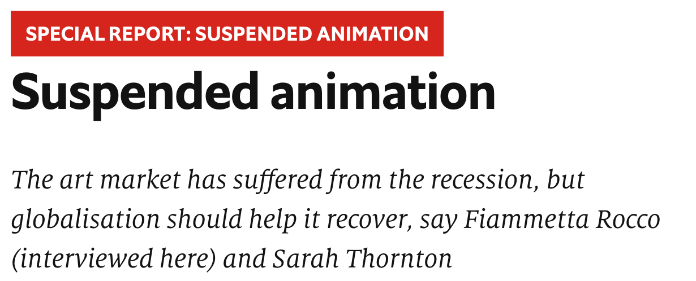

前言

全文 478 单词，包含 2020考研英语大纲词汇 150 个。

单词右上角标有考研（比如<mark>divorce</mark>考研）代表这个单词被【拓词】2020考研英语大纲单词书收录。

标绿文字可以重点读，与文章结构有关。 字变小是因为Nora认为ta们不重要😂。

文章来自《经济学人》，原文特别特别长， 考研英语取了前5段， 构成了2010年英语二的阅读一，几乎所有内容都一样，但是有一句话删掉了。 

2010年考研英语三题来源于The Economist(《经济学人》)，2010年的考研题， 3篇是The Economist, 1篇是商业周刊，1篇是

《麦肯锡周刊》，1篇《哈佛商业评论》，1篇西方原著。

考研英语完型填空部分，使用了2009年6月6日 Economist 《经济学人》杂志上的一篇文章，文章主要内容，是对社会学上一个经典的理论：霍桑效应的批判和反思。文章难度适中。命题专家在出题的时候也进行了一定程度的改写。

估计有不少人疑惑是在考英语还是在考经济，今天选的这篇讲的是艺术，如果在考场上初见， 估计不少人会一头雾水。。 

怎么搞定考研阅读？背好单词，或者另外一个途径， 读读常出题的那些外刊？

如果只是读文章，记记单词，文法这些，用散装的方式去理解文章，但是还是不懂为什么是这样行文，这个词这样子安排是不是有什么“暗戳戳”的想法。

这样即使读过了，好象也不会get到文章的深意哎， 若是考场上遇到，选对答案与否，这个应该不是必然了。

正文

001 <i>THE longest <b>bull run</b> in a century of art-market history <b>ended on a <mark>dramatic</mark>考研 note with</b> a sale</i> <small>of 56 works by Damien Hirst, “Beautiful Inside My Head Forever”, at Sotheby's in London on September 15th 2008 (see picture). All but two pieces sold, <b>fetching</b> more than £70m, a <b>record</b> for a sale by a single artist. <b>It was a last hurrah</b>. As the auctioneer called out bids, in New York one of the oldest banks on Wall Street, Lehman Brothers, filed for bankruptcy.</small>

重点讲解|第1段

<h5>end on a note with </h5>

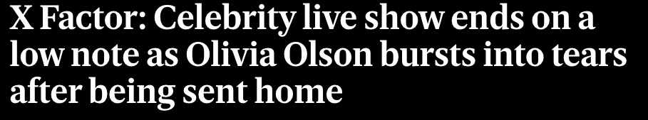

 

🌰 ...We'll <b>end</b> this little tribute not <b>on</b> a failure, but <b>on a high note</b>.
<small>出自<i><small>Vanity Fair</small></i></small>

🌰The twentieth century was <b>ending on a high note</b>. 
...but I'd like to <b>close on a postive note</b> by saying that most of these statesments are just jokes...

<small><i><small>出自Salon</small></i></small>

🌰<b>On a positive note</b>, I was sure that when my sixtysomething, ball-of-energy aunt got through redesigning the entire upstairs and driving contractors and decorators nuts, the upper stories of the house would once again be livable and ...

<small><i><small>出自小说Tails You Lose</small></i></small>

☞☞<small><b>conclude</b>/<b>close</b>/<b>finish</b>/<b>leave</b>/<b>begin</b>/<b>start off</b></small>    on a <i>positive</i> <strong>note</strong>

<h5>record</h5>
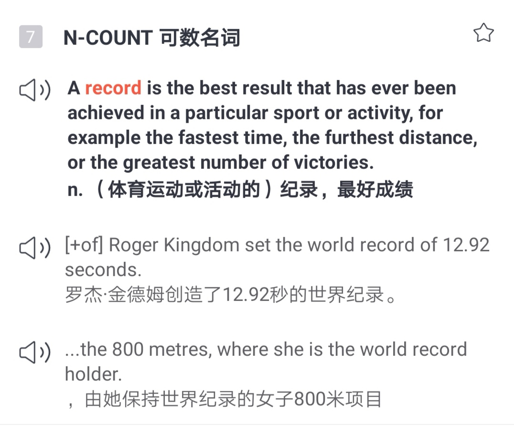

<h5>last hurrah </h5>

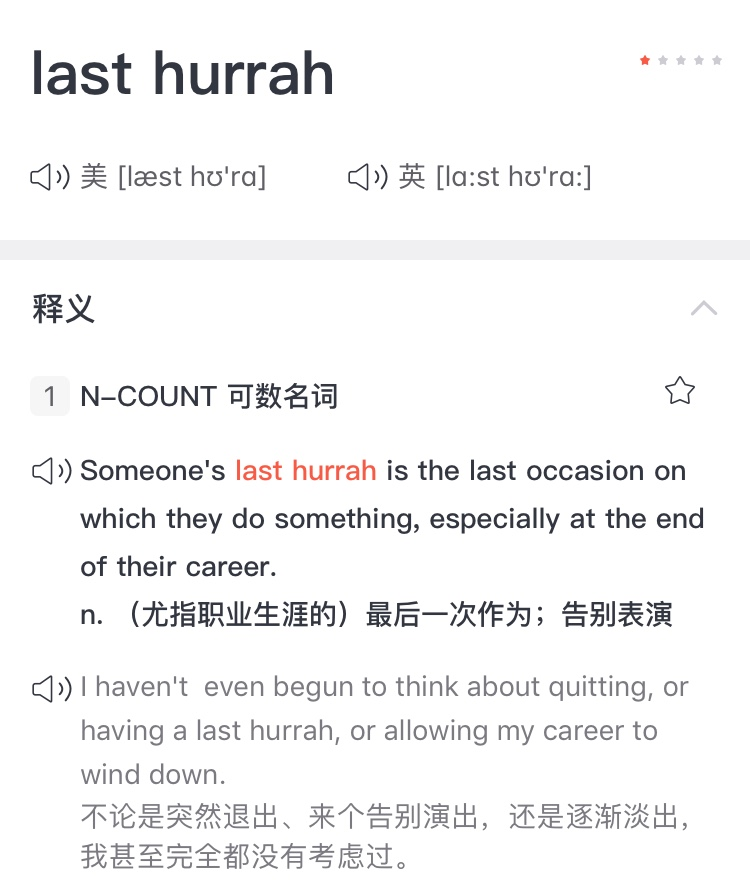

 

<kbd><strong>Swan song</strong></kbd>有近似义。
 
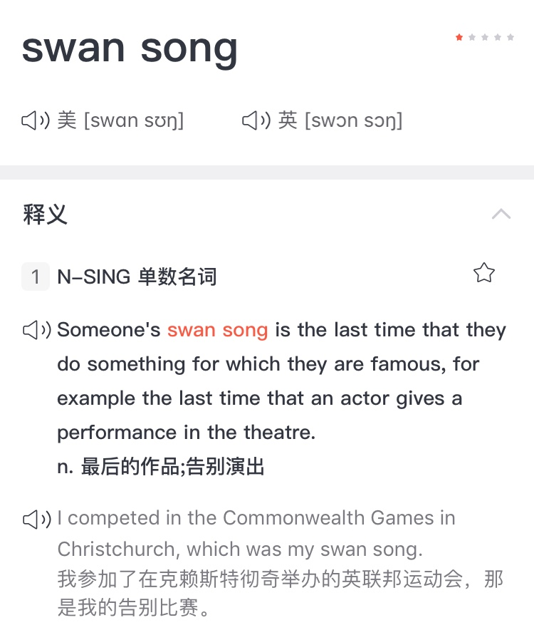

词汇表|第1段

dramatic adj. 戏剧性的 
fetch v. 卖得，售得 
auctioneer n.拍卖商 
file v. 提出 
bankruptcy n.破产

002 <i>The world art market had already been <b><kbd>losing <mark>momentum</mark>考研</kbd></b> for a while after rising vertiginously since 2003. </i> <small>At its peak in 2007 it was worth some $65 billion, reckons Clare McAndrew, founder of Arts <mark>Economics</mark>考研, a research firm—double the figure five years earlier. Since then it may have come down to $50 billion. <i>But</i> the market generates interest far beyond its size because it brings together great wealth, <mark>enormous</mark>考研 egos, greed, <mark>passion</mark>考研 and <mark>controversy</mark>考研 in a way matched by few other industries.</small>

重点讲解|第2段

🌰 <small>What am I in the eyes of most people — a nonentity, an eccentric, or an unpleasant person — somebody who has no position in society and will never have; in short, the lowest of the low.  All right, then — even if that were absolutely true, then I should one day like to show by my work what such an eccentric, such a nobody, has in his heart.  That is my ambition, based less on resentment than on love in spite of everything, based more on a feeling of serenity than on <mark>passion</mark>考研.  Though I am often in the depths of misery, there is still calmness, pure harmony and music inside me.  I see paintings or drawings in the poorest cottages, in the dirtiest corners. </small>  And my mind is driven towards these things with an <kbd><i>irresistible</i> <b>momentum</b></kbd>. 
<small>— Vincent van Gogh</small>

<small>大多数人眼中，我是一个无足轻重的人，一个古怪的、引人反感的人，一个在这个社会中没有也永远不会有任何位置的人，总而言之，就是底层中的底层。 好吧，即使这些都是真的，总有一天我也要通过我的作品展示我这样一个无足轻重的、古怪的人的内心。 这就是我的志向，基于万般种种后的爱而非愤怒，基于真诚而非激情。 虽然我经常沉浸于悲伤中，我的内心仍有冷静、平和与乐音。</small>  我从最简陋的木屋、从最肮脏的角落中看到艺术。我的意识不可控制的被这些事物吸引。

<small>— 文森特·梵高</small>

 

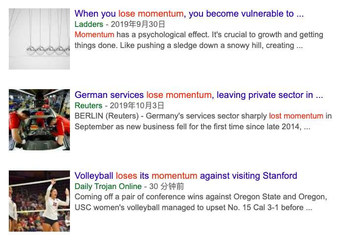

<b>build</b> <i>momentum</i> 增强势头 
gain <i>momentum</i> 势头增强 
gather <i>momentum</i> 势头增强 
have <i>momentum</i> 得势 
lose <i>momentum</i> 势头减弱 
maintain <i>momentum</i> 保持势头

词汇表|第2段

momentum n. 动量 
vertiginously adv. 陡峭地 
peak n. 顶点 
reckon v. 认为 
generate v.产生 
wealth n. 财富 
enormous adj. 巨大的 
ego n. 自我；自尊 
greed n. 贪婪 
passion n. 热情 
controversy n. 争议 
match v. 匹配

003 In the weeks and months that followed Mr Hirst's sale, <i>spending of any sort became deeply <b>unfashionable</b></i>, <small>especially in New York, where the <mark>bail-out</mark>考研 of the banks <b>coincided with</b> the loss of thousands of jobs and the <mark>financial</mark>考研 demise of many art-buying investors. In the art world that meant collectors stayed away from galleries and salerooms. Sales of contemporary art fell by two-thirds, and in the most <b>overheated</b> <mark>sector</mark>考研—for Chinese contemporary art—they were down by nearly 90% in the year to November 2008. Within weeks the world's two biggest <mark>auction</mark>考研 houses, Sotheby's and Christie's, had to pay out nearly $200m in guarantees to clients who had placed works for sale with them.</small>

重点讲解|第3段

<h5>A coincide with B</h5>
🌰  The festival is held twice a year, in April and October, when it <b>coincides with</b> Halloween.
 
BBC Oct 27, 2019

🌰  Sometimes <i>the best</i> and <i>worst</i> times of your life can <b>coincide</b>. <small>It is a talent of the soul to discover the joy in pain—-thinking of moments you long for, and knowing you’ll never have them again. The beautiful ghosts of our past haunt us, and yet we still can’t decide if the pain they caused us out weighs the tender moments when they touched our soul. This is the irony of love.</small>
 
― Shannon L. Alder

词汇表|第3段

unfashionable adj. 不流行的，过时的 
coincide v. 同时发生 
demise n. 终止，消亡 
gallery n. 画廊 
comtemporary adj. 当代的 
two-thirds 三分之二 
auction n. 拍卖 
guarantee n.保证金

004 <i>The <mark>current</mark>考研 downturn in the art market is the worst</i> <small>since the Japanese stopped buying Impressionists at the end of 1989, a move that started the most serious <b>contraction</b> in the market since the second world war. This time experts reckon that prices are <b>about 40% down on their peak on <mark>average</mark>考研</b>, though some have been far more volatile. But Edward Dolman, Christie's chief executive, says: “I'm pretty confident we're at the bottom.”</small>

词汇表|第4段

downturn n.衰退 
Impressionist 印象派画家 
contraction n. （分娩时的）子宫收缩，宫缩 
on average 平均 
volatile adj.动荡不定的 

005 <i>What makes this <b>slump</b> different from the last, he says, is that there are still buyers in the market</i>, <s>whereas in the early 1990s, when interest rates were high, there was no demand even though many collectors wanted to sell. Christie's revenues in the first half of 2009 were still higher than in the first half of 2006. </s><small>Almost everyone who was interviewed for this special report said that the biggest problem at the moment is not a lack of demand but a lack of good work to sell. The three Ds—death, debt and <mark>divorce</mark>考研—still <mark>deliver</mark>考研 works of art to the market. But anyone who does not have to sell is keeping away, waiting for confidence to return.</small>

考研真题里没有划删除线的句子。

重点讲解|第3段

<b>What makes</b> this slump <b>different from</b> the last,  he says,  <b>is that</b> there are still buyers in the market 

<i>What makes A different B is that...</i> 

词汇表|第4段

slump n. 萧条，衰退

后记

这篇文章最长的句子是👇这句，不妨用这个来测试一下是否可以很快读懂。

“I'm pretty confident we're at the bottom.” What makes this slump different from the last, he says, is that there are still buyers in the market, whereas in the early 1990s, when interest rates were high, there was no demand even though many collectors wanted to sell.

整篇文章的走向（基调），其实也屡次提到：contemporary,  downturn, volatile, demise。 
bull run, peak, at the bottom, fall，其他的数据和例子也罢，都是一直絮絮叨叨地再讲这个概念。

既然讲了艺术市场的走向， 不意外地用了很多数据参照， 很多写法考研er可以拿去用在小作文的图表题上。 
比如对于趋势的描述，第2段的这个句子就不错

<u>The world art market</u> had already been <u>losing momentum</u> for a while after <u>rising vertiginously</u> since 2003.

 the world art market可以换成其他的对象， lose momentum也可以是gain momentum或者是其他， rising vertiginously也可以换一个走向。

 表示下降/降低， 第3段就可以参考
 
Sales of contemporary art <u>fell by</u> two-thirds, and in the most overheated sector for Chinese contemporary art—they <u>were down by</u> nearly 90% in the year to November 2008.

 

 fell by two thirds, were down by nearly 90%, 简单直接具体，而且不重复。

本篇文章包含  <b>2020考研英语大纲词汇</b> <strong>150</strong>个 ，部分列表如下

<strong><kbd>passion momentum</kbd></strong>

<strong><kbd>financial enormous</kbd></strong>

<strong><kbd>economics dramatic</kbd></strong>

<strong><kbd>divorce deliver </kbd></strong>

<strong><kbd>current controversy </kbd></strong>

<strong><kbd>average auction </kbd></strong>

<strong><kbd>bail sector</kbd></strong>

<h1 style="color:red">11月 |  不要因为别人的眼光花钱 </h1>

那些让人清醒的句子

东方的哲人老子说， 人应该有3项特别好的美德，

我有三宝，持而宝之: 
一曰慈， 
二曰<b>俭</b>， 
三曰不敢为天下先。 
慈，故能勇; 
俭，故能广; 
不敢为天下先， 故能为成器长。

喜欢老子多于孔子的林语堂对于这段话的体悟是这样子的：

I have Three Treasures; 
Guard them and keep them safe: 
The first is Love. 
The second is, Never too much. 
The third is, Never be the first in the world. 
Through Love, one has no fear; 
Through not doing too much, one has amplitude
(of reserve power); 
Through not presuming to be the first in the world, 
One can develop one's talent and let it mature.

林语堂译

后来2000多年过去了，有个美国人，奋斗一生，终于从小透明变成了好多人仰望的大人物。 

晚年的时候写自传，也出了一版“做人该有哪些美德”，这里头同样讲了节俭。

To Industry and <b>Frugality</b>, the <i>early easiness of his circumstances</i> and <i>acquisition of his fortune</i>.

出自《本杰明富兰克林自传》

节俭(frugality)的好处是？免于生活窘迫（easiness of one's circumstances）， 还可以积累财富（acquisition of one's fortune），其实也是这个美国胖爷爷自己的故事。 

Nora理解的frugality，不是一条道走到黑，斩钉截铁地说no，或者一个人住在森林里2年，拿生活做一场极简主义实验：

we make ourselves rich by making our wants few. 

梭罗

 而是类似林语堂的理解，never too much就好。300年前的西方，关于商业和商人，口碑可不像现在“崩坏”，那时候很正面，甚至一度被认为是一个国家中最重要的人群:

...there are <i><kbd>no more</kbd></i> <b>useful members</b> in a commonwealth
<i><kbd>than</kbd></i> <b>merchants</b>.  They <b>knit mankind</b> together in a mutual intercourse of good
offices,  <b><kbd>distribute</kbd> the gifts of nature</b>,  <b><kbd>find</kbd>  work for the poor</b>,  <b><kbd>add</kbd> wealth to the rich</b>,  and <b>magnificence to the great</b>.

<small>出自英国作家Addison</small>

有多伟大呢？ 
他们连通世界，  让物产打破地域的隔绝， 让贫者有其业， 富者更富， 伟大的国家也影响更大

现在呢？新闻不是写conspicuous consumption is <b>depleting the earth</b>，就是rampant consumerism <b>harms all classes</b>. 

太多好像带来的伤害性更大些， 富兰克林说穷人比富人更慷慨，有点像月初和月末的自己。

A man being sometimes more generous when he has but a little than we he has plenty, perhpas thro'fear of being thought to have but little. 

是不是有可能没银子的时候更悠哉。消费型社会容易让人觉得，幸福在于拥有，好容易就不受控制的买买买，钱包怎么捂都捂不住😂

The consumption society has made us feel that happiness lies in having things. 

所以常常是“想存的钱到了月末已经一文不剩”🤦‍♀️

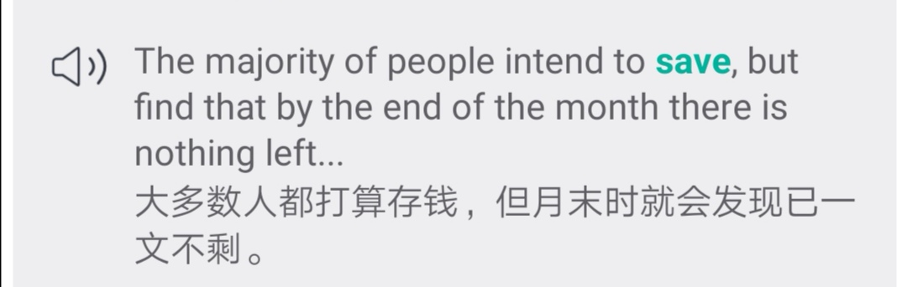

双11要来了， 给自己立一个flag，不为了买不同的东西而买，不为别人的眼光花钱 😂

