

🌟Jam tomorrow是“明天的果酱”吗？但你永远吃不到它，为什么？ 
🌟只有你自己才能决定什么最适合你 
🌟语言是最灵活的交流工具

<h1 style="color:red">壹 | 排行榜 </h1>

<h1 style="color:red">排行榜</h1>

全球榜

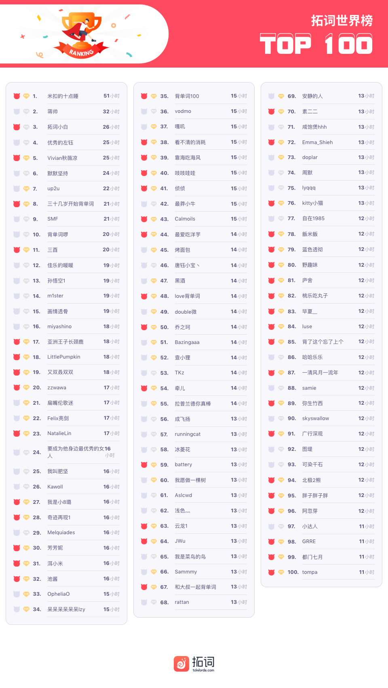

PS: 最新一周排行榜又来啦。后台时间统计单位为「分钟」，故「小时」排名分先后。

魔鬼营

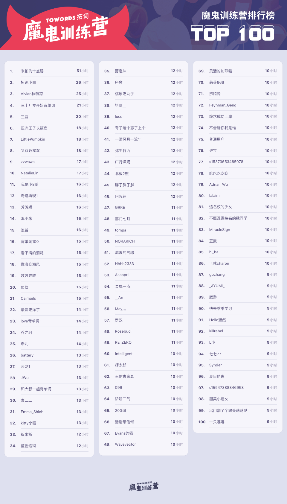

PS: 最新一周排行榜又来啦。后台时间统计单位为「分钟」，故「小时」排名分先后。

<h1 style="color:red">贰 | 拓词快讯 </h1>

选择

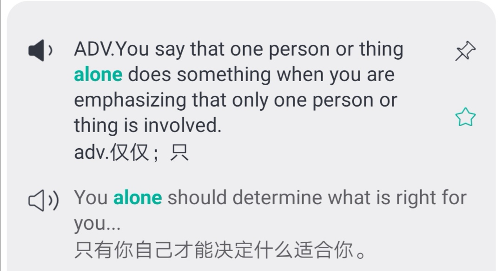

朋友同桌也是吧。 

现实是，出生在哪里，在哪里上学，是哪个班，这些已经帮我们决定了很大部分人生。

很长的一段时间里，也有可能是一生，我们会认识谁，会和哪些人做朋友，都是被注定了的。 

对有些人来说，无法选择的那些年，却可能是人生中非常重要的时间段。

很羡慕那些可以在学生时代就找到知己的人。

这一回可以自己选，

期待你不必羡慕别人有那样的好朋友（同桌），

也能成为别人羡慕的好朋友（同桌）。

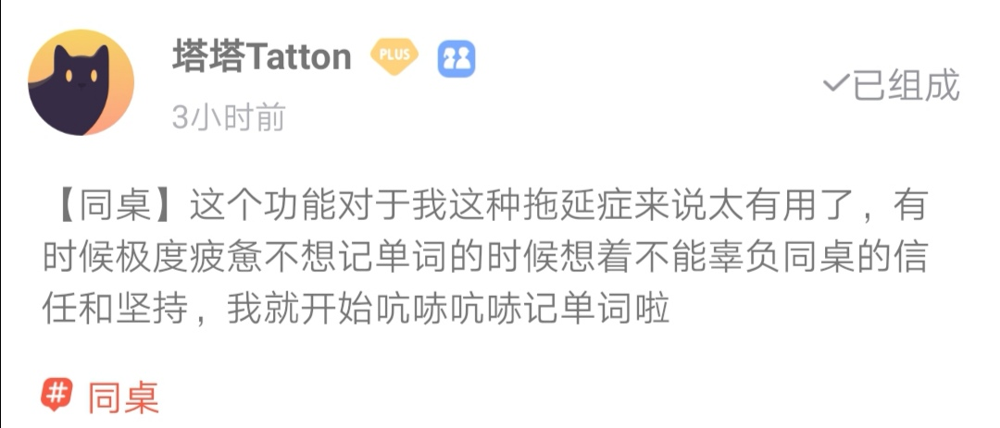
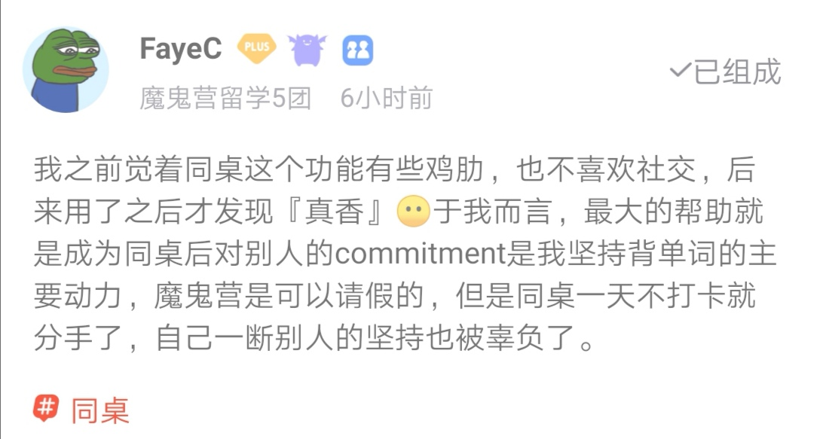
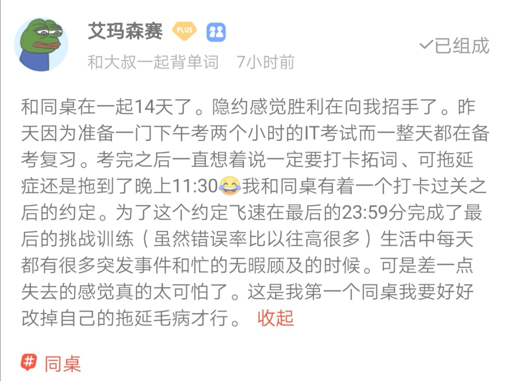
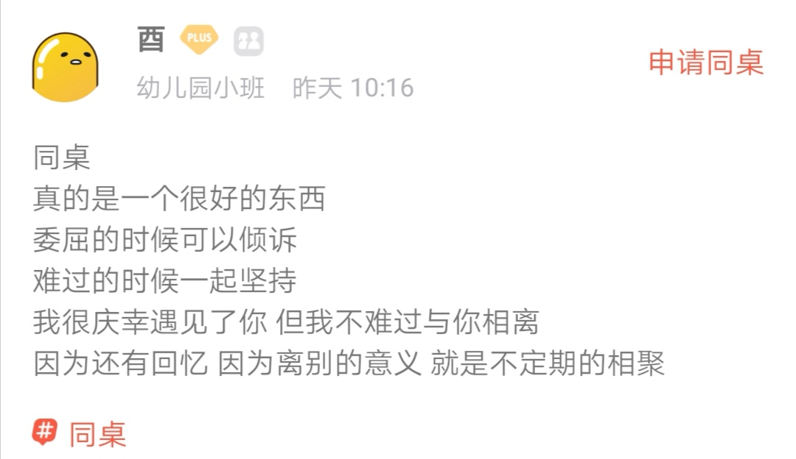
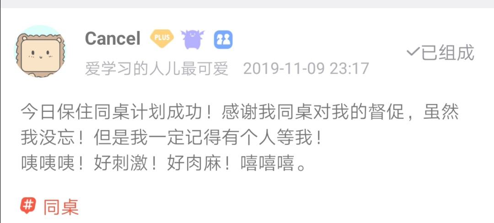
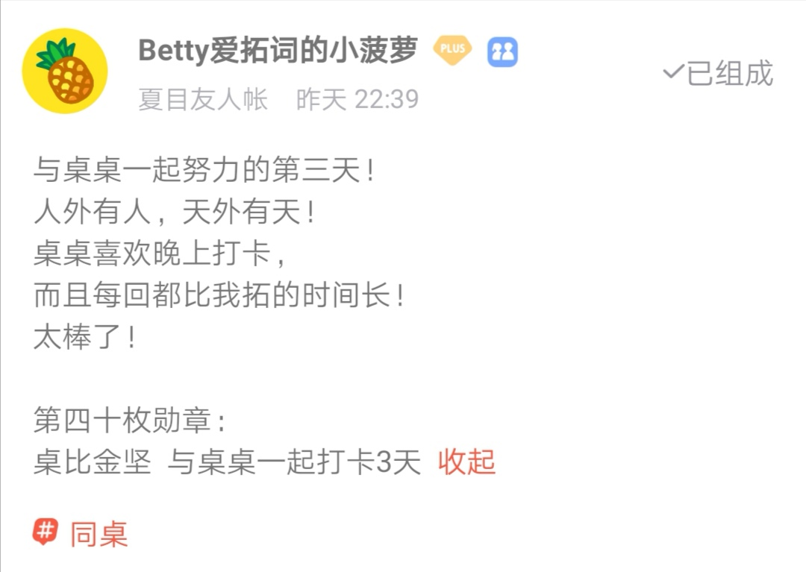

<h1 style="color:red">叁 | 早安英语 </h1>

Jam tomorrow是“明天的果酱”吗？但你永远吃不到它，为什么？

大家好！又到周一啦~

俗话说“一日之计在于晨”，在饮食上也是如此。早餐对人体健康发挥着至关重要的作用，因此我们一定要重视早餐。

今天我们就来讲讲早餐会吃到的果酱jam相关的词组，在口语中，最常见的搭配就是traffic jam（交通堵塞），非常形象，汽车都堵成一团果酱啦。那jam还有啥用法？

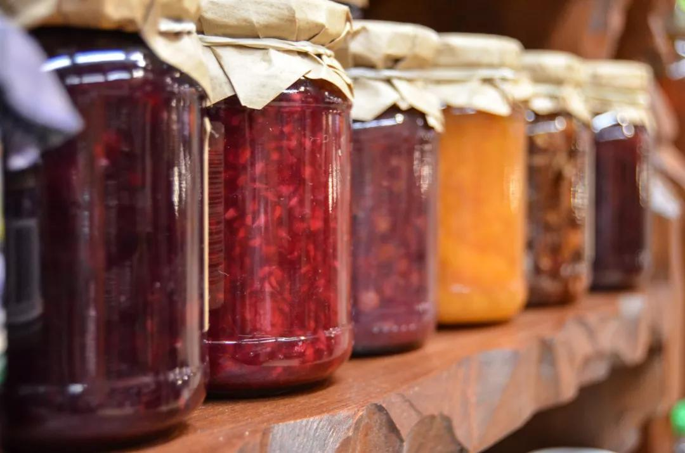

Jam tomorrow

出处是卡罗尔《爱丽斯漫游奇境记》的续集Through the Looking Glass，爱丽斯到White Queen那里打工，工资是1天两便士，还有一份jam，属于奖金。

这果酱的给法是“<b>Jam tomorrow and jam yesterday，but never jam today</b>”

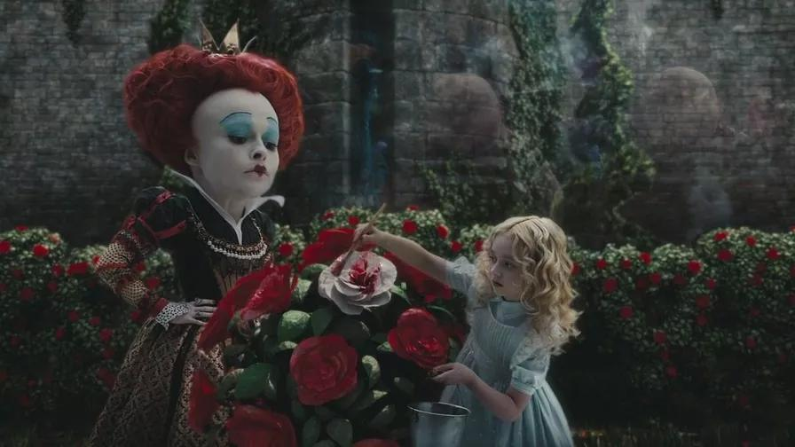

昨天明天都有，只有今天没有，也就等于永远没有。欧美工人要求老板兑现承诺时也有打着标语，上书WHERE IS THE JAM的。

因此，jam tomorrow意思是许诺但永不兑现的东西，可望而不可及的事物。

🌰
The Company’s big plan for employee welfare is actually no more than <b>jam</b> tomorrow. 
公司制定的员工福利计划其实只不过是永远都不会兑现的承诺罢了。

 

Be in a jam

Jam的名词意思里还有“困境”的含义，所以<b>be in a jam</b>表示<i>处于困境或麻烦中</i>。

回顾一下，相同意思的词组还有<b>in a hole，in hot water，in a hot seat，in the soup</b>以及<b>high and dry</b>，全部都是<i>处境艰难</i>的意思。

🌰 I am <b>in a jam</b>—I accidentally lost my key and it is 11 pm！ 我麻烦大了——我不小心钥匙掉了，现在可是晚上十一点啊！

Money for jam

Money for jam means a very quick and easy way to earn money，也就是用一种很快速又容易的方法赚到钱。

因此，<b>money for jam</b>意思是指<i>容易赚钱的便宜事儿，不费吹灰之力的又能赚钱的事</i>，有时候也写做<b>money for old rope</b>。

🌰  I will get paid to stay in my neighbours’house while they are on holiday. 
我邻居去度假时，他们付钱让我住到他们家里去。 
Wow，that will be money for jam! 
哇，那真是不费吹灰之力就把钱赚了啊！

<h1 style="color:red">考研|小词  </h1>

regard

考研大纲词regard, 近10年的真题里， 英语一出现了9次，英语二出现的15次。 也是名家爱用的词。 

《威尼斯商人》，一部看来夏洛特非常坏，鲍西娅很聪明，安东尼是个老实人的莎翁喜剧。不少人最喜欢的莎翁剧女主角，白富美鲍西娅，在挑选夫婿时候说自己够有钱了，所以她选丈夫并不care丈夫有没有钱。

had riches enough  not to <b>regard</b> wealth in a husband

这里的<b>regard</b>可以翻译成在乎。 除了这些，regard还有好多其他妙用。 有魔鬼营学员曾问过信件末尾的用法，当时小拓讲了yours truly, faithfully这种

其实也可以换成best/kind regards，也是指<b>关心注意</b>。

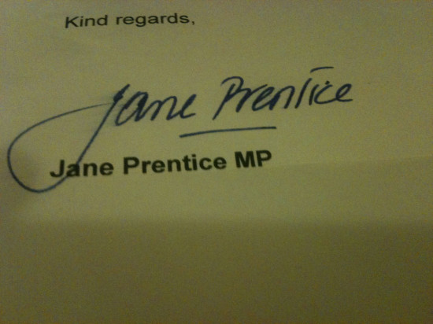

with regard to这个结构在考研英语里出现了好几回，表示<b>关于，至于</b>。

赫胥黎在讲读书的妙用时倒是有用到without regard to：

The mental power which will be of most importance in your daily life will be the power of seeing things as they are <b>without regard to</b> authority; and of drawing accurate general conclusions from particular facts. 

读书之后有什么？可以不用让权威来指点你的生活。

纷繁复杂的规则，你自己就可以看穿。

以前是远方太远，眼不见心不烦。 现在是却是极其躁动的精神世界。

想清心寡欲断离舍，仍然想保留生活的乐趣，又不愿意错过一场精彩的演出和炫目的电影。

想着诗和远方，还有财务自由。

哎，太难了。

林语堂上个世纪写中国人时，也是差不多情况：生活太烦恼了，还都和个人有关。

The modern man finds himself 
in continual perplexity <b>in regard to</b> many problems, and most of all in problems that affect closely his personal life. 

出自《吾国与吾民》

如何才好？Nora喜欢香奈儿的态度

I’ve done my best, <b>in regard to</b> people and to life, without precepts, but with a taste for justice.

<h5>后记</h5>

有一样东西，可以拉近我们的距离，可以让我们形同陌路？

语言。 虽然不完美，却比很多表达方式来得清晰、完整和长久， 比如肢体语言、表情包、艺术品等。

语言是如此的不同，说外语的时候这个感觉尤为强烈。说着自己的语言，一切就是那么轻松自然，水到渠成，然而一旦讲起外语，就能深刻地体会到对方语言的与众不同。

比如英文里用形容词传达的意向，中文对应的是动词，比如这里的contradict就是。 

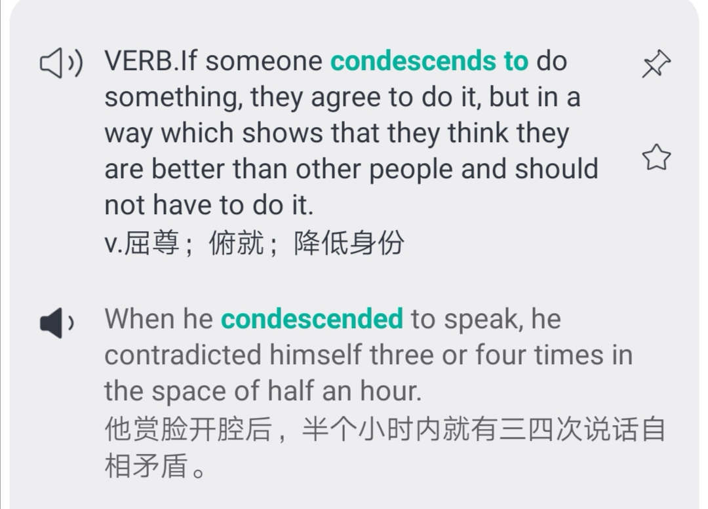

再如表达倾听对方讲话，英国作家这样用的<b>Sir Roger <small>planting himself at our historian’s elbow</small>, was very <i>attentive to</i> every thing he said</b>

<i>be attentive to</i>来表示倾听，可以拓展到<i>be attentive to words/demands/needs</i>等。 

这大概也算学英语的乐趣吧：看似简单的词，实际上会有独特的用法。

往期回顾：
<a href="https://www.topschool.com/towords/tarticle/index.html?article_id=37" style="color:#FF4855;font-size:14px;display:block">拓词小报·魔鬼营周报第一期</a>
<a href="https://www.topschool.com/towords/tarticle/index.html?article_id=39" style="color:#FF4855;font-size:14px;display:block">拓词小报·魔鬼营周报第二期</a>
<a href="https://www.topschool.com/towords/tarticle/index.html?article_id=41" style="color:#FF4855;font-size:14px;display:block">拓词小报·魔鬼营周报第三期</a>
<a href="https://www.topschool.com/towords/tarticle/index.html?article_id=42" style="color:#FF4855;font-size:14px;display:block">拓词小报·魔鬼营周报第四期</a>
<a href="https://www.topschool.com/towords/tarticle/index.html?article_id=43" style="color:#FF4855;font-size:14px;display:block">拓词小报·魔鬼营周报第五期</a>
<a href="https://www.topschool.com/towords/tarticle/index.html?article_id=44" style="color:#FF4855;font-size:14px;display:block">拓词小报·魔鬼营周报第六期</a>	
<a href="https://www.topschool.com/towords/tarticle/index.html?article_id=45" style="color:#FF4855;font-size:14px;display:block">拓词小报·魔鬼营周报第七期</a>
<a href="https://www.topschool.com/towords/tarticle/index.html?article_id=55" style="color:#FF4855;font-size:14px;display:block">拓词小报·魔鬼营周报第八期</a>
<a href="https://www.topschool.com/towords/tarticle/index.html?article_id=56" style="color:#FF4855;font-size:14px;display:block">拓词小报·魔鬼营周报第九期</a>
<a href="https://www.topschool.com/towords/tarticle/index.html?article_id=59" style="color:#FF4855;font-size:14px;display:block">拓词小报·魔鬼营周报第十期</a>
<a href="https://www.topschool.com/towords/tarticle/index.html?article_id=66" style="color:#FF4855;font-size:14px;display:block">拓词小报·魔鬼营周报第十一期</a>
<a href="https://www.topschool.com/towords/tarticle/index.html?article_id=67" style="color:#FF4855;font-size:14px;display:block">拓词小报·魔鬼营周报第十二期</a>
<a href="https://www.topschool.com/towords/tarticle/index.html?article_id=70" style="color:#FF4855;font-size:14px;display:block">拓词小报·魔鬼营周报第十三期</a>
<a href="https://www.topschool.com/towords/tarticle/index.html?article_id=73" style="color:#FF4855;font-size:14px;display:block">拓词小报·魔鬼营周报第十四期</a>
<a href="https://www.topschool.com/towords/tarticle/index.html?article_id=74" style="color:#FF4855;font-size:14px;display:block">拓词小报·魔鬼营周报第十五期</a>
<a href="https://www.topschool.com/towords/tarticle/index.html?article_id=75" style="color:#FF4855;font-size:14px;display:block">拓词小报·魔鬼营周报第十六期</a>
<a href="https://www.topschool.com/towords/tarticle/index.html?article_id=76" style="color:#FF4855;font-size:14px;display:block">拓词小报·魔鬼营周报第十七期</a>
<a href="https://www.topschool.com/towords/tarticle/index.html?article_id=77" style="color:#FF4855;font-size:14px;display:block">拓词小报·魔鬼营周报第十八期</a>
<a href="https://www.topschool.com/towords/tarticle/index.html?article_id=78" style="color:#FF4855;font-size:14px;display:block">拓词小报·魔鬼营周报第十九期</a>
<a href="https://www.topschool.com/towords/tarticle/index.html?article_id=80" style="color:#FF4855;font-size:14px;display:block">拓词小报·魔鬼营周报第二十期</a>
<a href="https://www.topschool.com/towords/tarticle/index.html?article_id=82" style="color:#FF4855;font-size:14px;display:block">拓词小报·魔鬼营周报第二十一期</a>
<a href="https://www.topschool.com/towords/tarticle/index.html?article_id=83" style="color:#FF4855;font-size:14px;display:block">拓词小报·魔鬼营周报第二十二期</a>
<a href="https://www.topschool.com/towords/weekly/23.html" style="color:#FF4855;font-size:14px;display:block">拓词小报·魔鬼营周报第二十三期</a>
<a href="https://www.topschool.com/towords/weekly/24.html" style="color:#FF4855;font-size:14px;display:block">拓词小报·魔鬼营周报第二十四期</a>
<a href="https://www.topschool.com/towords/weekly/25.html" style="color:#FF4855;font-size:14px;display:block">拓词小报·魔鬼营周报第二十五期</a>
<a href="https://www.topschool.com/towords/weekly/26.html" style="color:#FF4855;font-size:14px;display:block">拓词小报·魔鬼营周报第二十六期</a>
<a href="https://www.topschool.com/towords/weekly/27.html" style="color:#FF4855;font-size:14px;display:block">拓词小报·魔鬼营周报第二十七期</a>
<a href="https://www.topschool.com/towords/weekly/28.html" style="color:#FF4855;font-size:14px;display:block">拓词小报·魔鬼营周报第二十八期</a>

	
