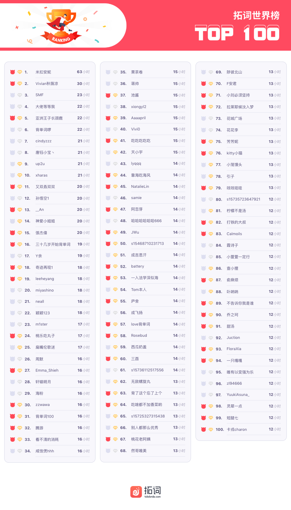

🌟凡是过往，皆为序章 
🌟《基督教科学箴言报》，考研出题人最爱的外刊 
🌟可以懵可以醉，打卡不掉队

<h1 style="color:red">壹 | 排行榜 </h1>

全球榜

PS: 最新一周排行榜又来啦。后台时间统计单位为「分钟」，故「小时」排名分先后。

魔鬼营

PS: 最新一周排行榜又来啦。后台时间统计单位为「分钟」，故「小时」排名分先后。

<h1 style="color:red">贰 | 拓词快讯 </h1>

词根词缀的故事：续

「美国孔子」爱默生有这样的一句话：

Language is the archives of history. 

 语言是历史的档案馆。 

Alexi在英语下午茶第一课讲历史（How to talk about history），总结成2个关键词：civilization 和heritage. 

Nora很喜欢他关于heritage遗产的定义：

Heritage means everything you keep from the past. Anything that comes from the past is part of a country's heritage.

最大众化的遗产，该属汉字。不仅藏着历史还有人生的况味，林语堂就「孤独」二字就有这样的见解

孤独这两个字拆开来看，有孩童，有瓜果，有小犬，有蝴蝶，足以撑起一个盛夏傍晚间的巷子口，人情味十足。稚儿擎瓜柳棚下，细犬逐蝶窄巷中，人间繁华多笑语，惟我空余两鬓风。  孩童水果猫狗飞蝶当然热闹，可都和你无关，这就叫孤独。 

 
<small>—林语堂</small>

「热闹是他们的，我什么也没有」。

了解汉字的意蕴，还可以从古人的"名""字"来看。春秋时代开始，古人不仅有名，还多有字。

林语堂先生在《苏东坡传》的卷首曾提到中国人名号的繁多常常使西方人感到头痛。 

在本名之外另取一个和本名意思有某种关系的名字，叫做字。取反如韩愈朱熹。韩愈，字退之。 「愈」表示前进。朱熹，字元晦。

苏轼的名和字（子瞻）也大有学问，老父亲苏洵还专门写文《名二子说》。

老舍本命舒庆春，曾字舍予，由「舒」而「舍予」，意思为忘我。「舒」字，可以是给予即快乐（舒心）。亦或者像经历了双十一的Nora, 「断离“舍”」可以让心舒坦很多。 

林语堂解读的孤独，老舍拆的舒等等，这些应该都可以归于汉字的一类，会意字。不象形，需要用意思去体会的字。

维基上的解释汉字「明」和「好」也是如此：

<h5>Associative Idea Characters  (Compound Conceptual Characters)</h5>
<h5>会意字</h5>
Also translated as logical aggregates or associative compounds, these characters have been interpreted as combining two or more pictographic or ideographic characters to suggest a third meaning. 

The canonical example is 明 bright. 明 is the association of the two brightest objects in the sky the sun 日 and moon 月, brought together to express the idea of "bright". 

It is canonical because the term 明白 in Chinese (lit. "bright white") means "to understand, understand". 

Other commonly cited examples include 休 "rest" (composed of the pictograms 人 "person" and 木 "tree") and 好 "good" (composed of 女 "woman" and 子 "child").

-维基百科

男，田里的劳动力。古人称东南多虫蛇的地区为“闽”，称西南多虫蛇地区为“蜀”。

为什么独是犬字边？古人说“狗相遇时总是互相争斗。羊的品性乐于合群，狗的特性倾向独处。”
 

 独，犬相得而斗也。羊为群，犬为独也。
 
——《说文》

会意的特性不属于汉语独有，英语里也有如此情况。

比如compassion，米兰昆德拉在他的书里《生命不可承受之轻》做过很好的诠释：

在拉丁语派生的所有语言里，com passion（同情）一词都由前缀com-和词根passio组成，该词原本表示“苦”的意思。在其他语言中，例如捷克语、波兰语、德语、瑞典语，这个词用作名词，由相类似的前缀加“情感”一词组成（捷克语：sou-cit；波兰语：不会打；德语：同上；瑞典语：同上）。  
在从拉丁语派生的语言中，compassion这个词的意思是说人们不能对他人的痛苦无动于衷；换言之：也就是人们对遭受痛苦的人具有同情之心。另一个词pitik的意思几乎相同（英语为pity)，该词甚至意味着应该对遭受痛苦的人表示某种宽容。“怜悯”一位妇女，意味着处境比她好，也就意味着降贵纡尊，要与她处于同一位置。  
正因为如此，“同情”这个词一般会引发蔑视，它指的是某一种处于次要地位的感情，同爱情没有瓜葛。出于同情爱一个人，并非真正爱他。  
而在以“情感”而非passio即“痛苦”作为词根组成“同情”一词的语言中，该词使用的意义基本相同，但是，很难讲它指的是不好的或是一般的情感。该词的词源包含的神秘力量给该词投上了另一层光芒，使其意义更为广泛：有同情心（同—感），即能够与他人共甘苦，同时与他人分享其他任何情感：快乐、忧愁、幸福、痛苦。因此这种同情是指最高境界的情感想象力，指情感的心灵感应艺术。在情感的各个境界中，这是最高级的情感。

<i>--Unbearable Lightness of Being</i>

拓词词根词缀的<i>联想记忆</i>来源某些也属于“会意”： 

 

有些单词的出现时间比较“近”，不需要会意，知道了故事一定不会再忘记意思

 

还有一些属于“二次解读”吧～😂

 

 

有些「联想记忆」好像有戳中到某人心扉，居然可以是小惊喜😂

感谢大家的等待和认可。

<small>PS: 首批带有「联想记忆」的单词主要是柯林斯的高频词，所以考研大纲也会覆盖很多，后续拓词将继续全力以赴，提供最合适的助记信息，感谢等待。</small>

<!--  -->

<h1 style="color:red">叁 | Nora小栈 </h1>

《基督教科学箴言报》，考研出题人最爱的外刊

​上周魔鬼营的精读课还是与考研有关，不过这次是《基督教科学箴言报》（The Christian Science Monitor）。

第8期魔鬼营周报有小专题写「为什么精读外刊」，因为是很多标准化考试的出题来源：考研、四六级、高考...

考研英语的素材来源？绝大部分都是英美主要报刊杂志，比如《经济学人》《纽约时报》《卫报》等。

不过最近英美某些媒体的报道实在失实太重，很有可能以后不会再被考虑，比如《卫报》。

虽然名字是《基督教科学箴言报》，但并不是纯宗教性的报纸，而是一份普通面向「世俗」的报纸，办报的宗旨是不伤害任何人，帮助所有人「To injure no man, but to bless all mankind」。

 

报道内容挺实在，没那么多的“幺蛾子"，最近3年考研英语选材出处最多占比相当大了（非常高频）：

2019年英语一阅读两篇； 
2018年英语一一篇，英语二两篇； 
2017年英语一阅读一篇， 英语二阅读两篇。

今天的文章是2019年英语一的阅读第一篇，属于和经济相关。

有点像倒叙。最重要的事情文章一开头就说了：

Financial regulators in Britain have imposed a rather unusual rule on the bosses of big banks.

英国的金融监管者像银行家放了大招！关于大招还可以有什么：

what is it?  
why? 
what else?  
是什么大招? 
为什么要放这个大招 
除了这个大招，还有别的可以做的吗？

其实这也符合我们遇到事情后的反应路径。那些突然的安排，都不会是无理取闹，而是经过调查、深思熟虑、几经取舍之后的结果。看多了外刊，你会发现报道里常常是这样的路径。 

<h5>重点词汇|举一反三</h5>

精读课里，Nora有重点讲一些词汇， 比如<kbd><b>impose on</b></kbd>

impose是强制实行的意思，搭配on，其实用法很灵活，很多场景都合适：

原文的例子是：

Financial regulators in Britain have imposed a rather unusual rule on the bosses of big banks. 

相对而言，金融监管者处于强势地位，毕竟有法律作为靠山，而<kbd><b>bosses of big banks</b></kbd>处于劣势。碰到类似的情形，就可以放心的用这个<kbd><b>A impose sth on B</b></kbd>
这个结构了，比如

常见的强弱关系有什么：

老板vs员工 
发达国家vs发展中国家 
老师vs学生 

只要可以明确两方是处于强弱的状态，就可以大胆地用。

比如我觉得自己听歌的品味还不错，喜欢听的歌，也想让父母也喜欢上，于是就“无耻”地在家全天公放😂

🌰 If you want to impose your music taste on your parents, play your tunes all day at top volume.

强加在给人的，可以是规定，像本文的rules, 还可以是taste（品味，格调）, will（意愿） values（价值观）等。 

<kbd><b>impose</b> one's  <i>taste/ will /values</i> <b>on</b></kbd>

<h5>好句积累|写作思路</h5>

解释完为什么要颁布这个规定，别的国家是怎么做的，这些来龙去脉都说清楚了。

脑补一下作者写这部分的时候的心理活动，「嗯，看懂这些该明白为什么英国的金融监管者要对银行家颁布这么奇怪的规定了吧」

接着文章第6段的开头来了这么一句：

Much more could be done to encourage “long-termism,” such as changes in the tax code and quicker disclosure of stock acquisitions.

紧接着上文，除了文章开头的rule还可以做以下内容blabla...

写作的时候，常有这样的场景：<b>为了A的发展</b>，必须<i>做事1，事2</i>...就可以借鉴这个句子。 

Much could be done to <b>encourge A</b>, <i>such as</i> 事1 and 事 2。

可以算作一个百搭句， 很多话题都可以用到，比如常见的<b>环保话题</b>。

encourage除了这么用，也可以用在表达<b>因果关系</b>上，想用<b>because of</b>的时候，不妨试试encouraged by 吧。看看新闻里是怎么用的吧～

🌰 In 2015, encouraged by government media outlets, speculative mainland investors poured into China's stock market...

🌰 Encouraged by the results of the study, Bredesen admits more needs to be done. 

今天就到这里啦，最后送上一句话共勉，考研的小伙伴加油哦～

The only limits in our life are those we impose on ourselves. 

生活中的唯一限制是我们加诸在自己身上的

<small>PS:下一期魔鬼营周报来自《大西洋月刊》，也是最近几年考研的热门题源</small>

<h1 style="color:red">懂得语源用处大 </h1>

<!-- 
语言这件小事
 -->

​我是谁？我来自哪里？

用哲学来解读是一种方式； 用DNA检测是另一种。一次测试，可以追踪到所有可能的远古祖先，很有可能来自亚洲之外。 

why we need to know the past?

为什么要知道过去呢？不是挺多人都说不念过往，不畏将来吗～

借用一下喜欢的<i>Will Durant</i>的一段话： 

Psychology is about how people behave,  philosophy is about the ideal way to behave  and history is about how people did behave. . . .  History is a laboratory of human behavior.

知道了过去，去掉了时间的封印，好多的不理解、疑惑、质疑等等一下子就被「合理化」了。 

就像中国的龙不应该和dragon有关系，翻译成loong虽然很拗口，但是也比Chinese dragon合适。

龙常被视作中华图腾，按照涂尔干的理论，图腾赋予的是大大的正能量：神性和主宰力量，帮助维系氏族社会。dragon呢？

维基上的介绍monsters to be tamed by saints，有点像西游记里总是为非作歹，需要被唐僧师徒收服的妖怪，总之就是大大的坏。

In western cultures, dragons are portrayed as monsters to be tamed or overcome, usually by saints or culture heroes,

-维基百科

做个不恰当的类比，weibo 和twitter、 youtube和youku、chess 和 Chinese chess以及 dragon和Chinese dragon，差别是指数级别的上升。 

有点看艺术的感觉。越古的差别越大，一看就知道是来自东方还是西方。越往现代，倒是不容易区分。 

所以对于那些很早很古就出现的概念或者东西，实在不应该做近似处理。除了这种本身就扯不上关系，也有同源但是还是会朝不同的方向演化的。

日语里的大丈夫常被翻译成「没关系」:

<small>日语<i>大丈夫</i>意思为<b>没关系</b></small>

但是在《广辞苑》（日本有名的日文国语辞典）对「大丈夫」（だいじょうぶ）的解释，的确还有「伟大的男子」这个意思。 

英文里这种情况也“层出不穷”。

在中世纪， knight errant指徘徊在乡间的年轻其实， 他们四处寻找着骑士精神的机会。 与之类似的arrant thief则指游荡在乡间、打劫百姓的流浪汉。

现在， errant已经失去「徘徊」之意，成为了一个表示程度的形容词，意思是「彻底的，十足的或者声名狼藉的」

若是追查词源会发现，delicious和delicate是同一个来路，scrub和shrub也是。 

想知道过去的西方人在生活中最重视什么，看看英语词里哪些领域最密集。

航海和星象就有一大批，好多造字也是根据这个来的， 加上前缀和后缀，就衍生出好多词。 

和星星有关的： disaster, consider; 短语里也是一批和航海有关： plain sailing, stemming the tide, swim against the tide， turnt the tide. 

这些词的出现时间和体量，其实也暗暗契合人类征服自然的路径。

还可以从用词里看出高低，美剧<i>why women kill</i>Karl说话很有英国老男人的范：

如果跟外国人说： I need to use the facilities。ta会认为你的英文很好。这里的facilities是指「卫生设备」，也就是「厕所」。

追究词源，facility来自法语。 英语对于同一事物，常有3种措辞，古英语、法语、拉丁或希腊文。

古英语的词，直接而又原始；法语的比较精致。来自拉丁语的更具专业感。前者比较随意，后两者更严谨，更适合学术。

想表达不同的态度，选对词就好了，可不是简单的同义词而已。

luck和fortune, dead和deceased这其中的细微差别，词源就可解释一大半。

存活至今的那些语言文字，都是由过去的历史铺垫至今。

「<b>凡是过往，皆为序章</b>」。

What's past is prologue

-莎士比亚

<h1 style="color:red">彩 | 蛋 </h1>

<h5>可以懵可以醉，打卡不掉队</h5>

