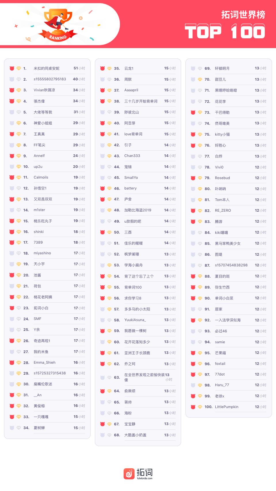
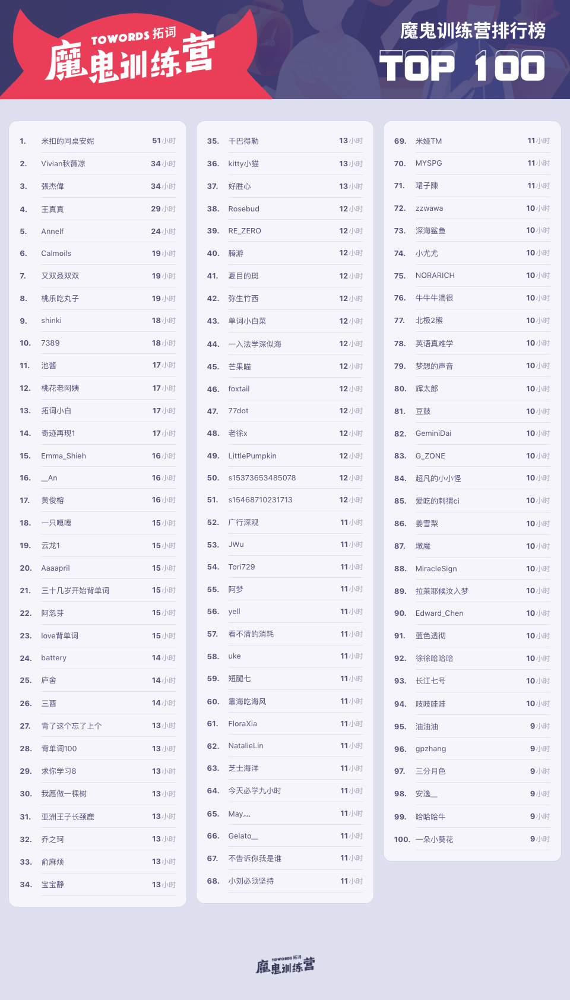
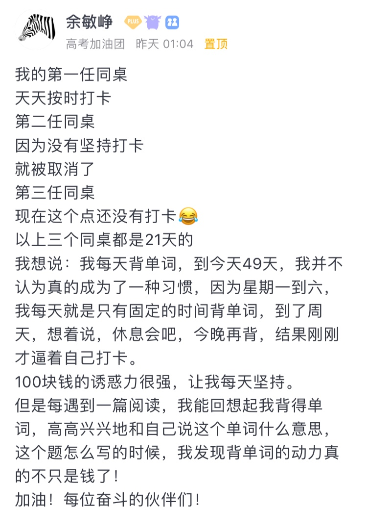
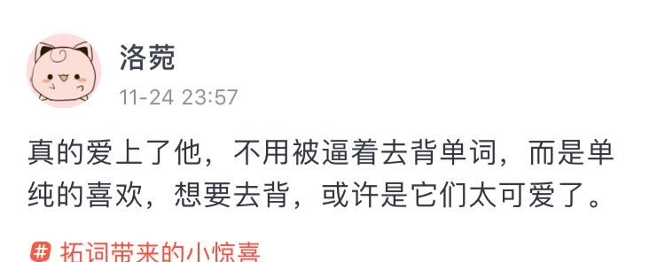
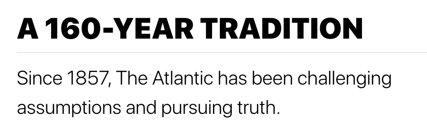
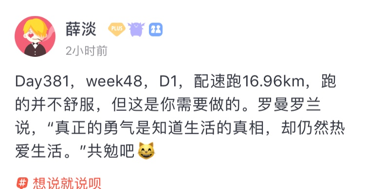
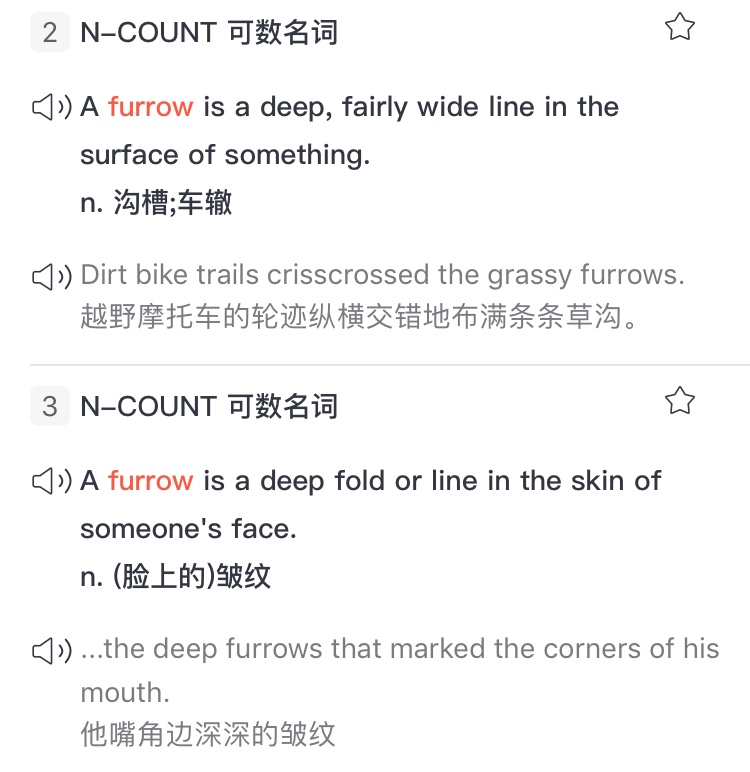
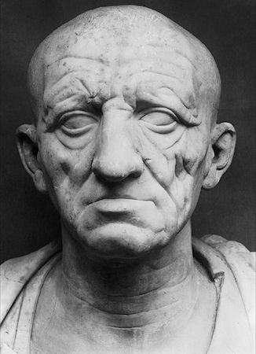

🌟人不需要活太多样子。你认真做一件事，会解释所有事 
🌟在最美好的年华，成为你自己 
🌟外刊推荐之大西洋月刊

<h1 style="color:red">壹 | 排行榜 </h1>

<h1 style="color:red">排行榜</h1>

全球榜

PS: 最新一周排行榜又来啦。后台时间统计单位为「分钟」，故「小时」排名分先后。

魔鬼营

PS: 最新一周排行榜又来啦。后台时间统计单位为「分钟」，故「小时」排名分先后。

<h1 style="color:red">贰 | 拓词快讯 </h1>

在最美好的年华，成为你自己

2000年前的罗马皇帝为什么写《沉思录》？

薛大觉得很有可能他对自己的一生也并不满意，所有才有了这本书。 还提到过往的那些名家，满意人生的似乎只有王阳明。临终之际，弟子问他有何遗言，“此心光明，亦复何言。”

如何是好?薛大说的是，“在有限的时间里把自己的事做到最好。相信只要大目标一致，时间会帮我们解决很多问题。”

「<i>人不需要活太多样子。你认真做一件事，会解释所有事</i>。」

<i>Time will take care of everything. </i>

比如背单词这件事上，关于<i>动力</i>的变化

感知“<i>好现象</i>”

“<i>单纯的喜欢</i>”

眼看自己<i>稳步前进，这种成就感太美好</i>

<h1 style="color:red">叁 | Nora小栈 </h1>

魔鬼营外刊精读|Atlantic Monthly大西洋月刊

最早知道《大西洋月刊》是从一篇报道里：

1999年5月从耶鲁毕业之后，我在北京的一所高中当英文老师——这是一份我既喜欢又擅长的工作。然而，作为一名耶鲁毕业生，我感到这份工作的薪水与地位都太低了。于是我成为了一名记者。在耶鲁学习英文文学专业的时候，我十分享受写作。然而，我的目标不是享受工作，而是获得成功——这意味着给《纽约客》（New Yorker）与<b>《大西洋月刊》（Atlantic Monthly）</b>等最出名的美国刊物写文章。

<small>《耶鲁没交给我的三件事》·《纽约时报》</small>

关于《纽约客》倒是更早知道，电影Letters to Juliet里女主角的身份是《纽约客》 的调查员，喜欢电影里意大利的阳光和美景，以及结局里的那段台词

" 'What'and 'if'are two words as non-threatening as words can be.
But put them side by side and they have the power to haunt you for the rest of your life……
you need only the courage to follow your heart "

对于耶鲁文学专业毕业生而言，获得成功意味着给《纽约客》（New Yorker）与<b>《大西洋月刊》（Atlantic Monthly）</b>等最出名的美国刊物写文章。<b>Atlantic Monthly</b>的地位不言自明。

<i>It is one of the finest magazines in the English-speaking world.</i> 

报道新闻态度克制，中立不偏激，一如它自己的介绍

像是站在宇宙看地球的纷纷扰扰，人间百态

<b>Look for the truth</b> above looking for a story.  
<b>Continue to explore</b> rather than imagining we're arrived.  
<b>Go beyond</b> what happens to what matters.  
<b>Embrace a diversity</b> of perspectives.  
<b>Immerse</b> ourselves, and our audience, in the world——instead of escaping from it. 

出自<i>大西洋月刊</i>官网

<!-- 报道新闻态度克制中立不偏激的，除了上次提到的《基督教科学箴言报》，还有《大西洋月刊》，它们都是近年来考研的热门题源。  -->

<!-- 这期的魔鬼营精读课选的也是《大西洋月刊》，是获得美国国家杂志奖次数最多的月刊。 -->

关于这本杂志， 它谈天文、自然、政治、科技，有人说美国的文化和精神在这里；关于内容，文笔和腔调俱佳，无偏见无党派也不失幽默有趣。

它的超然于物外看世间百态，就像爱默生一样。同样是写自然，梭罗写的是人间，爱默生更高远，容纳了天地。

不意外《大西洋月刊》的创始人居然包括<b>爱默生</b>，他的title很多:

梭罗的好朋友； 
哲学家； 
文学家； 
当年最受欢迎的演讲者； 
他的文章《美国学者》被誉为美国思想的“独立宣言” 
...

这本杂志始于1857年。 
美国内战1861年至1865年。  
还有那时期的工业革命。

多复杂，不言而喻。社会动荡、移民、欧洲启蒙思想….

这样混乱的时代，它以独立的姿态出现，似乎“应运而生”，来帮助这个年轻的国家解决正在面临的问题。

<h6>废除奴隶制度</h6>

It was the first to publish pieces by the abolitionists Julia Ward Howe ("Battle Hymn of the Republic" on February 1, 1862),   
Ralph Waldo Emerson, in “American Civilization,” calls for the emancipation of slaves, and praises President Abraham Lincoln for his principled moves in that direction.  
and William Parker, whose slave narrative, "The Freedman's Story" was published in February and March 1866. 

<h6>保护自然</h6>

AUGUST 1897  
In the same issue, John Muir argues passionately, in “The American Forests,”  for the central role federal government must play in the preservation of nature, later <b>inspiring President Theodore Roosevelt to establish the National Park Service</b>.

犯罪学里的破窗效应也是最早由Atlantic Monthly引入

MARCH 1982  
James Q. Wilson and George L. Kelling publish “Broken Windows,” which would go on to—for better and for worse, some might argue—define the next three decades of criminology, and continues to remain influential, and hotly debated, today.

《大西洋月刊》的供稿者有哪些人？梭罗，海明威，马克吐温等名家。Robert Frost的诗<i>The Road Not Taken</i>也最早刊登在Atlantic Monthly上。

读者有谁呢？东方的读者最早可以追溯到民国。

20世纪，东方人林语堂向西方介绍中国，英文著作《吾国与吾民》在美国引起“林语堂热”。

同时代，东方上海有一群文人，其中也包括林语堂，也办了一个杂志《天下月刊》，用英文向全世界介绍中国的文明，也引入西方的杂志内容，其中就包括《大西洋月刊》。

某种意义上来说，那本叫《大西洋月刊》的杂志，它不仅改变着美国，还引领着时代。

读它，可以是为了考试，比如考研，也是了解世界不可多得的途径之一

<h5>彩蛋</h5>

诗人Robert Frost说，没有什么是这3个字解释不了的

In three words I can sum up everything I've learned about life: it goes on.

就像薛大提到的

 

There is only one heroism in the world: to see the world as it is, and to love it. 

<small>罗曼罗兰</small>

 

你也这样认同吗？ words have the power to change us。

没有多余的字，倒是里面可能藏着你不知道的秘密。知道这些秘密，这些小细节，都能满足我小小的情绪，让我开心好一阵。 

例如英语的furrow帮我解锁过杜甫的诗。

英语里furrow指的是，车走过之后在地上走过的浅沟，也用来指皱纹。

怎样的皱纹呢？可能和这位罗马老人的皱纹很相似

Janson在他写的艺术史里描述这位罗马贵族就用过wrinkling furrows。 看到这里一下子就明白杜甫为何会写出莫<i>莫自使泪枯，收汝泪纵横</i>这样看似奇怪的句子了。

<i>长使英雄泪满襟</i>是泪往下流，打湿了衣裳。横着流要如何理解？

大概是因为脸上的皱纹，眼泪所以横着流。可以让眼泪横着流，不可能是细细的纹路，两三条也不够。这样的人，必定不再年轻，所以才叫老泪纵横吧。

或许还有一种可能，哭得纵情毫不克制，好像脸变形了一般，于是有了这样的沟壑。

往期回顾：
<a href="https://www.topschool.com/towords/tarticle/index.html?article_id=37" style="color:#FF4855;font-size:14px;display:block">拓词小报·魔鬼营周报第一期</a>
<a href="https://www.topschool.com/towords/tarticle/index.html?article_id=39" style="color:#FF4855;font-size:14px;display:block">拓词小报·魔鬼营周报第二期</a>
<a href="https://www.topschool.com/towords/tarticle/index.html?article_id=41" style="color:#FF4855;font-size:14px;display:block">拓词小报·魔鬼营周报第三期</a>
<a href="https://www.topschool.com/towords/tarticle/index.html?article_id=42" style="color:#FF4855;font-size:14px;display:block">拓词小报·魔鬼营周报第四期</a>
<a href="https://www.topschool.com/towords/tarticle/index.html?article_id=43" style="color:#FF4855;font-size:14px;display:block">拓词小报·魔鬼营周报第五期</a>
<a href="https://www.topschool.com/towords/tarticle/index.html?article_id=44" style="color:#FF4855;font-size:14px;display:block">拓词小报·魔鬼营周报第六期</a>	
<a href="https://www.topschool.com/towords/tarticle/index.html?article_id=45" style="color:#FF4855;font-size:14px;display:block">拓词小报·魔鬼营周报第七期</a>
<a href="https://www.topschool.com/towords/tarticle/index.html?article_id=55" style="color:#FF4855;font-size:14px;display:block">拓词小报·魔鬼营周报第八期</a>
<a href="https://www.topschool.com/towords/tarticle/index.html?article_id=56" style="color:#FF4855;font-size:14px;display:block">拓词小报·魔鬼营周报第九期</a>
<a href="https://www.topschool.com/towords/tarticle/index.html?article_id=59" style="color:#FF4855;font-size:14px;display:block">拓词小报·魔鬼营周报第十期</a>
<a href="https://www.topschool.com/towords/tarticle/index.html?article_id=66" style="color:#FF4855;font-size:14px;display:block">拓词小报·魔鬼营周报第十一期</a>
<a href="https://www.topschool.com/towords/tarticle/index.html?article_id=67" style="color:#FF4855;font-size:14px;display:block">拓词小报·魔鬼营周报第十二期</a>
<a href="https://www.topschool.com/towords/tarticle/index.html?article_id=70" style="color:#FF4855;font-size:14px;display:block">拓词小报·魔鬼营周报第十三期</a>
<a href="https://www.topschool.com/towords/tarticle/index.html?article_id=73" style="color:#FF4855;font-size:14px;display:block">拓词小报·魔鬼营周报第十四期</a>
<a href="https://www.topschool.com/towords/tarticle/index.html?article_id=74" style="color:#FF4855;font-size:14px;display:block">拓词小报·魔鬼营周报第十五期</a>
<a href="https://www.topschool.com/towords/tarticle/index.html?article_id=75" style="color:#FF4855;font-size:14px;display:block">拓词小报·魔鬼营周报第十六期</a>
<a href="https://www.topschool.com/towords/tarticle/index.html?article_id=76" style="color:#FF4855;font-size:14px;display:block">拓词小报·魔鬼营周报第十七期</a>
<a href="https://www.topschool.com/towords/tarticle/index.html?article_id=77" style="color:#FF4855;font-size:14px;display:block">拓词小报·魔鬼营周报第十八期</a>
<a href="https://www.topschool.com/towords/tarticle/index.html?article_id=78" style="color:#FF4855;font-size:14px;display:block">拓词小报·魔鬼营周报第十九期</a>
<a href="https://www.topschool.com/towords/tarticle/index.html?article_id=80" style="color:#FF4855;font-size:14px;display:block">拓词小报·魔鬼营周报第二十期</a>
<a href="https://www.topschool.com/towords/tarticle/index.html?article_id=82" style="color:#FF4855;font-size:14px;display:block">拓词小报·魔鬼营周报第二十一期</a>
<a href="https://www.topschool.com/towords/tarticle/index.html?article_id=83" style="color:#FF4855;font-size:14px;display:block">拓词小报·魔鬼营周报第二十二期</a>
<a href="https://www.topschool.com/towords/weekly/23.html" style="color:#FF4855;font-size:14px;display:block">拓词小报·魔鬼营周报第二十三期</a>
<a href="https://www.topschool.com/towords/weekly/24.html" style="color:#FF4855;font-size:14px;display:block">拓词小报·魔鬼营周报第二十四期</a>
<a href="https://www.topschool.com/towords/weekly/25.html" style="color:#FF4855;font-size:14px;display:block">拓词小报·魔鬼营周报第二十五期</a>
<a href="https://www.topschool.com/towords/weekly/26.html" style="color:#FF4855;font-size:14px;display:block">拓词小报·魔鬼营周报第二十六期</a>
<a href="https://www.topschool.com/towords/weekly/27.html" style="color:#FF4855;font-size:14px;display:block">拓词小报·魔鬼营周报第二十七期</a>
<a href="https://www.topschool.com/towords/weekly/28.html" style="color:#FF4855;font-size:14px;display:block">拓词小报·魔鬼营周报第二十八期</a>
<a href="https://www.topschool.com/towords/weekly/29.html" style="color:#FF4855;font-size:14px;display:block">拓词小报·魔鬼营周报第二十九期</a>
<a href="https://www.topschool.com/towords/weekly/30.html" style="color:#FF4855;font-size:14px;display:block">拓词小报·魔鬼营周报第三十期</a>

	
