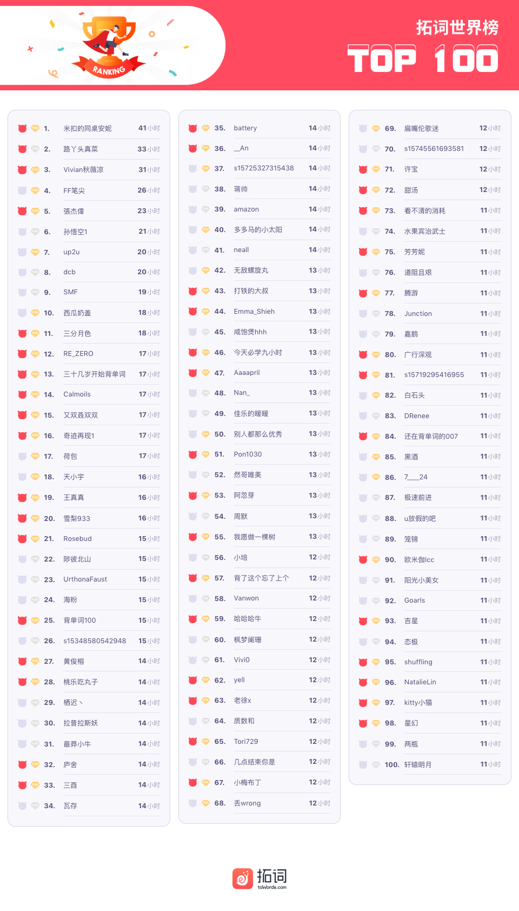
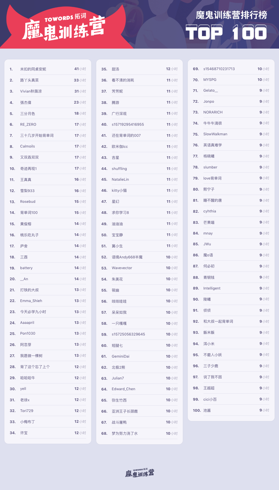
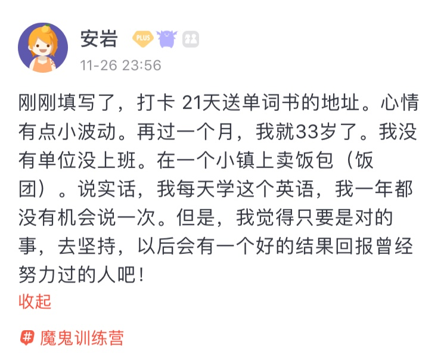
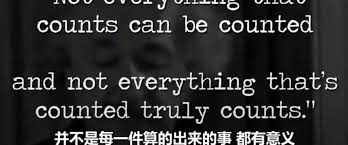
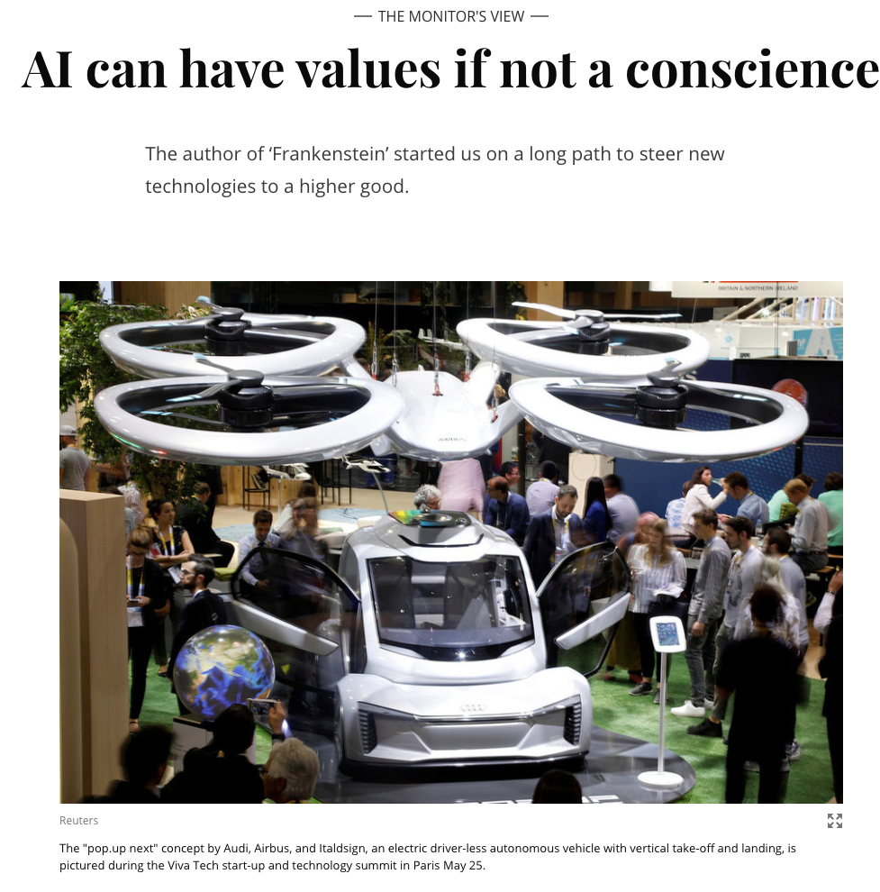
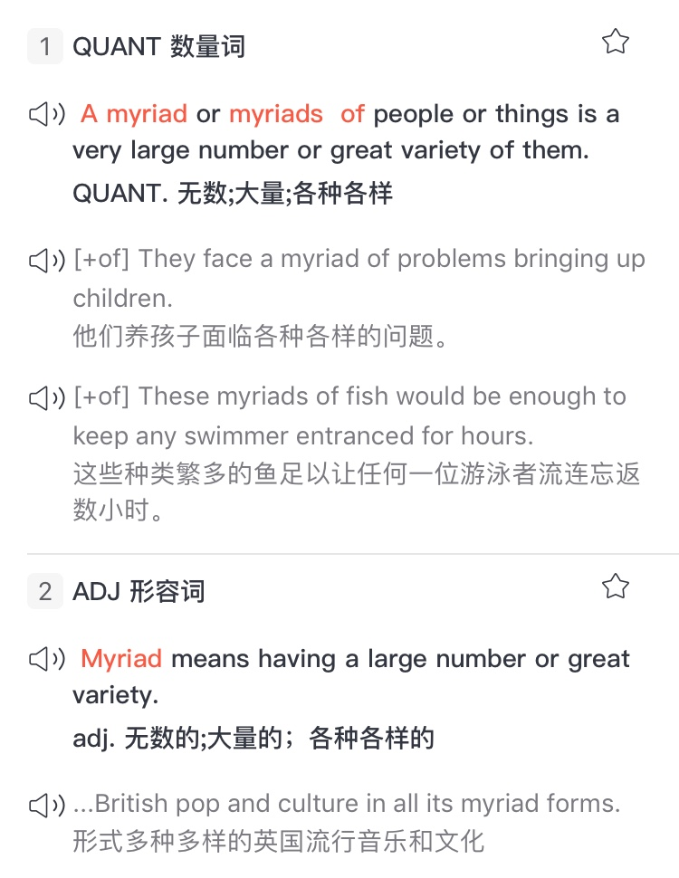
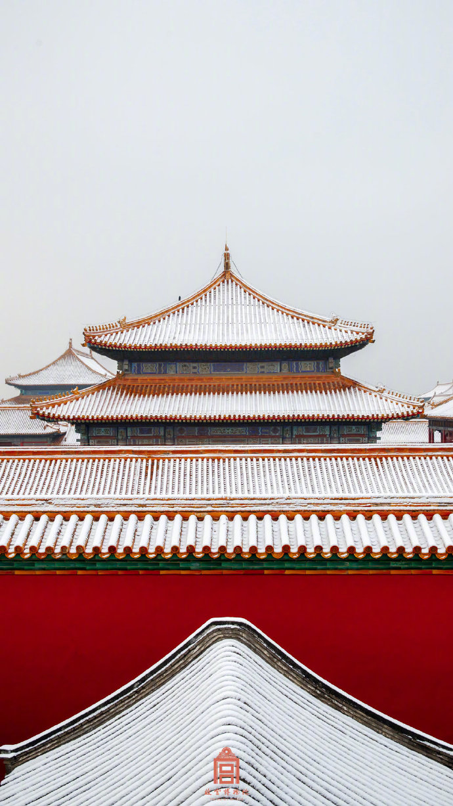

🌟细微之处出精彩 
🌟12月，空气非常寒冷，但似乎有雪的味道 
🌟在你自己的时区里，其实一切都很准时

<h1 style="color:red">壹 | 排行榜 </h1>

<h1 style="color:red">排行榜</h1>

全球榜

PS: 最新一周排行榜又来啦。后台时间统计单位为「分钟」，故「小时」排名分先后。

魔鬼营

PS: 最新一周排行榜又来啦。后台时间统计单位为「分钟」，故「小时」排名分先后。

<h1 style="color:red">贰 | 拓词快讯 </h1>

在你自己的时区里，其实一切都很准时

My Country and My People曾有这么一句

For the Chinese the end of life lies in the enjoyment of a simple life, especially the family life, and in harmonious social relationships. It is so brilliantly simple. 

<small>-林语堂</small>

林语堂那时眼中的大部分中国人，他们的生命终极目标是enjoyment of a simple life——享受生活。
好似可以解释古人好雅致，而非实用，中外的饮食差别这么一想也说得通了。

说来学知识也是如此，可能最大的愿望并不是成为顶尖，而是这样——生活会因此更美更好，「会有一个好的结果回报曾经努力过的人吧！」

Nora时常觉得好似这个时代太“吵闹”和“夸张”。用来“夸赞”人的“成功”、“努力”、“励志”，常觉得是用力打造出的标签，很少嗅到一点enjoyment。

倒是很向往木心先生说的「冷冷清清的风风火火」。在自己的一方世界，被岁月“打磨”，也“打磨”自己，「岁月不饶人，我亦未曾饶过岁月」。

关于那些大命题，比如人生或者成功，Nora更喜欢这样的定义。

There is only one success – to be able to spend your life in your own way.
这世上只有一种成功，就是能够用自己喜欢的方式度过自己的一生。

<small>Christopher Morley</small>

哪有那么多太迟了，都是刚刚好。

「在你自己的时区里，其实一切都很准时」。 

最后分享一个最近看到的演讲，视频以及部分文字如下：

<small>视频"在你自己的时区里，其实一切都很准时"</small>

I know people who graduated at 21 and didn't get a job until they were 27. I know people who graduated late at 25 and they found work immediately. I know people who never went to university, but found what they love at 18. 
有的人21岁毕业，到27岁才找到工作。有的人25岁才毕业，但马上就找到了工作。有的人没上过大学，却在18岁就找到了热爱的事。

I know people who found a job straight out of college making decent money, but hate what they do. I know people who took gap years and found their purpose. I know people who were so sure about what they were going to do at 16, they change their mind at 26. 有的人毕业就找到好工作，赚很多钱，却过得不开心。有的人选择间隔年，去寻找自我。有的人在16岁就清楚知道自己要什么，但在26岁时改变了想法。

I know people who have children but are single, and I know people who are married but had to wait 8 to 10 years to have children. I know people in relationships who love someone else. I know people who love each other but aren’t together. 有的人有了孩子，却还是单身。有的人结了婚，却等了10年才生孩子。有的人身处一段感情，爱的却是别人。有的人明明彼此相爱，却没有在一起。

So my point is everything in life happens according to our time, our clock. You may look at some of your friends and think that they’re ahead of you, maybe some of them you feel are behind, but everything happens at their own pace. They have their own time and clock and so do you. 我想说的是，人生中的每一件事都取决于我们自己的时间。你身边有些朋友也许遥遥领先于你。有些朋友也许落后于你，但凡事都有它自己的节奏。他们有他们的节奏，你有你自己的。

Be patient.　Don’t let anyone rush you with their time lines. Because as Einstein said, “ Not everything that counts can be counted and not everything that’s counted truly counts.” 耐心一点。不要让任何人扰乱你的时间表。因为爱因斯坦曾经说过：并不是每一件算的出来的事，都有意义，也不是每一件有意义的事，都能够被算出来。

And this is the most important thing, I want you to be able to create meaningful, purposeful fulfilling lives for yourselves and learn how to use that to make an impact and a difference in the lives of others. That will be true success. 这才是最重要的事，我希望你们可以创造属于自己的充满意义的人生，学会用这些去影响点亮他人的生活。这才是真正的成功。

<h1 style="color:red">叁 | Nora小栈 </h1>

除了Elsa,这些迪士尼公主也值得你拥有

2013年，迪士尼动画电影《冰雪奇缘》横空出世，风靡全球。

不仅横扫了包括奥斯卡、BAFTA在内的全球各大奖项，还以近13亿美元票房成为2013年全球票房年度冠军，更是一举刷新动画电影影史纪录。

6年过去了，主题曲《Let it go》仍在耳畔回响。

有多少憧憬城堡公主的小女孩，依然想像Elsa一样当一回女王。

作为第12部迪士尼公主电影，迪士尼终于在《冰雪奇缘》中颠覆了它以往的套路：

<b>公主不需要被男人拯救，她自己本身就是女王</b>。

<b>一见钟情是不靠谱的，王子也可能是笑里藏刀的反派</b>。

<b>真爱之吻不需要来源于爱情，也可以来源于亲情......</b>

<i>正因此，今天上映的《冰雪奇缘2》承载了影迷太多期待</i>。

不光是在北美和国内受欢迎，上映当天就有韩国导演集体抗议《冰雪奇缘2》在韩国影院垄断式排片。

<b>但是，我们经常忘记迪斯尼系列的其他公主。让我们来看看这5个被遗忘的迪斯尼公主</b>。

<h5>01 Princess Megara </h5>

成为迪士尼公主的一种可接受的方法是嫁给迪士尼王子。蜜儿在迪士尼的女主人公中是独一无二的，因为她不仅对爱情不感兴趣，而且积极反对这个想法，因为一段糟糕的感情让蜜儿付出了生命的代价。这对一位迪士尼公主来说可能很有趣，但《大力士海格力斯》在影院的表现喜忧参半，所以蜜儿从未入选。

Megara, more commonly known as Meg, appears as the love interest of Hercules who is the son of the Olympian King of Gods Zeus, in the movie Hercules, and all the other films and TV series style on Hercules. Though her family background remains unmentioned in the series, and she comes across as a commoner who became a princess by virtue of marriage (Hercules the animated series), Greek mythology suggests she is the daughter of Creon, the King of Thebes, and is thus a princess by birth. She is intelligent, atypically unromantic yet flirtatious, and world-weary, and is a significant part of the story. Megara is therefore worthy of being crowned as one of the memorable Disney Princesses.

 

<h5>02 Princess Tiger Lily</h5>

身为酋长的女儿并不能使茉莉成为公主，在电影中，她的台词也少了很多。迪士尼公主应该拥有小女孩可以效仿的个人优势。茉莉就很勇敢，即使自己的生命危在旦夕，她也拒绝告诉虎克船长彼得潘的藏身之处。

Tiger Lily is featured in the film Peter Pan as the daughter of the Native Chief of an Indian group. There should not be a doubt about her being a princess, because Pocahontas, too, has a similar lineage as hers, and she is an official Disney Princess. However, Tiger Lily gets far less lines in the movie. She is Peter Pan's friend, and loves to have fun. That she is royal is quite evident from her attitude, because most of the times, she has her head held high and her nose turned up, in a snobbish way. But this is more because of her being proud and brave, rather than being a pampered royal child. She is also stoic and flirtatious, and is ready to keep a secret to help her friend.

 

<h5>03
Princess Kida Nedakh</h5>

Nedakh出现在电影《亚特兰蒂斯:失落的帝国》及其续集，与大多数迪士尼公主不同，姬塔是一个强大的战士。在电影结束时成为了女王，这是迪士尼公主的另一件稀世珍品。可惜的是电影表现不佳，阻碍了她成为正式迪士尼公主的机会。

Kidagakash “Kida” Nedakh appears in the film Atlantis: The Lost Empire, and its sequel. She is the daughter of Kashekim Nedakh, the King of Atlantis, and hence, a princess by birth. She evertually becomes the queen, with the death of her father, which could possibly be the reason for her not being an official Disney Princess, though she has all the other characteristics that would make her perfect. Unlike other Disney princesses, she is a formidable warrior, and is intelligent, energetic, and even aggressive when she is required to be so. She also has a unique sense of style, with her hair being white with a tied off section, and blue tattoo beneath her eye. She is kind and caring, too.

 

<h5>04
Princess Giselle</h5> 

吉赛尔是迪士尼公主中唯一一个从动画角色开始，然后过渡到她电影中的真人角色的人。《魔法奇缘》模仿了许多迪士尼公主的故事，和赛尔本人就像灰姑娘、白雪公主和其他人一样甜美、善良和天真。吉赛尔差点成为迪士尼的官方公主。她成为迪士尼公主品牌的一部分，需要获得女演员艾米亚当斯的终身肖像权。

Giselle, the princess of Andalasia, and then, ends up in the tough world of New York, due to the conspiracy of the wicked Queen Narissa, the step-mother of her prince of dreams Edward. Sweet, pristine and inexperienced, she is described as “eternally optimistic and romantic” but is also “very independent and true to her convictions”. In fact, her character was designed to be a combination of Snow White, Cinderella, Sleeping beauty and Little Mermaid. She is “about 80% Snow White, with some traits borrowed from Cinderella and Princess Aurora… although her spunky attitude comes from Ariel a.k.a. The Little Mermaid.” She retains her chastity even amidst earthly complexities.

 

<h5>05
Princess Melody</h5>

每个人都喜欢小美人鱼，但是有多少人知道这部电影有续集呢?在电影《小美人鱼II:回到大海》中，公主旋律是主角。她是爱丽儿的女儿。虽然她继承了父亲的黑头发、浓浓的眉毛和蓝眼睛，但她有着母亲的性格特征。她聪明、顽皮、爱玩乐。她也很勇敢和冒险，尽管她也有点害羞。她也非常擅长游泳，而且速度非常快，因为她有部分美人鱼的血统。她讨厌规则，具有讽刺意味的是，她是一个希望成为美人鱼的人，变成了一个魔法的美人鱼。

Everybody loves the Little Mermaid, but how many are aware that there is a sequel to the movie? Princess Melody is the protagonist in the film The Little Mermaid II: Return to the Sea. She is the daughter of Ariel. While she has inherited the black hair, thick eyebrows and blue eyes from her father, Prince Eric, she has the personality traits of her mother. She is intelligent, mischievous, and fun-loving. She is also quite brave and adventurous, though she is a little shy, as well. She is also greatly skilled at swimming, and has great speed, because of her partial mermaid heritage. She hates rules and ironically, she is a human wishing to be a mermaid, and becomes a mermaid by magic.

 

  
<h1 style="color:red">魔鬼营| 精读课 </h1>
 

表达数量上，越往小词似乎越丰富，比如“略微”、“几许“、“一丝”等，而表示数量大的词好像少了些精致感。 

Nora看英文时候也有同样的感觉。不过这次精读课遇到的myriad表示很多已经算很有意境了。

原文是选自2019年考研英语一阅读三，来自《基督教科学箴言报》。

AI或机器人像人类一样思考?时间还远，不过不可避免的是AI开发涉及到伦理道德的问题。就像《弗兰克斯坦》，就像克隆羊多利，就像基因改造的婴儿...

说到AI开发可能会涉及到伦理道德问题，用的就是myriad

This year marks exactly two centuries since the publication of “Frankenstein; or, The Modern Prometheus,” by Mary Shelley. Even before the invention of the electric light bulb, the author produced a remarkable work of speculative fiction that would foreshadow <mark>myriad</mark> ethical questions to be spawned by technologies yet to come.

myriad的'多'自然是比many的意向更细致，下面的例子就可以看出来

🌰 Among the <b>myriad</b> threats to China's continued economic expansion, education is one of the most pressing.  
<small>中国经济持续发展面临的<b>无数</b>挑战中，教育是最为严峻的挑战之一。</small>
 🌰 For a <b>myriad</b> reasons, both technical and political, financial market regulation is never going to be strigent enough in booms.  
<small>由于<b>种种</b>原因，不管是方法上还是政治角度去考虑，在经济繁荣时期，对金融市场的监管永远都不会过于严格。</small> 🌰 Mr. Toyota pledged to get his hands dirty by zooming in on <b>myriad</b> issues. 
<small>丰田章男誓言要亲力亲为，关注各种<b>繁多</b>的事务。</small>

 

就词源来说，myriad在希腊语里是the greatest number in Greek expressed by one word， 是10，000.对古人来说， 成千上万应该属于很大的数量了， 所以后来引申为无数、大量。

比去myriad， Nora更愿意收藏英语里那些表示“一点点”的用法，比如a touch of和中文里的“沾点边”的感觉很像，可以翻译成一些、几许、一抹...

🌰 When in an hour they crowded into a cab to go home， I strolled idly to my club. I was perhaps a little lonely， and it was with <b>a touch of</b> <i>envy</i> that I thought of the pleasant family life of which I had had a glimpse.   
一个钟头以后，这一家挤上一辆马车回家去了，我也一个人懒散地往俱乐部踱去。我也许感到有一点寂寞， 回想我刚才瞥见的这种幸福家庭生活，心里不无艳羡之感。

<small>出自《月亮与六便士》</small>

🌰 Pappy's friend eyed him for a moment and said, "how about Cal? You want him don't you?" there was <b>a touch of</b> <i>amusement</i> in his voice. 
Pappy的朋友看了他一阵儿说，“那Cal怎么办，你要抓他，对吗？“他的声音中带有<b>一丝</b><i>兴奋</i>的语调。

类似的还有tinge, 《西南联大英文课》的<i>The End of Life</i>，林语堂讲一年四季他最喜欢秋天就说了， it is tinged a little with sorrow and a premonition of death

 I like spring, but it is too young. I like summer, but it is too proud. So I like best of all autumn, because its leaves are a little yellow, its tone mellower, its colors richer, and it is <b>tinged</b> a little with sorrow and a premonition of death. 

tinge本是说轻微地上色，文人眼里的秋天不正是多多少少总有些伤心的色彩，所以是be tinged with sorrow.

表示略微和少许都可以试一试be tinged with。比如声音里带有一种微微忧郁的口气可以是 The voice is <b>tinged with</b> a faint note of <i>melancholy</i>。

面对困难，虽然害怕但是依然有一丝倔强和坚定 This fear was <b>tinged with</b> a bit of <i>belief</i>. 

名词的tinge也有这个意味在，表示“一点点”:

🌰 If you say no, you feel <b>a tinge of</b> <i>guilt</i>.  
如果你对他们说“不”，你会觉得<b>有点</b><i>罪恶感</i>。  
🌰 When that happens, I feel both <b>a tinge of</b> <i>sadness</i> but also a sense of pride that I played at least a part in its history.  
在这种时候， 我既会有<b>一丝</b><i>感伤</i>，也会感到骄傲——我至少曾在它们的历史上扮演过一定的角色。

<h1 style="color:red">彩蛋  </h1>

11月末，北京初雪。一夜之间，北京变成了北平。
 

12月的北京， 空气非常寒冷，但似乎有雪的味道。

There was a bite in the air, a smell perhaps of snow. 
空气非常寒冷，但似乎有雪的味道。

「十二月，

就是这样的月份，

在生命弧度的底部，

等待一场雪轻轻覆盖下来」。

