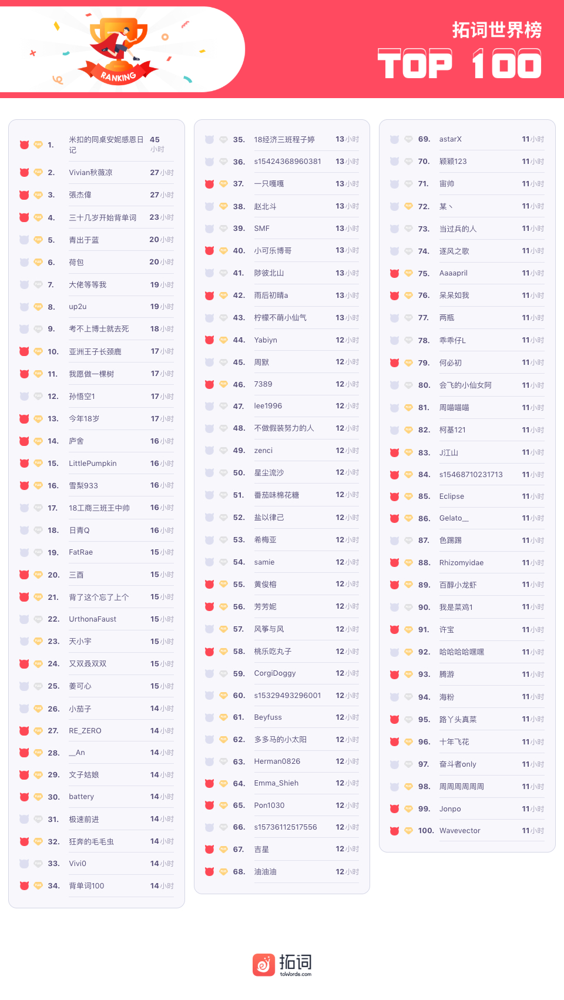
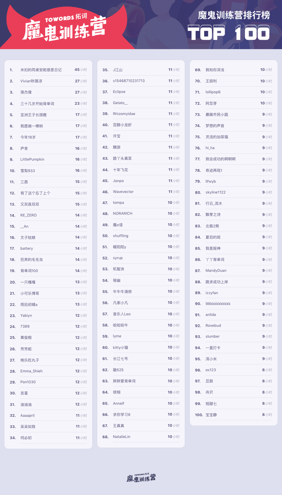
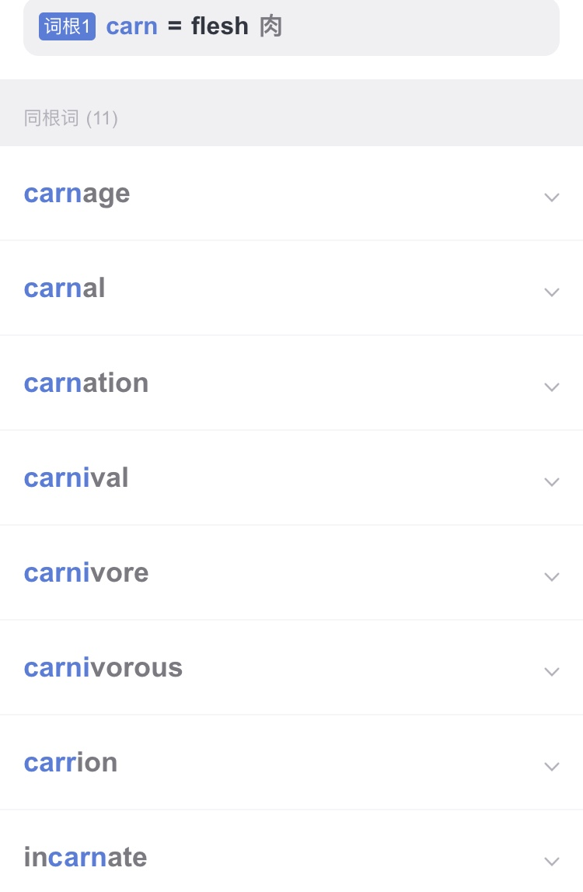
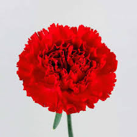
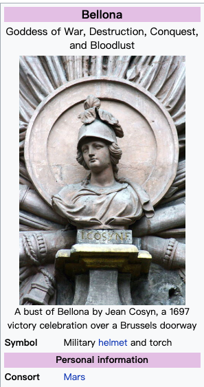
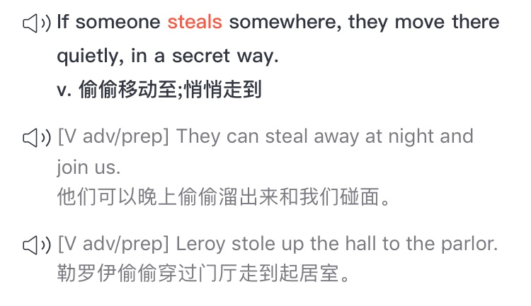
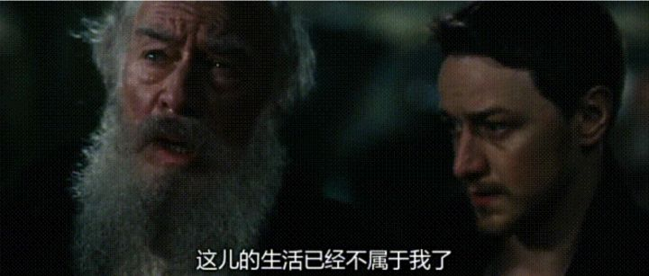

🌟但凡辛苦，皆为礼物 
🌟电影中的诗 
🌟吾爱世人，更爱自然 

<h1 style="color:red">壹 | 排行榜 </h1>

<h1 style="color:red">排行榜</h1>

全球榜

PS: 最新一周排行榜又来啦。后台时间统计单位为「分钟」，故「小时」排名分先后。

魔鬼营

PS: 最新一周排行榜又来啦。后台时间统计单位为「分钟」，故「小时」排名分先后。

<h1 style="color:red">贰 | 拓词快讯 </h1>

<h5>词根带来的小惊喜</h5>

爱默生讲莎士比亚戏剧，做过这样的划分

he could divide the mother's part from the father's part in the face of the child.

若当年的观众和后来的读者是他的孩子， 莎翁让他的戏剧或是母亲属性，或是父亲属性。 

那些温暖与爱，如<i>仲夏夜之梦</i>，似在说这个世界真实“精彩极了”。

那些冰冷和残忍，如四大悲剧，是不是在说这个世界“糟糕透了”。

不仅莎翁的戏剧如此，所用的文字也是如此，也自带属性。 

<i>麦克白</i>有这样的台词：

No, this my hand will rather <b>incarnadine</b> the multitudinous seas, making the green one red. 

in<b>carn</b>dadine，to make <b>flesh</b>-colored，把一样东西染成<b>血肉</b>的颜色。也对应了后面的making the green one red的<b>red</b>。 

即麦克白要大开杀戒，<b>谋害</b>他的王，<b>篡位</b>登基，从一个骁勇善战的将军堕落成为暴君...

<b>词根carn</b>的英文解释是<b>flesh</b>，表示<b>肉</b>，也可指<b>肉红色</b>、<b>红色</b>，看同根词便可知一二：

在看<b>carn</b>ival，算是轻量级的“酒池<b>肉</b>林”？

<b>carn</b>ation，康乃馨果如其（英文）名。

<i>哈姆雷特</i>Act 2 Scene 2里有这样的一句， 

His antique sword, <b>Rebellious</b> to his arm,  lies where it falls. 

说的是古代宝剑也不好使，落在了地上。 

不好使，估计是说剑和人无法心手相应，可以理解为心和手是背道而驰，对于对抗状态，这里用的是rebellious。

<b>词根bell</b>表示<b>war</b>，和<b>罗马女神Bellona</b>有关，是<b>战神Mars</b>的妻子， 外号"城市的毁灭者"。

战神一家承包了英语一大片战争有关的单词。 很多跟战争、斗争有关的词都与bell有关。 

比如re<b>bel</b>、re<b>bel</b>lion、<b>bel</b>licose和<b>bel</b>ligerent等等。

也有不少与女战神的丈夫<b>Mars</b>有关，比如<b>mar</b>tial和<b>mar</b>ch。

另外，莎翁四大悲剧之一的<i>麦克白</i>最开始对<i>麦克白</i>的介绍是，"<b>Bellona</b>'s bridegroom"。

都和<b>战神Mars</b>相提并论了，自然是说作为将军，<i>麦克白</i>的<b>武力值</b>极高，<b>骁勇善战</b>。

除了大片大片记单词，词根还可以帮助解读诗歌，帮助精进语言能力。

比如以下的interview如何解释才合适？

I love not Man the less, but Nature more, 
From these our <b>interviews</b>, in which I steal 
From all I may be, or have been before, 
To mingle with the Universe, and feel 
What I can ne’er express, yet cannot all conceal. 

<small>来自拜伦的《哈罗德漫游记》</small>

自然不能当作采访来看，从单词的本源倒是可以察觉作者想要表达的意思。 

inter表示之间， view表示看着。有点像中文里的面面相觑的最字面意思，互相看着。 

这里诗人想说的是——因为每天见无数的人，接受这样那样的注视，不堪甚扰，想偷偷溜走(steal)

"批量"记单词、更懂诗和莎翁戏剧等，撇开这些词根词缀还有给你哪些小惊喜😊？

<h1 style="color:red">叁 | Nora小栈 </h1>

电影里的诗

你是否也有同样的感受，有些电影，明明平平淡淡但是又无比震撼，久久不能忘怀。在Nora这里， 《荒野生存》（Into the Wild）算一部。

生于富裕家庭的年轻人，在大学毕业后，放弃了自己的所有，身无分文地踏上征途放逐自我。两年后，他在阿拉斯加的荒原上死去。

电影改编于真人真事。是怎样的人呢？台词里倒是有一份解读。

He risked what could have been a relentlessly lonely path from writers like Tolstoy, Jack London and Thoreau. but found company in the characters of the books he loved. 
他冒险踏上一条残酷孤独的道路，却在他钟爱的书籍中找到同路知己。他喜爱托尔斯泰，杰克·伦敦和梭罗。

<small>台词出自电影<i>Into The Wild</i></small>

 

<i>一人去崇拜一个偶像， 其实是在利用这个偶像的一些形象， 来告诉别人“我是什么样的人”。</i>

82岁的<b>托尔斯泰</b>离家出走，最后因病去世，在一个小车站被发现。

Dear Sonia:  亲爱的索尼娅：  
The discord existing between my life and my convictions has long been tormenting me. I could not compel you to change your [mode of] life, the habits which I myself had fostered in you ; 
nor could I leave you before now, fearing to deprive the children while 
young of what slight influence I might have over them and thus grieving 
you.   
我的生活与我的宗教信仰的不一致已经折磨我很久了，我不能强迫你们改变你们的生活，改变我让你们养成的习惯，到现在为止我也不能离开你们。
我想，我不能在孩子们还小的时候夺取那些我能够给他们的影响，即便这些影响很小，但我还是要伤你们的心了。  
But to continue living as I have lived these sixteen years — now 
wrangling with and irritating you, now myself yielding to the temptations 
of the environment to which I have grown accustomed — is equally impos- 
sible. <i>Hence I have decided to do now what I have long wished to do: to 
go away</i>;   
我再也不能继续像我这六十年以来的生活，时而抗争并激怒你们，时而又陷于那些将我包围的诱惑中，我再也不想这样了，<i>所以我决定，现在就做我早就想做的事——离开</i>。

<small>节选自托尔斯泰给妻子的信</small>

 

<small>图片出自托尔斯泰传记电影《最后一站》</small>

<b>梭罗</b>，出走都市2年，独居瓦尔登湖边上。 

I delight to come to my bearings -- not walk in procession with pomp and parade, in a conspicuous place, but to walk even with the Builder of the universe, if I may -- not to live in this restless, nervous, bustling, trivial Nineteenth Century. 
我愿我行我素，不愿涂脂抹粉，招摇过市，我也不愿---我不愿生活在这个不安的、神经质的、忙乱的、琐细的世纪生活中，宁可或立或坐，沉思着，听任这世纪过去。

<small>出自<i>瓦尔登湖</i></small>

<b>杰克伦敦</b>的小说《野性的呼唤》，讲的是主角历经艰险，最终回归大自然的故事。 

若要给这次出走找一个理由，应该是主人公在电影里引用的梭罗的一句话：

Rather than love, than money, than faith, than fame, than fairness, give me truth. 
不要爱情，不要金钱，不要信仰，不要名誉，不要公平，只求给我真相。

一如配乐society的歌词所写

When you want more than you have 
You think you need 
And when you think more than you want 
Your thoughts begin to bleed 
当你终日为了欲求羁绊，而你的欲望多过了需要，你的思想便开始流血。

电影开头的诗也别有深意

There is a pleasure in the pathless woods.  
There is a rapture in the lonely shore.  There is a society where none intrudes.  By the deep sea, and music in its roar.  I love not man the less, but nature more.   
无径之林，常有情趣。 无人之岸，几多惊喜。 岸畔崖间，鼓涛为乐。 无人驻足，是为桃源。 吾爱世人，自然甚之。

<small>出自诗人拜伦</small>

于Nora而言，电影很好。

“看透”了生活，抛下一切出走，是勇士。 

但认清生活真相之后

依然热爱生活，是英雄。

<h1 style="color:red">所谓辛苦 | 皆为礼物 </h1>

有大师说过，所谓功利无非图快捷或是利益。比如不少人会因为各种各样的原因，去选择这样或者那样的速成班速成课。

但你我心知肚明，天下的好东西真的可以速成吗？

the rarest of all human qualities is consistency.

<small>Jeremy Bentham</small>

所谓辛苦，

是你先付出（代价），

于是礼物随后而来。

No price is too high to pay for the privilege of owning yourself. 

Friedrich Nietzsche

你所获得的（才能），

所享受的（“特权”），

都是你能付得起代价的而已。

 

往期回顾：
<a href="https://www.topschool.com/towords/tarticle/index.html?article_id=37" style="color:#FF4855;font-size:14px;display:block">拓词小报·魔鬼营周报第一期</a>
<a href="https://www.topschool.com/towords/tarticle/index.html?article_id=39" style="color:#FF4855;font-size:14px;display:block">拓词小报·魔鬼营周报第二期</a>
<a href="https://www.topschool.com/towords/tarticle/index.html?article_id=41" style="color:#FF4855;font-size:14px;display:block">拓词小报·魔鬼营周报第三期</a>
<a href="https://www.topschool.com/towords/tarticle/index.html?article_id=42" style="color:#FF4855;font-size:14px;display:block">拓词小报·魔鬼营周报第四期</a>
<a href="https://www.topschool.com/towords/tarticle/index.html?article_id=43" style="color:#FF4855;font-size:14px;display:block">拓词小报·魔鬼营周报第五期</a>
<a href="https://www.topschool.com/towords/tarticle/index.html?article_id=44" style="color:#FF4855;font-size:14px;display:block">拓词小报·魔鬼营周报第六期</a>	
<a href="https://www.topschool.com/towords/tarticle/index.html?article_id=45" style="color:#FF4855;font-size:14px;display:block">拓词小报·魔鬼营周报第七期</a>
<a href="https://www.topschool.com/towords/tarticle/index.html?article_id=55" style="color:#FF4855;font-size:14px;display:block">拓词小报·魔鬼营周报第八期</a>
<a href="https://www.topschool.com/towords/tarticle/index.html?article_id=56" style="color:#FF4855;font-size:14px;display:block">拓词小报·魔鬼营周报第九期</a>
<a href="https://www.topschool.com/towords/tarticle/index.html?article_id=59" style="color:#FF4855;font-size:14px;display:block">拓词小报·魔鬼营周报第十期</a>
<a href="https://www.topschool.com/towords/tarticle/index.html?article_id=66" style="color:#FF4855;font-size:14px;display:block">拓词小报·魔鬼营周报第十一期</a>
<a href="https://www.topschool.com/towords/tarticle/index.html?article_id=67" style="color:#FF4855;font-size:14px;display:block">拓词小报·魔鬼营周报第十二期</a>
<a href="https://www.topschool.com/towords/tarticle/index.html?article_id=70" style="color:#FF4855;font-size:14px;display:block">拓词小报·魔鬼营周报第十三期</a>
<a href="https://www.topschool.com/towords/tarticle/index.html?article_id=73" style="color:#FF4855;font-size:14px;display:block">拓词小报·魔鬼营周报第十四期</a>
<a href="https://www.topschool.com/towords/tarticle/index.html?article_id=74" style="color:#FF4855;font-size:14px;display:block">拓词小报·魔鬼营周报第十五期</a>
<a href="https://www.topschool.com/towords/tarticle/index.html?article_id=75" style="color:#FF4855;font-size:14px;display:block">拓词小报·魔鬼营周报第十六期</a>
<a href="https://www.topschool.com/towords/tarticle/index.html?article_id=76" style="color:#FF4855;font-size:14px;display:block">拓词小报·魔鬼营周报第十七期</a>
<a href="https://www.topschool.com/towords/tarticle/index.html?article_id=77" style="color:#FF4855;font-size:14px;display:block">拓词小报·魔鬼营周报第十八期</a>
<a href="https://www.topschool.com/towords/tarticle/index.html?article_id=78" style="color:#FF4855;font-size:14px;display:block">拓词小报·魔鬼营周报第十九期</a>
<a href="https://www.topschool.com/towords/tarticle/index.html?article_id=80" style="color:#FF4855;font-size:14px;display:block">拓词小报·魔鬼营周报第二十期</a>
<a href="https://www.topschool.com/towords/tarticle/index.html?article_id=82" style="color:#FF4855;font-size:14px;display:block">拓词小报·魔鬼营周报第二十一期</a>
<a href="https://www.topschool.com/towords/tarticle/index.html?article_id=83" style="color:#FF4855;font-size:14px;display:block">拓词小报·魔鬼营周报第二十二期</a>
<a href="/s/weekly/23.html" style="color:#FF4855;font-size:14px;display:block">拓词小报·魔鬼营周报第二十三期</a>
<a href="/s/weekly/24.html" style="color:#FF4855;font-size:14px;display:block">拓词小报·魔鬼营周报第二十四期</a>
<a href="/s/weekly/25.html" style="color:#FF4855;font-size:14px;display:block">拓词小报·魔鬼营周报第二十五期</a>
<a href="/s/weekly/26.html" style="color:#FF4855;font-size:14px;display:block">拓词小报·魔鬼营周报第二十六期</a>
<a href="/s/weekly/27.html" style="color:#FF4855;font-size:14px;display:block">拓词小报·魔鬼营周报第二十七期</a>
<a href="/s/weekly/28.html" style="color:#FF4855;font-size:14px;display:block">拓词小报·魔鬼营周报第二十八期</a>
<a href="/s/weekly/29.html" style="color:#FF4855;font-size:14px;display:block">拓词小报·魔鬼营周报第二十九期</a>
<a href="/s/weekly/30.html" style="color:#FF4855;font-size:14px;display:block">拓词小报·魔鬼营周报第三十期</a>
<a href="/s/weekly/31.html" style="color:#FF4855;font-size:14px;display:block">拓词小报·魔鬼营周报第三十一期</a>
<a href="/s/weekly/32.html" style="color:#FF4855;font-size:14px;display:block">拓词小报·魔鬼营周报第三十二期</a>

