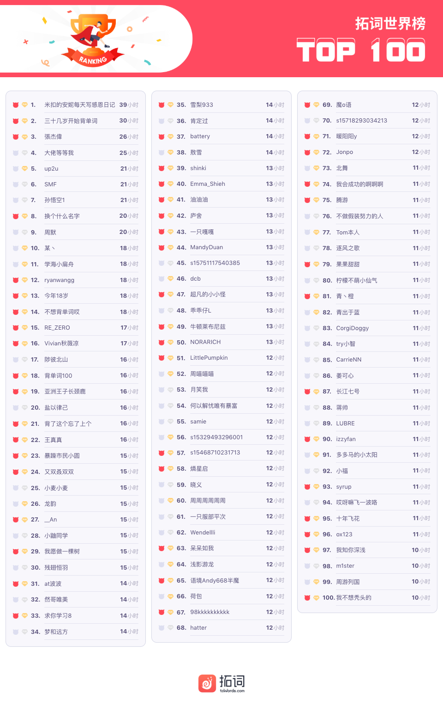
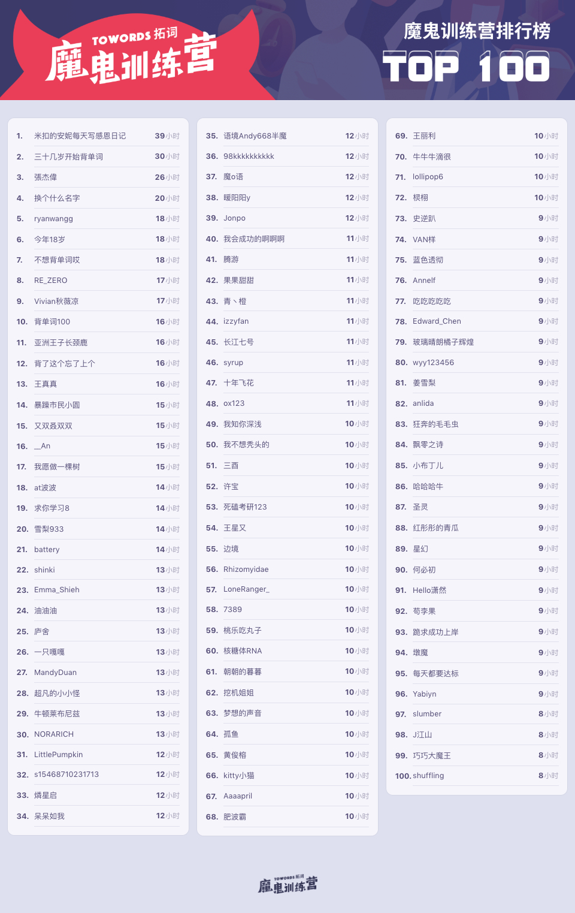
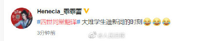
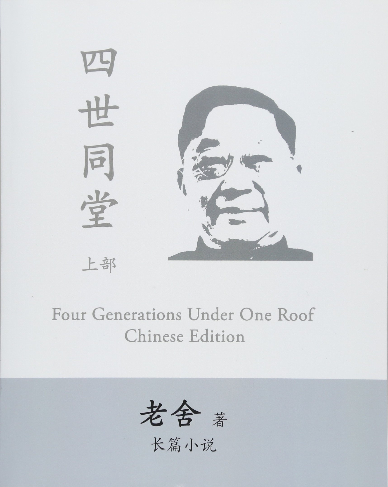
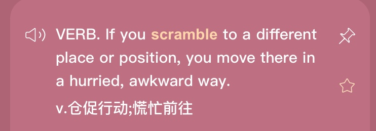
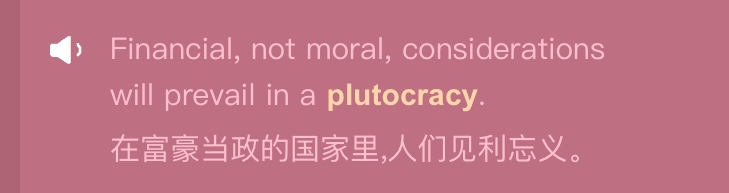
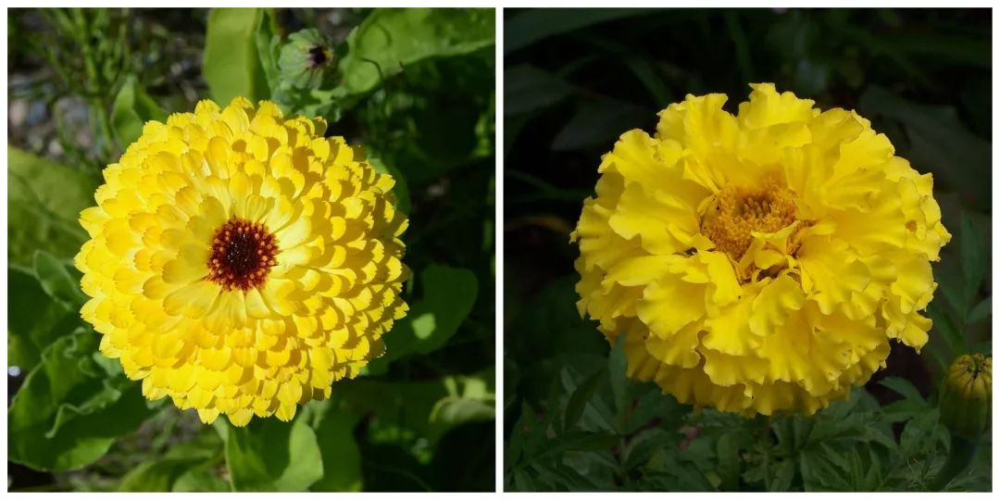

🌟四六级考试你贡献过的神翻译___？ 
🌟你的生活是我远道而来的梦想 
🌟我心中有个北平，可是我说不出来

<h1 style="color:red">壹 | 排行榜 </h1>

<h1 style="color:red">排行榜</h1>

全球榜

PS: 最新一周排行榜又来啦。后台时间统计单位为「分钟」，故「小时」排名分先后。

魔鬼营

PS: 最新一周排行榜又来啦。后台时间统计单位为「分钟」，故「小时」排名分先后。

<h1 style="color:red">贰 | 拓词快讯 </h1>

拓友带来的小惊喜

关于语言的发展，有这样的观点：「使用」才是词存活的关键，而且使用永远重于理论。 

传统也是如此，被留下来的定是对当下有益的，或许我们也正在创作未来的传统。 

工具也是如此，得好用才行。不仅成人、初高中可以，小孩子也可以用

国外的英文考试okay

国内的英语标准化考试也是

<h1 style="color:red">叁 | Nora小栈 </h1>

四六级考试你贡献过的神翻译___？

四级翻译又翻车了？

今年的四级考试，你有没有贡献神翻译？😂

到底该咋说？

<i>新闻</i>里会有这样的描述 <b>four generations living under one roof</b>.

新闻里的说法有好几种。比如12月2号<i>CNN某条新闻</i>：<b>4 generations of a family</b> killed on a hunting trip. 

<i>BBC</i>有 <b>Four successive generations of the family</b>，也有用<b>a four-generation family</b>的外刊。

还有<b>multigenerational households/families</b>的概念。

还有作家<i>老舍</i>的名篇<i>《四世同堂》</i> <b>Four Generations Under One Roof</b>

不止于四级，以上供参考的翻译其实可以有延伸

<i>爱默生</i>评价<i>莎士比亚</i>的戏剧，有这样的一句

He clothed the creatures of his legend with form and sentiments, as if they were people who had lived <b>under his roof</b>; and few real men have left such distinct characters as these fictions.

这里的as if they were people who had lived <i>under his roof</i>，说的是莎翁好像和他笔下的传奇人物<i>在一个屋檐下生活</i>过一样。

比如<i>Salon</i>有提到这样一句，

Most warriors are in their late teens or early 20s; by the time they’ve died, three more generations have come of age, suggesting, if Toynbee was right, <b>a four-generation gap</b> between “great wars.”

再如大家讲起戏剧<i>罗密欧与朱丽叶</i>， 说男主角和女主角两家是

<i>families at war <b>for many generations</b></i>

说他们的爱情悲剧是

<i>tragic love destroyed by family hatreds has endured <b>from generation to generation</b></i>

那世仇、宿怨，这种长期积累下来的情绪是不是也可以借鉴以上来翻译咧？

再啰嗦一点点，来自nora的个人感觉，越是上好的英文，和中文一比较，越觉相似和契合。比如丘吉尔的文字：

I soon <b>scrambled</b> out on the other side, and found myself surrounded by an agitated crowd of younger boys. 

在拓词搜索scramble, 第2条释义是：

If you <b>scramble</b> to a different place or position, you move there in a <i>hurried</i>, <i>awkward</i> way.

很迅速、笨拙又狼狈，和丘吉尔的文字场景也契合。 若是翻译成中文代替<i>手脚并用</i>恰恰好，搜单词图片更是瞬间就能明了。

若是从中文译向英文，很有可能会特别长，而且是<b>scramble</b>的可能性特别低。那种紧急情况下发生的<i>连滚带爬</i>用<b>scramble</b>好像也挺合适，属于<i>hurried</i>, <i>awkward</i>的范畴，而且也是手和脚一起用。

所以nora觉得有些很好很好的翻译呀，放中文放英文都不造作的那种，不是刻意求来的🤣。看拓词柯林斯的例句，有些中英文对照倒是越看越妥帖，例如👇下面的<i>见利忘义</i>

 

<h1 style="color:red">你的生活|是我远道而来的梦想
  </h1>

我心中有个北平，可是我说不出来

空气非常寒冷，似乎有雪的味道。北京又下雪了，小兔子嚷嚷着说要去故宫看雪。 

似乎北京的好，一下雪就格外明显。北京的好，我有点说不上来，说得出的好像都太肤浅🤦‍♀️。

林语堂1937年发表在《<i>纽约时报</i>》的<i>Captive Peiping Holds the Soul</i>写的是：

<i>Peiping is like a grand old tree</i>, whose roots stretch deep into the earth and draw substenance from it....  <i>How can a Peiping resident describe Peiping, so old and so grand</i>?

老舍也说过类似的话，<i>我心中有个北平，可是我说不出来</i>

There is a Beijing in my heart, but I can't articulate it.

倒是两个人都写了关于北京的书，林语堂的<i>Moment in Peking京华烟云</i>，老舍有<i>四世同堂</i>。

国际声誉上，林语堂首先是一个英文作家，老舍是中文作家。

林语堂曾自我介绍：“<i>我的长处是对外国人讲中国文化，而对中国人讲外国文化</i>。”

林语堂出生于福建，爸爸是乡村的牧师，小时候接触的第一本书是英文的圣经，小学和中学上的都是教会学校， 大学读的是上海圣约翰大学神学系。

大学毕业的林语堂，<i>英文卓越，中文一般</i>。自传里，他描述初到北京：

“因为我上教会学校，把国文忽略了。结果是中文弄得仅仅<i>半通</i>……我当时就那样投身到中国的文化中心北平，你想象我的窘态吧。”

<small>出自林语堂</small>

到北京之后，林语堂花了很多功夫去研究中国的传统文化，还“顺便”翻译了《<i>红楼梦</i>》 

首先，我看《<i>红楼梦</i>》，借此学北京话。 袭人和晴雯的语言之美，使多少想写白话的中国人感到脸上无光。

<small>出自林语堂</small>

林语堂的一生，在美国待的时间最长。某种意义上，林语堂对于北京或者中国古典文化的了解，属于“刻意练习”之后的“后天习得”，和老舍的情况自然不同。

都德说法语最美不切实际，是因为他就会这一种语言。一样地，若是说想了解北平或者去知晓传统的中国文化，看一个作者估计也不够。

综合不同背景的人写的文字，可能会更全面，比如像林语堂和老舍这两位大师。甚至也可以看外国人写的中国，比如作家<i>毛姆</i>、<i>赛珍珠</i>还有<i>Nora Waln</i>等。

夏天Nora在日签里提到过这位同名的作家，她的<i>Flower Diary花事记忆</i>被收录在<i>《西南联大英文课》</i>。

Nora Waln20多岁时，从美国前往中国，去的是她的养母家，养母是当时中国某个大家族的当家主母。她在养母家生活了12年。

Nora Waln的小说<i>The House of Exile</i>，写的是中国大家族的生活，内容依照了她在中国的生活经历。 

里面有很多关于中国的细碎往事，比如在Flower Diary里讲中国文化里<i>每个月份都有当令的花草</i>：

According to Chinese legend, <i>a flower presides over each month of the year</i>, celebrating her anniversary on the fifth day after the rise of the new moon. 

<small>出自<i>Nora Waln</i>的<i>Flower Diary</i></small></i>

就连<i>华</i>夏的来源，也似乎也有花有关。

在古代，花不叫花，叫<i>华</i>。<i>说文解字</i>里，没有花，但是有<i>华</i>。 诗经说，「桃之夭夭灼灼其<i>华</i>」。四字成语「<i>荣华富贵</i>」，<i>富贵</i>自然相应，<i>荣华</i>也是。<i>荣</i>可对应白居易的诗<i>离离原上草，一岁一枯<b>荣</b></i>。 「春<i>华</i>秋实」也是，春秋、华实各自相对。

书里所写，<i>一月</i><b>水仙</b>当令，<i>二月</i><b>紫罗兰</b>，<i>三月</i><b>桃花</b>。

<b>Narcissus</b> is hostess of the <i>first month</i>,  <b>violet</b> of the <i>second</i>,  <b>peach blossom</b> of the <i>third</i>,  which is a favorite month for weddings. 

<small>出自<i>Nora Waln</i>的<i>Flower Diary</i></small></i>

<i>四月</i><b>牡丹</b>盛开，却是<b>蔷薇花</b>当令。 

或许是因为<b>牡丹</b>花太<i>强势富贵</i>，不如<i>走入寻常百姓家</i>的<b>蔷薇花</b>。

<b>Peony</b> gives her name to the <i>fourth month</i>,  but <b>rose</b> presides over the month.  
This is <b>because</b> “the peony is the <i>millionaire's flower</i>,  <b>symbol of</b> <i><u>riches and power</u></i>;  <b>but</b> the lovely <i>rose belongs to everyone</i>,  as she graces cottage and palace impartially with her beauty”. 

<small>出自<i>Nora Waln</i>的<i>Flower Diary</i></small></i>

<i>五月</i>是<b>茉莉花</b>。

<i>六月</i>当令的是<b>莲花</b>，代表<i>高洁</i>。2019年12月14日的<b>六级翻译</b>题里的<i>荷花出淤泥而不染</i>怎么翻译？Nora Waln的这段描写倒是完美对应上了。

 The <b>lotus</b>, <b>symbol of</b> <i>purity</i> because she <u><i>grows out of the mud and is not soiled</i></u>.

<i>七月</i>是可以入药的<b>凤仙花</b>。 

<i>八月</i><b>桂花</b>香。 

<i>九月</i>是<b>菊</b>。

文人雅士爱菊，Nora Waln用<i>beloved</i>来写，倒是有几分宠爱的感觉，一下子觉得<i>一本正经</i>的文人们还挺<i>可爱有趣</i>😂。

The gentle <b>jasmine</b> is hostess of the <i>fifth month</i>. <b> The lotus</b>, <b>symbol of</b> <i>purity</i> because  she <u><i>grows out of the mud</i> and is <i>not soiled</i></u>,  reigns over the <i>sixth month</i>;  <b>balsam</b>, famous for <i><u>healing virtues</u></i>, over the <i>seventh</i>;  <b>cassia flower</b>, so <i><u>small but so fragrant</u></i>, over the <i>eighth</i>;  <b>chrysanthemum</b>, <i><u>beloved of scholars</u></i>, over the <i>ninth</i>. 

<small>出自<i>Nora Waln</i>的<i>Flower Diary</i></small></i>

<i>十月</i><b>万寿菊</b>，常被误译为金盏花。金盏花叫做Pot Marigod，有时候pot会被省略。其实两者差别挺大的（看叶子）。

<small>左边: 金盏花|右边:万寿菊</small>

<i>十一月</i>，<b>山茶</b>当令。

<i>十二月</i>，<b>梅花</b>。 

 
Bright cheerful <b>marigold</b> is hostess of the <i>tenth month</i>;  <b>camellia</b> of the <i>eleventh</i>;  the flowering winter <b>plum</b>,  whose petals are like the snowflakes,  of the <i>twelfth</i>. 

<small>出自<i>Nora Waln</i>的<i>Flower Diary</i></small></i>

恰如Nora Waln所写，花草之于中国人，从古至今一直都是饱含深意。

从<b>离骚</b>的<i>香草、美人</i>到<b>牡丹亭</b>的<i>如花美眷,似水流年</i>，从<i>岁寒三友</i>到<i>梅妻鹤子</i>...

 
<b>Poetry</b> and <b>art</b> through the centuries have endowed each <i>tree</i>, <i>vine</i>, and <i>plant</i> with <b>a symbolic significance</b>, and the cultured are guided by this in their arrangement. 

<small>出自<i>Nora Waln</i>的<i>Flower Diary</i></small></i>

连赏花都如此，不意外传统中国人还有赏月听雨的闲情雅致。

电影《<i>无问西东</i>》最打动Nora的是<i>静坐听雨</i>那一幕：虽是乱世下的悠闲，反而透露出一种笃定。

有时候呀，看似无用的事，比如这种悠闲，反而让人更专注。 

Nora是，古人的文字越看心越静，当代的好多书，却是越看越心乱。

那时候的人，多"闲"呀😂。

愿意花时间守着花开；听一场雨，等空气清明；会相约赏花等月圆、等雪来。可是也是他们，才是林语堂笔下的经典中国人。 

Nora也想成为这样的人，时刻自然流露<i>松弛感，人一点都不紧绷</i>。

<i>江山风月，本无常主，闲者便是主人</i>。

不紧张、从容自然的这种<i>悠闲</i>，其实是一种<i>主宰感</i>。

愿你也是如此，2020年考研要来了，<i>笃定</i>如你，加油 (ง •̀_•́)ง

往期回顾：
<a href="https://www.topschool.com/towords/tarticle/index.html?article_id=37" style="color:#FF4855;font-size:14px;display:block">拓词小报·魔鬼营周报第一期</a>
<a href="https://www.topschool.com/towords/tarticle/index.html?article_id=39" style="color:#FF4855;font-size:14px;display:block">拓词小报·魔鬼营周报第二期</a>
<a href="https://www.topschool.com/towords/tarticle/index.html?article_id=41" style="color:#FF4855;font-size:14px;display:block">拓词小报·魔鬼营周报第三期</a>
<a href="https://www.topschool.com/towords/tarticle/index.html?article_id=42" style="color:#FF4855;font-size:14px;display:block">拓词小报·魔鬼营周报第四期</a>
<a href="https://www.topschool.com/towords/tarticle/index.html?article_id=43" style="color:#FF4855;font-size:14px;display:block">拓词小报·魔鬼营周报第五期</a>
<a href="https://www.topschool.com/towords/tarticle/index.html?article_id=44" style="color:#FF4855;font-size:14px;display:block">拓词小报·魔鬼营周报第六期</a>	
<a href="https://www.topschool.com/towords/tarticle/index.html?article_id=45" style="color:#FF4855;font-size:14px;display:block">拓词小报·魔鬼营周报第七期</a>
<a href="https://www.topschool.com/towords/tarticle/index.html?article_id=55" style="color:#FF4855;font-size:14px;display:block">拓词小报·魔鬼营周报第八期</a>
<a href="https://www.topschool.com/towords/tarticle/index.html?article_id=56" style="color:#FF4855;font-size:14px;display:block">拓词小报·魔鬼营周报第九期</a>
<a href="https://www.topschool.com/towords/tarticle/index.html?article_id=59" style="color:#FF4855;font-size:14px;display:block">拓词小报·魔鬼营周报第十期</a>
<a href="https://www.topschool.com/towords/tarticle/index.html?article_id=66" style="color:#FF4855;font-size:14px;display:block">拓词小报·魔鬼营周报第十一期</a>
<a href="https://www.topschool.com/towords/tarticle/index.html?article_id=67" style="color:#FF4855;font-size:14px;display:block">拓词小报·魔鬼营周报第十二期</a>
<a href="https://www.topschool.com/towords/tarticle/index.html?article_id=70" style="color:#FF4855;font-size:14px;display:block">拓词小报·魔鬼营周报第十三期</a>
<a href="https://www.topschool.com/towords/tarticle/index.html?article_id=73" style="color:#FF4855;font-size:14px;display:block">拓词小报·魔鬼营周报第十四期</a>
<a href="https://www.topschool.com/towords/tarticle/index.html?article_id=74" style="color:#FF4855;font-size:14px;display:block">拓词小报·魔鬼营周报第十五期</a>
<a href="https://www.topschool.com/towords/tarticle/index.html?article_id=75" style="color:#FF4855;font-size:14px;display:block">拓词小报·魔鬼营周报第十六期</a>
<a href="https://www.topschool.com/towords/tarticle/index.html?article_id=76" style="color:#FF4855;font-size:14px;display:block">拓词小报·魔鬼营周报第十七期</a>
<a href="https://www.topschool.com/towords/tarticle/index.html?article_id=77" style="color:#FF4855;font-size:14px;display:block">拓词小报·魔鬼营周报第十八期</a>
<a href="https://www.topschool.com/towords/tarticle/index.html?article_id=78" style="color:#FF4855;font-size:14px;display:block">拓词小报·魔鬼营周报第十九期</a>
<a href="https://www.topschool.com/towords/tarticle/index.html?article_id=80" style="color:#FF4855;font-size:14px;display:block">拓词小报·魔鬼营周报第二十期</a>
<a href="https://www.topschool.com/towords/tarticle/index.html?article_id=82" style="color:#FF4855;font-size:14px;display:block">拓词小报·魔鬼营周报第二十一期</a>
<a href="https://www.topschool.com/towords/tarticle/index.html?article_id=83" style="color:#FF4855;font-size:14px;display:block">拓词小报·魔鬼营周报第二十二期</a>
<a href="/s/weekly/23.html" style="color:#FF4855;font-size:14px;display:block">拓词小报·魔鬼营周报第二十三期</a>
<a href="/s/weekly/24.html" style="color:#FF4855;font-size:14px;display:block">拓词小报·魔鬼营周报第二十四期</a>
<a href="/s/weekly/25.html" style="color:#FF4855;font-size:14px;display:block">拓词小报·魔鬼营周报第二十五期</a>
<a href="/s/weekly/26.html" style="color:#FF4855;font-size:14px;display:block">拓词小报·魔鬼营周报第二十六期</a>
<a href="/s/weekly/27.html" style="color:#FF4855;font-size:14px;display:block">拓词小报·魔鬼营周报第二十七期</a>
<a href="/s/weekly/28.html" style="color:#FF4855;font-size:14px;display:block">拓词小报·魔鬼营周报第二十八期</a>
<a href="/s/weekly/29.html" style="color:#FF4855;font-size:14px;display:block">拓词小报·魔鬼营周报第二十九期</a>
<a href="/s/weekly/30.html" style="color:#FF4855;font-size:14px;display:block">拓词小报·魔鬼营周报第三十期</a>
<a href="/s/weekly/31.html" style="color:#FF4855;font-size:14px;display:block">拓词小报·魔鬼营周报第三十一期</a>
<a href="/s/weekly/32.html" style="color:#FF4855;font-size:14px;display:block">拓词小报·魔鬼营周报第三十二期</a>
<a href="/s/weekly/33.html" style="color:#FF4855;font-size:14px;display:block">拓词小报·魔鬼营周报第三十三期</a>

