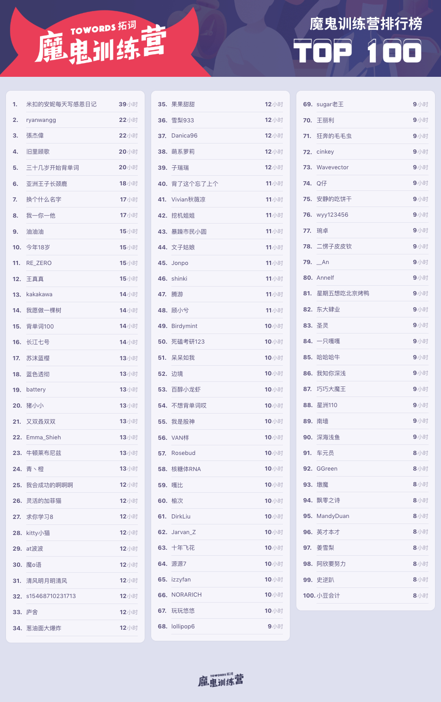
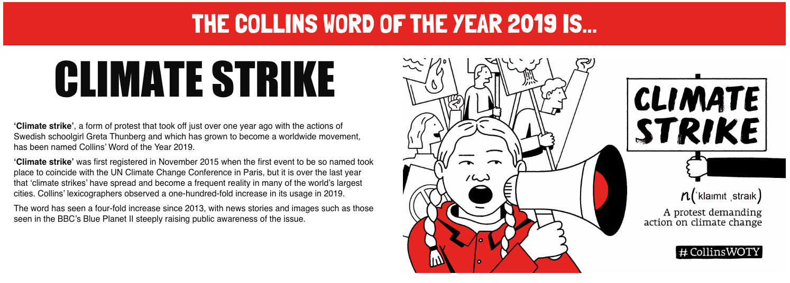
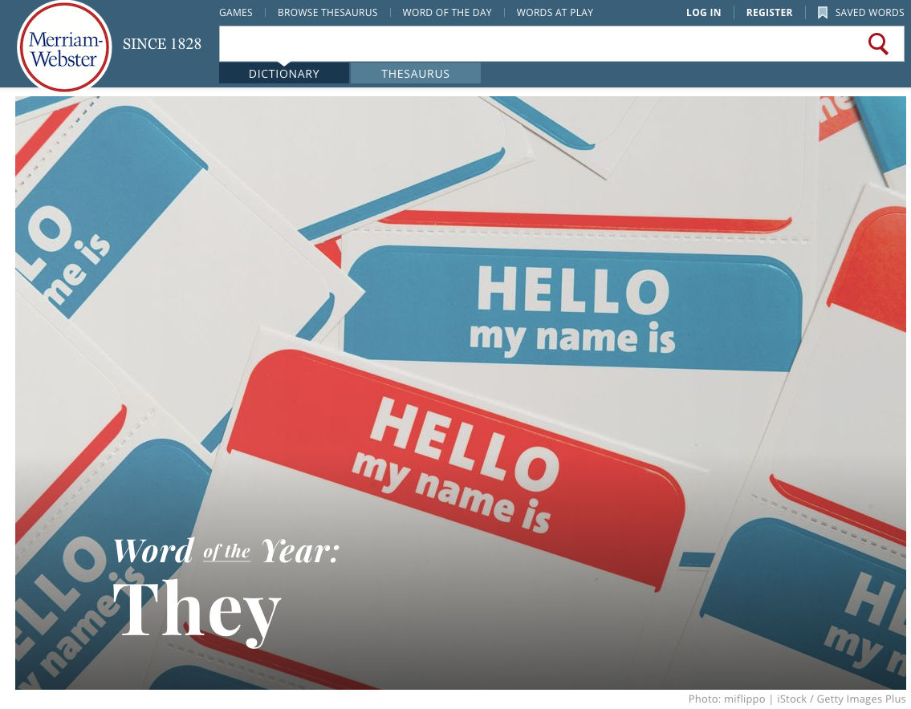
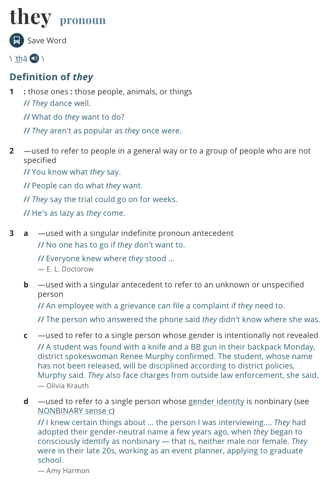
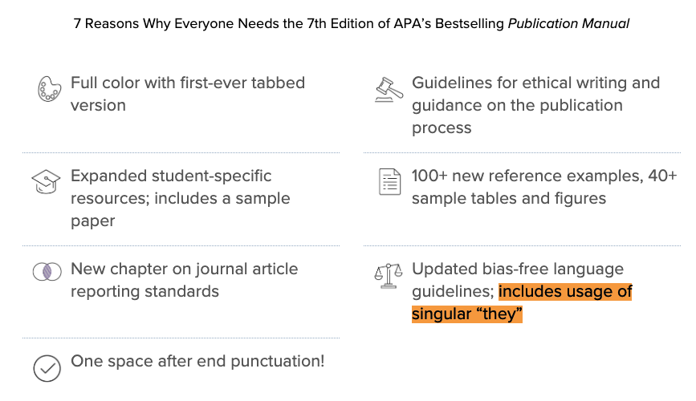
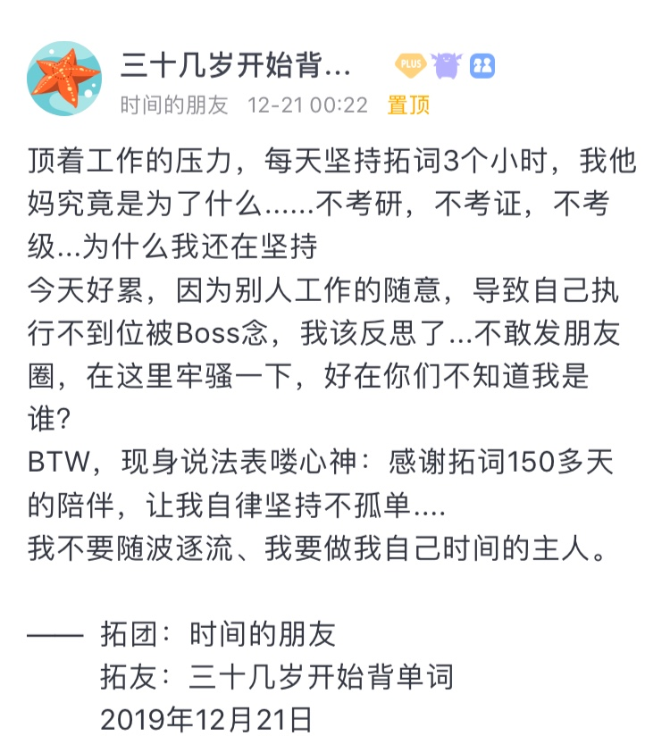
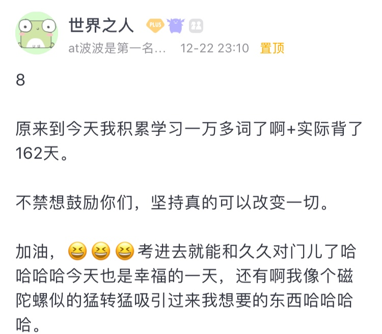

🌟2019年牛津年度英文单词 
🌟你的气质里藏着星星 
🌟人类与外星人的最佳交流语言是什么

<h1 style="color:red">壹 | 排行榜 </h1>

<h1 style="color:red">排行榜</h1>

全球榜

PS: 最新一周排行榜又来啦。后台时间统计单位为「分钟」，故「小时」排名分先后。

魔鬼营

PS: 最新一周排行榜又来啦。后台时间统计单位为「分钟」，故「小时」排名分先后。

<h1 style="color:red">贰 | 拓词快讯 </h1>

2019年度单词

柯林斯词典的年度主题词是关于气候，CLIMATE STRIKE。 

至于为什么选它，还是和数据有关系。柯林斯词典编纂者发现，与2018年相比，今年这个词的使用频率增加了100倍。

牛津字典选的是也是关于气候，CLIMATE EMERGENCY。

相比而言，标准过于“抽象”了点，“要反映社会风气、关注点，最好还有文化意义”。 

The Word of the Year citation is intended to highlight “a word or expression shown through usage evidence to <i>reflect the ethos, mood, or preoccupations of the passing year</i>, and <i>have a lasting potential as a term of cultural significance</i>.”

还真是集合了过去一年英语世界的“关注点”。

韦氏词典Merriam-Webster的年度词跟气候没有多大关系，但是和人有关，选的是THEY。

韦氏词典Merriam-Webster重新定义they，不仅可以指代<i>它们</i>，<i>她们</i>，<i>他们</i>，还可以指一个人——无特定性别者。

过去呢，he，she是单数，they表示复数。 

现在呢，he,she还是单词，they也是复数，但也可以是单数，当我们无法判断对方性别时，可用they代替he或者she。

为什么选they?其实是根据数据来的。和2018年其相比，they的搜索量增加了313%。

与其说英语they的释义又添加了一枚释义，不如说是这样的群体， gender identity is nonbinary获得了更多的关注，搜索一下相关的新闻答案就明了了。 

美国历史上首位女性印度裔国会议员普拉米拉·贾亚帕(Pramila Jayapal)，在关于《平等法》<i>Equality Act</i>的听证会上，谈到了她“性别不明”（gender-nonconforming）的孩子时使用了“they”。

My beautiful, now 22-year-old child told me last year that they were gender nonconforming.The only thought I wake up with every day is: My child is free. My child is free to be who they are, and in that freedom comes a responsibility for us as legislators to protect that freedom.

<small>出自Pramila Jaypal</small>

<!-- 歌手山姆·史密斯(Sam Smith)宣布其代词是they和them。 -->

学术论文必备参考之一的<i>APA出版手册</i>(美国心理学会出版手册)<i>Publication manual of the American Psychological Association</i>，在2020版本（第7版）里建议在学术写作中使用单数形式的they来指代性别未知者。

「语言是历史的档案柜」。

语言出现创新（新词或者新义），往往指向的是某种最新的发现、政治运动事件或者某种看法的修正。 

正因为需要作出改变，所以都直接反映在所用的词中，they就是如此。 

2019年还剩下最后的一周啦，用一句话来总结一下，你会怎么说呢？若是让Nora总结在拓词这一年的历程，大概是

绝不放弃，死磕到底； 
突破自我，成就彼此。 

也恰如拓友们自己的心得所言：
 
 

<i>2019，感谢拓友一路相伴，</i>

<i>2020，一起逐梦前行吧。</i>

 

<h1 style="color:red">叁 | 魔鬼营精读课 </h1>

人类与外星人交流的“最佳语言”是？

数学。 

Assuming that human messages actually reach their target, <u>what would earthlings and aliens talk about</u>? 

<u>The obvious subject to focus on</u> is <b>mathematics</b>; <i>its basic concepts are often assumed to be universal</i>.

选自魔鬼营1219期精读课课文<i>How to talk to aliens</i>

 

就连放给外星人听的音乐-旅行者唱片，也特意选了巴赫的曲子，是那种音乐中“蕴含着无穷和对称性的概念，具有数学的美感”，来自爱因斯坦的评价。 

旅行者金唱片（Voyager Golden Records）是一张于1977年随两艘旅行者探测器发射到太空的唱片。唱片内收录了用以表述地球上各种文化及生命的声音及图像，以期宇宙中其他外星高智慧生物发现。旅行者探测器在距今40000年后，才会从距离（彼时）最接近地球的恒星1.6光年处飞过。探测器被捕获的可能性不大，因此唱片的最终目的虽然仍是与外星人沟通，但其对人类与宇宙之间关系的象征意义更大。

<small>出自维基百科</small>

如何和外星人不尬聊？谈数学就好了。 如果欧几里、伽利略还在，估计也会同意吧。 

Mathematics is the language in which God has written the universe.

上帝是按照数学规律建立宇宙的。

― Galileo Galilei伽利略·伽利莱

 

The laws of nature are but the mathematical thoughts of God. 

自然法则不过是上帝对自然的思考。 

-Euclid欧几里得

虽然讲的是作为人类如何与外星人交谈？但是也可以当作一篇<i>如何与外国人交流指南</i>。 

Communication without a shared context is hard. 

选自魔鬼营1219期精读课课文<i>How to talk to aliens</i>

有时候同一种语言，都会发生鸡同鸭讲，对牛弹琴这样的经历。 人类与外星人，肯定也算跨物种吧，哪来的shared context做铺垫。 

懂现在的英文也不见能看明白以前的作品，比如莎翁戏剧或者乔叟的《坎特伯雷故事集》等。如《经济学人》所说，1000年前的英文已经不太适合用现代英语的方式来解读了。 

the English of just 1000 years ago is now unintelliglbe to most of its modern speakers. 

选自魔鬼营1219期精读课课文<i>How to talk to aliens</i>

虽然写的是和外星人的交流问题，倒是顺便解释了不少外语学习问题。比如人类学习语言的自然过程是怎样的，《经济学人》也给了清晰的答案。 

<h1 style="color:red"> Nora|小栈 </h1>

你来自哪颗星星

和星星有关的，中文里比较浪漫，比如很美的星星名字，北落师门。还有诗词，「人生不相见，动如参与商」，「醉后不知天在水，满船清梦压星河」。

英文里许多词的词源都和占星有关，倒是不那么写意了。 

但是东西方的古人们都会<i>向星星许愿，期待能够带来好运</i>。这个过程藏在单词<i>desire</i>里面，它的<i>拉丁语</i>来源是<b>de sidere</b>，意思是<b>from stars</b>，表示<b>期待星星带来的好运</b>，太多太多的期待，就是过多的<b>欲望</b>了。 

<b>思考</b>这件事，最早也是和<b>星星</b>有关。 那时候有专门的人（<i>钦天监</i>），<b>夜观星象</b>，再去认真<b>思考</b>其中的<i>凶兆</i>。 

<i>con</i><b>sider</b>这个词说得就是这个过程了，<b>-sider-</b>表示星星，<i>con-</i>表示不只一颗。 <i>最早的思考，由观察群星而来</i>，即<i>con</i><b>sider</b>。 

为了抵御<i>小行星</i>撞地球的威胁，科学家们应该会选择让它<i>偏离轨道</i>或者把它炸毁，从源头上解决<b>灾难</b>，此处让小行星<i>偏离轨道</i>可以帮助人类<i>免去灾难</i>。 

而古早的<b>灾难</b>，恰恰被认为是因为<i>行星脱离轨道</i>而来。 那时候认为，如果星星没有沿着既定的轨道运行，偏离了这个轨道，就会带来<b>灾难</b>。恰如<i>dis<b>aster</b></i>一词， <i>dis-</i>表示偏离，<b>aster</b>是古希腊语的星星。 

气质也和星星有关。

英武侠气，是火星。

<b>mar</b>tial adj 军人的； 
<b>Mar</b>s n. 火星

 
多愁善感，是土星。

<b>saturn</b>ine 阴郁的 
<b>saturn</b> 土星。

 
反复无常，是水星；

<b>mercur</b>ial 善变的  
<b>mercur</b>y 水星 

 

怡然自得，是木星；

<b>jov</b>ial 快乐的 
Jupiter 木星，也是罗马神话人物，又名<b>Jov</b>e 

 
混乱癫狂，是月;

<b>luna</b>tic 癫狂的 <b>luna</b> 月亮

猜猜看capricious和哪颗星有关系？