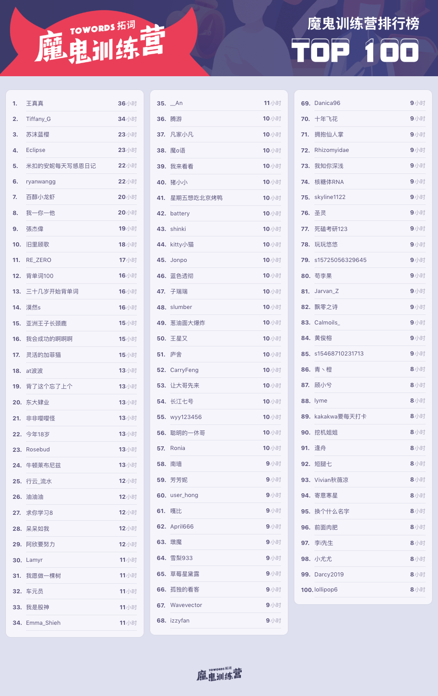
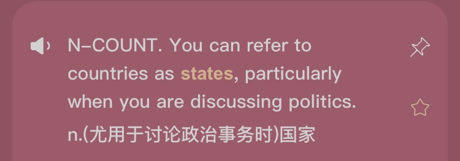
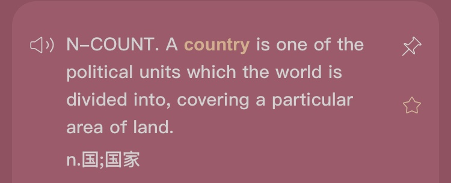

🌟有选择的人生更自在 
🌟AI可以写出好的文学作品吗 
🌟人生是一个动词

<h1 style="color:red">壹 | 排行榜 </h1>

<h1 style="color:red">排行榜</h1>

全球榜

PS: 最新一周排行榜又来啦。后台时间统计单位为「分钟」，故「小时」排名分先后。

魔鬼营

PS: 最新一周排行榜又来啦。后台时间统计单位为「分钟」，故「小时」排名分先后。

<h1 style="color:red">贰 | 拓词快讯 </h1>

选择

遇上新年。

Nora觉得自己又变成了谎言家和预言家。

2019年的flag倒了不少，你呢？

嗯，像拓友们学习

 

 

 

2019年，Nora的经历和体验也有很多。 

有读书，有远行，听到很多神奇的经历，获得很多没有过的人生感知。

不够不够，还是觉得2019不圆满，还不够自在。 

不自在，才不会有闲的状态，离“江山风月，本无常主，闲者便是主人”的境界还好远好远。 

这大抵也是学习的意义吧，成为更好的自己，因为可以得自在。

有选择的人生比没有选择的人生更自在。 

2019也许踉跄前行，

2020要重振旗鼓。

一起呀😊～

2020一起得自在。

<h1 style="color:red">叁 魔鬼营外刊精读 </h1>

AI可以写出好的文学作品吗？

不能。

要写出人类水准的小说，AI还有很长的路要走。 

<b>What eludes computers is creativity</b>. 

By virtue of having been trained on past compositions, they can <i>only be</i> <b>derivative</b>. 

<i>Furthermore</i>, <i>they cannot</i> <u><b>conceive</b> a topic or goal on their own, <b>much less plan how to get there with logic and style</b></u>.

选自魔鬼营1226期精读课课文<i>Don't fear the Writernator</i>

创作力为0，逻辑在线，风格不崩对AI来说太难了，更不用指望会有情节复杂的作品。

The prose gives the impression of being human. <i>But</i> on closer inspection it is <b>empty, even incoherent</b>.

选自魔鬼营1226期精读课课文<i>Don't fear the Writernator</i>

文字粗看像人写的，再看觉得空洞无物。 

Each sentence was fine on its own; remarkably, three or four back to back could stay on topic, apparently cohering. 

<i>But</i> machines are <b>aeons away from being able to recreate</b> rhetorical and argumentative flow across paragraphs and pages. 
 
选自魔鬼营1226期精读课课文<i>Don't fear the Writernator</i>

AI要达到人类创作文学的水平，还有很长的路要走。

<b>Meaningless prose</b> is <i>not only</i> the preserve of artificial intelligence. 

<u>There is already <b>a large quantity of writing</b> that <b>seems to make sense</b>, <i>but</i> ultimately <b>doesn’t</b></u>, at least to a majority of readers. 

选自魔鬼营1226期精读课课文<i>Don't fear the Writernator</i>

虽然写作这件事上，AI目前来看挺差劲的。但是《经济学人》也提到，好多人类写作水平其实也不敢恭维。 

Humans already produce language that is <b>devoid of meaning</b>, <i>intentionally</i> and otherwise.

选自魔鬼营1226期精读课课文<i>Don't fear the Writernator</i>

打着文学的幌子，无病呻吟的文字装疯卖傻不是一天两天了，古来有之，中外都是。

<i>But</i> to truly write, you must <b>first have something to say</b>. 

选自魔鬼营1226期精读课课文<i>Don't fear the Writernator</i>

不管是人还是AI，写作的要义都是一样的，<i>言之有物</i>。

<b>Computers do not</b>. 

They await instructions. 

Given input, they provide output.

选自魔鬼营1226期精读课课文<i>Don't fear the Writernator</i>
 

人可以下笔有神。AI不行，ta需要指令来引导。AI这种"水平属性"定不会有李白屈原，人都模仿不了，遑论机器。

Ask Apple’s Siri or Amazon’s Alexa for <b>a single fact</b>—say, what year “Top Gun” came out—<b>and you will get the answer</b>. 

<i>But</i> ask them to <u>assemble the facts to prove a case</u>, even at a straightforward level—“Do gun laws reduce gun crime?”—and <b>they will flounder</b>.

选自魔鬼营1226期精读课课文<i>Don't fear the Writernator</i>

写到心坎里的文字，肯定不是“某时某刻某地发生了某事”那种。

万维钢老师说， 人生里会遇到的三类问题：单纯的问题、两难的问题和棘手的问题。如果书籍是灵魂的导师，AI的作品估计只能局限在单纯问题里吧。

Perhaps a flood of furious auto-babble will force future readers to <b>distinguish between the illusion</b> of <u>coherence and the genuine article</u>.

选自魔鬼营1226期精读课课文<i>Don't fear the Writernator</i>

AI写手存在的意义莫过于提高读者的文学鉴别力了吧。 

品味这件事，越抽象，越难呀。

<h1 style="color:red"> Nora|小栈 </h1>

人生是一个动词

词的属性很多。

明明中文是一样的意思，内里却各有千秋。 

比如同样是国家，state强调政治范畴的国家概念，country则是更强调地理概念。

 

nation的文化和民族属性更强烈一些。
用词根-nat-（出生，天生）来解释很明晰了，很符合中文里的“同根”“同源”的含义。

话多的人，可以用verbose，
voluble
和garrulous来形容，但是每个词都有自己的特质。 

verbose是话多到模糊重点。 

voluble更像是舌灿莲花的感觉。 

garrulous有点没完没了的闲谈感觉。

为“人”，可以选用的也很多："being,
human, 

person, individual, creature" 。

creature有种原始的粗俗感。 

individual更个性。 

相比而言，Nora更喜欢being，于我而言，人生是一个动词，being很契合。

孩童时期，使用动词相当轻松。 

吃、喝、睡、想要...

所思考的、说出的甚至写下的都有动词，大概是因为动词的表达效果最好吧，可以最精准传达包含细微的动作、反应、态度和情感。 

being有一种为人是不断修行、不断练习的过程，像是把人生中的坑坑洼洼填满和铲平的过程。 

人生赢家大概也是如此吧，不断修炼自己，不断变成更好的人。

