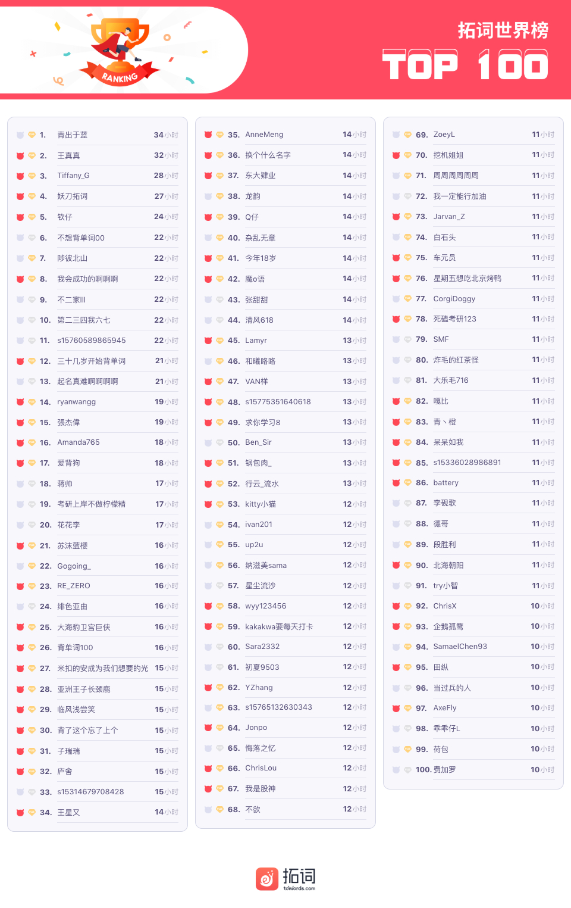
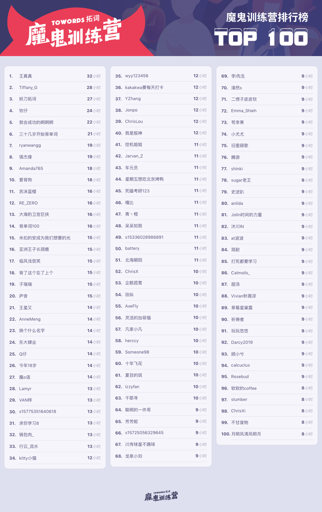
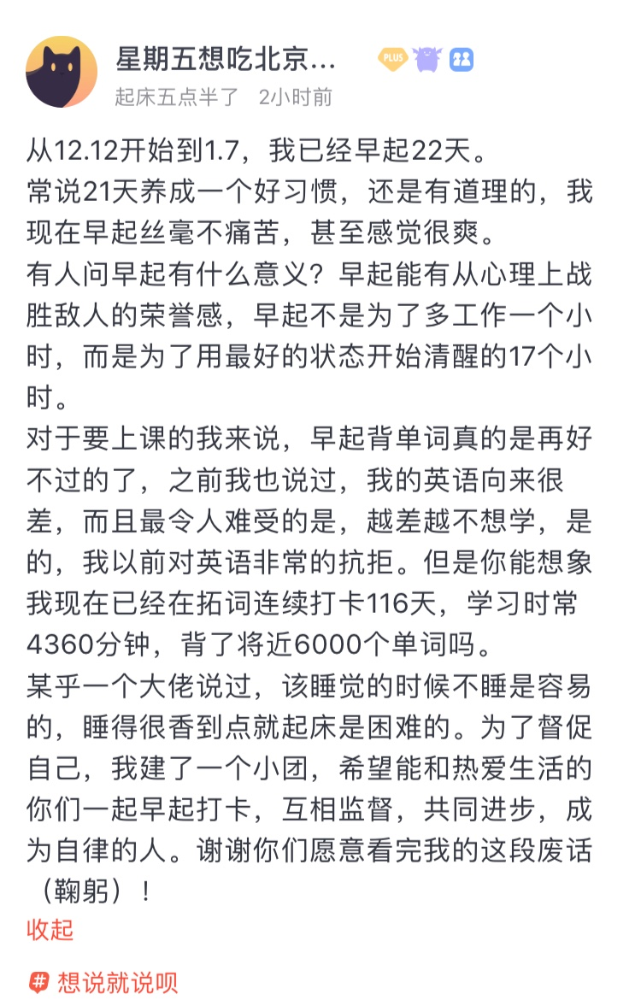
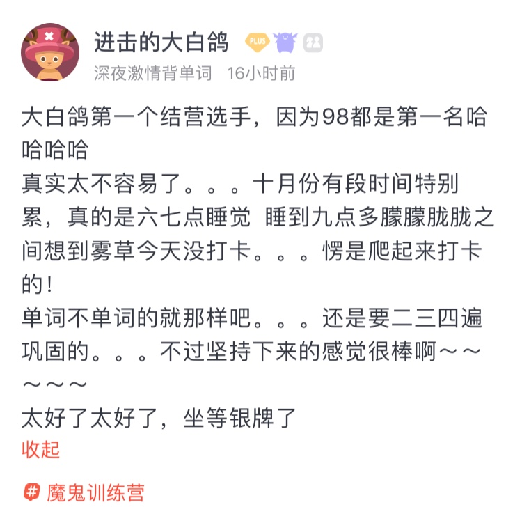
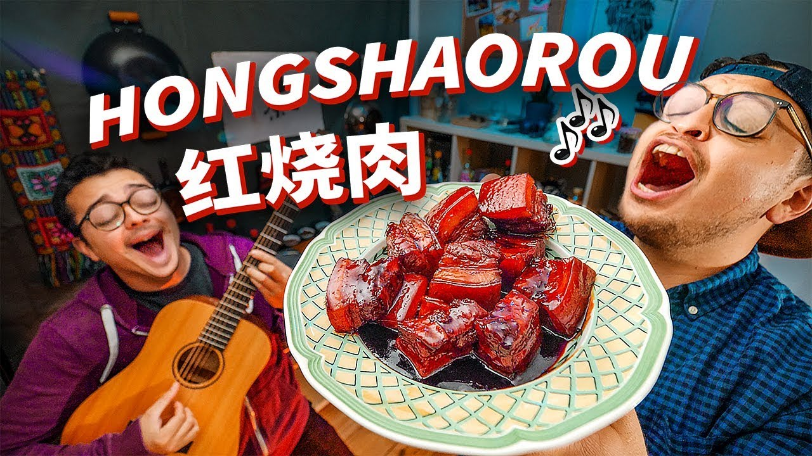
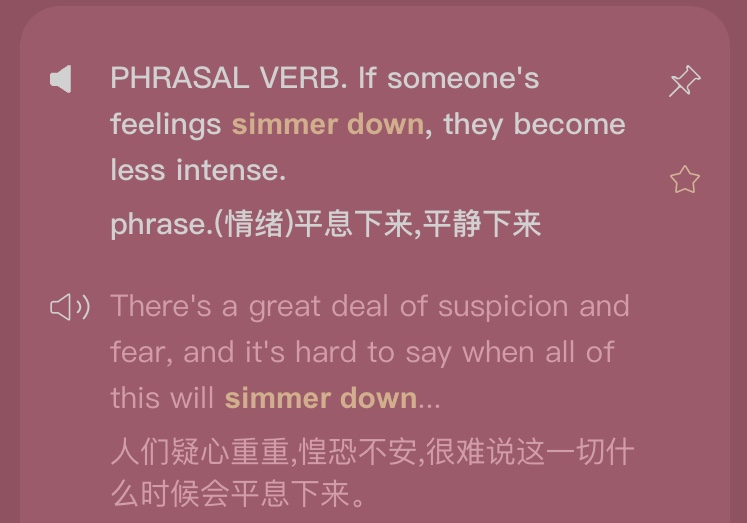
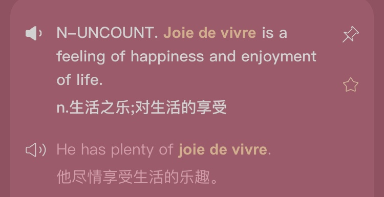
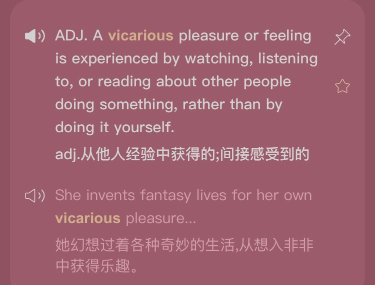

🌟与其用心生活，不如放松生活 
🌟人生低谷，言语无用时，唯有美食不可辜负。 
🌟你的家乡最有年味的一道菜是什么

<h1 style="color:red">壹 | 排行榜 </h1>

<h1 style="color:red">排行榜</h1>

全球榜

PS: 最新一周排行榜又来啦。后台时间统计单位为「分钟」，故「小时」排名分先后。

魔鬼营

PS: 最新一周排行榜又来啦。后台时间统计单位为「分钟」，故「小时」排名分先后。

<h1 style="color:red">贰 | 拓词快讯 </h1>

那些小小话语

有时候，我们需要一些小东西来激励自己，使自己感觉更好。 

We need a little something to help sometimes, 

to uplift us and make us feel better. 

 

 

和世界榜的大佬一样，你们的故事也是

uplift us and make us feel better

<h1 style="color:red">叁 | Nora的英文小栈 </h1>

现在我的脑子里在疯狂循环“红烧肉”

还记得在《中餐厅》中，女神舒淇凭借一道红烧肉成功俘获外国胃吗？

甚至还有一位忠实回头客，三次前来都钟爱红烧肉……最后一次没吃到的小眼神，让人Real心疼了==

红烧肉，绝对算是本档综艺众多美食中的C位担当了！

红烧肉薄皮嫩肉，色泽红亮，味醇汁浓，酥烂而形不碎，香糯而不腻口。

意志再坚定的减肥达人也得吞口水~

而对于歪果仁来说，红烧肉也绝对是他们眼中中国美食的佼佼者！《英语下午茶》第27集主题是Chinese food，Alexi也是大谈红烧肉。

他们对红烧肉到底有多爱呢？ 

最近，一首由几位外国年轻人创作的“红烧肉之歌”在网络上爆红，无论是旋律还是老外在用中文念红烧肉的发音，都十分洗脑。

▼ <i>红烧肉之歌MV（可点击播放）</i>

曲调大家都十分熟悉，改编自电影《桥》的主题曲《啊，朋友再见》。尤其是唱到“红烧肉"

MV中为大家演示的红烧肉做法也hin专业，葱姜油调料齐全到位

步骤也井井有条！这样的画面配上魔性的歌词，看一遍就想大喊：我要吃肉！

所以，今天就挑几句歌词出来，给大家整一期关于吃吃吃的英文干货！

首先看，老外是怎么翻译“红烧肉”的。

A classic Chinese red braised pork

经典的中国红烧肉

这首歌里，把红烧肉译成了"red braised pork", 其中的 braised 是炖的意思。

Rinse your pork belly

五花肉焯水

大家都知道，焯水是将食材放到开水里过一遍。而 rinse 这个词原意是冲洗，博主应该是将焯水理解为在热水里面冲洗一遍，所以才用的这个词。

Sculpt into pieces

精雕细切

sculpt 本意是雕琢、雕刻，用在这首歌里，可以理解为“比较精致的切”。英文里真正表示切菜的单词，应该是 slice（切片）、shred （切丝）、dice（切丁）、mince（切末）、chop（剁）。

Bring to a simmer

文火炖煮

simmer 是指即将沸腾的状态，也有文火炖、小火煨的意思。本身做红烧肉也是一个慢慢炖煮的过程，所以这里 simmer 用得还是比较恰当的。

食材小火慢煨，可以让滋味充分散发出来。

to get all the flavors to release. 

这个状态也适用于各种情绪feelings，“世界上没有无缘无故的爱，也没有无缘无故的恨”“冰冻三尺，非一日之寒”，所有的情绪都有酝酿的过程。 

所以simmer<u>还有（冲突、争吵等）酝酿，即将爆发</u>的意思

🌰 The province was attacked a month ago after weeks of simmering <b>tension</b>. 
在紧张局势连续数周恶化后，这个省于一个月前遭到了袭击。 

<small>出自柯林斯高阶英文字典</small>

🌰 Then Mr. Perez died at the age of 88 last December, and decades of simmering <b>resentment</b> spewed forth.
Perez先生于去年12月去世，享年88岁，两个家庭数十年结的仇终于爆发了出来。

<small>出自华尔街日报</small>

simmering food是让食物的滋味慢慢地散，最终全部都释放出来。 

simmering <b>tensions</b> 
simmering <b>hostilities</b> 
simmering <b>resentments</b> 
simmering <b>feud</b> 

也是如此，情绪不是一下子就爆发，而是蓄力已久。

这么说来，simmer有点发散，甚至向上的感觉。

simmering搭上food,便是可口的美食。搭上情绪，却又不美好了。 

也符合《英语下午茶》的里说的， 关于生活中那些积累起来的负面情绪simmering feelings，倒是可以通过simmering food来化解。

Sometimes, in the deepest moments, there are no words.There is only food. 

人生低谷，言语无用时，唯有美食不可辜负。

<small>出自拓词英语下午茶</small>

simmer down则有点相反的意味，“收”“敛”。

查词图片来自拓词

如果用季节来作比， simmer+食物/情绪，像是春天的感觉。 

simmer down是秋天。 

PS:快过年了，你的家乡最有年味一道菜是什么？

<h1 style="color:red">Nora小栈 | joie de vivre </h1>

与其用心生活，不如放松生活

论外国语言对英语的影响，法语算强势的。 

有些借字的发音已经被英语化了，比如mutton,beef。

有些还保留着法语发音，如joie de vivre。

查词图片来自拓词

直接翻译过来是joy of living，生活的乐趣，倒不是那种让人“头晕目眩”的大喜，豪掷千金购物那种不算，更偏向delight in simply living your life。

<i>浮生若梦，为欢几何</i>提到的快乐有这个意味。

一点一滴、亲力亲为得来的快乐。 

不像vicarious pleasure, 属于“二手货”secondhand experience。

查词图片来自拓词

Nora觉得，别人分享的快乐，我可以感受到的份额就属于a vicarious taste of the pleasure，间接体验到的快乐。 

好奇ta是怎样的一个人？ta喜欢在空闲时间的事就足以表明，那该算ta的joie de vivre。 

了解一个国家或者民族的内在也是如此，他们的joie de vivre就是很好的答案。 

是一种不能从别处借得的状态，也不是刻意求得，是松弛状态下自然流露的快乐感受。 

你觉得呢？

