

🌟英语牛娃来了 
🌟送你新春五福 
🌟年度词哪家选得好？《经济学人》这样说 

<h1 style="color:red">壹 | 排行榜 </h1>

<h1 style="color:red">排行榜</h1>

全球榜

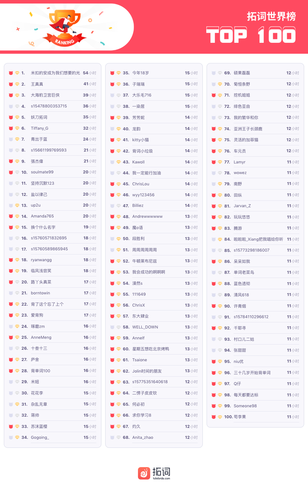

PS: 最新一周排行榜又来啦。后台时间统计单位为「分钟」，故「小时」排名分先后。

魔鬼营

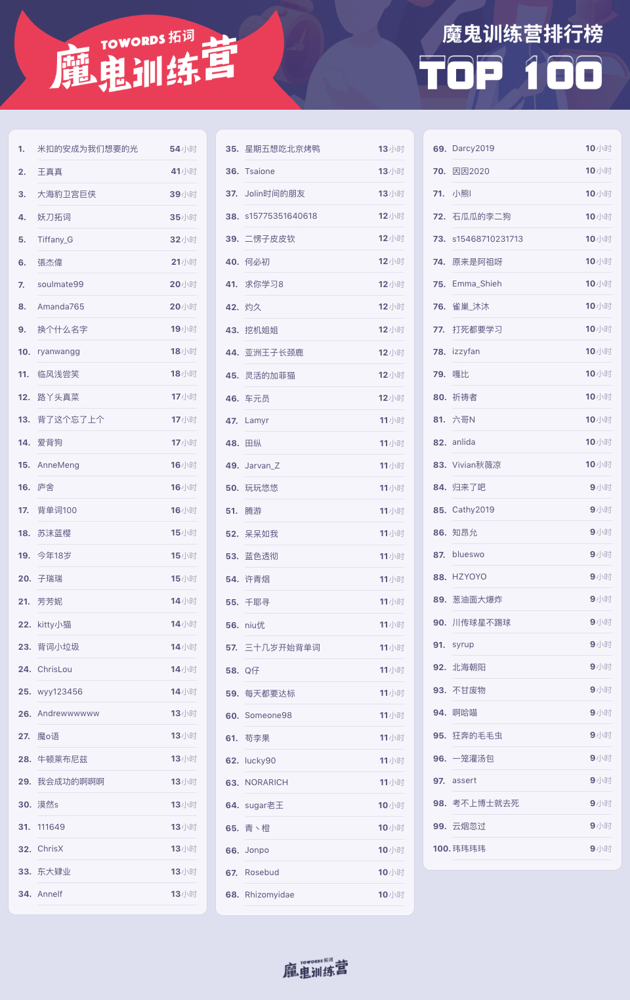

PS: 最新一周排行榜又来啦。后台时间统计单位为「分钟」，故「小时」排名分先后。

<h1 style="color:red">贰 | 拓词快讯 </h1>

英语牛娃来了

这周KET、PET出分啦。 

小拓友们查到成绩都来拓词报喜了，你们都太棒了🎉~

 

 
 
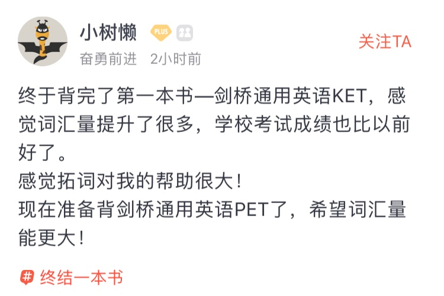 
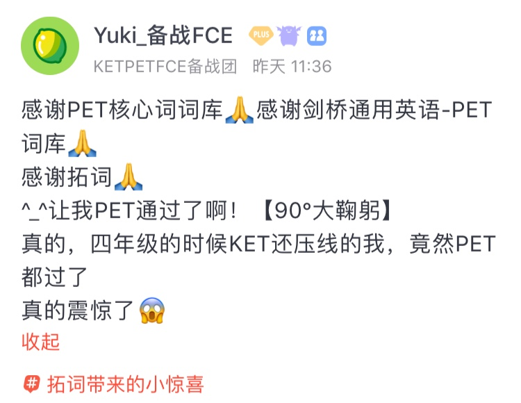 
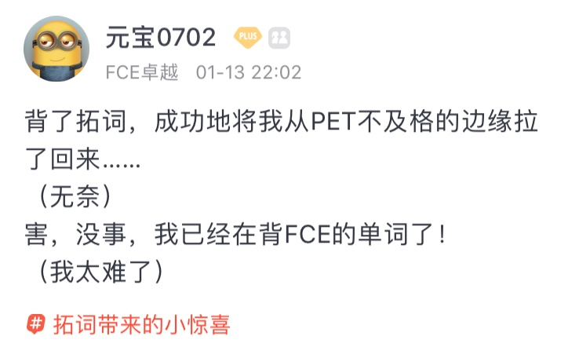 

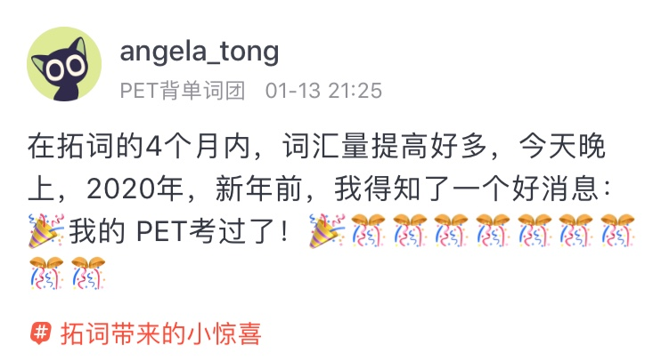 
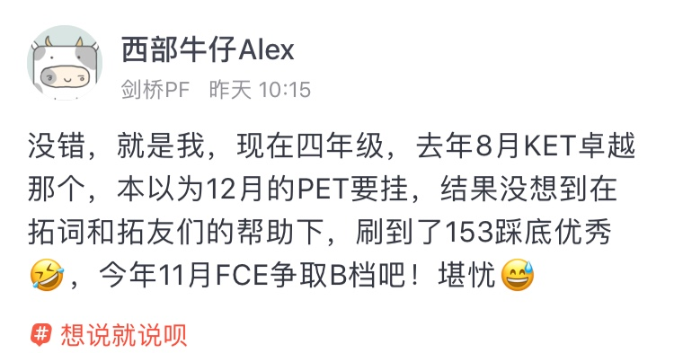 

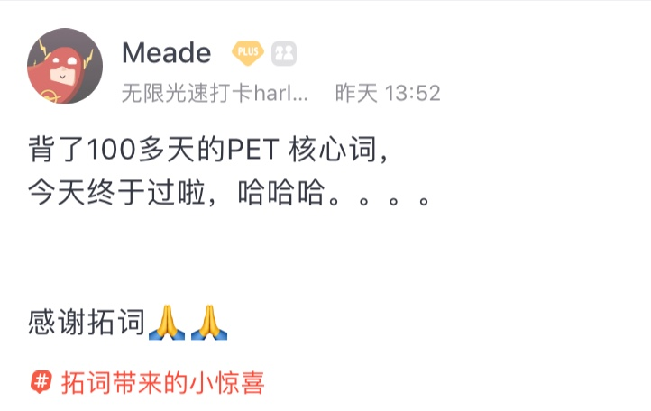 

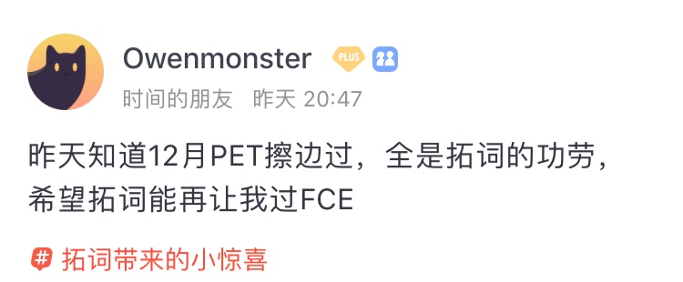 

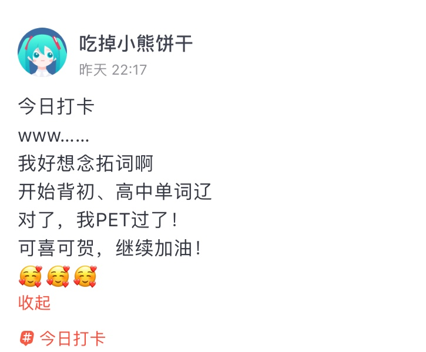 

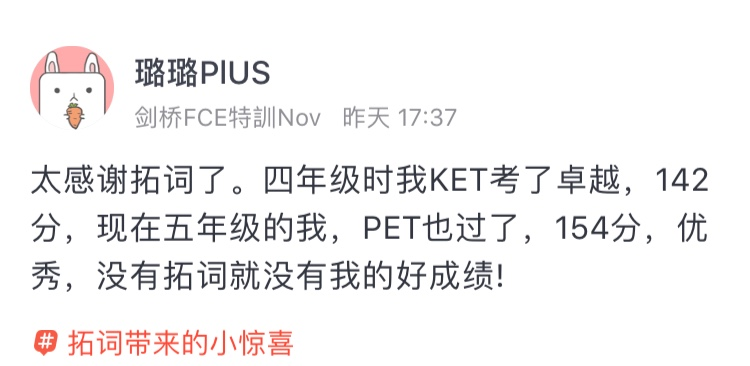 

KET和PET属于剑桥通用英语五级考试（MSE），由剑桥大学外语考试部开发。

MSE一共包括五个等级,从低到高依次为：初级到高级分别是KET、PET，FCE、CAE、和CPE。

　　1.    Cambridge English: Key 或Cambridge English: Key for Schools：又称KET是一项基础英语水平认证，证明你可以在简单的情景中使用英语进行沟通。这项测试可证明你的英语学习有了一个良好的开端。
  
　　2.    Cambridge English: Preliminary 或 Cambridge English: Preliminary for Schools： 又称PET，是一项中级英语水平认证。这项测试可证明你在工作、学习方面和旅行时的英语语言技能。
  
　　3.    Cambridge English: First 或 Cambridge English: First for Schools：又称FCE，是中高级水平证书，可以证明你可以在工作或学习中使用日常书面英语和英语口语。FCE校园版是专门为在校学生定制的，它可以提高学生学习英语的积极性。因为基于熟悉的主题和情景，它可以增强学生使用英语的信心，并激励学生继续向更高水平英语学习迈进，以获得更高一级的资格证书。
  
　　4.    Cambridge English: Advanced：又称CAE，用于证明你的英语成绩优异。 CAE广泛受到大学雇主以及政府等机构的认可。
  
　　5.    Cambridge English: Proficiency (CPE) ：又称CPE，是剑桥大学外语考试部所提供的最高级别的资格证书。它证明你的英语已经达到非常高的水平。

<small>出自中国教育考试网</small>

MSE和CEFR（欧洲共同语言参考标准）也对应，在全世界都有很高的认可度，很权威。 

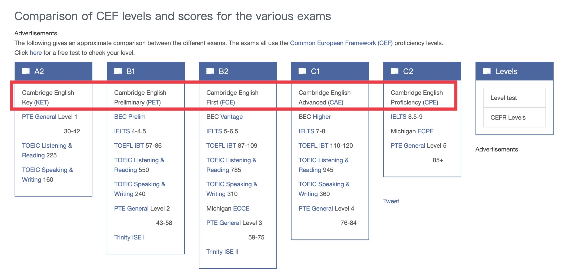

<small>图片来自examenglish.com</small>

2020年KET、PET题型和难度会有重大变化。

如何解决KET、PET背单词的难题？

让拓词来帮你😊

<h1 style="color:red">叁 | 魔鬼营精读课 </h1>

年度词哪家选得好？《经济学人》这样说

文章来自《经济学人》

<i>Of train-boasts, plane-shame and electric automobiles</i>

<small>The words of 2019 reflect the rise of climate-change activism</small>

2019，柯林斯词典的年度主题词是关于气候，CLIMATE STRIKE。 

<!--  -->

至于为什么选它，和数据有关系。柯林斯词典编纂者发现，与2018年相比，今年这个词的使用频率增加了100倍。

牛津字典选的是也是关于气候，CLIMATE EMERGENCY。

相比而言，《经济学人》认为Dictionary.com选的‘EXISTENTIAL’更贴切些。

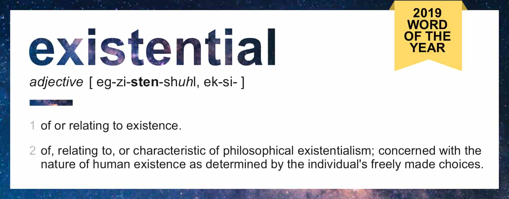

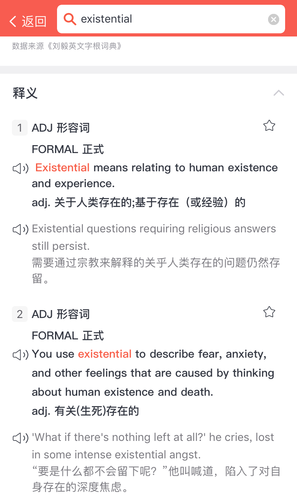

Dictionary.com通过搜索数据分析来决定每年的年度词。自2010年来，每年都会选出一个当年的年度词汇，2018年是misinformation。

为什么选existential，Dictionary.com给的解释是：气候变化、枪支暴力等都使得extential频繁被提及（搜索），这个词反映了2019年全球的威胁与危机。 

Existential, as a word and theme, was prominent in discussions of topics that dominated 2019: climate change, gun violence, and democratic institutions. It also popped up in lighter stories in popular culture, signaling its place in the cultural zeitgeist.

<small>出自DICTIONARY.COM</small>

What Does "Existential" Mean To You? 你有担心过自己的“存在”吗？

<small>视频|如何看待Existential</small>

<video width="320" height="240" controls>
  <source src="https://official-web.oss-cn-beijing.aliyuncs.com/towords/weekly/38/existential.mp4" type="video/mp4">
Your browser does not support the video tag.
</video>

不管是柯林斯还是牛津还是Dictionary.com。各家字典选的年度词虽然不同，不过都算不上积极向上。不知道2020会不会有逆转？

已经是2020啦，如果为你的2019选一个关键词，你会选什么？

<h1 style="color:red">Nora小栈 | 送你新年五福 </h1>

Luck,Happiness,Peace,Prosperity,Spring

对Nora来说，一年中那么多的节日，没有比春节更重大的了。看林语堂先生的文字也是如此，春节被算作<i>the greatest festival in the year for Chinese people</i>. 

The old Chinese new year, of the lunar calendar, <i>was the greatest festival in the year for the Chinese people</i>, compared with which every other festival seemed lacking in completeness of the holiday spirit.

<small>—林语堂</small>

按英语下午茶Alexi老师的说法，这个应该算heritage。

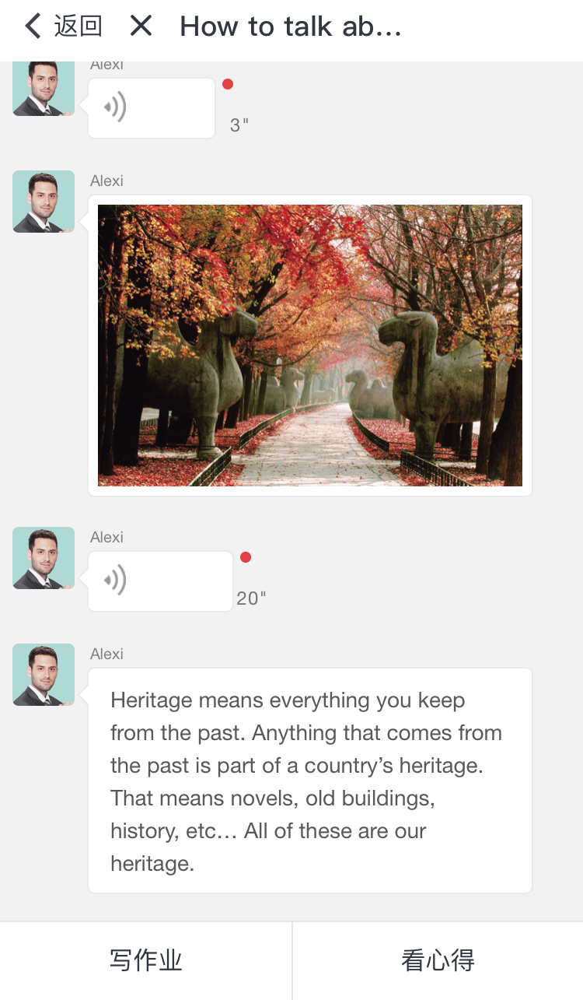

虽然是heritage，名家们“吐槽”起来一点也不“嘴软”。

梁实秋“怕除夕守岁熬夜”

我小时候并不特别喜欢过年，除夕要守岁，不过十二点不能睡觉，这对于一个习于早睡的孩子是一种煎熬。前庭后院挂满了灯笼，又是宫灯，又是纱灯，烛光辉煌，地上铺了芝麻秸儿，踩上去咯咯吱吱响，这一切当然有趣，可是寒风凛冽，吹得小脸儿通红，也就很不舒服。炕桌上呼卢喝雉，没有孩子的份。压岁钱不是白拿，要叩头如捣蒜。大厅上供着祖先的影像，长辈指点曰：“这是你的曾祖父，曾祖母，高祖父，高祖母……”虽然都是岸然道貌微露慈祥，我尚不能领略慎终追远的意义。

<small>—梁实秋</small>

鲁迅23年不过旧历年，倒是喜欢放烟花爆竹。 

我不过旧历年已经二十三年了，这回却连放了三夜的花爆，使隔壁的外国人也‘嘘’了起来：这却和花爆都成了我一年中仅有的高兴。

<small>—鲁迅</small>

最有趣的当属林语堂的文字了，Nora读出了一股“别扭”和“傲娇”，甚至“中二”的感觉。

My big Scientific Mind told me not to keep the Old New Year, and I promise him I wouldn't. "I'm not going to let you down," I said, with more good will than self-confidence. 

<small>—林语堂</small>

 

At five, we ate the fried nienkao, and with the room filled with the subtle fragrance of narcissus, <i>I felt terribly like a sinner</i>. "I'm not going to celebrate the New Year's Eve," I said resolutely; "I'm going to see the movies tonight." "How can you?" asked my wife. 

也挺诙谐有趣

<i>Fathers lost their dignify</i>, <i>grandfathers were more amiable than ever</i>, and children blew whistles and wore masks and played with clay dolls. 

年味里还有美食、故乡和回忆

I found on my way home that I had not only rotating lanterns and rabbit lanterns and several packages of Chinese toys with me, <i>but</i> some twigs of plum blossoms, besides. After coming home I found that someone from my native place had presented me with a pot of narcissus, the narcissus which made my <i>native place</i> nationally famous, and which used to bloom so beautifully and gave out such subtle fragrance on New Year's Day in my <i>childhood</i>.

 

At lunch, the smell of the narcissus made me think of one kind of <i>Fukien rice-pudding</i>, made with <i>carrots</i>.

"This year, no one has sent us any <b>carrot pudding</b>," I said sadly. "It's because no one came from <i>Amoy</i>.

 

好奇用胡萝卜做的福建rice-pudding是啥，让林语堂如此念念不忘，福建的拓友解个惑呗～

春节意义非凡，仪式和规矩里其实藏着敬畏和守望。<i>Sacred Mountain</i>提过，中国人会在特殊的日子里去某个神圣的地方去许愿。

春节就是这么一个契机，用林语堂的话说来是：

It was the great day of good <i>luck</i>, when everybody looked forward to a better and more <i>prosperous</i> new year, when everybody had the <i>pleasure</i> of adding one year to his age and was ready with an auspicious, luck-bringing word for his neighbors.

What does "春节" Mean to You？

按照《经济学人》提过的人类语言employ symbols。某种程度上可以说，语言之所以伟大，不是源自内在特质，而是背后的力量。

那春节呢，a symbol for ？

<b>Luck, Happiness, Peace, Prosperity, Spring</b>.

新的一年，祝愿我们都可以集齐这五福＼(￣▽￣)／

往期回顾：
<a href="https://www.topschool.com/towords/tarticle/index.html?article_id=37" style="color:#FF4855;font-size:14px;display:block">拓词小报·魔鬼营周报第一期</a>
<a href="https://www.topschool.com/towords/tarticle/index.html?article_id=39" style="color:#FF4855;font-size:14px;display:block">拓词小报·魔鬼营周报第二期</a>
<a href="https://www.topschool.com/towords/tarticle/index.html?article_id=41" style="color:#FF4855;font-size:14px;display:block">拓词小报·魔鬼营周报第三期</a>
<a href="https://www.topschool.com/towords/tarticle/index.html?article_id=42" style="color:#FF4855;font-size:14px;display:block">拓词小报·魔鬼营周报第四期</a>
<a href="https://www.topschool.com/towords/tarticle/index.html?article_id=43" style="color:#FF4855;font-size:14px;display:block">拓词小报·魔鬼营周报第五期</a>
<a href="https://www.topschool.com/towords/tarticle/index.html?article_id=44" style="color:#FF4855;font-size:14px;display:block">拓词小报·魔鬼营周报第六期</a>	
<a href="https://www.topschool.com/towords/tarticle/index.html?article_id=45" style="color:#FF4855;font-size:14px;display:block">拓词小报·魔鬼营周报第七期</a>
<a href="https://www.topschool.com/towords/tarticle/index.html?article_id=55" style="color:#FF4855;font-size:14px;display:block">拓词小报·魔鬼营周报第八期</a>
<a href="https://www.topschool.com/towords/tarticle/index.html?article_id=56" style="color:#FF4855;font-size:14px;display:block">拓词小报·魔鬼营周报第九期</a>
<a href="https://www.topschool.com/towords/tarticle/index.html?article_id=59" style="color:#FF4855;font-size:14px;display:block">拓词小报·魔鬼营周报第十期</a>
<a href="https://www.topschool.com/towords/tarticle/index.html?article_id=66" style="color:#FF4855;font-size:14px;display:block">拓词小报·魔鬼营周报第十一期</a>
<a href="https://www.topschool.com/towords/tarticle/index.html?article_id=67" style="color:#FF4855;font-size:14px;display:block">拓词小报·魔鬼营周报第十二期</a>
<a href="https://www.topschool.com/towords/tarticle/index.html?article_id=70" style="color:#FF4855;font-size:14px;display:block">拓词小报·魔鬼营周报第十三期</a>
<a href="https://www.topschool.com/towords/tarticle/index.html?article_id=73" style="color:#FF4855;font-size:14px;display:block">拓词小报·魔鬼营周报第十四期</a>
<a href="https://www.topschool.com/towords/tarticle/index.html?article_id=74" style="color:#FF4855;font-size:14px;display:block">拓词小报·魔鬼营周报第十五期</a>
<a href="https://www.topschool.com/towords/tarticle/index.html?article_id=75" style="color:#FF4855;font-size:14px;display:block">拓词小报·魔鬼营周报第十六期</a>
<a href="https://www.topschool.com/towords/tarticle/index.html?article_id=76" style="color:#FF4855;font-size:14px;display:block">拓词小报·魔鬼营周报第十七期</a>
<a href="https://www.topschool.com/towords/tarticle/index.html?article_id=77" style="color:#FF4855;font-size:14px;display:block">拓词小报·魔鬼营周报第十八期</a>
<a href="https://www.topschool.com/towords/tarticle/index.html?article_id=78" style="color:#FF4855;font-size:14px;display:block">拓词小报·魔鬼营周报第十九期</a>
<a href="https://www.topschool.com/towords/tarticle/index.html?article_id=80" style="color:#FF4855;font-size:14px;display:block">拓词小报·魔鬼营周报第二十期</a>
<a href="https://www.topschool.com/towords/tarticle/index.html?article_id=82" style="color:#FF4855;font-size:14px;display:block">拓词小报·魔鬼营周报第二十一期</a>
<a href="https://www.topschool.com/towords/tarticle/index.html?article_id=83" style="color:#FF4855;font-size:14px;display:block">拓词小报·魔鬼营周报第二十二期</a>
<a href="/s/weekly/23.html" style="color:#FF4855;font-size:14px;display:block">拓词小报·魔鬼营周报第二十三期</a>
<a href="/s/weekly/24.html" style="color:#FF4855;font-size:14px;display:block">拓词小报·魔鬼营周报第二十四期</a>
<a href="/s/weekly/25.html" style="color:#FF4855;font-size:14px;display:block">拓词小报·魔鬼营周报第二十五期</a>
<a href="/s/weekly/26.html" style="color:#FF4855;font-size:14px;display:block">拓词小报·魔鬼营周报第二十六期</a>
<a href="/s/weekly/27.html" style="color:#FF4855;font-size:14px;display:block">拓词小报·魔鬼营周报第二十七期</a>
<a href="/s/weekly/28.html" style="color:#FF4855;font-size:14px;display:block">拓词小报·魔鬼营周报第二十八期</a>
<a href="/s/weekly/29.html" style="color:#FF4855;font-size:14px;display:block">拓词小报·魔鬼营周报第二十九期</a>
<a href="/s/weekly/30.html" style="color:#FF4855;font-size:14px;display:block">拓词小报·魔鬼营周报第三十期</a>
<a href="/s/weekly/31.html" style="color:#FF4855;font-size:14px;display:block">拓词小报·魔鬼营周报第三十一期</a>
<a href="/s/weekly/32.html" style="color:#FF4855;font-size:14px;display:block">拓词小报·魔鬼营周报第三十二期</a>
<a href="/s/weekly/33.html" style="color:#FF4855;font-size:14px;display:block">拓词小报·魔鬼营周报第三十三期</a>
<a href="/s/weekly/34.html" style="color:#FF4855;font-size:14px;display:block">拓词小报·魔鬼营周报第三十四期</a>
<a href="/s/weekly/35.html" style="color:#FF4855;font-size:14px;display:block">拓词小报·魔鬼营周报第三十五期</a>
<a href="/s/weekly/36.html" style="color:#FF4855;font-size:14px;display:block">拓词小报·魔鬼营周报第三十六期</a>
<a href="/s/weekly/36.html" style="color:#FF4855;font-size:14px;display:block">拓词小报·魔鬼营周报第三十七期</a>

