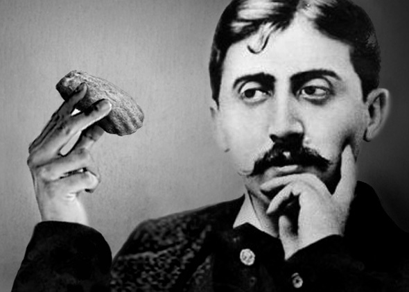
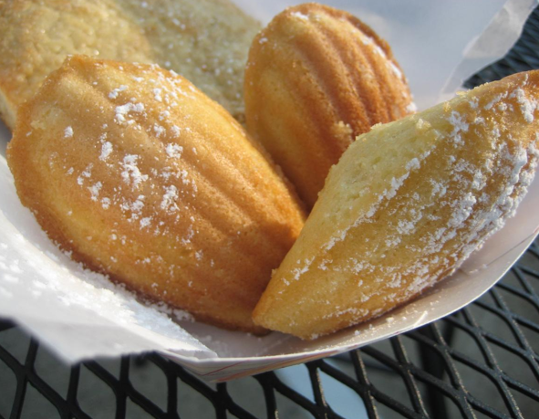

<h1 style="color:red">彩蛋| 
文学作品中难忘的<s>年味</s>食物 </h1>

云子饭，水晶瓜。林间携客更烹茶。

<small><i>辛弃疾</i></small>

想想画面就觉得很是惊艳，想看更想吃。写吃的好手，不得不提汪曾祺。以至于提起咸鸭蛋，Nora就想问一句是不是高邮的。 

高邮咸蛋的特点是质细而油多。蛋白柔嫩，不似别处的发干、发粉，入口如嚼石灰。油多尤为别处所不及。鸭蛋的吃法，如袁子才所说，带壳切开，是一种，那是席间待客的办法。平常食用，一般都是敲破“空头”用筷子挖着吃。筷子头一扎下去，吱——红油就冒出来了。

<small><i>出自汪曾祺</i></small>

英国的食物一点经不起夸。 

英国普通人家的饭食，好处是在干净；茶是真热。口味怎样，我不敢批评，说着伤心。

<small><i>出自老舍</i></small>

不像对岸的法国，文学巨著也可以用来研究法国美食文化，就是《追忆似水年华》。

说起文笔和食物的关系？普鲁斯特做了很好的关联。

<small>普鲁斯特</small>

说起玛德琳蛋糕，就会想起普鲁斯特的《追忆似水年华》。

有人说，大文豪因对玛德琳贝壳蛋糕的味觉回忆，写出了《追忆似水年华》，因此将玛德琳蛋糕推上了世界舞台。

<small>玛德琳蛋糕</small>

回忆是有味道的。像贝壳蛋糕，它细微、若有似无的味道，却把普鲁斯特回忆搅动得天翻地覆。

No sooner had the warm liquid mixed with the crumbs touched my palate than a shudder ran through me and I stopped, intent upon the extraordinary thing that was happening to me. 
  
<i>An exquisite pleasure had invaded my senses</i>, something isolated, detached, with no suggestion of its origin. And at once the vicissitudes of life had become indifferent to me, its disasters innocuous, its brevity illusory – this new sensation having had on me the effect which love has of filling me with a precious essence; or rather this essence was not in me it was me. ... 
  
Whence did it come? What did it mean? How could I seize and apprehend it? ... And suddenly the memory revealed itself. The taste was that of the little piece of madeleine which on Sunday mornings at Combray (because on those mornings I did not go out before mass), when I went to say good morning to her in her bedroom, my aunt Léonie used to give me, dipping it first in her own cup of tea or tisane. The sight of the little madeleine had recalled nothing to my mind before I tasted it. And all from my cup of tea.

<small><i>—追忆似水年华</i></small>

但是，就在带着蛋糕屑的茶碰到我上腭的那一瞬间，我不禁浑身一激灵，注意到我身上有一种异乎寻常的东西经过。

一种奇妙的快感侵入到我的心中，使我超然升华，但又不知道其中的缘由。它立即给我带回了生活沧桑的冷漠，生活灾祸的无害，生活幻景的短暂，就如爱情所起的作用一样，以一种珍贵的本质充实了我：或者确切地说，这一本质并不寓于我的内心中，它就是我自己。

我不再感到自己是那么的碌碌无为、卑贱渺小、平凡庸俗。这种强有力的快感是从哪里来的呢？我感觉它是跟茶水和甜点的味道密切相连的...

<small><i>—追忆似水年华</i></small>

于是有了「普鲁斯特效应」这个说法，即<i>气味可以解锁以前已经遗忘但却生动、饱含情感的回忆</i>。

<small><i>普鲁斯特效应</i></small>

The Proust effect refers to the vivid reliving of events from the past through sensory stimuli. 
  
Many of us are familiar with those special moments, when you are taken by surprise by a tiny sensory stimulus (e.g. the scent of your mother’s soap) that evokes an intense and emotional memory of an episode from your childhood.

触景生情，看到某些东西，会让人想起一些模糊的过去。

味道也有这样的能力，让回忆不请自来。

你有没有遇到过普鲁斯特效应？

有没有遇到这样的气味，ta撬动你的情绪，带来过去让人激动的回忆？

