

🌟报告，有人在心得开party 
🌟隔离quarantine和威尼斯以及40的瓜葛 
🌟70%的单词都和希腊语或者拉丁语有关系

<h1 style="color:red">壹 | 排行榜 </h1>

<h1 style="color:red">排行榜</h1>

全球榜

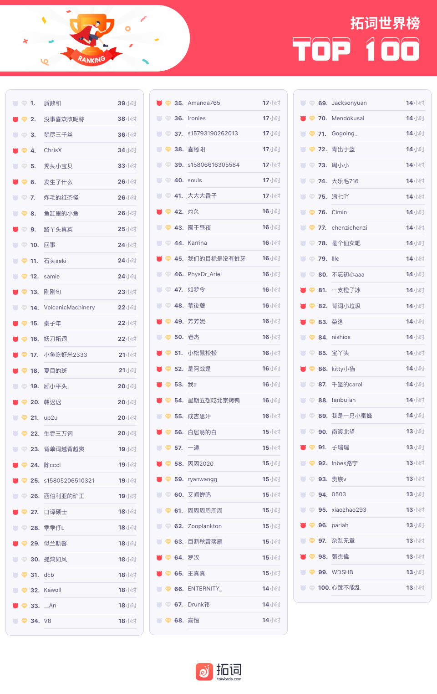

PS: 最新一周排行榜又来啦。后台时间统计单位为「分钟」，故「小时」排名分先后。

魔鬼营

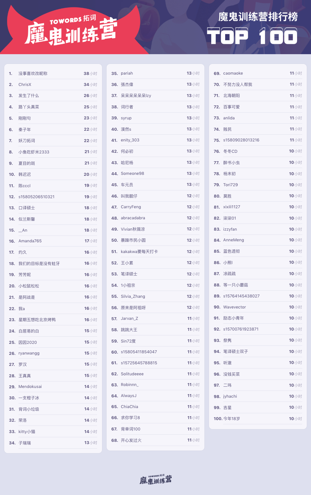

PS: 最新一周排行榜又来啦。后台时间统计单位为「分钟」，故「小时」排名分先后。

<h1 style="color:red">贰 | 拓词快讯 </h1>

最可爱的人

不知你看英文时，是否也有这样的感觉。 

很多词，觉得很妙，实在是令人遐想呀，好像这里面有莫大的欢喜和快乐一样。 

比如小栈里讲的，常作为同义词处理的specious和spurious，还有同样是表示伤感，但是性质很不同的maudlin和mawkish等，遇到它们时，nora就是这样的感受。 

好奇@草稿聋子说的对单词的兴趣是不是也有这层？

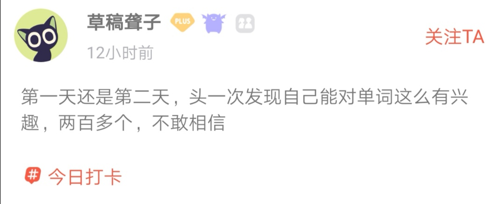

讲到欢喜和快乐，想起林语堂说过的一番话： 

我们只有知道一个国家人民生活的乐趣，才会真正了解这个国家，正如我们只有知道一个人怎样利用闲暇时光，才会真正了解这个人一样。

只有当一个人歇下他手头不得不干的事情，开始做他所喜欢做的事情时，他的个性才会显露出来。

看拓友心得就常有这样的疑问，ta们在生活里是不是也是这么可爱呀，那么亲切、友好、温和，还特别厉害，而且相当努力。

比如头一回见到在评论区开party的，办“美食节”的。

如此强烈的契约精神，👍 

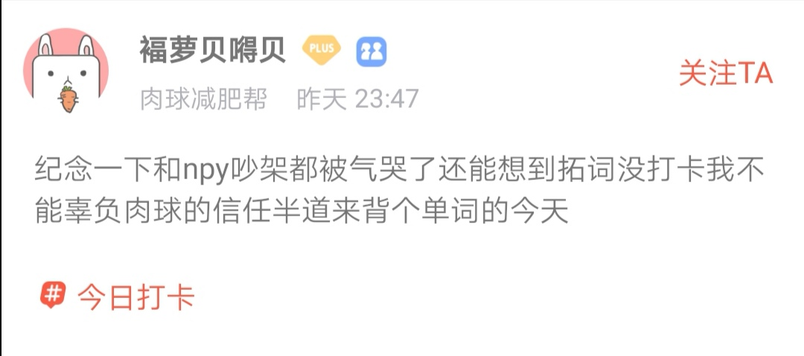

养一个习惯，不用21天
 

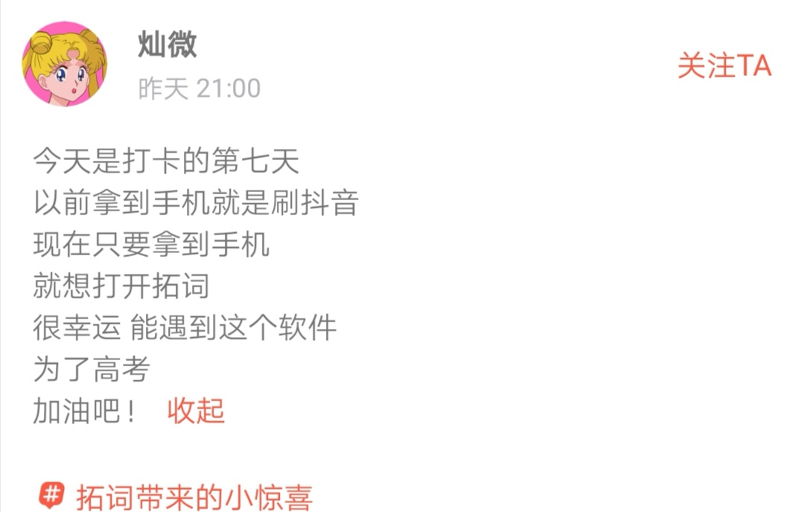 
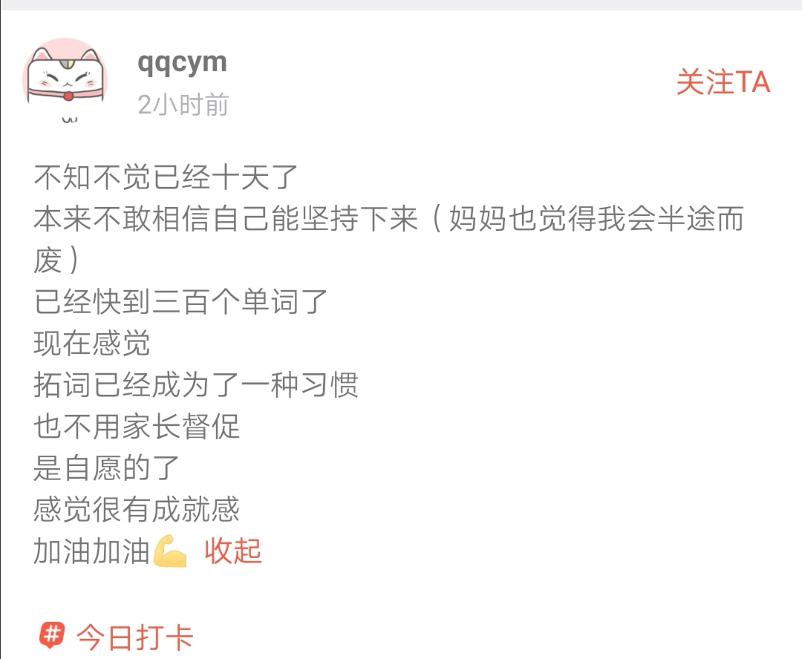 
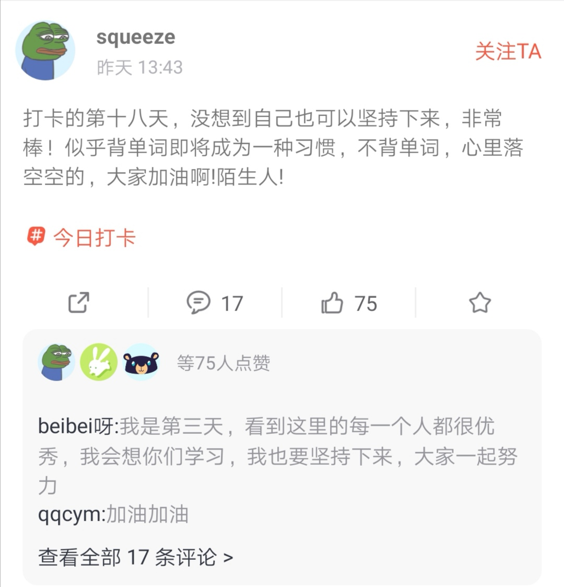

一口气就是100天

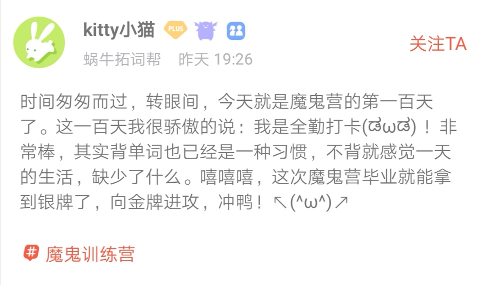

<h1 style="color:red">叁 | Nora小栈 </h1>

隔离检疫quarantine,与40何相干？

quarantine隔离检疫，与40有什么关系？与威尼斯又有什么关系？

看看其他的欧洲语言就明了多了。

<i>quarant</i>ine，英语，<b>检疫，隔离</b> 
<i>quarant</i>a，意大利语，<b>四十</b> 
<i>quarant</i>e，法语，<b>四十</b>

<i>quarant</i>ine从<b>40</b>到<b>检疫隔离</b>还有一段故事。 

时间往前约700年，那时候科学不像现在这样，也用了差不多的法子来对付传染病，也就是隔离。 

从历史来看，传染病时期，船舶绝对是危险场所，少数人染病，往往一船人都无法幸免，过去的黑死病霍乱时期就发生过这样的事。

传染病时期如何处理船舶上的人？隔离。

2月5号的新闻：为了防止疫情扩大，日本厚生劳动省已要求（钻石公主号邮轮）没有出现症状的乘客和船员在游轮上停留14天。 

BBC也有类似的报道：

Passengers and crew on the ship will now be <i>under quarantine</i> for 14 days.

<i>BBC</i> Feb 4, 2020

14世纪的威尼斯，对船只也是采取隔离。 

为了防止黑死病的传入，所有停泊在威尼斯港口的船只需事先在港口外水域<b>隔离40天</b>。 

<small>这句话实在太长了，所以暂时没放进拓词词根词缀的助记里头🤦‍♀️～</small>

所以quarantine逐成为隔离检疫的代名词，从“一段时间40天”变成“留住疑似病人观察治疗”，也就是“隔离检疫”。

可以作为名词使用，也可以作为动词使用。新闻报道疫情就是这样“混搭”的：

Most of the passengers will be taken by bus to a military facility where they will be held in quarantine for two weeks.

<i>Washington Times华盛顿邮报</i> Feb 5, 2020

Passengers and crew on the ship will now be under quarantine for 14 days.

<i>BBC</i> Feb 4, 2020

People quarantined aboard the Hakuo will be confined to quarters for around 10 days and provided with a tablet computer and Wifi to help them pass the time, the Japanese defense official said.

<i>Reuters路透社</i> Feb 4, 2020

像quarantine有“故事”的单词，其实不在少数。 

有专家就做过调查，可以追溯到拉丁文或者希腊文的英文单词到底有多少？

20%？

40%？

60%?

专家说：70%，放在科学技术领域里，这个比例会更高，差不多90%。 

比如quarantine有同源关系的词就挺多，下面这些只是一小部分：

<i>quadr</i>uple     使成<i>四</i>倍

<i>quar</i>ter        <i>四</i>分之一

<i>quar</i>tet        <i>四</i>重奏乐团

s<i>quar</i>e        <i>正方</i>形；广场

<i>quar</i>ry         采石场，<i>方形</i>石

医学词更明显。 

肺炎<i>pneumonia</i>，词根<i>pneumon</i>来自希腊词根，表示肺。 后缀<b>-ia</b>则是表示某种病态，例如炎症。

比如情绪不稳定，病态般的兴奋<i>hyster<b>ia</b></i>

<i>hyster</i>为希腊语词根，表示<i>womb</i>子宫，古代希腊人观察到歇斯底里或者癔病患者多为女性，所以这个病应该是和子宫功能不正常有关系。 

睡不着，失眠也不正常，<i>insomn<b>ia</b></i>。

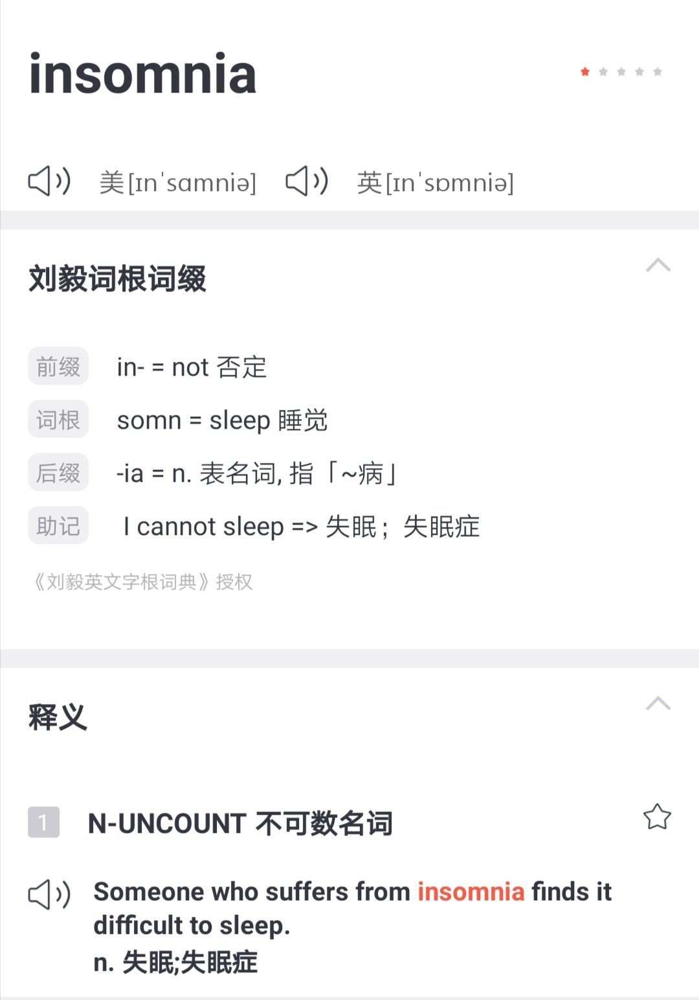

鼻窦炎 sinus<i>itis</i> 

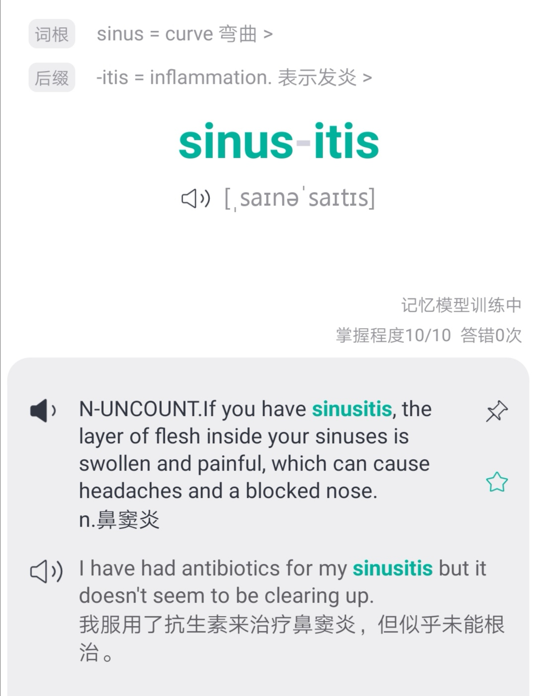

结膜炎 conjunctiv<i>itis</i>

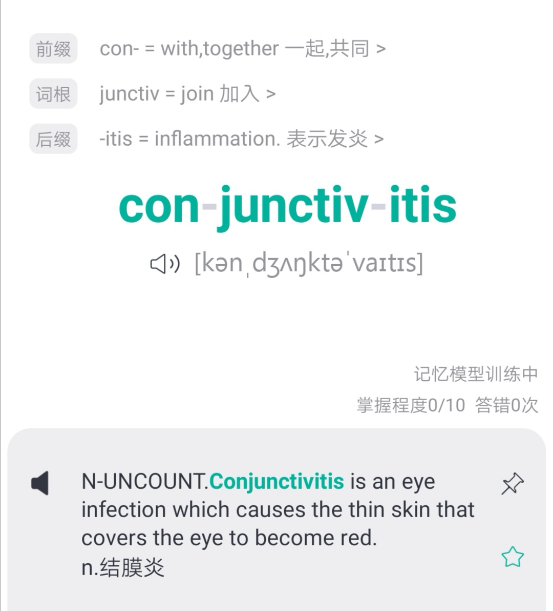

肝炎 hepat<i>itis</i>

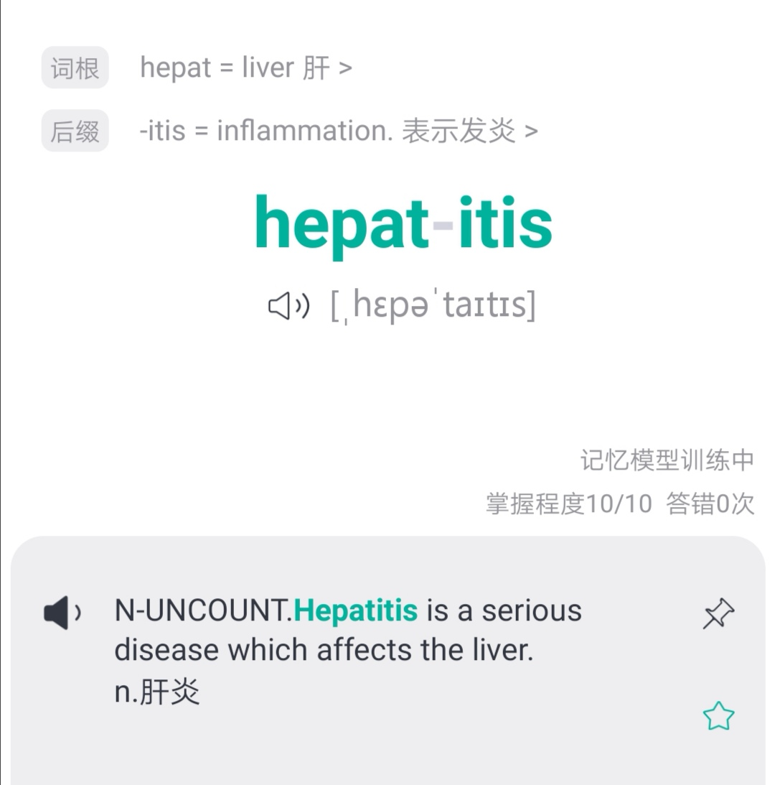

皮炎 dermat<i>itis</i>

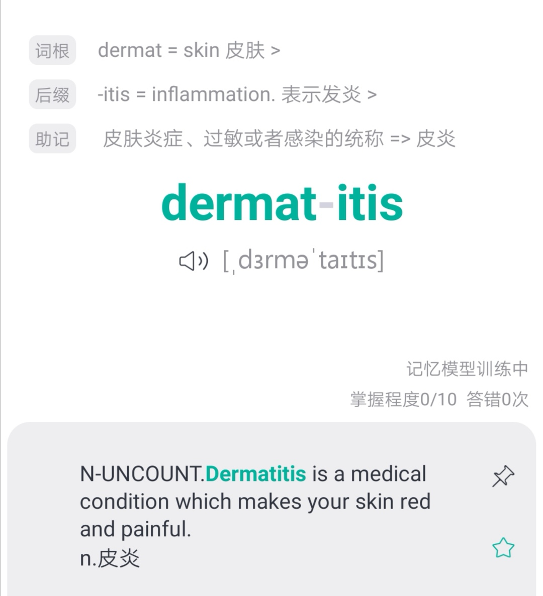

<h1 style="color:red">后记 </h1>

home

春节假期到现在，Nora待得最久的地方，是家里，自己的小房间里。 

家于我，意义几何？小栈上写的那样吗？

In every conceivable manner, the family is link to our past, bridge to our future. 

从任何意义上来看，家都是我们连接过去的纽带，是通向未来的桥梁。 

嗯，家还是一个地方，可能它很普通，也不一定美丽，但是告诉你外面世界没讲过的道理，一遍又一遍，一点都不嫌麻烦。 

就像阿兰德波顿的文字说的一样： 

What we call a home is merely any place

That succeeds in making more consistently available to us

The important truths which the wider world ignores, or which our 

distracted and irresolute selves have trouble holding on to. 

第一次「关」在家里等春天来， 

等春风微醺，暖日融融。 

愿山河无恙，人间皆安。

愿我们早日出门，闻到春天花草香，人语响。

岁月漫长，然而值得等待，(ง •̀_•́)ง。 

