

🌟你是乍暖还寒时候的暖 
🌟扒一扒个性迥异的同义词们 
🌟乍暖还寒时候，最难将息

<h1 style="color:red">壹 | 排行榜 </h1>

<h1 style="color:red">排行榜</h1>

全球榜

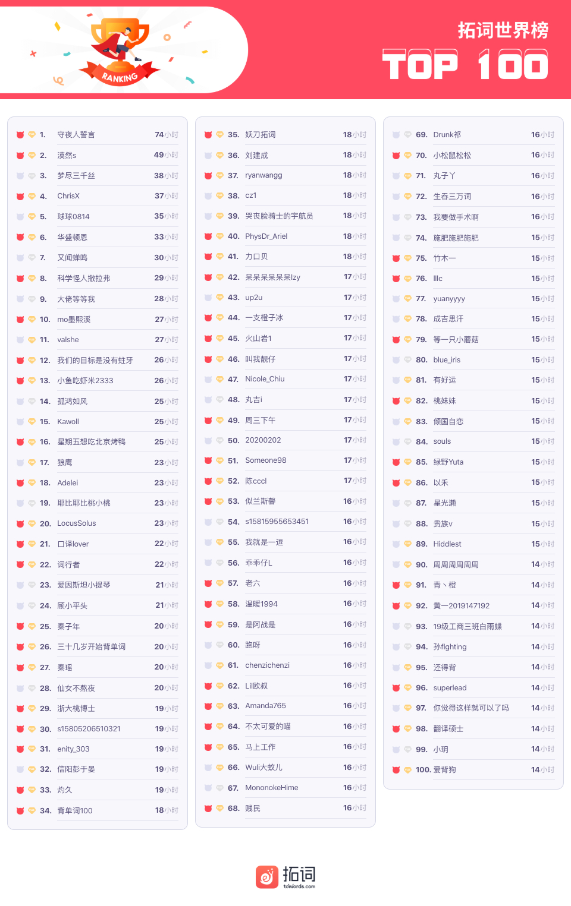

PS: 最新一周排行榜又来啦。后台时间统计单位为「分钟」，故「小时」排名分先后。

魔鬼营

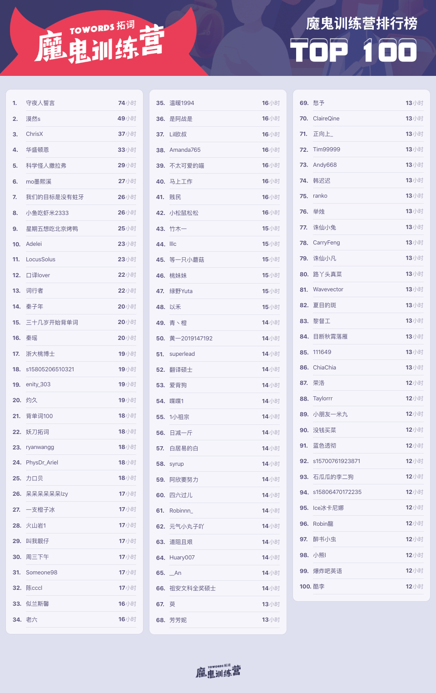

PS: 最新一周排行榜又来啦。后台时间统计单位为「分钟」，故「小时」排名分先后。

<h1 style="color:red">贰 | 拓词快讯 </h1>

你是乍暖还寒时候的暖

不能出门的日子，省了通勤的烦恼，也不用为吃饭操劳。 

余出来的时间还挺多的，看书正合适。 

最近看艺术史的书，有一句深受打动： 

As we look, we become aware that these are humanity's true faces; 
 
the artist has revealed the depravity that we are accustomed to hide behind our real masks, the faces we wear every day.

作者说的是这幅画：

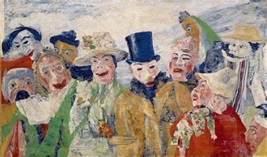

那是19世纪的欧洲，也有点像现代的社会了。

盛世狂欢下的孤独人，戴着面具，让人看不清。

不如拓词心得里的悲喜来得真真切切：

<a href="https://www.topschool.com/towords_learning_experience?experience_id=140221&userId=s15793611169326">

<i>@被风吹走的胖子</i>
(<small>点击可跳转至<i>@被风吹走的胖子</i>的拓词心得</small>)

</a>

大家好，今天是我来拓词的第25天了，我今年38岁了，是一个10岁男孩的妈妈，从前，我一直都觉得自己不可能记住这么多单词，甚至我觉得我这辈子跟英语是没什么缘分的，毕竟，在我那个年代，额，我初一开始才有英语，那时候应该是94年，三年学下来的单词量还有没我儿子小学学的多，口语更不要说了，连老师的口语都像印度阿三教的，我唯一能做到最好的就是书写，那是真的工整，直到现在，很多00后看到第一反应都是你的字好漂亮。
嗯，仅此而已。

可是，2019年，我突然萌生了出国的念头，准确的说法是，我想通了，我这个年纪，想为自己活，我想做自己感兴趣的事情。我只是不想这辈子只是活过而已，仅此而已。

说动就动，我是个行动派的鲁莽阿姨，一直都是，我去报了雅思培训机构，当我坐在学习室时，我才知道拾起久违的学习是一件多么不容易的事情，整整一天，我都在打哈欠，看书就不听打哈欠，看手机就两眼放光，一天下来，我知道单词都没记住。老师来给我上课，却看到我趴在桌子上睡得口水更久，满脸压痕的狼狈样子。我当时很尴尬，可是我跟自己说一把年纪了，怕丢什么人，我就天天坐这儿，哪怕一天记住一个我就是赚了！ 

于是，未来的一周，我每天过着快速脱妆的日子，不停的哈欠让眼泪把我坚挺的隔离霜都给洗没了，每天，我都是狼狈的顶着揉乱的鸡窝头和纯素颜灰溜溜的回家。大概过了20天，情况越来越好了，我开始看得进书并且不打哈欠了，虽然错误率很高，可是50个单词，起码第二天我能记住17个左右了，老师来上课，我也可以腰板笔直的听满两个小时。

再后来，我每周开始上那种早10点到晚8点的集中训练的课，旁边02年的小男孩哈欠连天，靠一杯杯咖啡续命，而我，精神抖擞，状态极佳的一直盯到8点钟的最后一秒，笔记也是班上最全的。听力也从连蒙带猜3.5，到了精准的7.5。我很开心

一晃到了2020年，我的计划是6月份考雅思，但是我的单词量一直是个问题，我一时间记不住这么多的单词。于是阅读，写作都成了老大难。

为此，我找了各自科目的授课老师取经，他们也给我推荐了很多背单词的APP，讲真，老阿姨虽然不是富豪，但也不缺钱，我激情澎湃的充了各种英语APP的会员VIP，可是基本上背两天就背不下去了，因为记不住，心理会产生质疑、恐慌、挫败，毕竟我前面都熬过来了，现在怎么还是记不住呢？（关键有些APP错误率还挺高，制作质量真的只能算是凑和）

最终，机缘巧合，在我放弃用APP背单词，准备啃单词书的时候，同班的00年小姑娘跟我推荐了拓词，我是抱着死马当活马医的心态下载的，我使用了几天免费的背单词通道，感觉设置的很人性化，很贴合人的记忆模式，而且制作的品质也很高，单词发音、例句还有释义，都很棒。所以我就去充了魔鬼训练营，开开心心的躲在家里，一边为国家做贡献，一边认真背单词。

今天是第25天了，为了督促自己，我还把我读研究生的学弟拉进来一起背，组成同桌，天天互相加油打气，这种每天都在进步，都有收获的感觉真好。

今年，我38了，10年作战部队参谋，6年政府纪检工作人员，4年从商个体户，离婚5年，独自一人撑起一个家和一个生命，我觉得我的人生改经历的都经历了，我为别人活够了，国家和社会我也做过贡献了，所以，从现在开始，我只想为自己活，我想做个优秀的人，做儿子的榜样。

我想用言传身教告诉他：什么叫努力的人生最美丽。

今天，很高兴在这里认识大家，也第一次写这么多关于自己的事情，希望大家可以跟我一起努力。寻求梦想的路上，无老少！！大家加油！！我自己加油！！

<a href="https://www.topschool.com/towords_learning_experience?experience_id=137321&userId=s15589279816101">

<i>@开心心</i>
(<small>点击可跳转至<i>@开心心</i>的拓词心得</small>)

</a>

不知不觉中,时光已经偷偷溜走了。我已经在拓词待了265天啦！我从一个还在学垂线和平行线的四年级学生,变成了一个在学方程的五年级学生了。

这2⃣️6⃣️5⃣️天里,我碰到了两百多个可爱的拓友们,在N个要找同桌的人当中找到了我坚持打卡的同桌@爱喝白开水,一个比我大区区两岁的女孩,她虽然比我少打卡十几天,但是拓词的数量却远远超过我!今后我一定会向她学习🤗🤗🤗!

其实,我能够和拓词见面,完全就是缘分吧！在去年五月底,老师给我们全班同学推荐了拓词,我半信半疑地下载下来,结果一拓,就把之前用的百词斩抛之脑后了。🤣🤣🤣

其实,一开始,我还不是个会员,也没有参加魔鬼训练营活动,因为我觉得那没有什么用！😓😓😓可是后来,我见几乎所有拓友们都报名了魔鬼训练营活动,好奇心越来越大，（毕竟我是个男孩😓）于是缠着妈妈给我报了魔鬼训练营,结果发现太太太太太太太太太太有用了，还送会员。

我立刻找了个同桌，结果经过3轮才成功，结果后来她不跟我同桌了，（也幸好这样才找到了我现在的桌桌@爱喝白开水）我只好找了一个急需同桌的人，刚好找到了爰喝白开水，我和她目前已经成功了7轮了，现在是第8轮。

这265天，是265次放弃和坚持中间的犹豫，是265次设定番茄钟，开始疯狂地拓词时光。时间快得像飞鸟，让我们珍惜时间，学好英语吧！（在此祝大家身体健康，平安幸福！

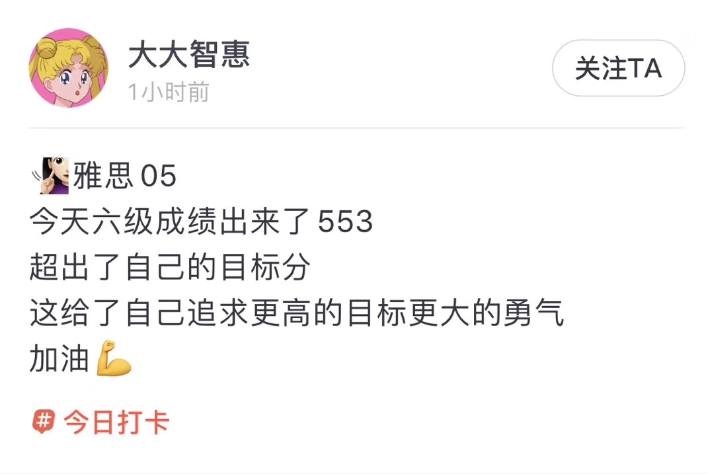
 
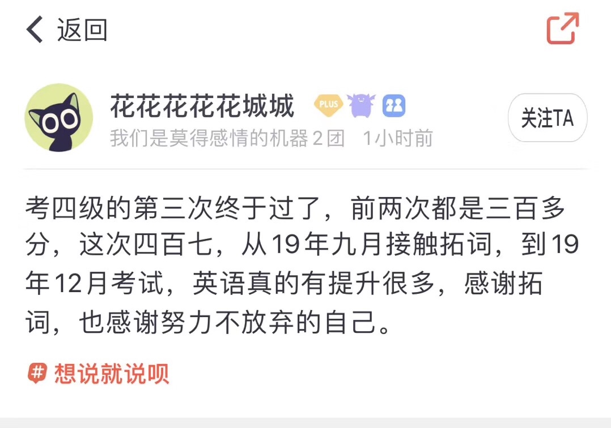
 

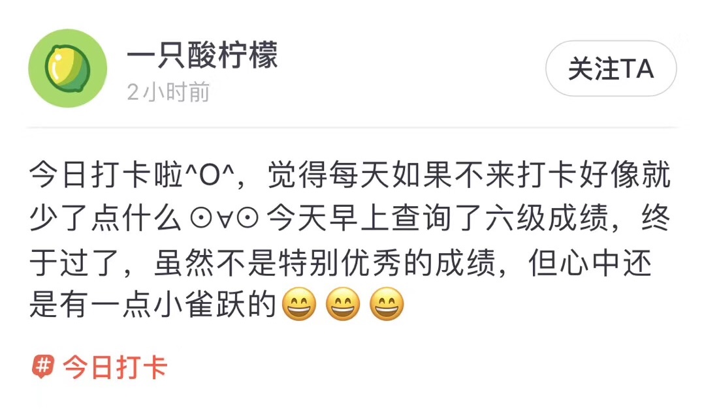
 

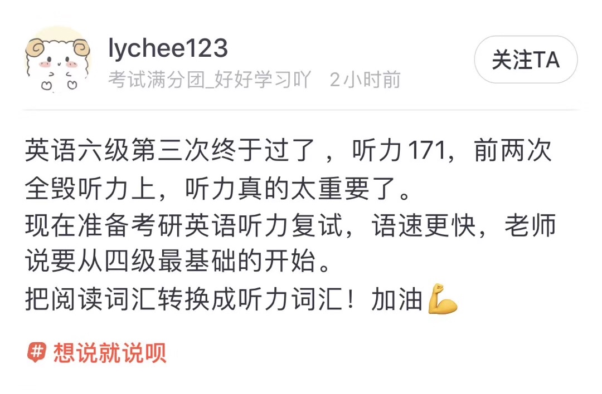
 
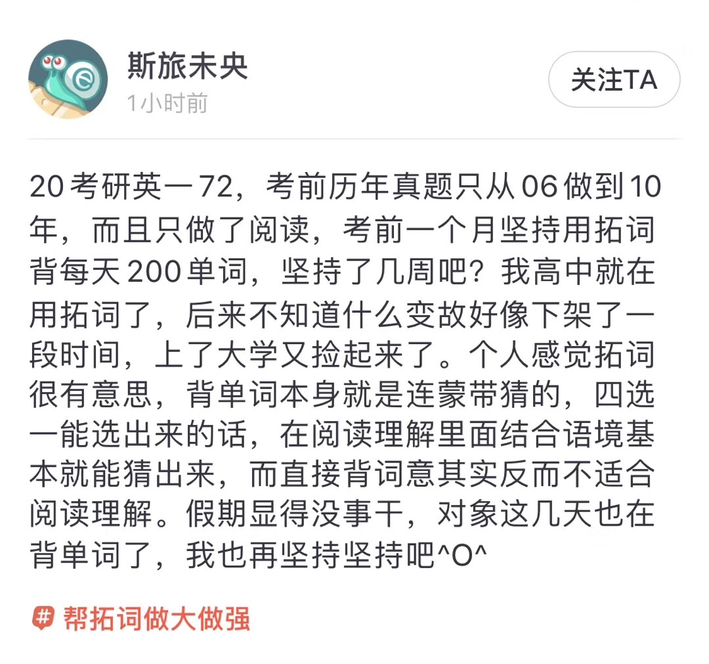
 
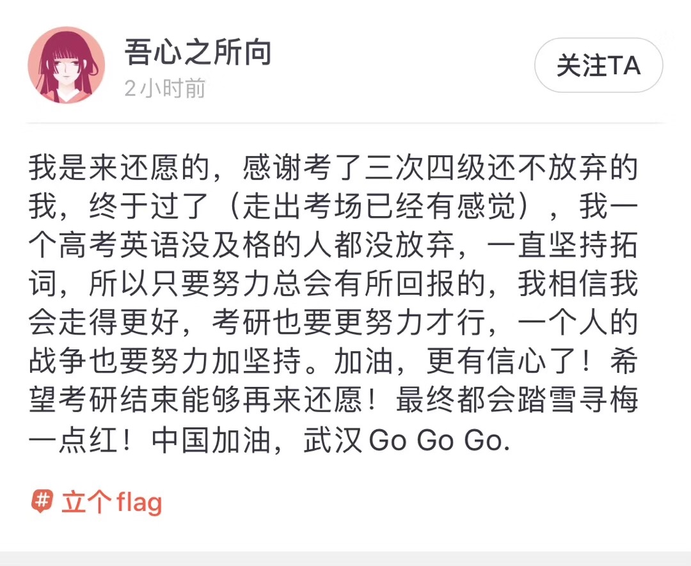
 
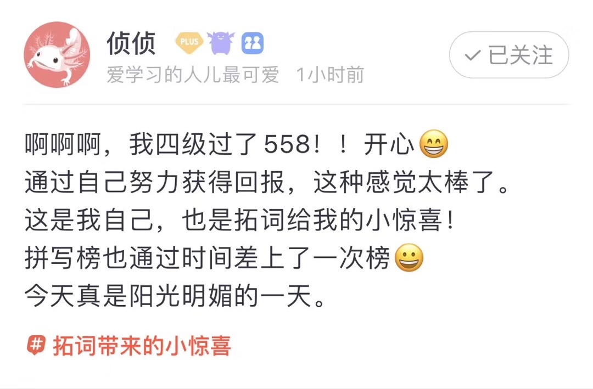

<h1 style="color:red">叁 | Nora小栈 </h1>

扒一扒个性迥异的同义词们

表示种族的词race和ethnicity常被当作同义词。 

但是释义上是有大区别的。

race的柯林斯英文释义

A race is one of the major groups which human beings can be divided into according to their physical features, such as the color of their skin. 

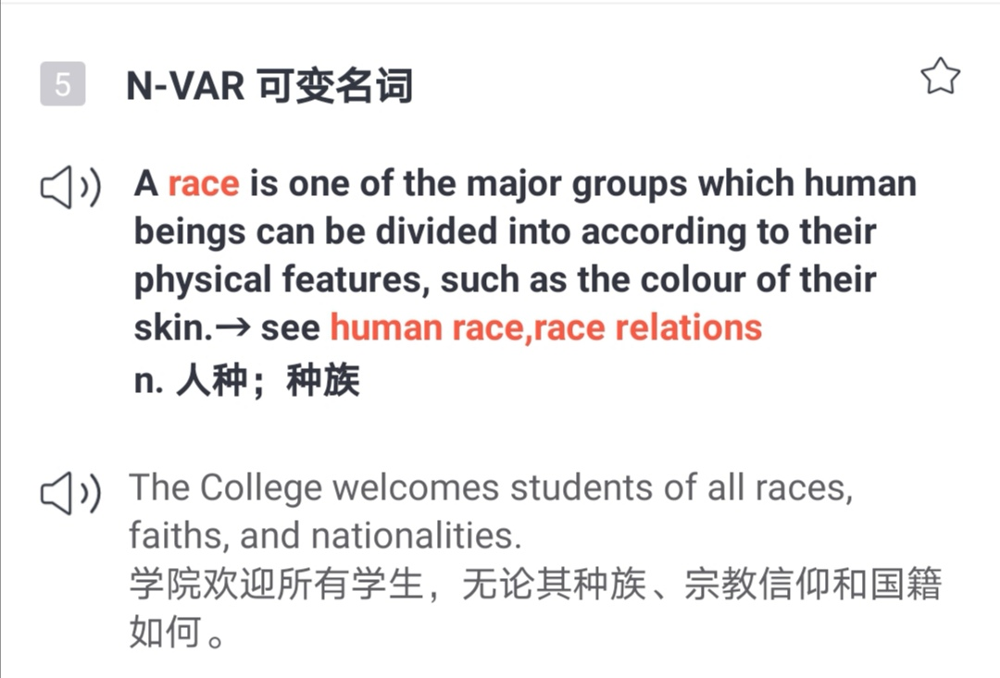

<small>截图来自拓词</small>

ethnicity的英文解释是：

Ethnicity is the state or fact of belonging to a particular ethnic group.

即ethnic的名词形式，再看看ethnic的英文释义:

Ethnic means connected with or relating to different racial or cultural groups of people. 

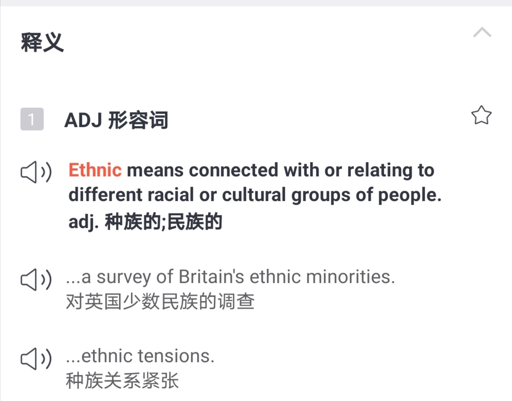

<small>截图来自拓词</small>

race是以physical features生理特征来区分，比如释义里所说的color of their skin。 

ethnicity更像是一个文化概念， 可以包括语言、传统、宗教等。 

若要我说，race的参考标准是基因决定的，ethnic可不是。哪一个标准更粗糙一看便知。 

单词race的“鼎盛时期”在18世纪，那个年代的关键词是：革命与独立。

民族主义正兴，怎么划分民族？是用physical features还是culture?明显前者更容易。 

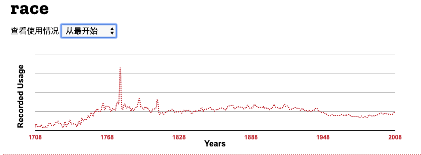

图片来自柯林斯数据

ethnicity晚将进200年，在20世纪中后期开始流行。那个年代的背景是：各种游行还有文化运动。 

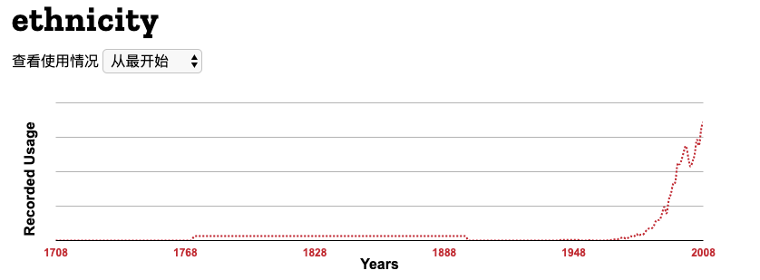

图片来自柯林斯数据

英语里头，ethnicity 这个词的形容词ethnic可与group连在一起使用，而race的形容词racial则不与group连用。 

race 和ethnicity，可以改变的是哪一个？

若要和individuality相连接，我选ethnicty。

我努力想要活出的自我并没有固定的范式。一如电影《国王的演讲》所讲，「you're very much your own man」。

我知道，人是渺小的、微茫的。

但我们天性高迈又积极呀，可以掌握知识，获得文化，甚至懂艺术和审美，好厉害的。

这样的造化不该用基因来简单圈定。 

<h1 style="color:red">后记 </h1>

乍暖还寒

这个时节，还蛮符合「乍暖还寒时候，最难将息」这句话。 

若是用英文散文来说，估计是

in the cold and warmth of it

中英皆通的大师们则是不一样的翻法。林语堂译的是

The weather, now warm, now cold, Makes it harder than ever to forget!

出自林语堂

乍暖还寒时候，最难将息。

出自李清照

读起来还挺有节奏的，比原文好背🤦‍♀️。 

只是把将息变成了forget😂。 

乍暖还寒时候，最难将息。

出自李清照

How hard is it 
To keep me fit  
In this lingering cold!

出自许渊冲

许大师的译版很有诗人的深情，就是没找到乍暖还寒的暖😂

乍暖还寒时，远方的你感受到的

是寒

还是暖?
