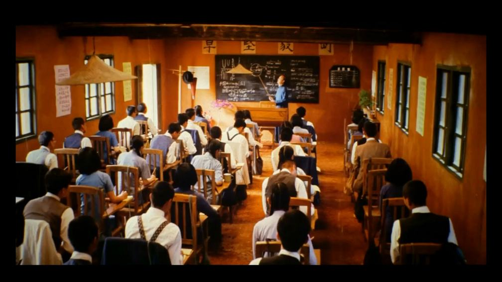

🌟宅在家的日子不如来一杯珍珠奶茶 
🌟世事洞明皆学问 
🌟英翻中，柯林斯做得还挺好

<h1 style="color:red">壹 | 排行榜 </h1>

<h1 style="color:red">排行榜</h1>

全球榜

PS: 最新一周排行榜又来啦。后台时间统计单位为「分钟」，故「小时」排名分先后。

魔鬼营

PS: 最新一周排行榜又来啦。后台时间统计单位为「分钟」，故「小时」排名分先后。

<h1 style="color:red">贰 | 拓词快讯 </h1>

世事洞明皆学问

似乎每个时代都会有高人发表关于教育的看法。 

写《师说》的韩愈。 

培根的论字系列文也有教育篇。

写《失乐园》弥尔顿，也有过长篇大论讲教育。看完Nora想起了西南联大的那群师生。 

弥尔顿说好的教育下出来的学生，应该是 when they shall be thus fraught  with an universal insight into things。

有点“世事洞明”的感觉。 

拓词里有些心得也给Nora这种感觉：这里有群人不光是语言进阶了，而且世事洞察也很厉害。 

<small>截图来自拓词心得</small>

 

<small>截图来自拓词心得</small>

 

<small>截图来自拓词心得</small>

 

<small>截图来自拓词心得</small>

<h1 style="color:red">叁 | Nora小栈 </h1>

宅在家的日子不如来一杯珍珠奶茶

居家抗"疫"的你

是否觉得一丝烦闷

寂寞的嘴巴和空虚的胃

就会让我开始思考人生

想吸珍珠，甜甜糯糯那种……

想喝奶盖，DuangDuangDuang那种……

所有的人生思考都会努力化成行动：

“点奶茶吗？”

“奶茶”，作为当代青年的快乐水

用英语应该怎么说？

  
? ? Milk tea ？？

歪果仁倒是听得懂，但是可能会理解错

因为milk tea更多的是指传统的英式奶茶

(直接用奶冲到茶里,还会配小点心那种~)

<marquee behavior="alternate">奶茶到底怎么说？</marquee>
<marquee behavior="slide" >奶茶到底怎么说？</marquee>
<marquee behavior="scroll">奶茶到底怎么说？</marquee>
<marquee direction="right">奶茶到底怎么说？</marquee>

▲ Boba tea

波霸奶茶，珍珠奶茶

☆ May I have a medium sized boba tea?

我可以要一杯中杯的珍珠奶茶吗？

▲ Bubble tea

泡泡茶

☆ How do you know I like bubble tea? 

你怎么知道我爱喝奶茶？

▲ Pearl milk tea 

珍珠奶茶

☆ I'm making pearl milk tea. 

我在煮珍珠奶茶！

加布丁？还是红豆？

▲ Pudding

布丁

☆ This is a mould of pudding. 

这是在模子中做成的布丁。

▲ Red bean

红豆

☆Red bean paste is a sweet , dark red bean paste originating from china.

红豆沙是一种由红豆制成的中国甜食。

<marquee behavior="alternate">奶茶怎么点</marquee>
<marquee behavior="slide" >奶茶怎么点</marquee>
<marquee behavior="scroll">奶茶怎么点</marquee>
<marquee direction="right">奶茶怎么点</marquee>

▲甜度 

extra sugar 多糖

● regular sugar 正常糖

● less sugar 少糖

● half sugar 半糖

● little sugar 微糖

● no sugar 无糖

▲ 冷热 

● regular ice 正常冰

● less ice 少冰

● little ice 微冰

● no ice 去冰

宅在家如何煮奶茶？

▲ 常规版 

▷白糖加入无水的锅中，中火加热至成琥珀色

▷往锅中倒入牛奶+茶叶，焦糖会突然结块，但是慢慢会化开

▷煮至奶茶颜色不再变，捞出茶叶，一杯奶茶就做好了

▲十三香版本

十三香本身没有味道，只是一种香料，步骤跟常规版一样，就是在第二步多加一小勺十三香，煮出来的奶茶香料味会比较重。

感兴趣的亲们可以去某站搜下up主夏川秋鱼的十三香奶茶教程

▲王老吉版本

最简单的都不用开火！配比：旺仔牛奶:王老吉=2:1 传说中有点像烧仙草奶茶，感兴趣就可以试试看。

班班动手做的奶茶 
大家宅在家也可以试试
 

<h1 style="color:red">后记 | 盘点柯林斯 </h1>

此处有深意，妙不可言

先做个题吧。碰到这个句子该怎么翻？

▲ 
His stomach had grown more <b>prominent</b> with every passing year.

以下是网络提供的3个参考答案。

看完更明白了《经济学人》说的话，AI在文字创作上取代人类还远着呢。 

▷某道：他的肚子一年比一年突出。 

▷某度：他的胃口一年比一年突出。 

▷某云：随着时间的推移，他的胃口越来越大。

肚子突出的画面不敢想象。

胃口一年比一年突出？？

话就很奇怪。如果不是关系熟，又咋能知道胃口是变大了还是小了。 

stomach此处该翻译成肚子还是胃口，不是一件随意的事情。 

<small>截图来自拓词柯林斯</small>

看得懂prominent的英文解释，答案就有了。

▲ something that is prominent is very <b>noticeable</b> or an important part of something else
.

<small>截图来自拓词柯林斯</small>

胃口好不好，看面相可不能知道。绝对不是什么非常<i>noticeable</i>（明显的）的事情。

有了<i>prominent</i>这个词打底，<i>stomach</i>翻译成胃口不太合适了。 

整句翻译成「<i>他的肚子一年比一年鼓</i>」还行，不突兀。 

<small>截图来自拓词柯林斯</small>

<i>肚子一年比一年鼓</i>，大概率人到中年，然后发福，或者油腻吧😂

