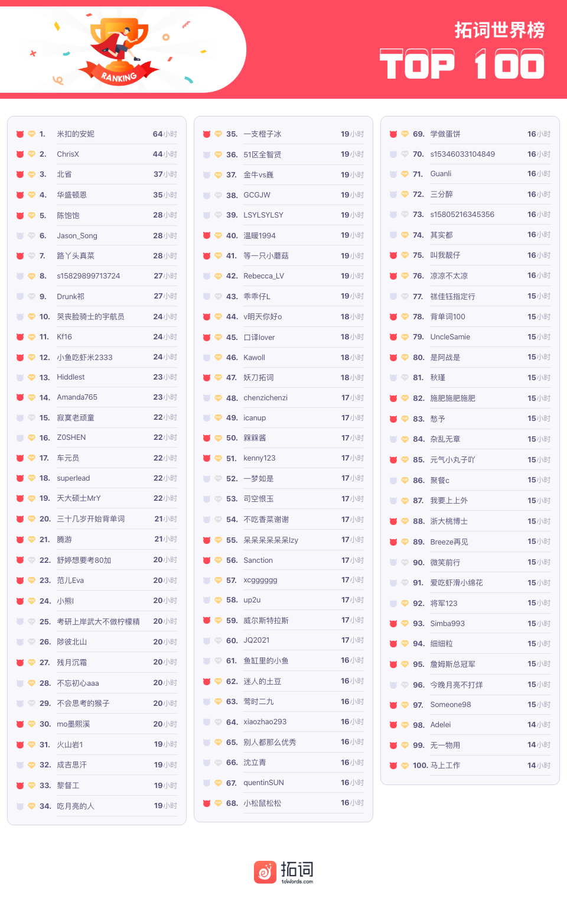

🌟新冠肺炎，pandemic和epidemic到底用哪个？ 
🌟此处有深意，妙不可言 
🌟莎翁戏剧的情理之中与意料之外

<h1 style="color:red">壹 | 排行榜 </h1>

<h1 style="color:red">排行榜</h1>

全球榜

PS: 最新一周排行榜又来啦。后台时间统计单位为「分钟」，故「小时」排名分先后。

魔鬼营

PS: 最新一周排行榜又来啦。后台时间统计单位为「分钟」，故「小时」排名分先后。

<h1 style="color:red">贰 | 拓词快讯 </h1>

选择

西方有文学家这样评莎士比亚的作品：

Expectation in preference to surprise

作家还用<big><i>看流星</i></big>we startle at a shooting star和<big><i>看日出</i></big>watching the sunrise at the pre-established moment来了一次比较。 

结论是surprise比起expectation来，low得很。 

有人说看莎士比亚，看的是亘古不变的人心，善恶的因果循环。行善者终究会被温柔以待。恶人终究不得善终。

莎剧故事开了头，结局其实已经写好，妙的是中间的跌宕起伏。 

某些现代剧看不下去，大部分归功于莫名其妙的剧情硬伤，还不是剧里surprise太多，expectation太少。

<s>都多少年了，跟莎翁学学不好吗？</s>

按照柯林斯的说法，surprise是意料之外的骤然获得。expectation是情理之中的徐徐图之。 

比起来，现代人期待的人生好像更倾向于surprise，而不是expectation。

当今恐怕难再有学箭的纪昌了，expectation的过程长达6年。

比起好好背单词，词汇量暴涨，速成这样的话题更能吸引眼球。

名家说，「so low is surprise compared with expectation.」

同意。在山顶等第一缕霞光，花一季光阴等花开，都是美好又确定的expectation。

用21天，100天，200天甚至更多的日子，来攒词汇量也是～👏👏👏

 
 
 
 
 
 
 
 

<h1 style="color:red">叁 | Nora小栈 </h1>

新冠肺炎，pandemic和epidemic到底用哪个？

今天，我们来一起辨析两个词的意思～

从疫情发生以来，表示流行病的pandemic和epidemic经常出现在各个报道中，那么这两个单词有什么区别呢？

尽管这两个词很相近，但二者指的不是同一种东西。

<small>截图出自拓词柯林斯</small>

感染控制和流行病学专业人员协会在网站上解释道：“当一种传染性疾病迅速传播给许多人时，就被称为epidemic。”通常，epidemic发生之前会有outbreak（疾病暴发），即“某种疾病案例的突然增加”。Outbreak可能影响到单个社区或几个国家，但规模比epidemic小得多。

<small>截图出自拓词柯林斯</small>

如果一场epidemic不能被控制住，还在不断蔓延，公共卫生官员可能就要开始称之为pandemic，意思是这场流行病已经影响到世界不同地区足够多的人，到了全球性暴发的程度。

1918年到1919年的西班牙流感在全世界导致2000万至4000万人丧生，这种流行病属于pandemic；离现在更近的2009年的甲型流感也是pandemic。

世界卫生组织24日表示，新冠肺炎疫情仍然可以被战胜，现在宣布它为全球性流行病还为时过早，尽管存在这种可能性。

"The key message that should give all countries hope, courage and confidence is that this virus can be contained," WHO Director-General Tedros Adhanom Ghebreyesus told a news conference in Geneva. 

 

世卫组织总干事谭德塞在日内瓦举行的记者会上说："应该给所有国家带来希望、勇气和信心的关键信息是'该(新冠)病毒可以被遏制"。

"Using the word 'pandemic' now does not fit the facts but may certainly cause fear," he said. "We must focus on containment while doing everything we can to prepare for a potential pandemic." 

"目前使用'全球性流行病'一词不符合事实，却一定会引起恐慌。我们现在应该集中精力控制疫情，尽一切努力为潜在的全球流行做好准备。"

现在，你明白这两个单词的区别了吗？如果之后在写作中用到的话，一定要严谨一点呀～

<h1 style="color:red">后记 | 颜色 </h1>

此处有深意，妙不可言

在古代，颜色也分尊卑。 

成语“恶紫夺朱”，说的是卑贱的紫色要取代尊贵的红色，表示以邪压正。

孔子说：「君子不以绀緅饰，红紫不以为亵服」。

古代君子衣服颜色选择上并不“自由”。用来镶边的布不能选天青色或铁灰色。家居服不宜用红色或者紫色的布。

唐朝时，「庶人以白为服」，所以白衣多指平头百姓。 

古代的西方则不同，仕人衣白袍。

<small>出自电影《埃及艳后》</small>

单词candidate也保留了这层含义：

<small>截图出自拓词柯林斯</small>

颜色并不仅仅只代表颜色本身。 

善意的魔法是<b>white</b> magic。 

<b>White</b> magic is the believed use of supernatural powers or magic for selfless purposes.

<b>white</b> witch是<i>善行</i>女巫。 

Basically,<b>white</b> witches are those who practice goodness and benevolence in all they do. 

They do not cast spells to harm others or to do selfish things for themselves that would involve intentional harm to others.

days marked with a <b>white</b> stone是<i>幸福</i>的日子。

a <b>white</b> lie是<i>善意</i>的谎言。 

颜色是客观的存在，对所有人来说，本质应是相同。不同的文化赋予了颜色不同的联想,这也是语言的魅力吧。