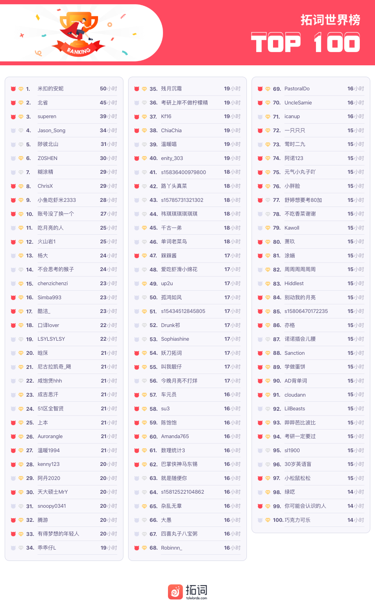
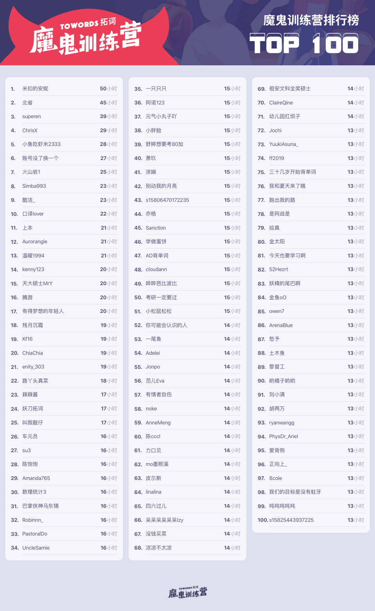
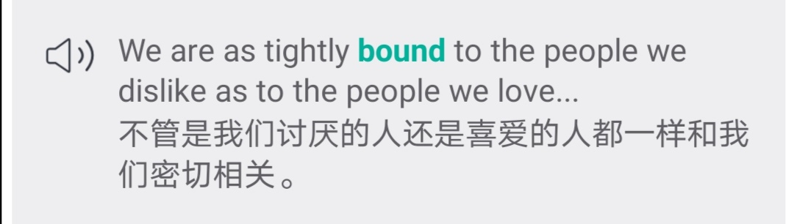

🌟拓友「私人定制」日签 
🌟当你说话时，你继承了那门语言的世界观 
🌟年年惜春春易老

<h1 style="color:red">壹 | 排行榜 </h1>

<h1 style="color:red">排行榜</h1>

全球榜

PS: 最新一周排行榜又来啦。后台时间统计单位为「分钟」，故「小时」排名分先后。

魔鬼营

PS: 最新一周排行榜又来啦。后台时间统计单位为「分钟」，故「小时」排名分先后。

<h1 style="color:red">贰 | 拓词快讯 </h1>

拓友定制日签

拓词打卡日签改版了。 

 

 

第一批日签来源不止有Ariel，还有其他曾经参加过春节翻译赛的小伙伴。  

 

根据内幕消息，拓词打算打卡日签一年365天（366天）不重样，欢迎广大拓友投稿。

内容包括但不限于如下：

1 <b>原创的格言金句</b>，句句都是拓友的肺腑之言

2 <b>柯林斯的经典例句</b>，鉴别力其实也是一种英语能力

比如bound的柯林斯例句：

<small>截图出自拓词柯林斯</small>

3 <b>原创的翻译，需提供中英文</b>。英翻中，中翻英皆可。 

加一的翻译就属于很好的的中翻英了。

英翻中可参考<i>英语下午茶</i>的拓友翻译：

英文原文出自英国大文豪Samuel Johnson:

<i>What we hope to do with ease</i>,  
<i>we mush learn first to do with diligence</i>.

来自下午茶学员的翻译：

▷<i>你要用尽全力，才能看起来毫不费力</i>。

▷<i>笃学不倦，方能得心应手</i>。

🔔🔔<big>内容重点是</big>🔔🔔

<b>原创</b>、<b>短小精悍</b>

<marquee behavior="alternate">
<b>原创</b>、<i>短小精悍</i></marquee>
<marquee behavior="slide" >
<i>原创</i>、<b>短小精悍</b></marquee>
<marquee behavior="scroll">
<i>原创</i>、<i>短小精悍</i></marquee>
<marquee direction="right">
<b>原创</b>、<i>短小</i><b>精悍</b></marquee>

所有被采纳的都会标注投稿人的昵称，期待在心得区（拓词APP发现页心得区）看见大家的优美文字呀～

<h1 style="color:red">叁 | Nora小栈 </h1>

当你说话时，你继承了那门语言的世界观

多学一门语言的好处就是什么呢？

非要计较投入产出的话，可以这样来算：

1 发财

职场里的优质加分项。

劳动力市场里有门语言经济学：一般外语好的人，工资就是高一些。 

2 辟谣

看得出别人是一本正经还是胡说八道，免得被诓了。

一年前的新西兰枪击案，主流媒体是这么报道的

...嫌疑犯腿上绑着杂志...🤯

3 延年益寿

这个说法来源于《经济学人》。

How things have changed. In the past decade it has become almost common knowledge that bilingualism is good for you—witness articles such “Why Bilinguals are Smarter” and “The Amazing Benefits of Being Bilingual” by the New York Times and the BBC. Stacks of research papers have suggested that two-tongued people enjoy a variety of nonlinguistic advantages. <u>Most notably, they have shown that bilinguals get dementia on average four years later than monolinguals</u>, and that they have an edge in “executive control”—a basket of abilities that aid people doing complex tasks, including focusing attention, ignoring irrelevant information and updating working memory.

-The Economist

 

最值得注意的是，他们发现双语者患上痴呆症的平均时间上比单语者晚四年。

Most notably, they have shown that bilinguals <u>get dementia on average four years later</u> than monolinguals

不那么“功利”地来看的话，Nora觉得学外语大概是在修一门功夫。功夫练好了，走江湖也更容易些了。

《一代宗师》讲「人这一生,要见众生,见天地,见自己」，学外语也莫不如此。《经济学人》这篇的结尾写得极妙，Nora觉得也对得上「见众生,见天地,见自己」了。

A second language <i>expands the number of people</i> you can talk to. 

It <i>adds to the ways</i> you can say things, and so offers a second point of view on the whole business of expression. 

Bilingualism may <i>help you understand other people</i>...

The Economist

话说，学外语给你带来你什么样的好处呢？想说什么直接留言吧。 

最后附上这次魔鬼营精读课的<s>鬼畜饶舌</s>视频片段

视频可点击播放

👇

<video width="100%" height="auto" controls="false" poster="https://new-towords.oss-cn-beijing.aliyuncs.com/web/zhongyu/reading.png">
<source src="https://new-towords.oss-cn-beijing.aliyuncs.com/web/zhongyu/readingclip.mp4" type="video/mp4"/>
</video>
 

<h1 style="color:red">后记 | 春色 </h1>

罗密欧与朱丽叶

莎翁与他的剧永垂不朽。

除了莎翁本身业务能力极其厉害之外，莎评家的功劳也不可小觑。 

英国文坛仅次于莎翁的男人，柯林斯大字典序言里都会cue的Samuel Johnson，比起编英文字典，他其实更擅长写莎评文章。(经济学人的Johnson板块就是这个Johnson)

他读莎翁说里面写满了人性，估计和他的人生经历也有关系。 

华兹华斯的好朋友，也叫Samuel的Coleridge也是了不起的莎评家。

如果说Johnson读出的人性是「见众生」，那Coleridge可能属于「见天地」。有一股造化和自然的感觉。 

That law of unity, which has its foundations, not in the factitious necessity of custom, but in nature itself, the unity of feeling,is everywhere and at all times observed by Shakespeare in his plays. 

出自Samuel Coleridge

别人读罗密欧与茱丽叶是美丽而残忍的爱情。 

Coleridge读出了少年和春日的气息，不愧是湖畔派诗人的好朋友。

他说这出戏文里有spring, flower, 还有transiency，果真是戏文也是春日。 

不只是年轻人符合春日的特质，主角们的父母也满足。

The old men, the Capulets and the Montagues, are not common old men; they have an eagerness, a heartiness, a vehemence, the effect of spring.

出自Samuel Coleridge

春光灿烂，爱情也是。

春色短暂，罗密欧和茱丽叶的love story也是。 

唉，年年惜春春易老。

