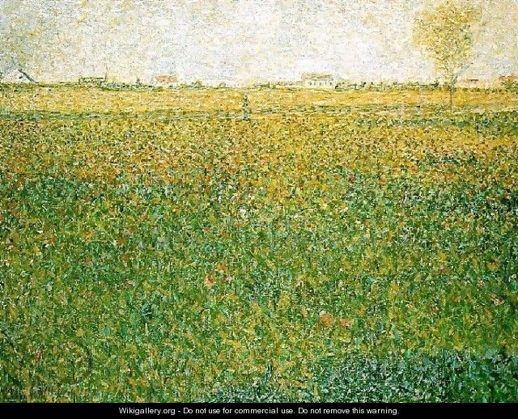

.

白色在西方代表纯洁和圣洁。 
。 

莎士比亚所有的作品都有一个特点：一以贯之(unity)
 factitious， not natural, sth made by man. 人为的，人工做出来的。 
-
一致不是这种：戏文讲的是300年前的事，舞台上努力用一切手段再现当年的风貌（custom）。 
而是每部戏色调和情感的均一。 
莎翁所有戏剧中都奉行这一点。 
麦克白夫人，一定是一袭黑衣，阴郁在一边。 
朱丽叶，白色长裙才和青春纯真美好的爱情联系在一起。

002 That law of unity, 
which has its foundations, 
not in the factitious necessity of custom, 
but in nature itself, the unity of feeling,
is everywhere and at all times
observed by Shakespeare in his plays. 

内容引用：

红色边框

图片缩小尺寸

If you're looking for an adjective that means "sticking out above the rest; famous," consider prominent. A prominent person might be the big cheese, the head honcho, the top dog — not just any Joe Schmo.

When the flowers open in spring they fill the night air with a fragrance that <b>defies</b> description...

只可意会不可言传也。 有点像英国大散文家说的那样子

We must "give it an understanding, but no tongue.此中有深意，但是只可意会不可言传。

如果你问我春天的颜色是什么？也属于上述情况。 

若是非要一个答案，那选Seurat的画吧。 

