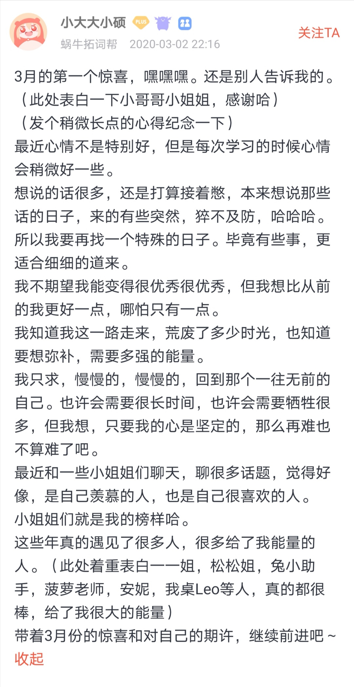

🌟不负春光 
🌟天涯共此时 
🌟语法挑战要来了

<h1 style="color:red">壹 | 排行榜 </h1>

<h1 style="color:red">排行榜</h1>

全球榜

PS: 最新一周排行榜又来啦。后台时间统计单位为「分钟」，故「小时」排名分先后。

魔鬼营

PS: 最新一周排行榜又来啦。后台时间统计单位为「分钟」，故「小时」排名分先后。

<h1 style="color:red">贰 | 拓词快讯 </h1>

海内存知己，天涯若比邻

柯林斯说：

<i>大多数人都忙于自己的烦心事，而无暇提供太多的帮助</i>。 

柯林斯还说过<i>没有什么比孤军作战更可怕的了</i>。

这个时代，人与人之间的疏离愈发地明显，明明是友邻，可能一年到头也说不上几句话。 

但是相同频率的人之间的默契，好像比任何事情都来得更确定。 

有人即使隔着山，隔着海，隔着日月，却依然熟悉。 

也许同桌之间，不是端坐在书桌两边你我相视一笑，而是隔着早上的雾气与夜晚的星光相望。

都是美好的相遇（缘分）呀，世当珍惜。 

古人说的<i>海内存知己，天涯若比邻</i>不过如此了。

<small>纽约时间的Leo</small>

<small>北京时间的同桌小硕子</small>

另外，同桌2.0版本正在筹划中了，可以和没会员的小伙伴结同桌啦。 

<h1 style="color:red">叁 | Nora小栈 </h1>

好言一句三冬暖

今天，我们来学习👆实用口语～

当你觉得别人有奇思妙想的时候，你要怎么表达自己的赞美呢？

现在，就和我们一起来学习形容别人“主意好！”的5个句子吧～

<audio :src="(()=>require('./asset/44/好主意.mp3'))()" controls />
 

今天的口语你们学会了吗？快来跟着录音多练几遍吧！

<h1 style="color:red">后记 | 不负春光 </h1>

听，春雨敲窗

提到明媚春光，Nora很喜欢这句诗

<i>小楼一夜听春雨</i>，

<i>深巷明朝卖杏花</i>。

有点像柯林斯例句所言：

<i>这场雨过后，野花会变得美不胜收</i>。 

<small>出自拓词柯林斯词典</small>

诗里的杏花，肯定比野花更明艳大气。 

<b>乔伊斯</b>的那句<i>I heard the rain impinge upon the earth</i>，和这句诗倒是也神似。

不止陆游，有名的文人都有听过雨，写过诗。

近代的戴望舒留下的诗，最著名的也是那首《雨巷》。

关于中国诗歌盛行，林语堂在《吾国与吾民》写<i>雨打芭蕉</i>前说过这样的话： 

Sometimes it appeals to their romanticism and gives them a vicarious emotional uplift from the humdrum workaday world...

出自《吾国与吾民》

因为华夏人有着优雅浪漫的心性，所以古来诗歌盛行。如果天天想的问题可现实了，哪里会有浪漫的诗。 

所以文人多有雅好——<i>听雨</i>。 

<small>出自电影《无问西东》</small>

古人说<i>种蕉可以邀雨</i>，难怪不出门，光听雨就很开心。

 

林语堂在《吾国与吾民》写<i>雨打芭蕉</i>

It teaches them to listen with <i>enjoyment</i> to the sound of raindrops on banana leaves...

柯林斯的英文语境写雨，虽然没有<i>春雨敲窗</i>来得有诗意，也嚼得出一份静谧来

<small>出自拓词柯林斯词典</small>

春雨敲窗，花月如常，愿你我皆不负春光。 

<h1 style="color:red">预告  </h1>

语法挑战和收藏要来了

敬请期待～