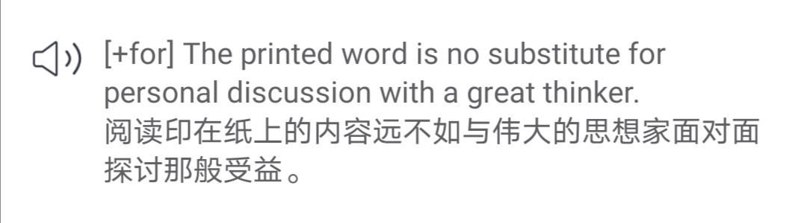

🌟谚语和习语用多了会变得俗气 
🌟写作最重要的阶段是修改 
🌟语言的区别 

<h1 style="color:red">壹 | 排行榜 </h1>

<h1 style="color:red">排行榜</h1>

全球榜

PS: 最新一周排行榜又来啦。后台时间统计单位为「分钟」，故「小时」排名分先后。

魔鬼营

PS: 最新一周排行榜又来啦。后台时间统计单位为「分钟」，故「小时」排名分先后。

<h1 style="color:red">贰 | 拓词快讯 </h1>

语言大师柯林斯

柯林斯的例句里藏着很多独到的见解，柯林斯的编辑肯定算得上语言学上的大师了。

比如<i>subtlety</i>的例句：

<i><big>当一本书被翻译成另一种语言后，所有那些语言上的精妙之处就丢失了</big></i>。

<small>出自拓词柯林斯词典</small>

并且用<i>broader</i>的例句证明了这个观点。 

<small>出自拓词柯林斯词典</small>

<i>crime</i>的例句也很妙，比起其他家的算是很诗意了：

<i><big>语言是一种精心调试的乐器，破坏它就是一种罪过</big></i>。

<small>出自拓词柯林斯词典</small>

估计说的是语法，毕竟柯林斯认为口音不地道可以接受，语法问题不能忍。 

<i><big>地方口音还可以接受，但要下大力气纠正语法错误</big></i>。

<small>出自拓词柯林斯词典</small>

不意外形容词和名词的搭配就说了好几条。 

 

<small>出自拓词柯林斯词典</small>

写作不是一遍就结束了。 

<i><big>实际上写作过程中最重要的阶段是修改</big></i>。

<small>出自拓词柯林斯词典</small>

阅读不可囫囵吞枣。 

<i><big>阅读行为的关键在于对语言的理解</big></i>。

<small>出自拓词柯林斯词典</small>

「纸上得来终觉浅」，有能力的话可以找个厉害的导师谈笑风生。

<i><big>阅读印在纸上的内容远不如与伟大的思想家面对面探讨那般受益</big></i>。

<small>出自拓词柯林斯词典</small>

谚语也不可多用，用多了就是俗气。 

<i><big>谚语和习语会由于使用过多而变得俗套</big></i>。

<small>出自拓词柯林斯词典</small>

Nora对这些语言学习观点很是认同呀，你怎么看？

<h1 style="color:red">叁 | Nora小栈 </h1>

语言的区别

  又到了我们学习词义辨析的时间了，今天我们要讨论的单词是“语言”～

  说到“语言”的单词，你是不是会想起language、lingo、tongue这三个单词？
    
   

  今天，我们就来辨析一下这三个单词如何区分～
    
   

<section style="max-width: 100%;font-family: -apple-system-font, BlinkMacSystemFont, &quot;Helvetica Neue&quot;, &quot;PingFang SC&quot;, &quot;Hiragino Sans GB&quot;, &quot;Microsoft YaHei UI&quot;, &quot;Microsoft YaHei&quot;, Arial, sans-serif;letter-spacing: 0.5440000295639038px;white-space: normal;line-height: 2em;text-align: left;box-sizing: border-box !important;word-wrap: break-word !important;">
   
</section>
<section style="max-width: 100%;font-family: -apple-system-font, BlinkMacSystemFont, &quot;Helvetica Neue&quot;, &quot;PingFang SC&quot;, &quot;Hiragino Sans GB&quot;, &quot;Microsoft YaHei UI&quot;, &quot;Microsoft YaHei&quot;, Arial, sans-serif;letter-spacing: 0.5440000295639038px;white-space: normal;text-align: left;line-height: 2em;box-sizing: border-box !important;word-wrap: break-word !important;">
  这三个单词与我们书面或口头的交流方式有关。
    都可以指使用文字或声音进行交流的行为或风格。
    
</section>
<section style="max-width: 100%;font-family: -apple-system-font, BlinkMacSystemFont, &quot;Helvetica Neue&quot;, &quot;PingFang SC&quot;, &quot;Hiragino Sans GB&quot;, &quot;Microsoft YaHei UI&quot;, &quot;Microsoft YaHei&quot;, Arial, sans-serif;letter-spacing: 0.5440000295639038px;white-space: normal;text-align: left;line-height: 2em;box-sizing: border-box !important;word-wrap: break-word !important;">
   
</section>
<section style="max-width: 100%;font-family: -apple-system-font, BlinkMacSystemFont, &quot;Helvetica Neue&quot;, &quot;PingFang SC&quot;, &quot;Hiragino Sans GB&quot;, &quot;Microsoft YaHei UI&quot;, &quot;Microsoft YaHei&quot;, Arial, sans-serif;letter-spacing: 0.5440000295639038px;white-space: normal;text-align: left;line-height: 2em;box-sizing: border-box !important;word-wrap: break-word !important;">
  <strong>“Language”</strong>
  是最中性的一个，使用范围也最广，并且可以与大多数其它单词结合，创造出更具体的复合名词。
    
</section>
<section style="max-width: 100%;font-family: -apple-system-font, BlinkMacSystemFont, &quot;Helvetica Neue&quot;, &quot;PingFang SC&quot;, &quot;Hiragino Sans GB&quot;, &quot;Microsoft YaHei UI&quot;, &quot;Microsoft YaHei&quot;, Arial, sans-serif;letter-spacing: 0.5440000295639038px;white-space: normal;text-align: left;line-height: 2em;box-sizing: border-box !important;word-wrap: break-word !important;">
   
</section>
<section style="max-width: 100%;font-family: -apple-system-font, BlinkMacSystemFont, &quot;Helvetica Neue&quot;, &quot;PingFang SC&quot;, &quot;Hiragino Sans GB&quot;, &quot;Microsoft YaHei UI&quot;, &quot;Microsoft YaHei&quot;, Arial, sans-serif;letter-spacing: 0.5440000295639038px;white-space: normal;text-align: left;line-height: 2em;box-sizing: border-box !important;word-wrap: break-word !important;">
  <strong>“Lingo”</strong>
  指的是一种非正式的语言，或是指一个特定群体使用的语言。
    
</section>
<section style="max-width: 100%;font-family: -apple-system-font, BlinkMacSystemFont, &quot;Helvetica Neue&quot;, &quot;PingFang SC&quot;, &quot;Hiragino Sans GB&quot;, &quot;Microsoft YaHei UI&quot;, &quot;Microsoft YaHei&quot;, Arial, sans-serif;letter-spacing: 0.5440000295639038px;white-space: normal;text-align: left;line-height: 2em;box-sizing: border-box !important;word-wrap: break-word !important;">
   
</section>
<section style="max-width: 100%;font-family: -apple-system-font, BlinkMacSystemFont, &quot;Helvetica Neue&quot;, &quot;PingFang SC&quot;, &quot;Hiragino Sans GB&quot;, &quot;Microsoft YaHei UI&quot;, &quot;Microsoft YaHei&quot;, Arial, sans-serif;letter-spacing: 0.5440000295639038px;white-space: normal;text-align: left;line-height: 2em;box-sizing: border-box !important;word-wrap: break-word !important;">
  <strong>“Tongue”</strong>的意思和 “language” 很相近，但更具有文学色彩。
    “Tongue” 也可以描述交流的风格，但是能与 “tongue” 搭配使用表示和 “语言” 相关的单词组合较少。
    
  
</section>
 

<section style="max-width: 100%;font-family: -apple-system-font, BlinkMacSystemFont, &quot;Helvetica Neue&quot;, &quot;PingFang SC&quot;, &quot;Hiragino Sans GB&quot;, &quot;Microsoft YaHei UI&quot;, &quot;Microsoft YaHei&quot;, Arial, sans-serif;letter-spacing: 0.5440000295639038px;white-space: normal;line-height: 2em;text-align: center;box-sizing: border-box !important;word-wrap: break-word !important;">
   
</section>
<section style="max-width: 100%;min-height: 1em;font-family: -apple-system-font, BlinkMacSystemFont, &quot;Helvetica Neue&quot;, &quot;PingFang SC&quot;, &quot;Hiragino Sans GB&quot;, &quot;Microsoft YaHei UI&quot;, &quot;Microsoft YaHei&quot;, Arial, sans-serif;letter-spacing: 0.5440000295639038px;white-space: normal;text-align: left;line-height: 2em;box-sizing: border-box !important;word-wrap: break-word !important;">
  “language” 有两个主要含义。
    一是指一个有组织的交流系统，包括声音、单词和其它符号，并由某个特定的社区成员使用，比如一个国家的人说一种语言。
    例如，说一种以上语言的人有自己的 “first language” 母语，还有 “second language” 第二语言。
    
</section>
<section style="max-width: 100%;box-sizing: border-box;letter-spacing: 0.5440000295639038px;white-space: normal;font-family: 微软雅黑;font-size: 18px;color: rgb(64, 64, 64);text-align: left;line-height: 2em;word-wrap: break-word !important;">
   
</section>
<section style="max-width: 100%;box-sizing: border-box;letter-spacing: 0.5440000295639038px;white-space: normal;font-family: 微软雅黑;font-size: 18px;color: rgb(64, 64, 64);text-align: left;line-height: 2em;word-wrap: break-word !important;">
  <strong style="max-width: 100%;box-sizing: border-box;font-family: Arial, Helvetica, freesans, sans-serif;word-wrap: break-word !important;">Examples
    </strong><strong style="max-width: 100%;box-sizing: border-box;font-family: Arial, Helvetica, freesans, sans-serif;word-wrap: break-word !important;"></strong>
   
  I'm bilingual, so I speak two languages: English and Chinese.
    
   
</section>

  “language” 还可以指一个人在特定时间、场合的交流方式，他们的用词。
    

<section style="max-width: 100%;box-sizing: border-box;letter-spacing: 0.5440000295639038px;white-space: normal;font-family: 微软雅黑;font-size: 18px;color: rgb(64, 64, 64);text-align: left;line-height: 2em;word-wrap: break-word !important;">
  <strong style="max-width: 100%;box-sizing: border-box !important;word-wrap: break-word !important;"></strong>
</section>
<section style="max-width: 100%;box-sizing: border-box;font-family: -apple-system-font, BlinkMacSystemFont, &quot;Helvetica Neue&quot;, &quot;PingFang SC&quot;, &quot;Hiragino Sans GB&quot;, &quot;Microsoft YaHei UI&quot;, &quot;Microsoft YaHei&quot;, Arial, sans-serif;letter-spacing: 0.5440000295639038px;white-space: normal;font-size: 18px;color: rgb(64, 64, 64);text-align: left;line-height: 2em;word-wrap: break-word !important;">
   
</section>
<section style="max-width: 100%;box-sizing: border-box;letter-spacing: 0.5440000295639038px;white-space: normal;font-family: 微软雅黑;font-size: 18px;color: rgb(64, 64, 64);text-align: left;line-height: 2em;word-wrap: break-word !important;">
  <strong style="max-width: 100%;box-sizing: border-box;font-family: Arial, Helvetica, freesans, sans-serif;word-wrap: break-word !important;">Examples
    </strong><strong style="max-width: 100%;box-sizing: border-box;font-family: Arial, Helvetica, freesans, sans-serif;word-wrap: break-word !important;"></strong>
   
  When making a sale, she always chose her language carefully.
    
</section>
<section style="max-width: 100%;box-sizing: border-box;letter-spacing: 0.5440000295639038px;white-space: normal;font-family: 微软雅黑;font-size: 18px;color: rgb(64, 64, 64);text-align: left;line-height: 2em;word-wrap: break-word !important;">
   
</section>
<section style="max-width: 100%;box-sizing: border-box;letter-spacing: 0.5440000295639038px;white-space: normal;font-family: 微软雅黑;font-size: 18px;color: rgb(64, 64, 64);text-align: left;line-height: 2em;word-wrap: break-word !important;">
  “language” 通常与其它单词组合在一起，以指定其 “语言” 类型。
    比如，表示语言透明度的 “cryptic language” 神秘的语言；
    展现礼貌的 “colourful language” 丰富多彩的语言；
    体现交流风格的 “body language” 肢体语言；
    或一个群体使用的特定语言。
    例如，lawyers speak the language of law 律师说的 “法律语言”。
    
</section>
<!-- <section style="max-width: 100%;box-sizing: border-box;letter-spacing: 0.5440000295639038px;white-space: normal;font-family: 微软雅黑;font-size: 18px;color: rgb(64, 64, 64);text-align: left;line-height: 2em;word-wrap: break-word !important;"> -->
  <!--   -->
<!-- </section> -->
 

<section style="max-width: 100%;box-sizing: border-box;letter-spacing: 0.5440000295639038px;white-space: normal;font-family: 微软雅黑;font-size: 18px;color: rgb(64, 64, 64);text-align: left;line-height: 2em;word-wrap: break-word !important;">
   
  
</section>
<section style="max-width: 100%;box-sizing: border-box;letter-spacing: 0.5440000295639038px;white-space: normal;font-family: 微软雅黑;font-size: 18px;color: rgb(64, 64, 64);text-align: left;line-height: 2em;word-wrap: break-word !important;">
  “lingo” 也有两个主要的意思和用法。
    在大多数情况下，都需要交流双方对 “lingo” 有一定程度的理解。
    通俗地说，“lingo” 的意思是 “外语，外国话”，尤其突出指说话人自己不懂的语言。
    
</section>
<section style="max-width: 100%;box-sizing: border-box;letter-spacing: 0.5440000295639038px;white-space: normal;font-family: 微软雅黑;font-size: 18px;color: rgb(64, 64, 64);text-align: left;line-height: 2em;word-wrap: break-word !important;">
  <strong style="max-width: 100%;box-sizing: border-box !important;word-wrap: break-word !important;"></strong>
</section>
<section style="max-width: 100%;box-sizing: border-box;letter-spacing: 0.5440000295639038px;white-space: normal;font-family: 微软雅黑;font-size: 18px;color: rgb(64, 64, 64);text-align: left;line-height: 2em;word-wrap: break-word !important;">
   
</section>
<section style="max-width: 100%;box-sizing: border-box;letter-spacing: 0.5440000295639038px;white-space: normal;font-family: 微软雅黑;font-size: 18px;color: rgb(64, 64, 64);text-align: left;line-height: 2em;word-wrap: break-word !important;">
  <strong style="max-width: 100%;box-sizing: border-box;font-family: Arial, Helvetica, freesans, sans-serif;font-size: 18px;word-wrap: break-word !important;">Example
    </strong><strong style="max-width: 100%;box-sizing: border-box;font-family: Arial, Helvetica, freesans, sans-serif;font-size: 18px;word-wrap: break-word !important;"></strong> &nbsp;
  I'd never been to Italy before, but I managed to pick up some of the lingo while I was there.
    
</section>
<section style="max-width: 100%;box-sizing: border-box;letter-spacing: 0.5440000295639038px;white-space: normal;font-family: 微软雅黑;font-size: 18px;color: rgb(64, 64, 64);text-align: left;line-height: 2em;word-wrap: break-word !important;">
   
</section>
<section style="max-width: 100%;font-family: -apple-system-font, BlinkMacSystemFont, &quot;Helvetica Neue&quot;, &quot;PingFang SC&quot;, &quot;Hiragino Sans GB&quot;, &quot;Microsoft YaHei UI&quot;, &quot;Microsoft YaHei&quot;, Arial, sans-serif;letter-spacing: 0.5440000295639038px;white-space: normal;line-height: 2em;text-align: left;box-sizing: border-box !important;word-wrap: break-word !important;">
  更常见的是，“lingo” 被用来指某个特定主题或群体内所使用的词汇、俚语或技术语言，尤其是当这个语言不被该群体之外的人所使用。
    比如，医生说 “medical lingo” 医学术语；
    社交网络用户说 “internet/social media lingo” 社交媒体术语；
    科幻小说迷可能会说 “sci-fi lingo” 科幻术语。
    在表达这个意思的时候，“lingo” 和 “jardon” 行话的意思很相似。
    
</section>
<section style="max-width: 100%;font-family: -apple-system-font, BlinkMacSystemFont, &quot;Helvetica Neue&quot;, &quot;PingFang SC&quot;, &quot;Hiragino Sans GB&quot;, &quot;Microsoft YaHei UI&quot;, &quot;Microsoft YaHei&quot;, Arial, sans-serif;letter-spacing: 0.5440000295639038px;white-space: normal;line-height: 2em;text-align: left;box-sizing: border-box !important;word-wrap: break-word !important;">
   
</section>
<section style="max-width: 100%;font-family: -apple-system-font, BlinkMacSystemFont, &quot;Helvetica Neue&quot;, &quot;PingFang SC&quot;, &quot;Hiragino Sans GB&quot;, &quot;Microsoft YaHei UI&quot;, &quot;Microsoft YaHei&quot;, Arial, sans-serif;letter-spacing: 0.5440000295639038px;white-space: normal;line-height: 2em;text-align: left;box-sizing: border-box !important;word-wrap: break-word !important;">
  <strong style="max-width: 100%;box-sizing: border-box;font-family: Arial, Helvetica, freesans, sans-serif;font-size: 18px;word-wrap: break-word !important;">Example
    </strong><strong style="max-width: 100%;box-sizing: border-box;font-family: Arial, Helvetica, freesans, sans-serif;font-size: 18px;word-wrap: break-word !important;"></strong> &nbsp;
  <em>She had a good understanding of the technical lingo of the company's software engineers.
    </em>
  
</section>
 

<section style="max-width: 100%;font-family: -apple-system-font, BlinkMacSystemFont, &quot;Helvetica Neue&quot;, &quot;PingFang SC&quot;, &quot;Hiragino Sans GB&quot;, &quot;Microsoft YaHei UI&quot;, &quot;Microsoft YaHei&quot;, Arial, sans-serif;letter-spacing: 0.5440000295639038px;white-space: normal;line-height: 2em;text-align: left;box-sizing: border-box !important;word-wrap: break-word !important;">
   
</section>
<section style="max-width: 100%;font-family: -apple-system-font, BlinkMacSystemFont, &quot;Helvetica Neue&quot;, &quot;PingFang SC&quot;, &quot;Hiragino Sans GB&quot;, &quot;Microsoft YaHei UI&quot;, &quot;Microsoft YaHei&quot;, Arial, sans-serif;letter-spacing: 0.5440000295639038px;white-space: normal;line-height: 2em;text-align: left;box-sizing: border-box !important;word-wrap: break-word !important;">
  “tongue” 最被人所熟知的意思是 “舌头”，它其实也是 “language” 的近义词，也可以用来表示 “语言”。
    但和 “language” 和 “lingo” 不同，“tongue” 更文学。
    比如，我们可以用 “mother tongue/native tongue” 来指 “母语”。
    
</section>
<section style="max-width: 100%;font-family: -apple-system-font, BlinkMacSystemFont, &quot;Helvetica Neue&quot;, &quot;PingFang SC&quot;, &quot;Hiragino Sans GB&quot;, &quot;Microsoft YaHei UI&quot;, &quot;Microsoft YaHei&quot;, Arial, sans-serif;letter-spacing: 0.5440000295639038px;white-space: normal;line-height: 2em;text-align: left;box-sizing: border-box !important;word-wrap: break-word !important;">
   
</section>
<section style="max-width: 100%;font-family: -apple-system-font, BlinkMacSystemFont, &quot;Helvetica Neue&quot;, &quot;PingFang SC&quot;, &quot;Hiragino Sans GB&quot;, &quot;Microsoft YaHei UI&quot;, &quot;Microsoft YaHei&quot;, Arial, sans-serif;letter-spacing: 0.5440000295639038px;white-space: normal;line-height: 2em;text-align: left;box-sizing: border-box !important;word-wrap: break-word !important;">
  <strong style="max-width: 100%;box-sizing: border-box;font-family: Arial, Helvetica, freesans, sans-serif;font-size: 18px;word-wrap: break-word !important;">Example
    </strong><strong style="max-width: 100%;box-sizing: border-box;font-family: Arial, Helvetica, freesans, sans-serif;font-size: 18px;word-wrap: break-word !important;"></strong> &nbsp;
  <em>She was great at international sales too and spoke several other tongues besides her native one.
    </em>
  
</section>
<section style="max-width: 100%;font-family: -apple-system-font, BlinkMacSystemFont, &quot;Helvetica Neue&quot;, &quot;PingFang SC&quot;, &quot;Hiragino Sans GB&quot;, &quot;Microsoft YaHei UI&quot;, &quot;Microsoft YaHei&quot;, Arial, sans-serif;letter-spacing: 0.5440000295639038px;white-space: normal;line-height: 2em;text-align: left;box-sizing: border-box !important;word-wrap: break-word !important;">
   
</section>
<section style="max-width: 100%;font-family: -apple-system-font, BlinkMacSystemFont, &quot;Helvetica Neue&quot;, &quot;PingFang SC&quot;, &quot;Hiragino Sans GB&quot;, &quot;Microsoft YaHei UI&quot;, &quot;Microsoft YaHei&quot;, Arial, sans-serif;letter-spacing: 0.5440000295639038px;white-space: normal;line-height: 2em;text-align: left;box-sizing: border-box !important;word-wrap: break-word !important;">
  和 “language” 一样，“tongue” 也可以指说话的风格或方式。
    但是，和 “language” 不同的是，可以与 “tongue” 搭配的组合相对较少。
    常用的包含名词 “tongue” 的搭配有：
    “a sharp tongue” 尖利的嘴，说话尖刻，刀子嘴；
    “a silver tongue” 口才好的，善于雄辩的。
    
</section>
<section style="max-width: 100%;font-family: -apple-system-font, BlinkMacSystemFont, &quot;Helvetica Neue&quot;, &quot;PingFang SC&quot;, &quot;Hiragino Sans GB&quot;, &quot;Microsoft YaHei UI&quot;, &quot;Microsoft YaHei&quot;, Arial, sans-serif;letter-spacing: 0.5440000295639038px;white-space: normal;line-height: 2em;text-align: left;box-sizing: border-box !important;word-wrap: break-word !important;">
  
</section>
<section style="max-width: 100%;font-family: -apple-system-font, BlinkMacSystemFont, &quot;Helvetica Neue&quot;, &quot;PingFang SC&quot;, &quot;Hiragino Sans GB&quot;, &quot;Microsoft YaHei UI&quot;, &quot;Microsoft YaHei&quot;, Arial, sans-serif;letter-spacing: 0.5440000295639038px;white-space: normal;line-height: 2em;text-align: left;box-sizing: border-box !important;word-wrap: break-word !important;">
   
</section>
<section style="white-space: normal;max-width: 100%;box-sizing: border-box;letter-spacing: 0.5440000295639038px;font-family: 微软雅黑;font-size: 18px;color: rgb(64, 64, 64);text-align: left;line-height: 2em;word-wrap: break-word !important;">
  <strong style="max-width: 100%;box-sizing: border-box;font-family: Arial, Helvetica, freesans, sans-serif;font-size: 18px;word-wrap: break-word !important;">Example
    </strong><strong style="max-width: 100%;box-sizing: border-box;font-family: Arial, Helvetica, freesans, sans-serif;font-size: 18px;word-wrap: break-word !important;"></strong> &nbsp;The boss has a silver tongue. He will persuade the shareholders to agree to the deal.
    
  
</section>
 

<section style="max-width: 100%;font-family: -apple-system-font, BlinkMacSystemFont, &quot;Helvetica Neue&quot;, &quot;PingFang SC&quot;, &quot;Hiragino Sans GB&quot;, &quot;Microsoft YaHei UI&quot;, &quot;Microsoft YaHei&quot;, Arial, sans-serif;letter-spacing: 0.5440000295639038px;white-space: normal;line-height: 2em;text-align: left;box-sizing: border-box !important;word-wrap: break-word !important;">
   
</section>

<section style="max-width: 100%;font-family: -apple-system-font, BlinkMacSystemFont, &quot;Helvetica Neue&quot;, &quot;PingFang SC&quot;, &quot;Hiragino Sans GB&quot;, &quot;Microsoft YaHei UI&quot;, &quot;Microsoft YaHei&quot;, Arial, sans-serif;letter-spacing: 0.5440000295639038px;white-space: normal;line-height: 2em;text-align: left;box-sizing: border-box !important;word-wrap: break-word !important;">
   
</section>
<section style="max-width: 100%;font-family: -apple-system-font, BlinkMacSystemFont, &quot;Helvetica Neue&quot;, &quot;PingFang SC&quot;, &quot;Hiragino Sans GB&quot;, &quot;Microsoft YaHei UI&quot;, &quot;Microsoft YaHei&quot;, Arial, sans-serif;letter-spacing: 0.5440000295639038px;white-space: normal;line-height: 2em;text-align: left;box-sizing: border-box !important;word-wrap: break-word !important;">
  这三个单词的用法你们掌握了吗 ？
    
   
</section>
<section style="max-width: 100%;font-family: -apple-system-font, BlinkMacSystemFont, &quot;Helvetica Neue&quot;, &quot;PingFang SC&quot;, &quot;Hiragino Sans GB&quot;, &quot;Microsoft YaHei UI&quot;, &quot;Microsoft YaHei&quot;, Arial, sans-serif;letter-spacing: 0.5440000295639038px;white-space: normal;line-height: 2em;text-align: left;box-sizing: border-box !important;word-wrap: break-word !important;">
   
</section>
<section style="max-width: 100%;font-family: -apple-system-font, BlinkMacSystemFont, &quot;Helvetica Neue&quot;, &quot;PingFang SC&quot;, &quot;Hiragino Sans GB&quot;, &quot;Microsoft YaHei UI&quot;, &quot;Microsoft YaHei&quot;, Arial, sans-serif;letter-spacing: 0.5440000295639038px;white-space: normal;line-height: 2em;text-align: left;box-sizing: border-box !important;word-wrap: break-word !important;">
  来做一个翻译题检查一下吧 ！
    
   
</section>

   

<section style="max-width: 100%;font-family: -apple-system-font, BlinkMacSystemFont, &quot;Helvetica Neue&quot;, &quot;PingFang SC&quot;, &quot;Hiragino Sans GB&quot;, &quot;Microsoft YaHei UI&quot;, &quot;Microsoft YaHei&quot;, Arial, sans-serif;letter-spacing: 0.5440000295639038px;white-space: normal;line-height: 2em;text-align: left;box-sizing: border-box !important;word-wrap: break-word !important;">
  题目：
    这些部落所说的语言都不相同。
    
</section>
<section style="max-width: 100%;font-family: -apple-system-font, BlinkMacSystemFont, &quot;Helvetica Neue&quot;, &quot;PingFang SC&quot;, &quot;Hiragino Sans GB&quot;, &quot;Microsoft YaHei UI&quot;, &quot;Microsoft YaHei&quot;, Arial, sans-serif;letter-spacing: 0.5440000295639038px;white-space: normal;line-height: 2em;text-align: left;box-sizing: border-box !important;word-wrap: break-word !important;">
   
</section>
<section style="max-width: 100%;font-family: -apple-system-font, BlinkMacSystemFont, &quot;Helvetica Neue&quot;, &quot;PingFang SC&quot;, &quot;Hiragino Sans GB&quot;, &quot;Microsoft YaHei UI&quot;, &quot;Microsoft YaHei&quot;, Arial, sans-serif;letter-spacing: 0.5440000295639038px;white-space: normal;line-height: 2em;text-align: left;box-sizing: border-box !important;word-wrap: break-word !important;">
  
</section>

   

<h1 style="color:red">后记 | 读书须用意 </h1>

师承

Nora看过的武侠剧里，似乎是这样的：规规矩矩名门剑客比起半路出家的游侠，自然是高级一点的。 如果一门功夫让人看不出门道，免不了会被说一句旁门左道，甚至是歪门邪道。

某种意义上来说，不是传承来的好功夫好像不算好。野狐禅也是形容来路不正的，<i>野</i>就很能说明态度了。 
那些让人羡慕的才能，如果细察，都可以发现传承关系。 

讲中华诗歌的浪漫，年少时只晓得任情恣性的李白，其实前还有屈原，后有李贺。 

靠写作起家的富兰克林早年模仿的是约瑟夫·艾迪生。

著名作家柯勒律治说过莎翁不是靠剧情出圈的，他的很多故事其实来自旧有的题材。

Independence of the interest on the story as the ground-work of the plot. Hence Shakespeare never took the trouble of inventing stories. 

-Samuel Coleridge
 

鼎鼎大名的文艺复兴，那些经典画作也不是横空出世，而是酝酿已久，这中间的师承关系，詹生的艺术史写得挺清楚的。 

后世也受其影响，讲鲁本斯的时候就这样说了。 

In this he was carrying forward the spirit and the aims of the great <i>Venetians</i>. 

<i>Titian</i> became Rubens' major source of inspiration in his late years, when his style changed from turbulence and drama to tenderness and serenity.

你我都知道，做人不可信口开河。世界上也没有无源之水。不止艺术，不只文学，需要修炼的「功夫」当有严谨的传承在。学语言也算。

了解词源（词根词缀）来增强语言能力本身逻辑自洽的，当然，根源绝不限于此。 
