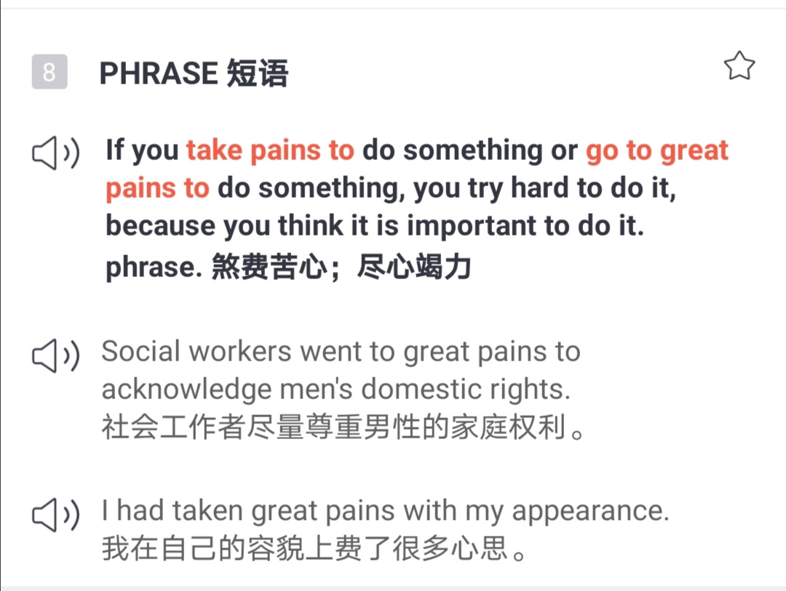
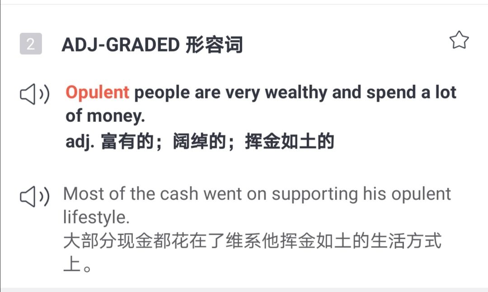
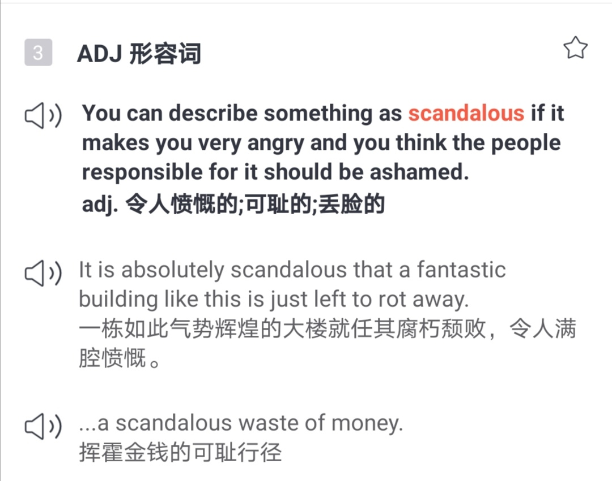
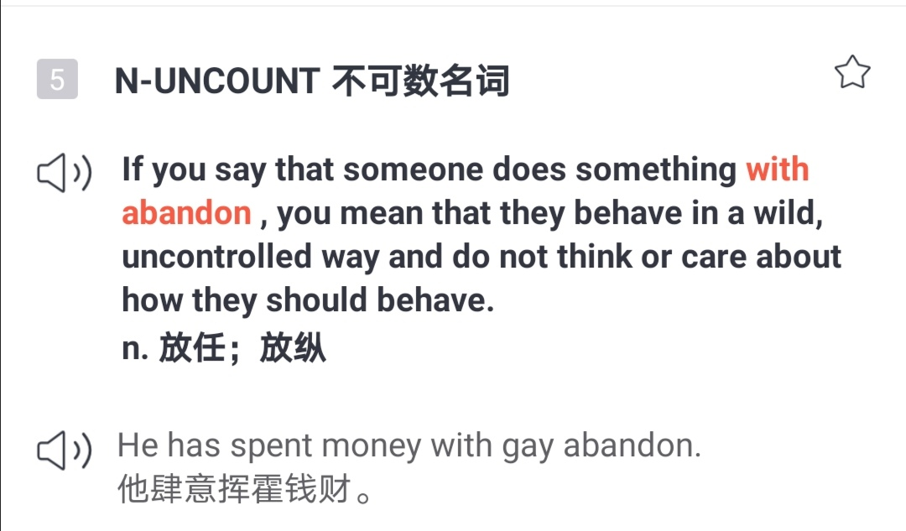
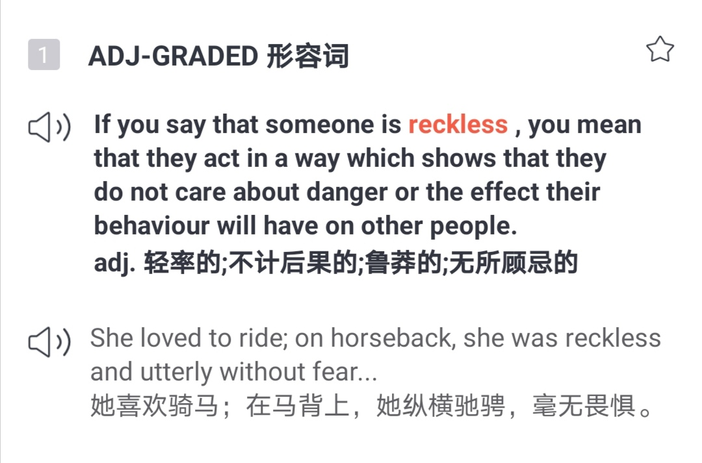
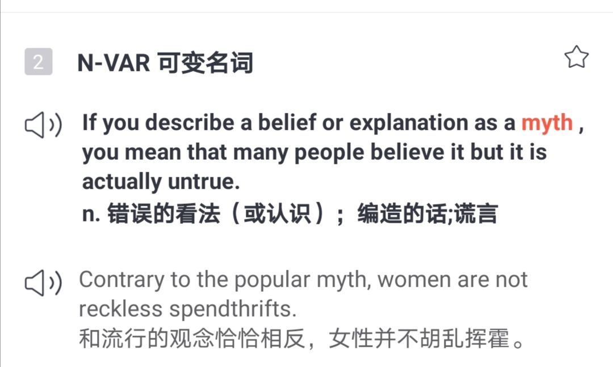
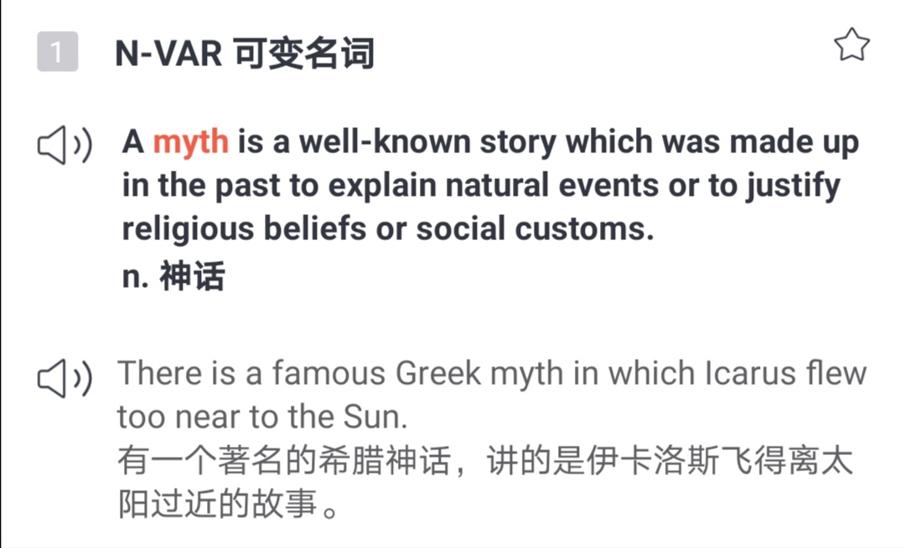
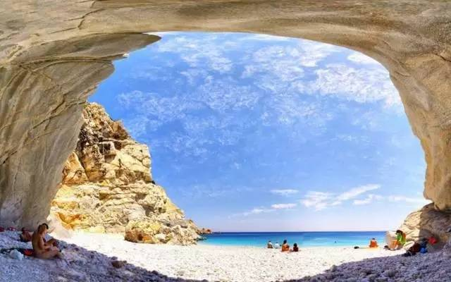

🌟执着追梦，砥砺磨坚 
🌟你会不会报复性消费 
🌟伊卡洛斯的翅膀 

<h1 style="color:red">壹 | 排行榜 </h1>

<h1 style="color:red">排行榜</h1>

全球榜

PS: 最新一周排行榜又来啦。后台时间统计单位为「分钟」，故「小时」排名分先后。

魔鬼营

PS: 最新一周排行榜又来啦。后台时间统计单位为「分钟」，故「小时」排名分先后。

<h1 style="color:red">贰 | 拓词快讯 </h1>

执着追梦，砥砺磨坚

No PAIN，NO GAIN,说的是吃一堑长一智。 

这句话变成NO PAINS也成立，说的是下的功夫如果不到位，也不要肖想什么收获了。 

pains翻译成功夫而不是苦难，可以从👇例句看出来

<i>I had taken great pains with my appearance</i>.

我在自己的容貌上<i>费了很多心思</i>。

<small>截图出自拓词柯林斯</small>

pain也好，pains也好，说到底，世界没有平白无故的恩赐。

大作家毛姆也说，哪里有什么妙笔生花的天才，连他的偶像都是个异常勤奋的男子。

Burke was a man of <i>prodigious industry</i> and it is certain that he <i>took pains</i> not only over the matter of his discourse, but over the manner. 

惊才绝艳的后面是大笔大笔的功夫，所以才砥砺出不偏不倚的旷世名篇。

算得上「执着追梦，砥砺磨坚」的绝好范例了。魔鬼营的小伙伴也算：

 

 

<h1 style="color:red">叁 | Nora小栈 </h1>

你会不会报复性消费？

​​经过长时间宅家，现在的你会不会报复性消费？

今天我们就来跟着BBC一起学习一下表示“我要大买特买！”的口语~

<audio :src="(()=>require('./asset/46/疯狂花钱.mp3'))()" controls />
 

❶ I'm going to <i>splurge</i>. 

我要<i>挥霍</i>一下。

动词“<i>splurge</i>”的意思是“挥霍”，尤其指购买奢侈品。

❷ I'm going to <i>push the boat out</i>. 

我得<i>挥霍一下（犒劳自己）</i>。

表达“push the boat out 把船推出去”比喻“为了庆祝一件事而花费大笔金钱”。

❸I'm <i>going on a shopping spree</i>. 

我要去<i>疯狂购物</i>。

“Go on a shopping spree”的意思是“疯狂地采购”。这里，名词“spree”指“过度的玩乐”。

❹ I'm going to <i>splash out</i>. 

我要来一回<i>挥金如土</i>。

搭配“splash out”可以形容花很多钱购物，尤其指购买不需要的物品。

花钱的理由千千万万，花钱的方式千奇百怪，除了BBC说的这几项，看<i>柯林斯</i>的例句也是「大开眼界」:

➡️ Most of the cash went on supporting his <b>opulent</b> lifestyle.

大部分现金都花在了维系他<i>挥金如土</i>的生活方式上。

<small>截图出自拓词柯林斯</small>

有意思的是，图片搜索opulent lifestyle，一溜全是大豪宅。

➡️ ...a <b>scandalous</b> waste of money.	

<i>挥霍</i>金钱的可耻行径

一个scandalous就让人浮想连篇，莫非这钱花得"不正经"？

<small>截图出自拓词柯林斯</small>

➡️ He has spent money with gay <b>abandon</b>.	他肆意挥霍钱财。

abandon这里是<i>放任；放纵</i>的意思。整句话翻译起来大概就是「哥有钱，使劲花，随便花」。

<small>截图出自拓词柯林斯</small>

➡️ Contrary to the popular <b>myth</b>, women are not reckless spendthrifts.	

和流行的观念恰恰相反，女性并不<i>胡乱挥霍</i>。

花钱是门学问，花得好，叫理财或者投资。反之则是胡乱挥霍。<i>reckless</i>说人时，那是莽夫，可不是没头脑。

<small>截图出自拓词柯林斯</small>

花钱也是这个理，一时冲动、不明不白就下单，还没收到就想退货，不就是<i>reckless spendthrifts</i>么。

<h1 style="color:red">后记 |伊卡洛斯的翅膀 </h1>

“飞机起源”的悲怆神话

说起文字，似乎有两种美，天成的或者是人工的。前者极尽雕琢后者自由散漫，一如诗坛的李杜。

这两个标准，即便是说艺术也过得去，野逸和工巧之分。没有孰高孰低，各有各的好。 

Nora更喜前者，觉得那种天马行空的fancy自带仙气。可不是么？可上九天揽月的是诗仙。

想飞的不止东方的诗人，还有西方的神。

<i>有一个著名的希腊神话，讲的是<i>伊卡洛斯</i>飞得离太阳过近的故事</i>。

这是<i>柯林斯</i>给myth神话配的例句:

<small>截图出自拓词柯林斯</small>

善良的编辑没有补上显而易见的结局，离得太阳过近能有什么好下场。 

伊卡洛斯的翅膀，是用蜡和羽毛造的。蜡被太阳融化，跌落而死。后被埋葬在一个海岛上。为了纪念他，埋葬伊卡洛斯的海岛命名为伊卡利亚。

<small>长寿岛伊卡利亚风景一隅</small>

伊卡洛斯的陨落，该怪谁？有人评价是自负者自食其果。

明明父亲有警告过他，「不要飞得离太阳那么近，因为蜡会融化；也不要靠近海，因为海水的湿气会阻碍飞翔。」

大概是太阳的光芒太耀眼，所以伊卡洛斯像飞蛾扑火...

一如<i>木心</i>的文字：

<i>我曾为文，将尼采、托尔斯泰、拜伦，都列入飞出的伊卡洛斯。</i>

<i>但伊卡洛斯的性格，宁可飞高，宁可摔死。</i>

<i>一定要飞出迷楼，靠艺术的翅膀。宁可摔死。</i>

<i>欲望，是要关起来，现代迷楼，更难飞出，需要更大的翅膀。</i>