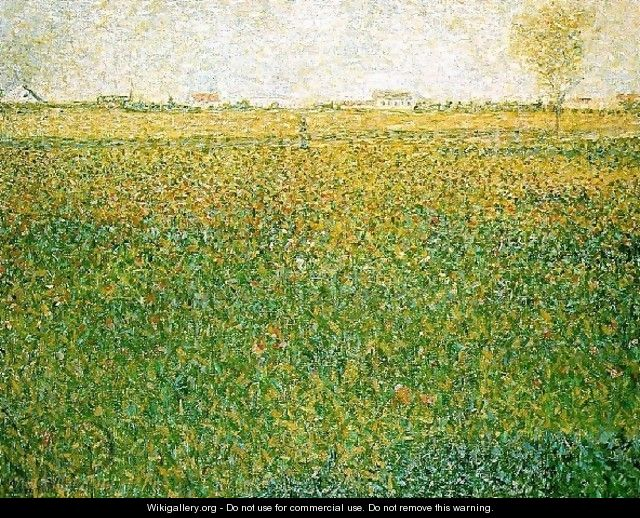

信口开河

莎翁的故事 好多都是加工品。 

一个人对你好的没有来头会让你心生警惕。 

太阳底下无新鲜事。 

It was a slow, <b>pulsing</b> rhythm that seemed to sway languidly in the air.

那是一种缓缓的律动，感觉像是在空中慵懒地摇曳。

估计在柯林斯编辑看来

浪漫和理性是天敌呀。 

All this questioning is so analytical and <b>clinical</b> — it kills romance.

整个询问分析性和逻辑性太强，浪漫的气息荡然无存。

It was a slow, <b>pulsing</b> rhythm that seemed to sway languidly in the air.

Don't ever be <b>swayed</b> by fashion.

永远不要受潮流的影响。

The conversation around them was resumed, but in <b>subdued</b> tones.

他们周围的人又开始交谈了，但这次是窃窃私语。

听到的雨
木心说过这样的话：

<i>古典主义，是后人说的</i>。

<i>浪漫主义，是自己说的</i>。

浪漫主义是一种风格吗？我猜不是，柯林斯给的释义强调浪漫主义在乎的是个人

【截图】

浪漫主义的核心应当是individuals吧，看欧洲的绘画主题就是这样的感觉：没有宗教的神圣光辉，倒是有寻常人家的温情脉脉。 
【浪漫主义图】

个人individual的核心是？

个性张扬。

柯林斯的释义里也是这样说的：不一样，不从众

【individual截图】

very unusual and do not try to imitate other people or things.

典型中的典型就是李白了。 独一无二到没有办法去模仿他。 

这个时代，我们会感觉到人与人之间的疏离。但是相同频率的人之间的默契，天南海北，全世界的同学聚集到

这个时代，人与人之间的疏离愈发地明显，明明是友邻，可能一年到头也说不上几句话。 

但是相同频率的人之间的默契，好像比任何事情都来得更确定。 

Nora就是这样的感受，拓词里的大家，隔着天，隔着海，隔着日月，却依然熟悉。 

也许同桌之间，不是书桌，是早上的雾气与夜晚的星光相望。

都是美好的相遇（缘分）呀，世当珍惜。

感恩与大家相遇。 

浪漫主义解构的世界里，芸芸众生不是以群体来被认识，而是个体。 
传统的权威（帝王）被推翻了， 人的内心当中不再像以往一样，像奴隶一样臣服于既有的权威，每个人的内心当中开始臣服于什么东西呢？
浪漫主义的核心cult of individuals. 
他们所膜拜的是个人，是具有个性化的一个个活生生地，芸芸众生里的个体。
非常重要的核心是：个性张扬。 
自己的个性不顾羁绊地，不顾及任何藩篱，枷锁这样淋漓尽致地表现出来，法国大革命之后， 文学和艺术这个大的风潮，叫浪漫主义。

看关于绘画的纪录片，那么多的风格初以为浪漫主义是一种风格，

有丰富的心灵才有悠闲的生活。 

https://www.vocabulary.com/articles/vocabulary-shout-out/quiz-diagnostic-test-or-evaluation/

.

白色在西方代表纯洁和圣洁。 
。 

莎士比亚所有的作品都有一个特点：一以贯之(unity)
 factitious， not natural, sth made by man. 人为的，人工做出来的。 
-
一致不是这种：戏文讲的是300年前的事，舞台上努力用一切手段再现当年的风貌（custom）。 
而是每部戏色调和情感的均一。 
莎翁所有戏剧中都奉行这一点。 
麦克白夫人，一定是一袭黑衣，阴郁在一边。 
朱丽叶，白色长裙才和青春纯真美好的爱情联系在一起。

002 That law of unity, 
which has its foundations, 
not in the factitious necessity of custom, 
but in nature itself, the unity of feeling,
is everywhere and at all times
observed by Shakespeare in his plays. 

If you're looking for an adjective that means "sticking out above the rest; famous," consider prominent. A prominent person might be the big cheese, the head honcho, the top dog — not just any Joe Schmo.

When the flowers open in spring they fill the night air with a fragrance that <b>defies</b> description...

只可意会不可言传也。 有点像英国大散文家说的那样子

We must "give it an understanding, but no tongue.此中有深意，但是只可意会不可言传。

如果你问我春天的颜色是什么？也属于上述情况。 

若是非要一个答案，那选Seurat的画吧。 

Janson讲Rubens

讲学艺术有这么一句话，师古人不如师造化  师古人不如师造化,师造化不如师心源