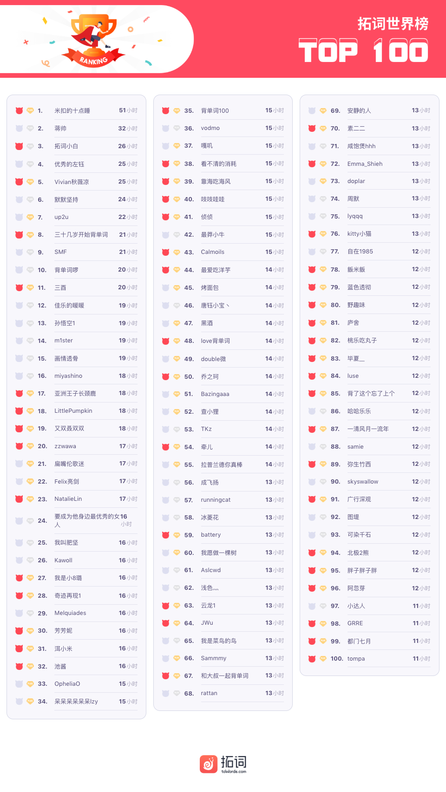

🌟J 

<h1 style="color:red">壹 | 排行榜 </h1>

<h1 style="color:red">排行榜</h1>

全球榜

PS: 最新一周排行榜又来啦。后台时间统计单位为「分钟」，故「小时」排名分先后。

魔鬼营

PS: 最新一周排行榜又来啦。后台时间统计单位为「分钟」，故「小时」排名分先后。

<h1 style="color:red">贰 | 拓词快讯 </h1>

选择

<h1 style="color:red">叁 | Nora小栈 </h1>

Jam tomorrow是“明天的果酱”吗？但你永远吃不到它，为什么？

内容引用：

红色边框

图片缩小尺寸

<<<<<<< HEAD

<marquee>文字滚动</marquee>
=======
>>>>>>> 8ad9c3b57f83d4f56486542055a6a6e73c3658c7
