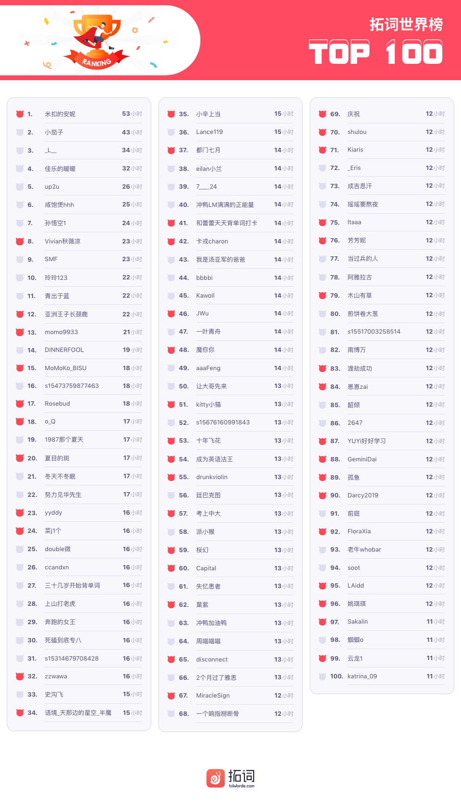
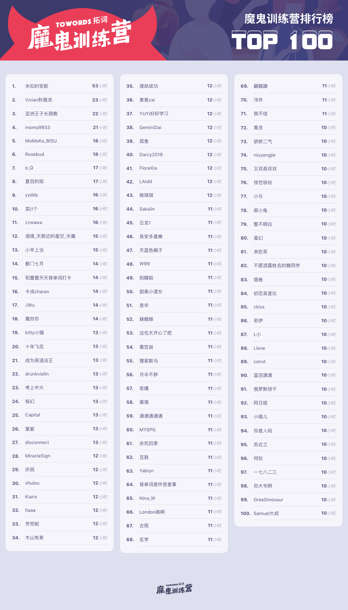
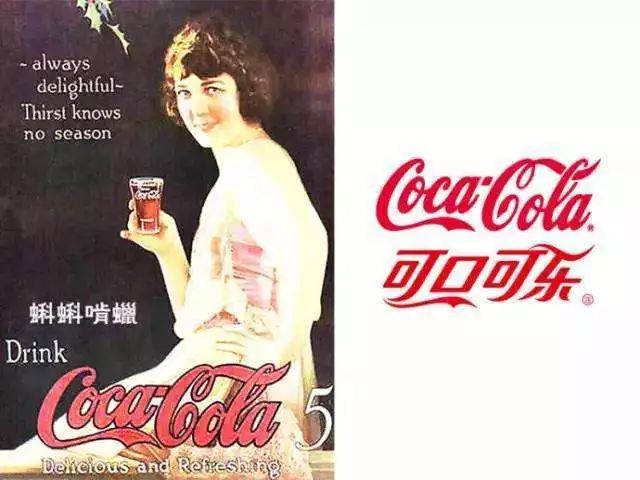
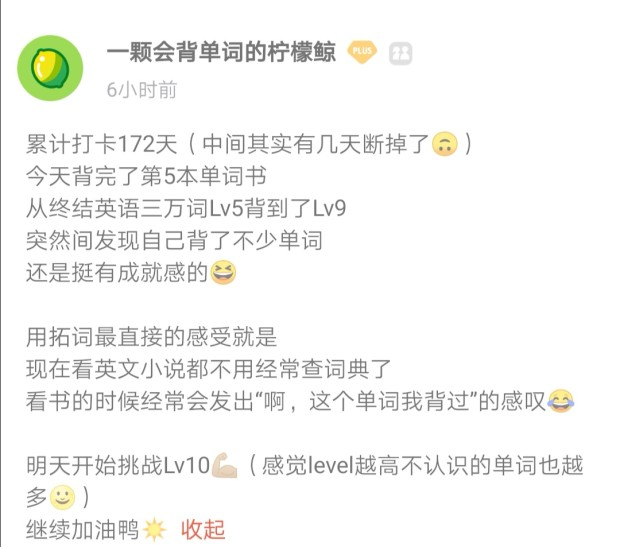
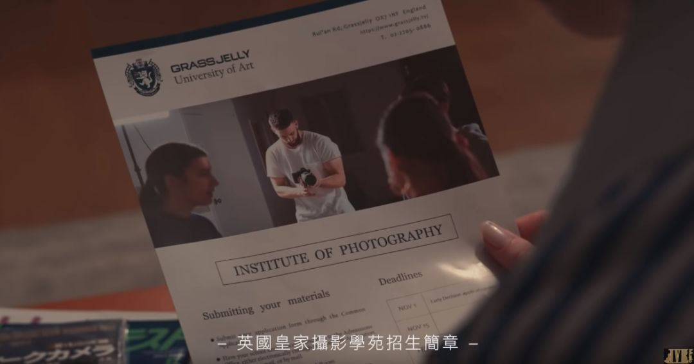
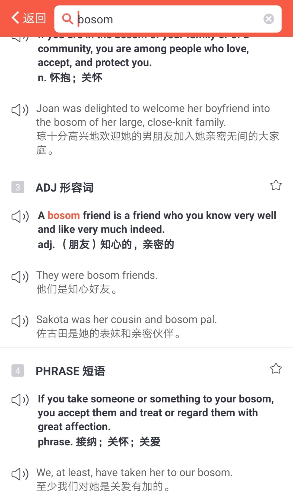
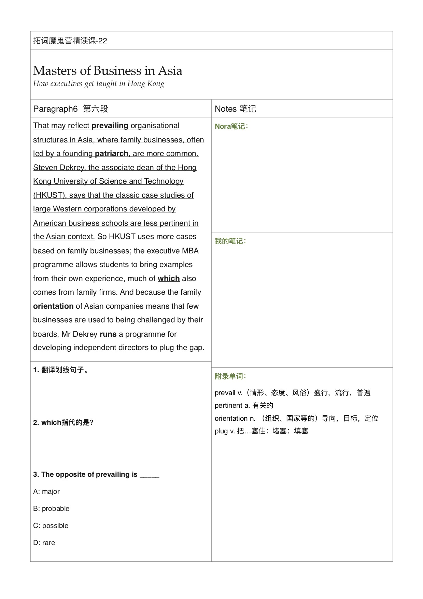

🌟翻译有最高标准吗？ 
🌟如果你能在秋天来... 
🌟东坡居士易安居士，居士是出家人吗？

<h1 style="color:red">排行榜</h1>

全球榜

PS: 最新一周排行榜又来啦。后台时间统计单位为「分钟」，故「小时」排名分先后。

魔鬼营

PS: 最新一周排行榜又来啦。后台时间统计单位为「分钟」，故「小时」排名分先后。

<h1 style="color:red">拓词快讯</h1>

译事

说说看，若是碰到翻译，你是会一字一词，尽量让逐个词都挨得上。

还是优先考虑意思有没有传达出来，很可能单词不是一一对应的那种。

翻译是个较真的活, 若觉得不合适, 可以改到天荒地老。 

唐诗里的「二句三年得，一吟双泪流」放在翻译里其实也不夸张。 

觉得合适时， 怎么看都是满心欢喜。 

比如英语下午茶课程里， 某篇 Nora引用了英国大文豪Samuel Johnson的话

> What we hope to do with ease,   we must learn first to do with diligence.

就像林语堂翻译的《聊斋》，说是另外的故事也没错。 

同样的句子，因为不同的鉴赏路径，于是有了不同的翻译结果。 

大文豪的这句话，某些拓友的翻译着实让人眼前一亮

> 笃学不倦，方能得心应手。
 
> 你必须要用尽全力， 才可能毫不费力。

Nora曾在公众号盘点过好的翻译是什么样子。 

比如 可口可乐还蛮符合快乐肥宅水的特质的，最初的蝌蚪啃蜡听起来就像黑暗饮料

多抓鱼的déjà vu别有深意，和二手书的气质也很符合

> 什么是déjà vu？  
Have you ever been somewhere brand new, <i><b>but you feel like you've been there before</b></i>? That odd feeling is called déjà vu.

微信 wechat， 连logo都完美对应。 

好的翻译是怎样标准？

唐代的那位高僧来说，是「既须求真,又须喻俗」。
Nora觉得，省事不添堵，一口气读下来不费劲就是好翻译。 

有这么一个说法：同样是外来宗教，我们好像对佛教的接纳程度更高？一方面除了更早，可能也和翻译有关系。 

「刹那」「浮世」「涅槃」听起来就很有意境，读着读者心就静了。 

100年前翻译的Bible也不错，自是不能和千年前大师的翻译作品相比。

再如林语堂。他不少作品属于用英文写中国故事。读起来倒是很通畅

比如 My Country and My People 里说的 

> the wisdom of stupidity

大约是大智若愚。 

> thorough-going skepticism
> the advantage of lying low 
> and the importance of camouflage

这些又是什么熟悉的中文呢？猜猜看。

 

夏日里的遗憾，一定会被秋风温柔化解

 
 
 风，已经是秋天的味道了。 

 降燥，缓缓凉。 

关于秋天，英国作家Gissing说过 
> But -- whatever temptation comes to me in <b>mellow autumn</b>, when I think of the grape and the olive-- I do not I shall ever again cross the sea. 

柔美清秋。 

也像阿兰德波顿笔下的秋天
> ... where he would like to imagine himself stepping from the train on an <b>autumn evening</b>,   when the <b>trees</b> are already <b>bare</b> and <b>smelling strongly</b> in the <b>keen air</b>...

虽然温度差不多，但是走在外面，可以感觉出来春秋是两个季节。 

光景不一样，事也不一样。古人做事爱讲究时辰，连读书也是。 

<b>
读经宜冬，其神专也； 
读史宜夏，其时久也； 
读诸子宜秋，其致别也； 
读诸集宜春，其机畅也。</b>

看了看桌子上没看完的书，内心其实如下图

可能看书的时节不对吧～( ˘•ω•˘ )

秋天也许就适合了(´▽｀)ノ♪

心得里的小惊喜

有多少拓友和Nora一样， 每每想要发空时，便去刷心得，而且还总会有所得。

「...背英语也是， 我为我知道这样才能成为一个愉快的习惯。背得太多，反而会预支以后的兴趣，那样就不好玩了。不好玩，就容易坚持不下去了。 故何乐而不为?背单词的这几天，看了好多英美电影，会很有兴趣跟着念台词。我想我应该找到一条属于我的路了...」

有点像“不惑的人”了，是羡慕的状态了。

字里行间， Nora读出来一丝”松弛感“，还似乎窥见了一股天然的好学习气。

求知这件事，挺容易变拧巴。

学的人苦大仇深，也可能依然没有渐长。

有时候倒像是和自己在battle，或者在argue书山那么多条路，到底哪条是正道呢。 

有点像梭罗说的，“以挑剔的心活着，即使最富有的人也不会觉得快乐。”

放在读书学习也讲得通 

作家Lamb的文字里也有类似的感受

> How many improprieties, perfect solecisms in letter-writing, do we put up with in Clarissa and other books, for the sake of the delight which that form upon the whole gives us. 

“若是读久远的小说，可能会遇到写法不当，语法错误，但是比起故事带来的快乐，不值一提。”

那些improprieties, 可能就是上下求索的”崎岖“吧。

但快乐也会有，前提是需要忍得住寂寞。

去探索，才能发现乐趣。

获得的，很可能的他人感受不到，不能驾驭的快乐。

比如看英文小说，“<b>啊，这个单词我背过</b>”的感叹应该算

<h1 style="color:red">魔鬼营志异</h1>

早安英语

周杰伦新歌《说好不哭》准时上线，

整个社交网全部瘫掉！！

QQ音乐一度瘫痪，

朋友圈完全被刷屏，

微博话题直接爆掉，

前十热搜占了八，

不到两小时销量即破千万！

新歌最大的惊喜竟然是阿信！

阿信X周杰伦，

一个弹着钢琴，

一个弹着吉他，

完美声线的融合，

这是什么神仙合作啊！

两家的粉丝都开心炸了！

听歌之余，网友们拿着放大镜发现了杰伦这首歌mv背后隐藏的很多彩蛋。

“<b>彩蛋</b>”指在电影、电视剧或其他视频中为眼尖的观众埋藏的小惊喜，源自西方复活节找彩蛋的游戏，寓意为“惊喜”，可以叫它Easter Egg。

 比如：

>The framed picture of Julia Roberts inside the character's home was an **Easter Egg** inserted by the director.    
朱莉亚•罗伯茨在片中居室里挂的画像是导演安插在电影中的“彩蛋”。

那么，电影末尾的彩蛋英文中怎么说呢？
 

电影上完主要演职员表和导演名字之后会出现一小段情节，英文俗称为 Mid-credits scene还有片尾演职员全体名单全部结束后，会出现 Post Credits Scene  。

这些泛称为片尾Coda画面俗称为惊喜情节。

这次新歌最大的彩蛋，就是在一分三十八秒的时候，伴随着【突然好想你】的旋律，五月天“重量级”人物阿信出场，缓解了来自杰伦中年发福的压力。

另一个隐藏的彩蛋是mv 里男主录取的大学叫【 Grass Jelly University of Art】，直译过来就是【烧仙草艺术大学】，知道真相的我，只想说：杰伦，你真的不能再喝奶茶了......
 

<!-- 图 henanicha "杰伦，你真的不能在喝奶茶了" -->

作为多年好友，奶茶十级爱好者周杰伦和陈信宏同学双双从乐坛天王变成奶茶兄弟。

<!-- 图 panggelia"奶茶兄弟" -->

好兄弟、好哥们儿 的英文可以说great buddy，表示男生的好朋友。

女生的好朋友可以说 bestie或者 BFF （Best Friend Forever），也就是我们常说的闺蜜。

如果不分男女生形容好朋友，我们可以用 bosom friend ，表示知心好友。

bosom 是胸襟、胸怀的意思，放在心上的人，当然就是好朋友咯，它比BFF更能表达出朋友之间的亲密感和知心程度。

> **A bosom friend** is one to whom you could tell all your secrets.
亲密的朋友就是你能将秘密告诉他的人。

然而，他们的好兄弟JJ直接哭晕在厕所：我陪你喝了那么多奶茶，篮球也陪你打，超话也给你**打榜（hit the charts）**，最后奶茶三兄弟里我却不能拥有姓名，这或许就是虚假的兄弟情谊吧~

<!-- 图 suliao]"虚假的兄弟情谊" -->

**塑料友谊**用英文怎么说呢？

“塑料友谊”是形容那种表面上要好，但是内心却见不得对方好的那种表里不一的关系，常见的有两种说法：

**① frenemy/ˈfrenəmi/ 假装是朋友，实际是敌人~**

它是friend(朋友)和enemy(敌人)的合成词，完美诠释了亦敌亦友的关系~

>If your best friend steals your boyfriend of three years, she was **a frenemy** all along.  如果你最好的朋友偷走你谈了三年的男朋友，你们其实一直只是“塑料姐妹花”而已。

**② toxic friend  有毒朋友（带来负能量和烦恼的朋友）**

这朋友有毒，用来形容“塑料姐妹花”间脆弱的感情，也是再形象不过了。

>For some women it takes an "inciting incident" to finally notice that a friend is toxic.  一些女人就是在遇到“煽情事件”时最终认清了哪个朋友是损友。

这次新歌里，杰伦教会了我们，除了塑料友谊，这世间还有一种友情叫

奶茶友情让我想起了一个词 “酒肉朋友”，指的是那些只能在一起吃喝玩乐，不能共患难的朋友。

英文可以说 fair-weather friend ，也就是只有好天气才存在的朋友，比如：

>Charlie is merely a fair-weather friend. He always disappears when I’m going through difficult times.  
查理只是酒肉朋友而已。当我有困难时，他总是会消失！

每当有人劝我戒奶茶，都不禁想说：周杰伦四岁学琴，中学就尝试写歌，一边打工，一边参加选秀，出道至今一直坚持自己的风格和高质量的创作，他能成功和自律脱不了关系。

所以他这么自律的人都戒不了奶茶，我，凭啥能?

▼ 最后，我们来听听歌吧～

PS: 内容来自公众号「Nora的英文小栈」

<h1 style="color:green">Nora日签</h1>

1

看苏轼的wikipedia介绍

居士的英文是householder

> 什么是householder
householder denotes a variety of terms. Most broadly, it refers to any layperson, and most narrowly, to a wealthy andn prestigious familial patriarch. 

破旧古刹，手捧千章，青灯黄卷，看世界都是多余的苦行僧，

居士大概是这样子的：

自称是佛教徒， 依然驰骋在“花花世界”，甚至有如花美眷，享受珍馐佳肴，饱览大好河山...

比起来，现代的“佛系”比居士更像修行一点

2

司，既为动词，也为名词。 

各司其职，牝鸡司晨的司。 

港澳的财政部门叫财政司。 

英文里也有类似的构词。 
office的词根fic表示do, perform. 
office本身也有局、部门的意思。 

PS: 内容来自公众号「Nora的英文小栈」

<h1 style="color:green">魔鬼营精读</h1>

这一期的《经济学人》中讲到了中国的企业~

> ASIA’S RISING economic power is remaking the world.   
Chinese corporate champions like Alibaba and Baidu are challenging their Western counterparts. 

以为要讲阿里巴巴和百度的管理秘诀，

结果发现只是开头见，说好欣赏亚洲的管理方式，正文里却一点都看不出来。

不如读读文章。下图为精读课件一览，有时间有兴趣的魔鬼营小伙伴记得在群里查收～

<!-- 图 【精读】 -->

图来自于魔鬼营精读课课件

<h1 style="color:green">后记</h1>

夏日里的遗憾 
若有, 
定会被秋风温柔化解 
天缓缓凉, 
秋天你来吗 
有人信你, 
有人陪你, 
有人等你,  
100天 
和你一起 
拿下6000个单词

往期回顾：
<a href="https://www.topschool.com/towords/tarticle/index.html?article_id=37" style="color:#FF4855;font-size:14px;display:block">拓词小报·魔鬼营周报第一期</a>
<a href="https://www.topschool.com/towords/tarticle/index.html?article_id=39" style="color:#FF4855;font-size:14px;display:block">拓词小报·魔鬼营周报第二期</a>
<a href="https://www.topschool.com/towords/tarticle/index.html?article_id=41" style="color:#FF4855;font-size:14px;display:block">拓词小报·魔鬼营周报第三期</a>
<a href="https://www.topschool.com/towords/tarticle/index.html?article_id=42" style="color:#FF4855;font-size:14px;display:block">拓词小报·魔鬼营周报第四期</a>
<a href="https://www.topschool.com/towords/tarticle/index.html?article_id=43" style="color:#FF4855;font-size:14px;display:block">拓词小报·魔鬼营周报第五期</a>
<a href="https://www.topschool.com/towords/tarticle/index.html?article_id=44" style="color:#FF4855;font-size:14px;display:block">拓词小报·魔鬼营周报第六期</a>	
<a href="https://www.topschool.com/towords/tarticle/index.html?article_id=45" style="color:#FF4855;font-size:14px;display:block">拓词小报·魔鬼营周报第七期</a>
<a href="https://www.topschool.com/towords/tarticle/index.html?article_id=55" style="color:#FF4855;font-size:14px;display:block">拓词小报·魔鬼营周报第八期</a>
<a href="https://www.topschool.com/towords/tarticle/index.html?article_id=56" style="color:#FF4855;font-size:14px;display:block">拓词小报·魔鬼营周报第九期</a>
<a href="https://www.topschool.com/towords/tarticle/index.html?article_id=59" style="color:#FF4855;font-size:14px;display:block">拓词小报·魔鬼营周报第十期</a>
<a href="https://www.topschool.com/towords/tarticle/index.html?article_id=66" style="color:#FF4855;font-size:14px;display:block">拓词小报·魔鬼营周报第十一期</a>
<a href="https://www.topschool.com/towords/tarticle/index.html?article_id=67" style="color:#FF4855;font-size:14px;display:block">拓词小报·魔鬼营周报第十二期</a>
<a href="https://www.topschool.com/towords/tarticle/index.html?article_id=70" style="color:#FF4855;font-size:14px;display:block">拓词小报·魔鬼营周报第十三期</a>
<a href="https://www.topschool.com/towords/tarticle/index.html?article_id=73" style="color:#FF4855;font-size:14px;display:block">拓词小报·魔鬼营周报第十四期</a>
<a href="https://www.topschool.com/towords/tarticle/index.html?article_id=74" style="color:#FF4855;font-size:14px;display:block">拓词小报·魔鬼营周报第十五期</a>
<a href="https://www.topschool.com/towords/tarticle/index.html?article_id=75" style="color:#FF4855;font-size:14px;display:block">拓词小报·魔鬼营周报第十六期</a>
<a href="https://www.topschool.com/towords/tarticle/index.html?article_id=76" style="color:#FF4855;font-size:14px;display:block">拓词小报·魔鬼营周报第十七期</a>
<a href="https://www.topschool.com/towords/tarticle/index.html?article_id=77" style="color:#FF4855;font-size:14px;display:block">拓词小报·魔鬼营周报第十八期</a>
<a href="https://www.topschool.com/towords/tarticle/index.html?article_id=78" style="color:#FF4855;font-size:14px;display:block">拓词小报·魔鬼营周报第十九期</a>
<a href="https://www.topschool.com/towords/tarticle/index.html?article_id=80" style="color:#FF4855;font-size:14px;display:block">拓词小报·魔鬼营周报第二十期</a>
<a href="https://www.topschool.com/towords/tarticle/index.html?article_id=82" style="color:#FF4855;font-size:14px;display:block">拓词小报·魔鬼营周报第二十一期</a>
<a href="https://www.topschool.com/towords/tarticle/index.html?article_id=83" style="color:#FF4855;font-size:14px;display:block">拓词小报·魔鬼营周报第二十二期</a>

	