

🌟诺贝尔文学奖最年轻作家这样择友 
🌟2亿网友都在关注的“残雪”究竟是谁？ 
🌟那些意境很美很简单的英文搭配

<h1 style="color:red">排行榜</h1>

全球榜

PS: 最新一周排行榜又来啦。后台时间统计单位为「分钟」，故「小时」排名分先后。

魔鬼营

PS: 最新一周排行榜又来啦。后台时间统计单位为「分钟」，故「小时」排名分先后。

<h1 style="color:red">壹 | 拓词快讯 </h1>

友

诺贝尔文学奖最年轻作家，有过记者经历的加缪说朋友应该是这样的：

<kbd>Don't walk behind me, I may not lead.  Don't walk in front of me, I may not follow.  Just walk beside me and be my friend. </kbd>

不要走在我后面,
因为我可能不会引路 

不要走在我前面,
因为我可能不会跟随 

请走在我的身边,
做我的朋友 ​

很契合owomud说的伙伴了

<kbd><b>伙伴</b> </kbd>

<kbd>刚开始谁都是热情洋溢，有着雄心壮志，仿佛一伸手，那6k词就握在了手心。可是，你走的越久，发现身边的人越少。
想到之前背comrade的例句，“<i>Unlike so many of his comrades,he survived the war.</i>”谁说这不是场战争呢？能坚持下来的，可谓患难与共。  就像我的同桌，一路走来，也不曾间断，我从未见她在群里打卡，但是啊，我知道，她就是在啊。
哪怕是沉默，陪着你走过艰难的成长之路的人，总能给你带来些许温情。</kbd>

这些温情在Nora看来，是一种赋能。 因为ta有打动到你， 也是因为ta的存在，陪伴， 好像接受ta的那个人变得不同了，越来越好了。像这样：
  

<i>绝对不是天使派来的魔鬼，而是小天使</i>
 

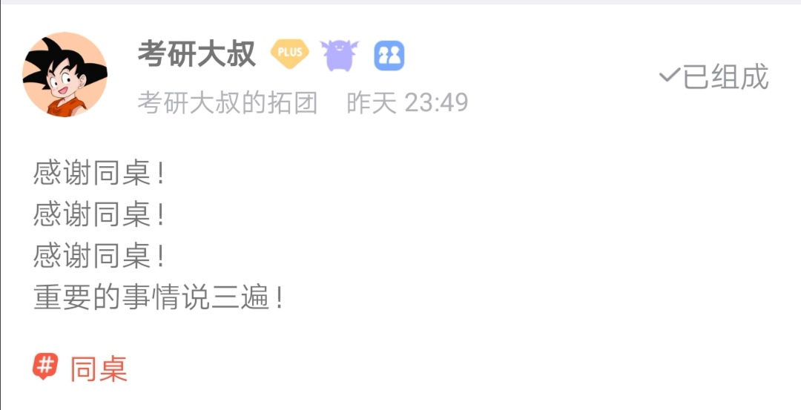

 
<em>或许是学习路上的“催化剂”。</em>
 

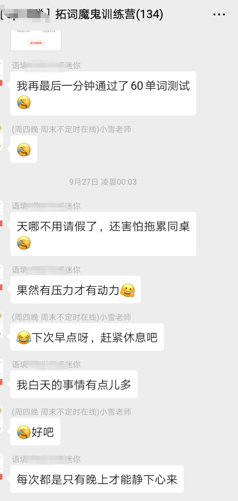
 
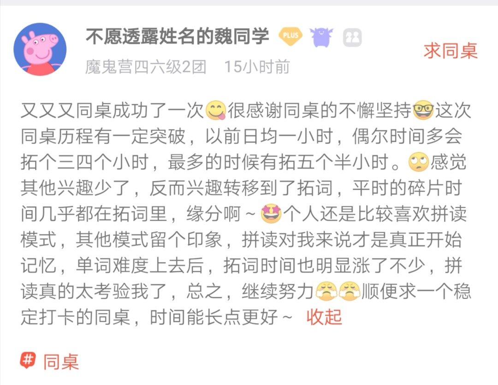

 <em>人与人相遇可能有100种方式，这绝对是我见过最独特的第101种say hello了。</em> 

 

<em>或许会让人变成🍋🍋</em>

 

<h1 style="color:red">贰 | 魔鬼营志异 </h1>

早安英语

<b>2亿网友都在关注的“残雪”究竟是谁？</b>

10月10日下午7时，举世瞩目的诺贝尔文学奖揭晓！因为去年诺贝尔文学奖停发了，所以今年的诺贝尔文学奖产生了两位得主：

波兰作家奥尔加·托卡丘克（Olga Tokarczuk）获得了2018年诺贝尔文学奖。奥地利作家彼得·汉德克（Peter Handke）获得了2019年诺贝尔文学奖。

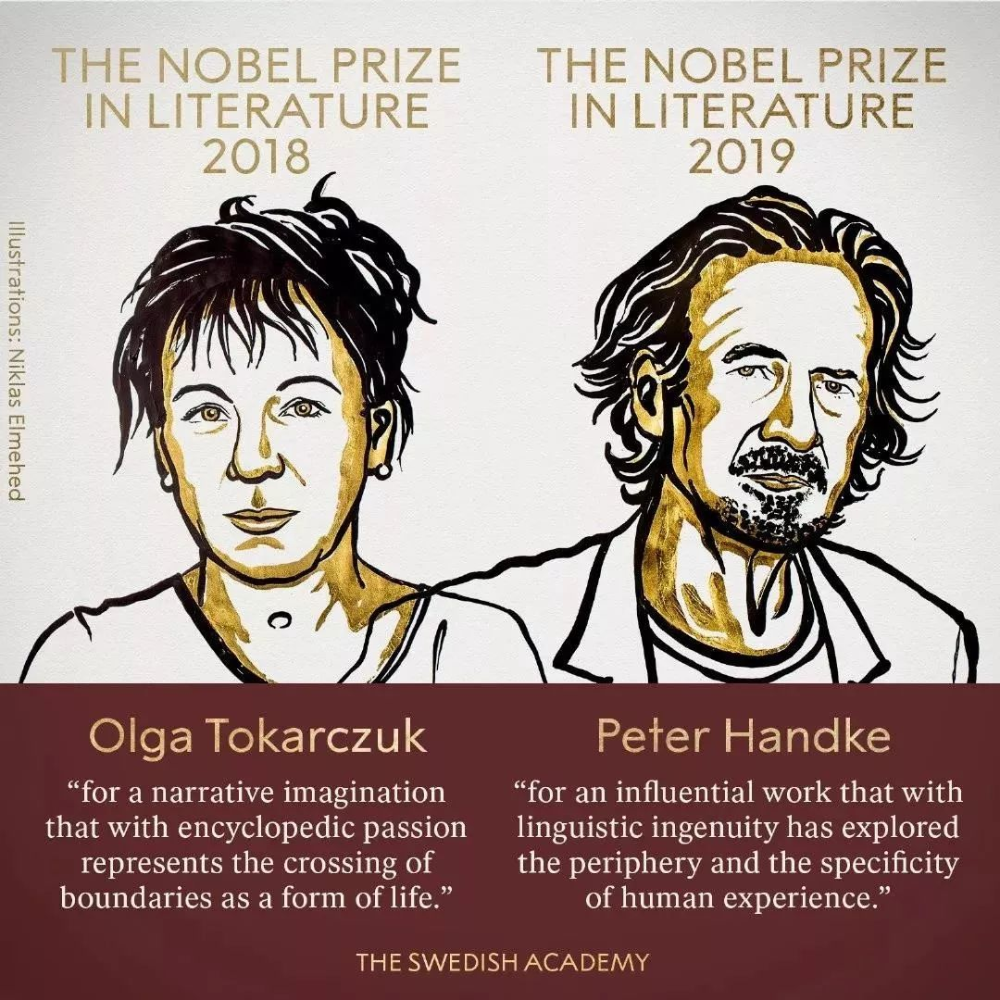

此前呼声甚高的中国女作家残雪未获奖。

<b>几天前，“残雪是谁？”上了热搜</b>。

这个有点像网络写手的名字，横空出世，突然走入了大家的视野。

<b>因为在2019诺贝尔文学奖赔率榜上，中国作家残雪上榜，高居第三，热度超过日本的村上春树，成为大冷门</b>。

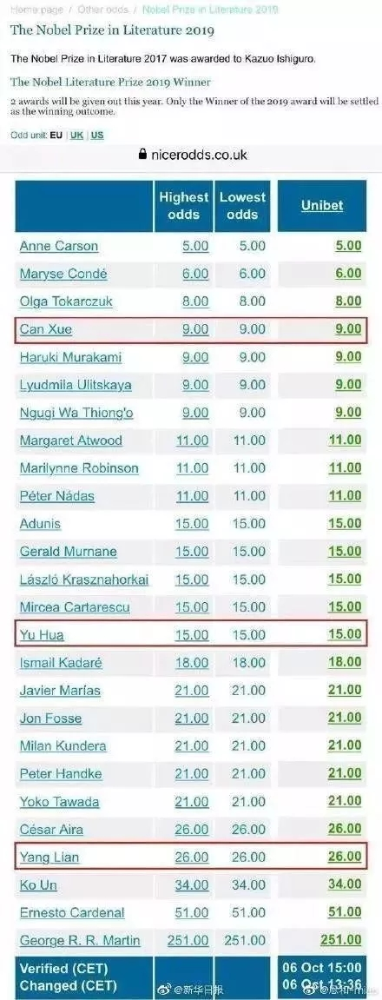

对于大部分人来说，“残雪”这个名字可能非常陌生，听起来还有点古风的名字，很难和高大上的诺贝尔奖联系在一起。

说一组统计，让你更快的了解她：

在世界范围内，残雪在当代中国作家中有三最：<b>作品被翻译得最多，作品入选外国高校教材最多，拥有为数众多的专门研究她的机构</b>。

1985年1月残雪首次发表小说，至今已有七百万字作品，<b>被美国和日本文学界认为是20世纪中叶以来中国文学最具创造性的作家之一</b>。

她的“粉丝”也不乏大家，据说<i>诺奖评委马悦然（Goran Malmqvist）</i>曾评价残雪为“<b>中国的卡夫卡</b>”。

<i>美国知名女作家苏珊·桑塔格（Susan Sontag）</i>曾说：<b>如果中国有谁能获得诺贝尔的桂冠，那就会是残雪</b>。

残雪的作品有着很强的先锋气质，言辞犀利直率。代表作有《山上的小屋》《黄泥街》《苍老的浮云》《五香街》等。

对于自己和自己的作品时，残雪的评价也和她的作品一样犀利又直接：

I see writing as a performance. My writing is my performance, a performance of freedom. I think the best readers should take part in my performance, and have his or her own performance with Can Xue. The readers of my books must be very familiar with modern writing, with philosophy, with literature. Those are the readers I attract.

我把写作看作一种表演。我的写作是我的表演，是自由的表演。我认为最好的读者应该参加我的表演，和残雪一起表演。我的书的读者一定对现代写作、哲学和文学非常熟悉。这些就是我吸引的读者。

I think Can Xue is completely unique compared to other Chinese writers. I am ahead of the times. At the moment, there are no writers like me in China. But in the ’80s, the generation of Can Xue, there were several writers who had similar styles. Now, they’ve all changed or disappeared. This style, my style, is much more difficult than their style nowadays – they took the easy way. I worry about China’s literary environment. I feel there is no hope.

我认为我与其他中国作家相比是完全独特的。我走在时代的前面。目前，中国还没有像我这样的作家。但在80年代，我的那一代，有几个作家有着相似的写作风格。现在，它们都变了，或者消失了。这种风格，我的风格，比他们现在的风格难多了——他们走的是捷径。我担心中国的文学环境。我觉得没有希望了。

甚至还有人评价过残雪是目前为止从各个方面来说，国内最接近鲁迅的一位作家。

从她对中国文学的评价中，你是否能感受到鲁迅先生的气质？又是否想要去拜读一下她的作品？

最后，小拓安利这份诺贝尔文学奖书单，码起来！赶快行动吧~

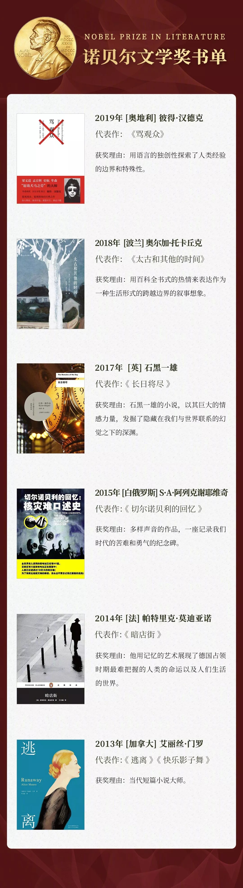
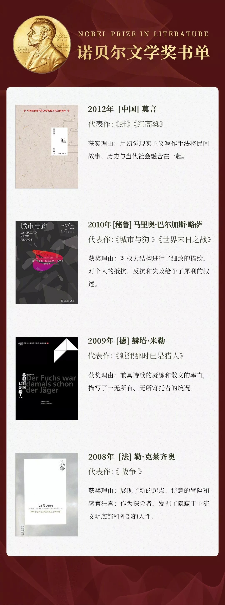
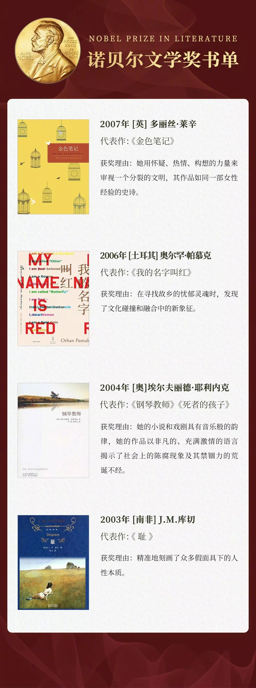
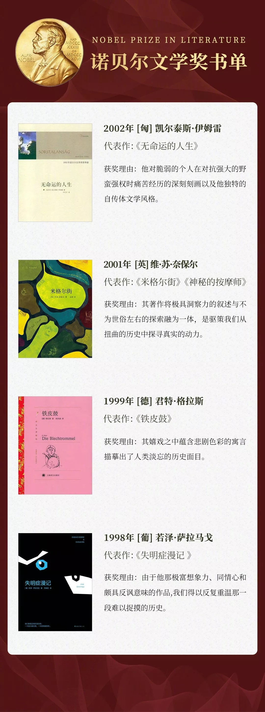
 

以上是诺贝尔文学奖书单上篇。剩下部分下期周报见～

 

PS: 内容转自公众号Nora的英文小栈（herteabreak）

魔鬼营精读课

前言

全文<b>716</b>个单词，包含 <b>2020考研英语大纲</b>词 <b>125</b> 个。

单词右上角标有考研（比如compose考研）代表这个单词被【拓词】2020考研英语大纲单词书收录。

不少《经济学人》的句子结构，同样出现在考研真题里， 比如equivalent of 等。

标绿文字可以重点读，与文章结构有关。 字变小是因为Nora认为ta们不重要😂。

很久以前说着冰岛语的人和说英语的人其实可以理解对方，为什么这么多年过去了，
英语越来越大众化，冰岛语越来越难，会说的人很少（和英语比较而言）
互联网其实做了很好的解释。

关于互联网有没有毁掉语言， 文章也说得很清楚～

正文

<h1 style="color:red">
The internet is changing language less than curmudgeons fear
</h1>

Instead it is helping explain how language works
 

001 <i>What is technology doing to language? Many assume the answer is simple: ruining it</i>. Kids can no longer write except in text-speak. Grammar <strong>is going to the dogs</strong>. The ability to <mark>compose</mark><b>考研</b> thoughts longer than a tweet is <strong>waning</strong>. 

重点讲解|第1段

<strong><kbd>waning（wane）</kbd></strong>

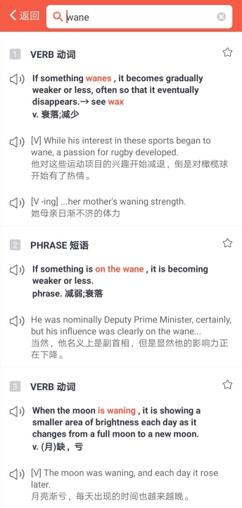
 

<strong><kbd>go to the dogs 衰落、大不如前、每况愈下</kbd></strong>

 

专门用于形容组织、公司甚至国家经济风光不再。
来源貌似和中国有关。据说古时候， 狗不能进入城。所以狗只能在墙外流浪，吃着城里的人扔出来的不要的垃圾、食物。 
被「放逐的人」，「不被接受的人」，或者「罪犯」也要被迫与这些流浪狗一起生活。 
用来形容生活或者经济彻底破落。 

Its origin is a bit unclear but some people believe that the idiom originates from the <b>ancient Chinese</b> custom of <i>not allowing dogs into the walls of the city</i>, and as a result they gathered outside the main walls, living off anything they could find in the rubbish. They often had to compete for food and space with <b>the people</b> who had been <i>expelled from the city</i>, and therefore had “gone to the dogs”.

Nora读后感|第一段

<small>科技之于语言是什么？不少觉得是负面作用， 正如这里的<b>ruin</b>. 写起字来，不成体统， going to the dogs有几分世风日下的感慨。  世人的功底好像就一落千丈了。是吗？不见得吧。 文字这种东西，拿过去的标准来衡量好像并不公允。    比如提起汉朝，是赋。 唐朝是诗， 宋朝词。现在说词，境界不逊唐诗。事实上相当一段长的时期， 词就不登大雅之堂，所以是小词。 查查词的来源就了然了，多是关乎风花雪月。   不另说小说了，夫子会教写诗写赋，但也不会教散文， 林语堂谈小说是</small>

 
 grown without cultivation. And it gave without expected return.

 
 
 
 <small>这么看来，互联网时代的文字某种程度上也属于grown with cultivation, expected return应该也是可以期待的结果才是～</small>
 

词汇表|第一段

assume v. 假定 
go to the dogs 大不如前 
compose v.组成，构成 
wane v.衰落

 002 <i>Language experts <mark>tend</mark>考研  to <mark>resist</mark>考研  that gloom, <strong>noting</strong> that there is little proof that speech is really</i> <b>degenerating</b>: kids may say “lol” out loud sometimes, but this is a marginal phenomenon. Nor is <mark>formal</mark>考研  writing <b>falling apart</b>.  

<small>Sentences like “omg wtf William teh Conqueror pwned Harold at Hastings in 1066!” tend to be written by middle-aged columnists trying to <mark>imitate</mark>考研 children’s supposed habits. A study by Cambridge Assessment, a British exam-setter, found almost no <mark>evidence</mark>考研  for text-speak in students’ writing. </small> 

重点讲解|第2段

<strong><kbd>fall apart</kbd></strong>
. 

eg1:...I'm lucky my whole life didn't <strong><kbd>fall apart</kbd></strong>. I could have lost my wife, my career, everything. 

eg2: ... If you only knew, my dad's whole world would <strong><kbd>fall apart</kbd></strong> without her.

eg3: ...Police detective Frank Taylor had his marriage <strong><kbd>fall apart</kbd></strong> after the abduction of his son. 

Nora读后感|第2段

专家说，对于语言，互联网并没有起败坏作用。

词汇表|第2段

resist v.抵抗 
gloom n.昏暗 
degenerate v.恶化  
conqueror n.征服者 
columnist n.专栏作家  

003 <i>Fortunately, the story of language and the internet has attracted more serious analysts, too</i>. Now Gretchen McCulloch, a prolific language blogger and journalist—and herself of the generation that grew up with the internet—joins them with a new book, “Because Internet”. <u>Rather than obsessing about what the internet is doing to language, it largely focuses on what can be learned about language from the internet</u>. 

<small>Biologists grow <mark>bacteria</mark>考研  in a Petri dish partly because of those organisms’ <b>short lifespans</b>: they are born and reproduce so quickly that studies over many <mark>generations</mark>考研  can be done in a reasonably <b>short period</b>. Studying language online is a bit like that: trends appear and disappear, platforms rise and fall, and these let linguists <mark>observe</mark>考研  dynamics that would otherwise take too much time.</small>

重点讲解|第3段

<strong><kbd>句子分析</kbd></strong>

<em><u>Rather than</u> obsessing about what the internet is doing to language, it largely focuses on what can be learned about language from the internet.</em>

rather than A, it focuses on B. 

<strong>考研真题|2017年英语一</strong>

eg1: <i>Rather than</i> just <strong>focusing</strong> on GDP, over 40 different sets of criteria from health, education and civil society engagement have been measured to get a more rounded assessment of how countries are performing.

eg2: But policymakers who <strong>refocus</strong> efforts on improving well-being <i>rather than</i> simply worrying about GDP figures could avoid the forecasted doom and may even see progress. 

词汇表|第3段

analyst n.分析家 
prolific adj.多产的  
obesess v. 迷恋 
Petri dish 皮氏培养皿 
lifespan n. 寿命 
linguist n. 语言学家 

004 <i>For example</i>, why do languages change? A thousand years ago, early versions of English and Icelandic were closely related, possibly even mutually intelligible. English has since evolved hugely, and Icelandic, far less. 

<small>Linguists have studied the relative effects of strong ties (friends, family) and weaker acquaintanceships in such patterns</small>, <b>hypothesising</b> that <strong>small communities would <mark>host</mark>考研 more <mark>stable</mark>考研 languages</strong>. 

<small> A computer <i>simulation</i> proved that a mix of strong and weak ties—close-knit groups existing in a larger sea—allowed language-change “leaders” to disseminate updates to the wider population. </small>

<small><i>Twitter</i> combines strong and weak ties—and sure enough, drives more language change than <i>Facebook</i>, which is more dominated by strong ties. That, in turn, helps explain the conservatism of Icelandic (more like Facebook) and the mutability of English (more like Twitter).</small>

词汇表|第4段

version v. 版本 
intelligible adj. 可以理解的 
evolve v.进化 
acquaintance n. 认识 
hypothesize v. 假定 
simulation n. 模仿 
disseminate n. 传播 
dominate v.在～中最具影响力 
conservatism n. 保守 
mutability n.易变性  

005 <i>Emoji, odd as they may look, also <mark>reflect</mark>考研  something universal</i>. They are not a language (try telling a complex story in emoji to someone who doesn’t know it already). <b>They are</b>, Ms McCulloch argues, <b>the digital <mark>equivalent</mark>考研  of gestures</b>. 

Those come in two types. 

<small>“Emblems”, like a thumbs-up or a wink, have a fixed meaning and form. But “co-speech” gestures—wincing, gesticulating, pointing—are <mark>spontaneous</mark>考研  and more variable. And emoji come in these same flavours. </small>

<small>People randomly combine many co-speech-style emoji, <b>but</b> are <b>more</b> restrained in mixing emblems. Just as it would make no <mark>sense</mark>考研  to give someone the finger while shaking your head to negate it, emblematic emoji often stand alone rather than in expressive chains.</small>

<small>Other online “innovations” are not really new, either. Philosophers have previously tried to <mark>invent</mark>考研  a marker for irony—a backwards question-mark or an upside-down exclamation point, for example—before online types succeeded with the <mark>sarcastic</mark>考研 ~tilde~. The first use of omg long preceded computers. Those who worry about teens speaking “hashtag” aloud (“Good for you—hashtag sarcasm!”) might consider the last time they punctuated an utterance by saying “full stop” or “period”.</small>

重点讲解|第5段

<strong>equivalent </strong>

<strong>考研真题|2011年英语一</strong>

eg1: In a society that so persistently celebrates procreation, is it any wonder that admitting you regret having children <i>is equivalent to</i> admitting you support kitten-killing? It doesn't seem quite fair, then, to compare the regrets of parents to the regrets of the children. 

<strong>考研真题|2019年英语二</strong>

eg2: In the popular imagination, of course, guilt still gets a bad rap. It is deeply uncomfortable-- it's the emotional <i>equivalent of</i> wearing a jacket weighted with stones. 

词汇表|第5段

universal adj.普遍的 
the equivalent of 对应物 
gesticulate v.做手势 
spontaneous adj. 自然的，自发的 
variable adj. 多变的 
flavour n. 概念 
ramdomly adv. 任意地 
restrain v. 制止 
negate v. 取消，使无效 
emblematic adj. 象征地 
innovation n. 创新 
philosopher n. 哲学家 
irony n. 冷嘲 
exclamation n. 感叹 
sarcasm n. 讽刺

006 <i>In the end, Ms McCulloch’s book is about the birth of a new <mark>medium</mark>考研  <strong>rather than</strong> a new language.</i> <u>For millennia, speech was all there was. </u> For most of “recorded” history, nearly everyone was illiterate. Then, in the age of the printing press and mass literacy, writing acquired a kind of primacy, seen as prestigious, a standard to be learned and <mark>imitated</mark>考研 (often even in speech).

Nora读后感|第6段

会写文章的人曾经是一个高门槛， 士农工商的分级就可见一斑～

旧时，舞文弄墨属于精英们的日常。兴之所致，对酒当歌，赏月成诵。

词汇表|第6段

millennia n. 千年   
speech n. 讲话    
record v. 记录   
illiterate adj. 文盲地   
literacy n.文盲     
acquire v. 获得   
primacy n. 首要  
prestigious adj.有声望的  
standard adj. 标准 
imitate v.模仿

007 Future historians may <mark>regard</mark>考研  that <mark>epoch</mark>考研  of <b>reverence</b> as unusual. <b>Mass reading has now been joined by mass writing: frequent, error-filled and evanescent—like speech</b>. 

Little surprise that internet users have created tools to give their writing the gesture, playfulness and even meaninglessness of chitchat. 

<b>Mistaking it for the downfall of “real” writing is a <mark>category</mark>考研  error</b>. Anything that helps people enjoy each other’s company can only be a good thing.

重点讲解|第7段

<strong><kbd>mistaking A for B is a/an (adj) error</kbd></strong>
. 

<strong><kbd>mistake A for B </kbd></strong>

<i>mistake</i> friendship <i>for</i> love 
<i>mistake</i> isolation <i>for</i> independence 
<i>mistake</i> effort <i>for</i> achievement 
<i>mistake</i> thirst <i>for</i> hunger 
<i>mistake</i> money <i>for</i> anything 
<i>mistake</i> concern <i>for</i> pity
<i>mistake</i> charity <i>for</i> justice

词汇表|第7段

historian adj.历史学家 
epoch n.时间 
reverence n.尊敬 
evanescent adj. 逐渐消失的 
gesture n. 手势 
meaninglessness n.无意义 
category n.种类 
company n.陪伴

后记

本篇文章包含  <b>2020考研英语大纲词汇</b> <strong>125</strong>个 ，部分列表如下

<strong><kbd>compose </kbd></strong>

<strong><kbd>tend </kbd></strong>

<strong><kbd>resist </kbd></strong>

<strong><kbd>formal </kbd></strong>

<strong><kbd>imitate </kbd></strong>

<strong><kbd>evidence</kbd></strong>

<strong><kbd>bacteria </kbd></strong>

<strong><kbd>generation </kbd></strong>

<strong><kbd>observe</kbd></strong>

<strong><kbd>stable </kbd></strong>

<strong><kbd>reflect </kbd></strong>

<strong><kbd>equivalent</kbd></strong>

<strong><kbd>spontaneous</kbd></strong>

<strong><kbd>sense</kbd></strong>

<strong><kbd>invent </kbd></strong>

<strong><kbd>sarcastic </kbd></strong>

<strong><kbd>medium </kbd></strong>

<strong><kbd>regard </kbd></strong>

<strong><kbd>epoch </kbd></strong>

<strong><kbd>category </kbd></strong>

PS: 内容转自公众号Nora的英文小栈（herteabreak）

<h1 style="color:red">叁 | 以诗之名 </h1>

《人间词话》里有说

词以境界为上。  有境界则自成高格，自有名句。  
五代、北宋之词所以独绝者在此。

中文的妙，特别是古文里，多在意境。 
古代诗人，多半是营造意境的大师。 

比如「小桥流水人家」，都不必分出主词副词。

不仅文是这样， 画也是这样。中国画更多的场景是关于氛围，在乎是否写意。

好像是的，咱们的古画对「逼真」都是不像西方那么有追求。 苏东坡就说过:"论画以形似，见与儿童邻“。

不爱江山爱丹青的宋徽宗出过题，「竹锁桥边卖酒家」。

拔得翘楚的画面大致是：小桥，竹林， 还有酒旗的一角。 

酒旗即是酒家。说回来，讲到诗情，英文好像也差不远。 也用词练达，也意境悠远。 

比如

Hence arises the great power of the <kbd><b>sublime</b></kbd>, that,  far from being produced by them,  it <kbd><b>anticipates</b></kbd> our <kbd><i>reasonings</i></kbd>,  and <kbd><b>hurries us on</b></kbd>  by an <kbd><i>irresistible force</i></kbd>. 

来自英国作家Edmund的文字。讲那种壮美广阔的风景给人的感受。

明明是无法生动起来的场景， 在Edmund的笔下，倒是看出了节奏、张力、故事感。 用词简单，没有故弄玄虚，难度应该不超过考研大纲，也没有复杂到很玄妙的句型在其中。 

那种抽象的感受，类似于只可意会不好言传的惊叹，或者说不清道不明的敬仰，居然可以被描述得如此细微。 

anticipate our reasonings，有气势如虹的范。像流行语里说的“给跪了”。理性还没有被唤起，就彻底地俯首称臣了。 实在好奇到底是怎样地风景才配得上这样的感觉。😂

hurries us on by an irresistible force.无法抵抗， 毫无招架还手之力，一切都在电光火石， 迅雷不及掩耳之间， 就发生了。 

这种通畅淋漓尽致地感觉， 就像看《北京你好》的张北京，葛优的表演果然配得上 “你大爷果然是大爷”的称赞。 

再如vision，一个被「大材小用」了的常见词。英文大师林语堂这样用过

Like a dreamer awakened, we see life,  
not with the romantic color of yesternight's dream,  
but with a <kbd><em>saner</em> vision</kbd>. 

古人的为赋新词，强说愁，游目骋怀， 不是中二病，是对过往的审视

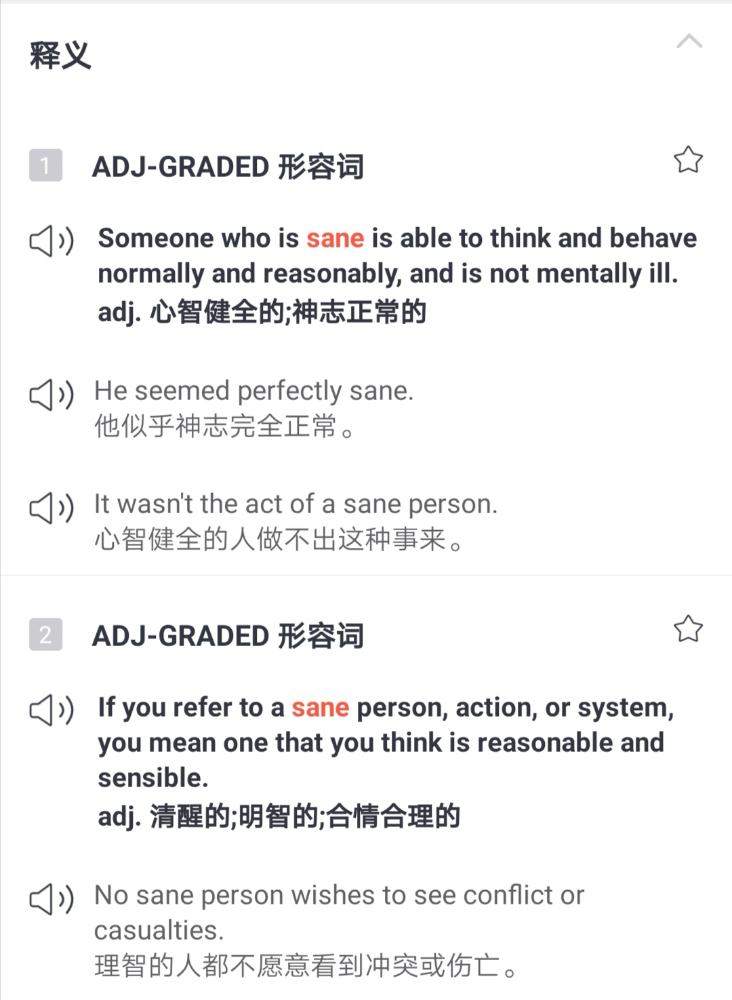

清醒时分看到的风景， 可算sane vision. 

让人觉得凄凄惨惨戚戚的，是bleak vision. 

一览众山小，俯瞰全局的，是panoramic vision. 

和和美美的景象，是beatific vision.

词汇之间搭配，变化无穷，也映射着我们是如何打量这个世界。如有些时候是with sane vision，让理性来主导（engage in reasoning)。

以及我们如何经营自己的一方小小天地，若我说向往的是simple elegance，那定然不会是大红大紫，24k纯金，气势逼人的“洋气”。

就像书里写的那样， nothing really ostentatious. 

 
 She had her hair done during the day, but still in a fairly simple manner. To be sure, she looked fabulous, showing her natural simple elegance, nothing really ostentatious. 

常说的关心cares, 成功success, 若是冠以worldly，似乎又是一个境界了。 

<h1 style="color:red">彩 | 蛋 </h1>

For many the philosophy was merely a fashion, and the novelty soon wore off.

对许多人来说哲学只是一种时髦罢了，不久就没新鲜感了。

来自某个词组的柯林斯例句。你也这样觉得吗？

