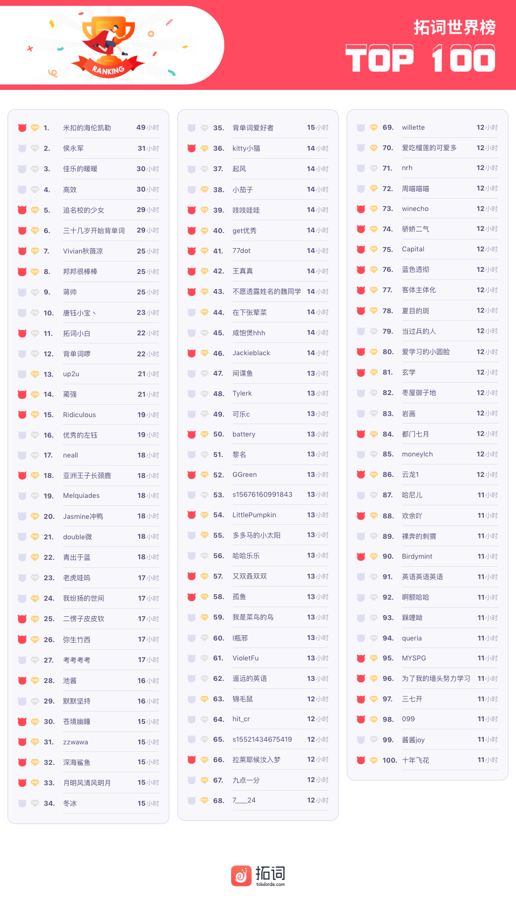
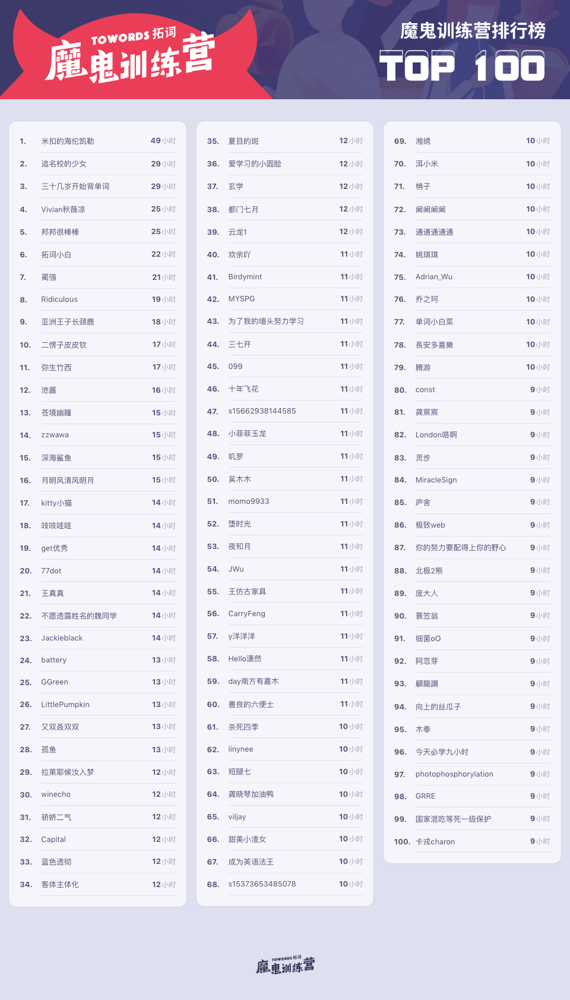

译事

> 什  
Ha <i><b>but</b></i>? h

 

2

 
 

3

<h1 style="color:red">贰 | 魔鬼营志异 </h1>

早安英语

<h1 style="color:red">排行榜</h1>

全球榜

PS: 最新一周排行榜又来啦。后台时间统计单位为「分钟」，故「小时」排名分先后。

魔鬼营

PS: 最新一周排行榜又来啦。后台时间统计单位为「分钟」，故「小时」排名分先后。

<h1 style="color:red">壹 | 拓词快讯 </h1>

友

<h1 style="color:red">贰 | 魔鬼营志异 </h1>

早安英语

<h1 style="color:red">贰 | 英式和美式的差别 </h1>

最是书香能致远

10月，你会有始料不及的运气，会有突如其来的欢喜。

银烛秋光冷画屏，轻罗小扇扑流萤。天阶夜色凉如水，卧看牵牛织女星。”该诗写女子独守空房，抒发幽怨之情。轻罗小扇，用又轻又薄的绢绸作的小团扇。扇子本是夏天用来挥风取凉的，秋天就没用了，所以古诗里常以秋扇比喻弃妇。流萤，飞动的萤火虫

Epiphany 顿悟
An epiphany is an experience of sudden and striking realization.
一个词讲了一个故事的感觉 : )

I&apos;m very fortunate in that I don&apos;t have to do the washing-up or the dusting.","tran":"我很幸运，因为我不用洗餐具也不用打扫灰尘

Like a dreamer awakened, we see life, not with the romantic color of yesternight's dream, but with a saner vision. 

出自林语堂的《吾国与吾民》

昨夜，有追忆前尘，非常恍惚朦胧的诗意在里面。 昨夜星辰昨夜风，李商隐。 昨夜西风凋碧树，昨夜雨疏风骤，中国诗文中只要一说到昨夜，就呆着诗情。 

这一次回望前尘，可能少了很多中国古代那些风雅的诗人他们所具有的浪漫诗情。而是用一种更为清晰的更为真切的视野来打量我们曾经经历的过往。 
sane， sensible and reasonable有道理的，理性的。 
看一样东西，可以用不同的眼光。 用特别理性的眼光，叫with a saner/sane vision. 

英语词汇的斑斓和词汇之间修饰搭配无穷的变化。

pleasure就分很多种，我们活在这个世界，无数次去打量这个世界，看世界的方式和结果也是不一样的，如果有些时候，用一种特别清醒的真切的眼光，去看这个世界，看到的风景和图像叫sane vision. 
如果通览很多英文的原典籍和原著，打量一样东西，都可以有不同的景象和视野产生？

这些名家去看世界之前， vision会有哪些搭配呢？

人生中极其罕见的情况下看到的盛大的景象，极其浩瀚，语言难以去描摹和表达， 这个意象很常见。 
面对大峡谷， 面对维也纳浩瀚的森林
面对像泰山这样充满了历史饱含沧桑这样的峰峦的时候， 
这个盛大的景象，magnificent, brilliant， 相对有格调的是glorious vision. 
古道西风瘦马， 或者苏东坡讲的
往日崎岖还记否,路长人困蹇驴嘶。
凄清惨淡的景象，bleak vision.全景完整的风景， 一览众山小一样， 

Panoramic vision. 
如果一个地方恍若仙境，仙山琼岛， 英文用什么？Fairy vision. 莫奈的很多画，你所流连的是里面迷离的风景。 
叫enchanted vision. 
极其清晰冷静的观点叫sane vision. 某些风景令人遐想， prefiguring vision。 所有这些东西都是东西方这些名家，笔下表现生活当中过无数次的凝眸。 
所看到的不一样的风景， 内心中不一样的回声。 

glorious vision 和 上帝联系在一起
