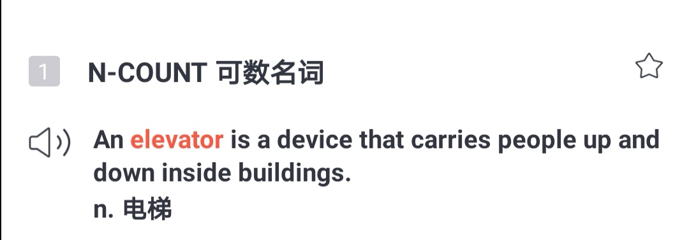
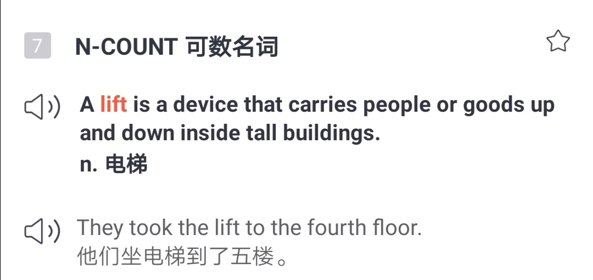
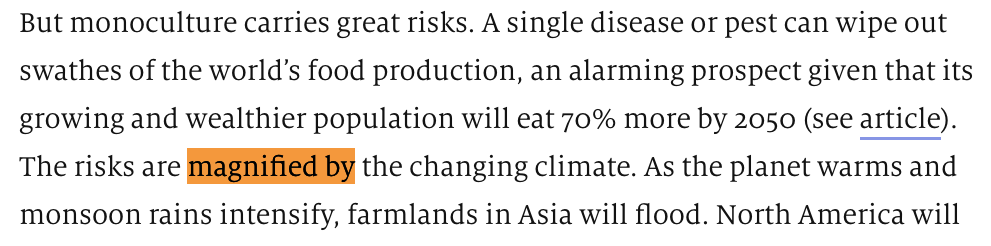
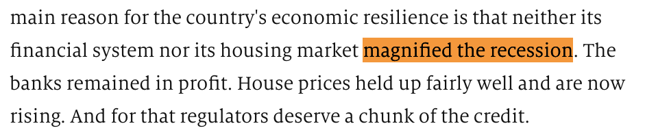

前言

全文 735个单词，包含 2020考研英语大纲词汇 190 个。

单词右上角标有考研（比如<mark>debate</mark>考研）代表这个单词被【拓词】2020考研英语大纲单词书收录。

不少《经济学人》的句子结构，同样出现在考研真题里， 比如XX 等。

标绿文字可以重点读，与文章结构有关。 字变小是因为Nora认为ta们不重要😂。

正文

<h1 style="color:red">
How America saved old-fashioned English grammar
</h1>

Can I get a Coke? Or have I gotten one already?
 

001 <i><kbd>IS AMERICA RUINING English or giving it new life? Most of this old transatlantic <mark><kbd>debate</kbd></mark>考研</strong> concerns words.</kbd></i> 

<small>Is <mark><kbd>elevator</kbd></mark>考研 </small> an improvement on <mark><kbd>lift</kbd></mark>考研</strong>? Why say transportation when <mark><kbd>transport</kbd></mark>考研</strong> will do?</small> 

<i><kbd>Sometimes it involves spelling</kbd></i>, <small>specifically the American reforms that made British centre into American center. Pragmatic change or dumbing down? And, of course, the quickest way to tell a Yank from a Brit is by pronunciation.</small>

Nora读后感|第1段

同样是说英语，是英国人还是美国人?嗯， 拼写有关系， spelling involves. 读法也有玄机。 
美国人爱用elevator, 英国人常用lift.  

美国人爱用transportation, 英国人常用transport. 

词汇表|第1段

transatlantic adj. 大西洋彼岸的 
debate n.讨论 
concern v. 与～有关 
elevator n. 电梯 
lift n. 电梯 
transportation n. 交通 
transport n. 交通 
involve v. 使～参与 
spelling n. 拼写 
reform v. 改革 
pragmatic adj. 务实的 
dumb down 使～简化；使～通俗化 
Yank n. 美国佬 
pronunciation n. 发音

002 <i><kbd>But the differences</kbd></i>  between British and American English <i><kbd>go beyond words, sounds and spelling to grammar itself.</kbd> </i>

<small>Here they can be <mark><kbd>subtle</kbd></mark>考研</strong>, but they are many: the index of the “Cambridge Grammar of the English Language” mentions regional differences in 95 places. America being the parvenu, most people assume that any variations between the two countries result from American <mark><kbd>innovation</kbd></mark>考研</strong>, to the (sometimes <mark><kbd>mock</kbd></mark>考研</strong> <mark><kbd>horror</kbd></mark>考研</strong> of Britons. In reality, America has often been the <mark><kbd>conservative</kbd></mark>考研</strong> one, and Britain the innovator. When British speakers borrow American habits, they are sometimes unwittingly readopting an older version of their language.</small>

Nora读后感|第2段

英美式的差别，除开发音，拼写这些容易被领会的表象，其实还有更深层的特质。 比如其实美式偏保守(conservative)， 英式用法上更别具一格(innovator)  。

重点讲解|第2段

<b>the differences</b> between British and American English <b>go beyond</b> words, sounds and spelling to grammar itself.

tea's greatest benefits <b>go beyond</b> physical health

the problems <b>go beyond</b> the boredom and the frustration of being away from home so long 

...there are reasons that <b>go beyond</b> style and message

词汇表|第2段

grammar n. 语法 
regional adj. 地区的 
parvenu n. 暴发户，新贵 
assume v.假定 
variation n. 变化 
result from 由～引起 
innovaiton n. 创新 
mock v.嘲笑 
horror n. 惊恐 
conservative adj. 保守的 
innovator n. 创新者 
unwittingly adv. 不知情地 
readopt v. 重新采纳 
version n. 版本

003 Take the <i><kbd>past participle of get</kbd></i>, which in Britain is got and in America gotten. To some Britons, American gotten is a cute or irritating <mark><kbd>invention</kbd></mark>考研</strong>. In fact, it is the older form, which came from Old Norse. “Gotten” appears in a Bible translation of 1535: “Treasures that are wickedly gotten, profit nothinge.” It persisted for centuries before fusing with the past tense, got, in Britain. Not that America was entirely conservative; it has a got too. But Americans use it differently: “He’s got a car” means he owns one, while “He’s gotten a car” means he has acquired one.

词汇表|第3段

past participle 过去式 
irritating adj. 使人生气的 
invention n. 发明 
appear v. 出现 
translation n. 翻译 
treasure n. 金银财宝 
wickedly adv. 缺德地；邪恶地 
profit n. 收益 
acquire v. 获得

004 Get gets Brits in another expression: “<i><kbd>Can I get…?</kbd></i>”, now nearly as ubiquitous in London restaurants as it is in Seattle. Part of the British <mark><kbd>complaint</kbd></mark>考研</strong> is that the American expression wrongly uses “can” <kbd>rather than</kbd> “may”. But possibility often requires <mark><kbd>permission</kbd></mark>考研</strong>, which is why the two overlap in meaning. 

<small>Can has been used for <mark><kbd>permission</kbd></mark>考研</strong> at least since 1489, according to the Oxford English Dictionary. May is in steep decline in America in general, partly as can further <b><kbd>colonises its role</kbd></b> in signalling <mark><kbd>permission</kbd></mark>考研</strong>. But it is in almost as stark a <mark><kbd>retreat</kbd></mark>考研 </small> in Britain, too. According to one study, may’s <mark><kbd>frequency</kbd></mark>考研</strong> in British speech <mark><kbd>declined</kbd></mark>考研</strong> by 40% between 1961 and 1991. That is well before American <b>influence was magnified</b> by shows such as “Friends”—often blamed for the “Can I get…?” <mark><kbd>invasion</kbd></mark>考研 </small>.

Nora读后感|第4段

虽然英国人觉得“may I get"比“can I get“更合适，但是被事实打脸。 就算没有《老友记》的风靡，英国人自己也越来越少用may了。

重点讲解|第4段

<h5>colonise its role</h5>

May is in steep decline in America in general, partly as can further <b>colonises its role</b> in signalling permission 

 

为什么may的美国的使用率也暴跌？因为can“大行其道"。影响力越来越大， 《经济学人》用的是colonise its role. 似乎有一点点深意在。  
colonise，一般想到的是<strong>a powerful country</strong> colonizes（colonise的美式写法） a territory or area that's <strong>much less powerful</strong>，关于的是强者对弱者的征服，全球近代史可以参照的例子很多，所以不care用法正确是极有可能的。 放在这里有一种不得不接受的无奈感。 
说回role的搭配，更常见的是play a (adj) role. 比如讲父亲在孩子人生的重要性上

Fathers <kbd><strong>play a <b>surprisingly large</b> role</strong></kbd> in their children's development, from language and cognitive growth in toddlerhood to social skills in ...

又或者是用fulfill the role,有点像人生这舞台，角色其实早就安排好了，剩下的是我们怎么去填充了

...he has come to me again in this lifetime to <kbd><strong>fulfill the same role</strong></kbd>: that of protector and guide

<h5>influence was magnified</h5>

That is well before American <b>influence was magnified</b> by shows such as “Friends”.

 

magnify有放大，加剧的意思, to make something bigger,可以是实，比如size, 也可以是虚，比如significance, influence这种。《经济学人》用过好多次，想表达become larger、become bigger类似概念的的时候不妨换用magnify. 

 

词汇表|第4段

complaint n. 抱怨 
expression n. 表达 
overlap v.与～交叉  
colonise v.在～开拓殖民地 
permission n. 允许 
colonise v. 殖民 
signal v.发信号 
stark adj. 严峻的 
retreat n. 后退 
frequency n. 频繁 
decline v. 下降 
magnify v.放大，扩大
invasion n. 侵入
blame for 责怪

005 <strong><kbd>In a <mark><kbd>striking</kbd></mark>考研  case</kbd></strong>, <i><kbd>a piece of grammar was virtually dead</kbd></i> in Britain and moribund in America, before an unlikely revival there and <mark><kbd>subsequent</kbd></mark>考研</strong> <mark><kbd>re-export</kbd></mark>考研</strong> to the mother country—the subjunctive, as in formulations like “The teacher asks that each student bring [not ‘brings’] a pencil.” In 1926 H.W. Fowler, godfather of English-usage writers, considered this subjunctive “dying” in “A Dictionary of Modern English Usage”, except in archaic phrases such as “so be it” or in “pretentious journalism”.

重点讲解|第5段

<strong>in a <kbd>striking</kbd> case </strong>

in a <b>particular</b> case

in a <b>similar</b> case

in a <b>worst</b> case

in a <b>sensational</b> case

词汇表|第5段

striking adj. 引人注目的 
virtually adv.实际上 
revival n. 复兴 
subsequent adj. 随后的 
re-export v. 再出口 
subjunctive n. 虚拟语气 
formulation n. 表达方式 
archaic adj. 古老的 
phrase n. 惯用语 
pretentious adj. 自负的 
journalism n. 新闻业

006 <i><kbd>The subjunctive</kbd></i> had also been <i><kbd>on its way out</kbd></i> in America, <i><kbd>but</kbd></i> started to <i><kbd>reappear</kbd></i> in the mid-to-late 19th century, as Lynne Murphy, a linguist, recounts in “The Prodigal Tongue”. No one knows why; theories include greater Bible reading (which would have kept Americans acquainted with older grammar) and immigrants who spoke subjunctive-filled languages. Whatever the reason, the subjunctive stuck out as a Yankeeism, irking British commentators such as Kingsley Amis, a novelist: “Be careful with any American writings, which often <mark><kbd>indulge</kbd></mark>考研</strong> in subjunctive forms.”

词汇表|第6段

reappear v. 再现 
linguist n. 语言学家 
recount v. 讲述 
acquainted with 认识的 
immigrant n. （外来）移民 
Yankee n. 美国佬，美国人 
commentator n. 解说员 
novelist n. 小说家 
indulge in 使（自己）沉迷；放纵（自己）

007 <i><kbd>Yet it is on its way back in Britain, too.</kbd></i> British writers still often <mark><kbd>replace</kbd></mark>考研</strong> it with the <mark><kbd>indicative</kbd></mark>考研</strong>; a recent report on the BBC website reads, “Facebook is determined that the future of the internet is shaped more in Brussels and Berlin than Beijing.” Strictly, the subjunctive requires “be shaped” <kbd>rather than</kbd> “is”. But some Britons have been happy to re-import the habit. The Guardian style guide endorses the subjunctive, which “can add elegance to your writing”. This is a slightly odd phrasing—matters of grammar are usually framed in terms of correctness, not elegance—but it is clear the subjunctive is having a second life.

词汇表|第7段

repalce v. 替换 
indicative adj. 指示的 
determined adj. 坚定的 
shape v. 塑造 
strictly adv. 严格地 
endorse v. （公开地）赞同，支持 
elegance n.优雅 
odd adj. 古怪的 
frame v.表达；表示

008 Stereotypes often have <strong><kbd>a grain of truth</kbd></strong>. <i>Americans <strong><kbd>have indeed</kbd></strong> innovated  <strong><kbd>extensively</kbd></strong> with English, as with other things</i>. <i><kbd>But language never sits still</kbd></i>: the British variety itself went on changing after 1776, as all living languages must. 

Americans, for their part, <strong><kbd>eagerly</kbd></strong> <mark><kbd>import</kbd></mark>考研</strong> <strong><mark><kbd>fashionable</kbd></mark>考研</strong> British slang. 

Instead of <strong><kbd>bemoaning</kbd></strong> new-fangled Americanisms, British observers could spare a thank you to the old colonies for keeping traditional English safe.

重点讲解|第8段

<h5>a grain of truth</h5>

刻板印象还是有几分道理的，美国人真的有在“发展”英语。 但是这份肯定其实没啥作用， a grain of truth就有几分且信且疑，不可全信的意味在。

再补刀，其实也跟美国人或者丑国人没关系，语言本身一直在变化。

词汇表|第8段

stereotype n. 刻板印象 
indeed adv.确实 
innovate v. 创新 
extensively adv.广泛地  
still adj. 静止的，不动的 
variety n. 变化 
eagerly adv. 热切地 
import v. 进口 
fashionable adj. 流行的 
slang n. 俚语 
bemoan v. 叹息 
new-fangled adj.（新想法）太复杂的 
observer n. 观察者 
spare v. 抽出，拨出（金钱或其他资源） 
colony n. 殖民地

后记

本篇文章包含  <b>2020考研英语大纲词汇</b> <strong>190</strong>个 ，部分列表如下

<strong><kbd>elevator </kbd></strong>

<strong><kbd>striking </kbd></strong>

<strong><kbd>fashionable </kbd></strong>

<strong><kbd>subsequent </kbd></strong>

<strong><kbd>lift</kbd></strong>

<strong><kbd>export</kbd></strong>

<strong><kbd>invention </kbd></strong>

<strong><kbd>horror </kbd></strong>

<strong><kbd>replace</kbd></strong>

<strong><kbd>mock </kbd></strong>

<strong><kbd>debate </kbd></strong>

<strong><kbd>permission</kbd></strong>

<strong><kbd>subtle</kbd></strong>

<strong><kbd>indulge</kbd></strong>

<strong><kbd>conservative </kbd></strong>

<strong><kbd>frequency </kbd></strong>

<strong><kbd>indicative</kbd></strong>

<strong><kbd>complaint </kbd></strong>

<strong><kbd>innovation</kbd></strong>

<strong><kbd>retreat</kbd></strong>

<strong><kbd>decline</kbd></strong>

<strong><kbd>import</kbd></strong>

<strong><kbd>transport</kbd></strong>

<strong><kbd>invasion</kbd></strong>

